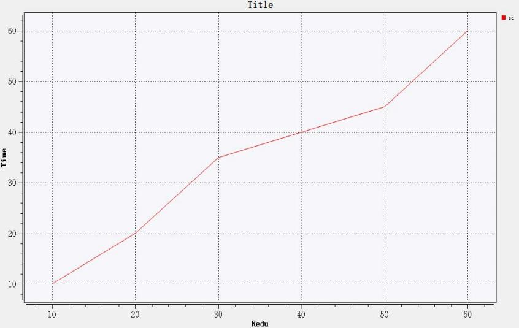
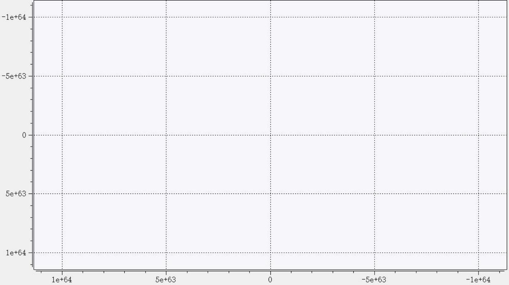
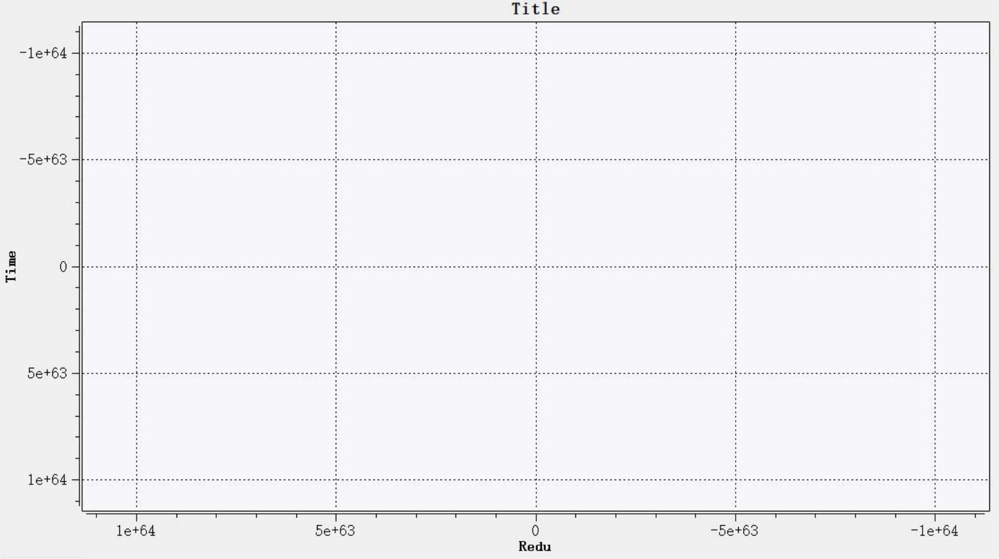
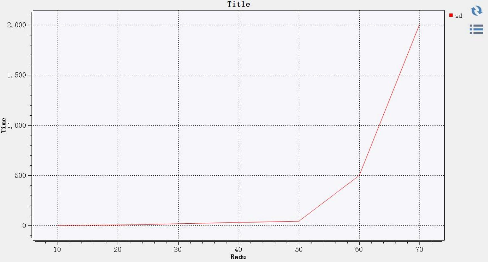
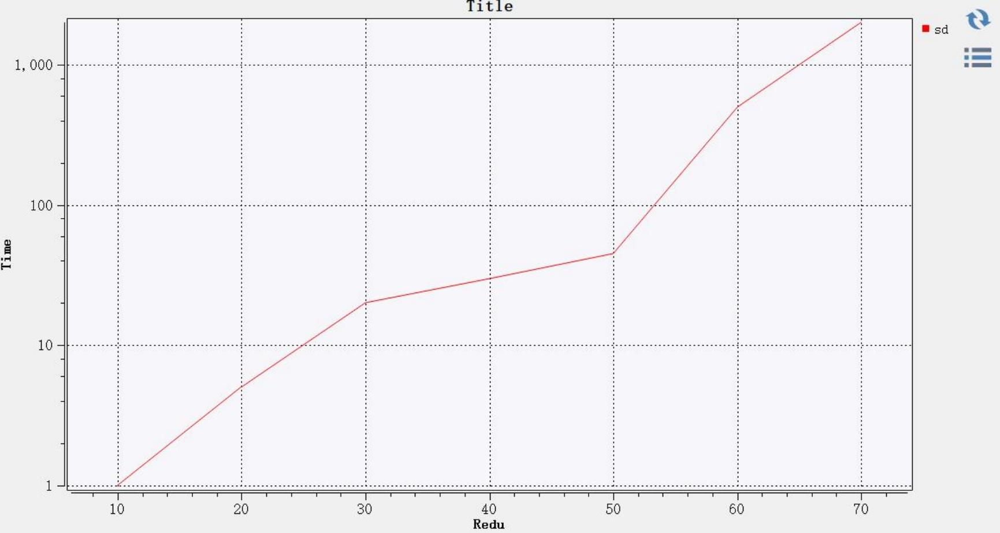
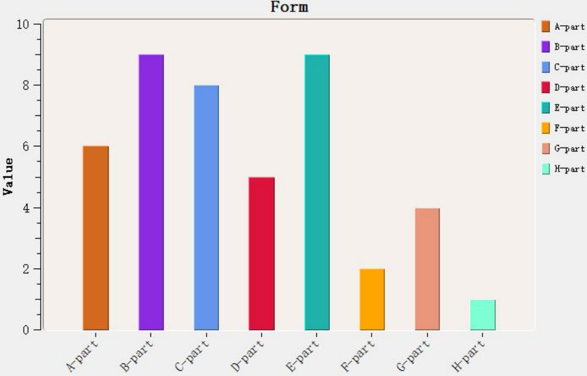
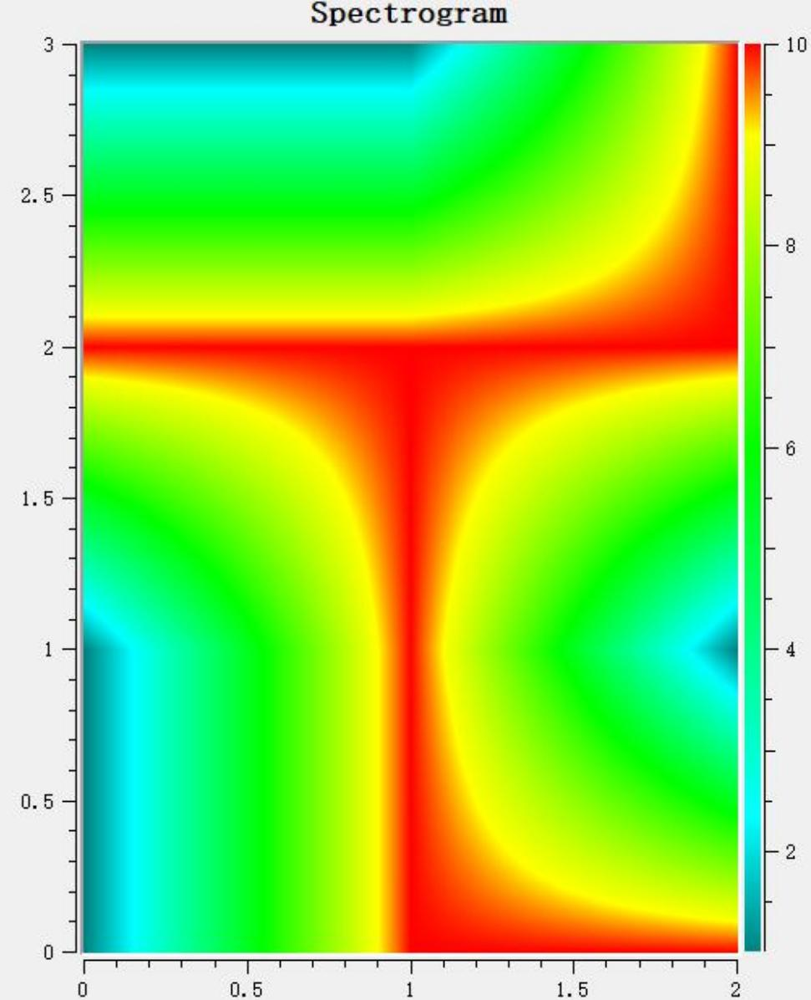
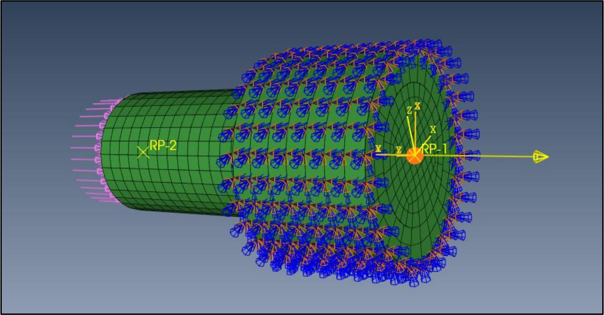
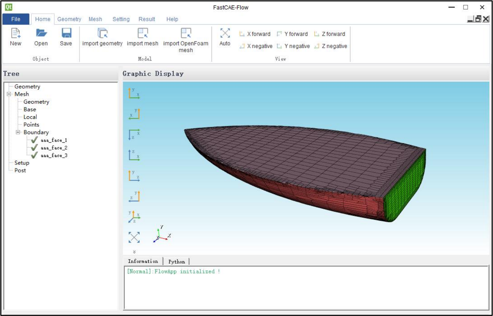

> **基础底座开发与使用** **说明书**
>
> **青岛数智船海科技有限公司**

+--------------+-------------------------------------------+--------------+
| > **时间**   | > **修改纲要**                            | > **修改人** |
+--------------+-------------------------------------------+--------------+
| > 2024/09/03 | > 首次编制                                | > 李宝君     |
+--------------+-------------------------------------------+--------------+
| > 2024/09/18 | > 添加自动保存器与系统环境检查说明        | > 李宝君     |
+--------------+-------------------------------------------+--------------+
| > 2024/12/08 | > 添加可执行程序驱动                      | > 刘中华     |
|              |                                           | > 李宝君     |
+--------------+-------------------------------------------+--------------+
|              |                                           |              |
+--------------+-------------------------------------------+--------------+
|              |                                           |              |
+--------------+-------------------------------------------+--------------+
|              |                                           |              |
+--------------+-------------------------------------------+--------------+
|              |                                           |              |
+--------------+-------------------------------------------+--------------+
|              |                                           |              |
+--------------+-------------------------------------------+--------------+
|              |                                           |              |
+--------------+-------------------------------------------+--------------+
|              |                                           |              |
+--------------+-------------------------------------------+--------------+
|              |                                           |              |
+--------------+-------------------------------------------+--------------+
|              |                                           |              |
+--------------+-------------------------------------------+--------------+
|              |                                           |              |
+--------------+-------------------------------------------+--------------+
|              |                                           |              |
+--------------+-------------------------------------------+--------------+
|              |                                           |              |
+--------------+-------------------------------------------+--------------+
|              |                                           |              |
+--------------+-------------------------------------------+--------------+
|              |                                           |              |
+--------------+-------------------------------------------+--------------+
|              |                                           |              |
+--------------+-------------------------------------------+--------------+

> FastCAE 为了规范 CAE
> 软件子系统集成，设计开发了基础集成底座，该集成底座中定
> 义了基础的抽象数据结构，并提供了线程池等基础通用工具，同时定义了 CAE
> 软件的集成 框架，规定了软件运行的顺序。基于该底座能够实现标准化的CAE
> 软件集成，可有效提高 CAE 软件的集成效率与软件的鲁棒性。
>
> FastCAE 基础集成底座基于 Qt 应用程序框架开发，分为 Core、AppFramework
> 、Adaptor、 Python 脚本驱动器四部分。Core
> 模块是整个软件的核心模块，一方面定义了基础的抽象数
> 据结构，并提供了数据管理与全局数据查找；另一方面，在 Core
> 模块中提供了软件开发过
> 程中常用的工具与通用算法，例如线程池、第三方程序驱动、文件与路径创建删除等。
> AppFramework 中定义了CAE 软件的主要运行过程，在该模块中将 CAE
> 软件的运行过程分
> 为了十四个部分，在提供基础功能的同时，提供了注册接口，能够实现个性化的软件集成。
> Adaptor 模块中定义了适配器的抽象类及其管理器，该模块中将适配器分为文件
> IO 适配器 与渲染对象适配器两类。
>
> **一、Core 模块**
>
> **1. 模块功能描述**
>
> Core 模块的主要功能分为抽象数据管理、基础常用工具与算法两部分。
>
> **抽象数据结构与数据管理器定义：**这些数据包括抽象数据对象，GUI
> 基本对象， 以及 操作器（Operator）抽象对象。这里操作器是指能够对数据与
> UI 进行访问与修改，并对其
> 进行关联，操作器中通常实现具体的业务流程。数据对象、GUI
> 对象、操作器对象就可以通 过全局唯一 ID 进行标记与查找。
>
> **常用工具与算法：**包含线程池、文件与目录操作、三维矢量计算、简单的三维图形运算、
> 枚举值反射等工具与算法。
>
> **2. 模块关键类**

+----------------------+--------------------------+------------------------------------+
| > **类名**           | > **所属源文件**         | > **描述**                         |
+----------------------+--------------------------+------------------------------------+
| > FITKAbstractObject | > FITKAbstractObject.hpp | > 平台所有类的抽象基类，主要用参数 |
|                      |                          | > 接口定义。                       |
+----------------------+--------------------------+------------------------------------+

+--------------------------+---------------------------+:-----------------------------------+
| > FITKAbstractDataObject | > FITKAbstractDataObject  | > 所 有 数 据 对 象 的 抽 象 基 类 |
|                          |                           | > ， FITKAbstractObject            |
|                          |                           | > 的子类。该抽象类                 |
|                          |                           | > 的派生类对象创建后自动纳入到全局 |
|                          |                           | > 数据仓库（FITKDataRepo）管理，分 |
|                          |                           | > 配全局数据 ID。                  |
+--------------------------+---------------------------+------------------------------------+
| > FITKAbstractDataIDAlte | > FITKAbstractDataObject  | > 数据 ID 修改，FITKAbstractObject |
| >                        |                           | > 的 ID                            |
| > r                      |                           | > 不允许随意修改，可通过该类进行   |
|                          |                           | > 修改。                           |
+--------------------------+---------------------------+------------------------------------+
| > FITKAbstractNDataObje  | > FITKAbstractNDataObjec  | > 需要名称的数据类抽象基类，派生自 |
| >                        | >                         | > FITKAbstractDataObject           |
| > ct                     | > t                       |                                    |
+--------------------------+---------------------------+------------------------------------+
| > FITKAbstractGUIObject  | > FITKAbstractGUIObject   | > GUI 对 象 抽 象 基 类 ，         |
|                          |                           | > FITKAbstractObject               |
|                          |                           | > 的子类。该抽象类                 |
|                          |                           | > 的派生类对象创建后自动纳入到全局 |
|                          |                           | > UI 仓库（FITKGUIRepo）管理，分配 |
|                          |                           | > 全局唯一 ID。                    |
+--------------------------+---------------------------+------------------------------------+
| > FITKWidget FITKDialog  | > FITKAbstractGUI         | > 基于 Qt提供的标准UI              |
| >                        |                           | > 控件进行封装， 以方便内存管理。  |
| > FITKMainWindow         |                           |                                    |
+--------------------------+---------------------------+------------------------------------+
| > FITKAbstractOperator   | > FITKAbstractOperator    | > 操作器抽 象类                    |
|                          |                           | > 。FITKAbstractObject 的子类。    |
+--------------------------+---------------------------+------------------------------------+
| > FITKAbstractObjectCont | > FITKAbstractObjectConta | > 抽 象 对 象 容 器 ， 可 以 存 储 |
| > ainer                  | > iner                    | > FITKAbstractObject               |
|                          |                           | > 及其子类（全部数 据类、UI        |
|                          |                           | > 类、操作器类）对象指针。 存 放   |
|                          |                           | > 的 对 象 被 释 放 后 自 动 变 成 |
|                          |                           | > nullptr。                        |
+--------------------------+---------------------------+------------------------------------+
| > FITKDataFactory        | > FITKDataFactory         | > 数据工厂，提供注册宏，可根据注册 |
|                          |                           | > 的类型创建数据对象。             |
+--------------------------+---------------------------+------------------------------------+
| > FITKAbstractDataManag  | > FITKAbstractDataManage  | > 抽象数据管理器，是一个模板类，能 |
| >                        | > r.hpp                   | > 够对 FITKAbstractDataObject      |
| > er                     |                           | > 的子类                           |
+--------------------------+---------------------------+------------------------------------+

+-----------------------+-----------------------+:-------------------------------------+
|                       |                       | > 对象进行管理。提供多种数据查找接   |
|                       |                       | > 口，对象被释时会自动从管理器移除。 |
|                       |                       | > 能够保证线程安全。                 |
+-----------------------+-----------------------+--------------------------------------+
| > FITKDataRepo        | > FITKDataRepo        | > 数据对象仓库，管理全部生命周期内   |
|                       |                       | > 的数据对象，提供多种方式检索访问。 |
+-----------------------+-----------------------+--------------------------------------+
| > FITKGUIRepo         | > FITKGUIRepo         | > GUI 对象仓库，管理全部的 GUI       |
|                       |                       | > 对象， 对象释放后自动被移出仓库。  |
+-----------------------+-----------------------+--------------------------------------+
| > FITKOperatorRepo    | > FITKOperatorRepo    | > 操作器仓库，提供注册器接口，可以   |
|                       |                       | > 根据注册的字符创建操作器。         |
+-----------------------+-----------------------+--------------------------------------+
| > FITKActionOperator  | > FITKActionOperator  | > Qt action pushbutton               |
|                       |                       | > 等点击控件触发 的抽象操作器。      |
+-----------------------+-----------------------+--------------------------------------+
|                       | > FITKCoreMacros.h    | > 常用的宏定义                       |
+-----------------------+-----------------------+--------------------------------------+
| > 文件与路径操作的 C  | > FITKDirFileTools    | > 基于 qt 的文件操作，实现文件路径创 |
| > 函 数               |                       | > 建、移除、清空等操作               |
+-----------------------+-----------------------+--------------------------------------+
| > FITKEnumTransfer    | > FITKEnumTransfer    | > 基于 qt 的反射机制实现枚举值与字符 |
|                       |                       | > 串的双向映射。                     |
+-----------------------+-----------------------+--------------------------------------+
| > FITKThreadTask      | > FITKThreadTask      | > 线程任务抽象类，与线程池匹配使用   |
+-----------------------+-----------------------+--------------------------------------+
| > FITKThreadTaskGroup | > FITKThreadTaskGroup | > 线程任务组，是一组                 |
|                       |                       | > FITKThreadTask，                   |
|                       |                       | > 一起提交到线程池。                 |
+-----------------------+-----------------------+--------------------------------------+
| > FITKThreadPool      | > FITKThreadPool      | > 线程池定义                         |
+-----------------------+-----------------------+--------------------------------------+
| > FITKVarientParams   | > FITKVarientParams   | > 基于 QVarient 的参数列表管理，本质 |
|                       |                       | > 是 QHash\<QString, QVariant\>。    |
+-----------------------+-----------------------+--------------------------------------+
| > FITKPoint           | > FITKVec3D           | > 三维点与向量表示                   |
| >                     |                       |                                      |
| > FITKNode            |                       |                                      |
| >                     |                       |                                      |
| > FITKVec3D           |                       |                                      |
+-----------------------+-----------------------+--------------------------------------+
| > 三维向量运算 C 函数 | > FITKVec3DAlg        | > 计算点之间的距离， 向量夹角、叉乘  |
|                       |                       | > 与点乘等。                         |
+-----------------------+-----------------------+--------------------------------------+
| > 空间圆形相关计算    | > FITKCircleAlg       | > 空间三点计算圆心、半径等算法       |
+-----------------------+-----------------------+--------------------------------------+

> **3. 软件核心架构**
>
> 软件核心架构参考 MVC 架构模式，将软件中的主要的类分为数据类，UI
> 类、以及业 务逻辑类，分别对应 Data 、GUI 和 Operator
> ，三者之间的关系如下图所示：

{width="3.5881933508311463in"
height="2.3465266841644796in"}

> 三者中数据层处于最底层，可以被 UI 与 Operator 访问与修改，Operator
> 可以直接访问 UI ，而 UI 则可以通过访问 Operator 的基类抽象接口实现对
> Operator 的控制，这样就做到了 三者之间的彼此独立，且能够相互访问。
>
> Core
> 模块中提供了三者的抽象定义与管理器、注册工厂等工具，后续基于该架构的软
> 件在设计开发过程中可以直接套用该模式，减少开发的工作量，提高程序的鲁棒性与拓展性。
>
> **4. 应用示例**
>
> **(1) 数据工厂应用**
>
> 数据工厂提供了集中创建数据对象的途径，数据工厂的应用分为三个步骤：1）定义数
> 据类对象；2）注册到数据工厂； 3）通过工厂创建数据。示例如下：
>
> ● 首先定义一个数据类，该数据类要求继承自
> Core::FITKAbstractDataObject，且必须有一 个无参的默认构造函数。
>
> 1\. class TstDataClass : public Core::FITKAbstractDataObject
>
> 2\. {
>
> 4\. TstDataClass() = default;
>
> 5\. \~TstDataClass() = default;
>
> 6\. *//添加其他默认成员函数与成员变量*
>
> 7\. };
>
> ● 然后将这个类注册到工厂，方法是使用工厂提供的宏
> Register2FITKDataFactory ，需要
> 指定两个参数，第一个参数为自定义标记，是一个字符串，通过工厂创建时，就是通过
> 该字符串进行区分；第二个参数是类名，注意不能添加命名空间。下述的注册代码原则
> 上可以在能够识别到工厂与自定义类任意位置声明，但习惯上一般在声明类的头文件中
> 完成注册。
>
> 1\. *//注册到工厂*
>
> 2\. Register2FITKDataFactory(TST, TstDataClass);
>
> 即通常情况下上述两个步骤的会得到如下代码：
>
> 1\. class TstDataClass : public Core::FITKAbstractDataObject
>
> 2\. {
>
> 3\. public :
>
> 4\. TstDataClass() = default;
>
> 5\. \~TstDataClass() = default;
>
> 6\. *//添加其他默认成员函数与成员变量*
>
> 9\. Register2FITKDataFactory(TST, TstDataClass);
>
> ● 完成注册之后即可通过工厂在需要的位置进行数据创建
>
> {width="1.7878390201224847e-2in"
> height="0.21666666666666667in"}{width="3.36464457567804in"
> height="0.21666666666666667in"}1.auto{width="4.800634295713036e-2in"
> height="0.19166557305336832in"}td{width="4.759295713035871e-2in"
> height="0.19166557305336832in"}={width="4.759295713035871e-2in"
> height="0.19166557305336832in"}{width="2.150392607174103in"
> height="0.19166557305336832in"}Core::FITKDataFactory::getInstance()-\>create(\"TST\");
>
> 2\. auto tstd = dynamic_cast\<TstDataClass\*\>(td);
>
> 3\. if(tstd)
>
> 4\. {
>
> 5\. *// do something with tstd*
>
> 6\. }
>
> **(2) 创建单例**
>
> 单例是软件开发中最常用的设计模式之一，为了方便单例使用，在
> FITKCoreMacros 中 提供了 DeclSingleton 宏。下面简单介绍宏的使用方法。
>
> 首先声明一个类，构造函数与析构函数均不需要添加，在类内宏
> DeclSingleton；同时添 加 initialize 和 finalize
> 两个函数，用于单例初始化与销毁。在宏中考虑到线程安全问题，因
> 此需要在类声明的时候包含头文件 QMutex。
>
> 1\. */@file MySingleton.h*
>
> 2\.

+---------------------------------+---------------------------------+---------------------------------+---------------------------------------------------------------+
| > 3\. *//包含其他头文件*                                                                                                                                            |
+---------------------------------------------------------------------------------------------------------------------------------------------------------------------+
| > 4\. #include \<QMutex\>                                                                                                                                           |
+---------------------------------------------------------------------------------------------------------------------------------------------------------------------+
| > 5\.                                                                                                                                                               |
+---------------------------------------------------------------------------------------------------------------------------------------------------------------------+
| > 6\. class MySingletonDeleator;                                                                                                                                    |
+---------------------------------------------------------------------------------------------------------------------------------------------------------------------+
| > 7\.                                                                                                                                                               |
+---------------------------------------------------------------------------------------------------------------------------------------------------------------------+
| > 8\. class MySingleton                                                                                                                                             |
+---------------------------------------------------------------------------------------------------------------------------------------------------------------------+
| > 9\. {                                                                                                                                                             |
+-------------------------------------------------------------------+-------------------------------------------------------------------------------------------------+
| > 10\.                                                            | > *//用于程序结束时释放单例*                                                                    |
+-------------------------------------------------------------------+-------------------------------------------------------------------------------------------------+
| 11\.                                                              | > friend MySingletonDeleator;                                                                   |
| {width="7.98611111111111e-2in"     |                                                                                                 |
| height="0.19166666666666668in"}                                   |                                                                                                 |
+-------------------------------------------------------------------+-------------------------------------------------------------------------------------------------+
| > 12\.                                                            | > *//声明为单例*                                                                                |
+-------------------------------------------------------------------+-------------------------------------------------------------------------------------------------+
| 13\.                                                              | > DeclSingleton(MySingleton);                                                                   |
| {width="7.98611111111111e-2in"     |                                                                                                 |
| height="0.19166557305336832in"}                                   |                                                                                                 |
+-------------------------------------------------------------------+-------------------------------------------------------------------------------------------------+
| > 14\.                                                            | > *//添加成员函数与成员变量*                                                                    |
+---------------------------------+---------------------------------+-------------------------------------------------------------------------------------------------+
| > 15\.                          | private :                                                                                                                         |
+---------------------------------+-----------------------------------------------------------------------------------------------------------------------------------+
| > 16\.                          | > void initialize()                                                                                                               |
+---------------------------------+-----------------------------------------------------------------------------------------------------------------------------------+
| > 17\.                          | > {                                                                                                                               |
+---------------------------------+-------------------------------------------------------------------+---------------------------------------------------------------+
| > 18\.                                                                                              | > *//初始化*                                                  |
+-----------------------------------------------------------------------------------------------------+---------------------------------------------------------------+
| 19\. {width="0.1597222222222222in" height="0.19166557305336832in"}  | > }                                                           |
+-----------------------------------------------------------------------------------------------------+---------------------------------------------------------------+
| > 20\.                                                                                              | > void finalize()                                             |
+-----------------------------------------------------------------------------------------------------+---------------------------------------------------------------+
| 21\. {width="0.1597222222222222in" height="0.19166557305336832in"}  | > {                                                           |
+-----------------------------------------------------------------------------------------------------+---------------------------------------------------------------+
| > 22\.                                                                                              | > *//销毁*                                                    |
+-----------------------------------------------------------------------------------------------------+---------------------------------------------------------------+
| 23\. {width="0.1597222222222222in" height="0.19166557305336832in"}  |                                                               |
|                                                                                                     |                                                               |
| 24\. };                                                                                             |                                                               |
+-----------------------------------------------------------------------------------------------------+---------------------------------------------------------------+

> 在上述代码中，还有一个友元 MySingletonDeleator
> ，用于程序结束时候的单例销毁， 后续将会介绍。
>
> 在单列中，有存在两个静态变量，分别是一个线程锁和本单例类的静态指针，需要在类
> 外对其进行初始化。
>
> 1\. *//@file MySingleton.cpp*
>
> 2\. *//静态变量初始化*
>
> 3\. MySingleton\* MySingleton::\_instance = nullptr;
>
> 4\. QMutex MySingleton::m_mutex;
>
> 这样一个单例就声明完成了，其他的成员函数与成员变量根据业务逻辑的需要进行添加
> 即可，该单例的访问可以通过下面的静态函数。
>
> 1\. MySingleton\* s = MySingleton ::getInstance();
>
> 由于单例的核心是一个本单例类型的静态指针，为了保证程序运行结束单例能够被释
> 放，于是需要采用友元 MySingletonDeleator
> 释放内存。其原理是采用静态变量在程序运行
>
> 结束之后释放，通过 MySingletonDeleator
> 的析构函数对单例的指针进行释放，示例代码如 下：
>
> 1\. *//@file MySingleton.h*
>
> 2\.
>
> 4\. {

+-------------------------------------+------------------------------------------------------------------+
| > 5\.                               | > public:                                                        |
+-------------------------------------+------------------------------------------------------------------+
| > 6\.                               | > MySingletonDeleator() = default;                               |
+-------------------------------------+------------------------------------------------------------------+
| > 7\.                               | > \~MySingletonDeleator                                          |
+-------------------------------------+------------------------------------------------------------------+
| > 8\.                               | > {                                                              |
+-------------------------------------+------------------------------------------------------------------+
| > 9\.                               | > *//释放单例内存，将会调用MySingleton::finalize*                |
+-------------------------------------+------------------------------------------------------------------+
| > 10\.                              | > if (MySingleton::\_instance)                                   |
+-------------------------------------+------------------------------------------------------------------+
| > 11\.                              | > delete MySingleton::\_instance;                                |
+-------------------------------------+------------------------------------------------------------------+
| > 12\.                              | > MySingleton::\_instance = nullptr;                             |
+-------------------------------------+------------------------------------------------------------------+
| > 13\.                              | > }                                                              |
+-------------------------------------+------------------------------------------------------------------+
| > 14\.                              | > };                                                             |
+-------------------------------------+------------------------------------------------------------------+
| > 15\. *//静态变量在程序结束释放，运行析构函数*                                                        |
+--------------------------------------------------------------------------------------------------------+

> 16\. static MySingletonDeleator \_\_DELEATOR\_\_;
>
> **(3) 抽象对象容器使用**
>
> 在软件编码中，一个对象的指针不可避免会被多次复制与记录，而在其中一个位置释
> 放（delete）该对象之后，其他位置的指针将会变成野指针，再次访问将会出现严重错误，
> 为避免这一问题，FastCAE 在 Core
> 模块中定义了抽象对象容器模板类，抽象对象容器类似
> 智能指针，一旦对象被释放，与该对象相关的容器获取对象指针的时候都将智能获取空指针。
> 使用示例如下：
>
> 1\. *//定义MyTestData，继承自FITKAbstractDataObject*
>
> 2\. *//创建一个对象*
>
> 3\. MyTestData\* data = new MyTestData;
>
> 4\. *//可创建多个容器，封装data 对象*
>
> 5\. FITKAbstractObjectContainer\<MyTestData\> c1(data);
>
> 6\. FITKAbstractObjectContainer\<MyTestData\> c2(data);
>
> 7\. FITKAbstractObjectContainer\<MyTestData\> c3(data);
>
> 8\. *//在c1 释放对象或者直接delete data 对象*
>
> 9\. delete c1.c.getObjectPtr();
>
> 10\. *//c2 与* *c3 获取对象为空指针*
>
> 11\. auto pt2 = c2.c.getObjectPtr(); *//c2 为nullptr*
>
> 12\. auto pt3 = c3.c.getObjectPtr(); *//c3 为nullptr*
>
> **(4) 添加并调用操作器（Operator）示例**
>
> 操作器的作用是实现具体的业务逻辑，关联 UI
> 与数据层，从而避免二者之间的相互依
> 赖关系，达到功能独立化的目的。在软件开发过程中为了适配不同的功能与业务，不可避免
> 需要添加新的操作器，下面介绍操作器的添加方式与调用方式，从总体上说，与（1）
> 中的 数据工厂的比较类似。
>
> 首先定义一个操作器（Operator），定义的操作器需要继承
> FITKAbstractOperator。要求 操作器必须有一个无参的构造函数。
>
> 1\. class MyOperator : public FITKAbstractOperator
>
> 2\. {

+---------------------------------------------------------------:+----------------------------------------------------------------:+
| 3\.                                                            | > public :                                                      |
| {width="7.98611111111111e-2in" |                                                                 |
| height="0.19166557305336832in"}                                |                                                                 |
+----------------------------------------------------------------+-----------------------------------------------------------------+
| > 4\.                                                          | > explicit MyOperator () = default;                             |
+----------------------------------------------------------------+-----------------------------------------------------------------+
| 5\.                                                            | > virtual \~MyOperator () =default;                             |
| {width="7.98611111111111e-2in" |                                                                 |
| height="0.19166557305336832in"}                                |                                                                 |
+----------------------------------------------------------------+-----------------------------------------------------------------+
| > 6\.                                                          | > *//添加其他成员函数与成员变量*                                |
+----------------------------------------------------------------+-----------------------------------------------------------------+
| > 7\. };                                                                                                                         |
+----------------------------------------------------------------------------------------------------------------------------------+

> 然后将 Operator 注册到 Operator
> 仓库（FITKOperatorRepo），与数据工厂相似，操作器
> 仓库也提供了注册宏---Register2FITKOPeratorRepo。注册时需要两个参数，第一个参数是一
> 个字符串，第二个是操作器类名。注册的时候，一个字符串只能对应一个操作器，而一个操
> 作器可以对应多个字符串。注册代码如下：
>
> 1\. Register2FITKOPeratorRepo(MyString, MyOperator );
>
> 通常情况下上述注册代码在 Operator 声明之后，也就是说，在头文件中既有
> Operator 声明，也有注册。这一点与数据工厂是一致的。
> 使用操作器时候也是从操作器工厂获取，
> 操作器工厂是一个单例，可直接访问，也可以通过宏 FITKOPERREPO
> 访问。示例代码如下：
>
> 1\. *//获取抽象类型*
>
> 2\. FITKAbstractOperator\* oper1 =
> FITKOPERREPO-\>getOperator(\"MyString \");
>
> 3\. {width="7.512248468941382e-2in"
> height="0.19722222222222222in"}*//也可以通过模板函数直接实现类型转换，这里*{width="7.512248468941382e-2in"
> height="0.19722222222222222in"}*oper1*{width="7.512248468941382e-2in"
> height="0.19722222222222222in"}*与oper2 是同一个对象*
>
> 4\. MyOperator\* oper2 =
> FITKOPERREPO-\>getOperatorT\<MyOperator\>(\"MySt ring\");
>
> 6\. {
>
> 7\. *//可以向操作器设置参数，参数可以是数字，字符串等多种类型*
>
> 8\. oper2-\>setArgs(\"arg1\", \"XX\");
>
> 9\. oper2-\>setArgs(\"arg2\", 0.5);
>
> 10\. *//do something with oper2*
>
> 11\. }
>
> **(5) 数据仓库与** **UI 仓库访问**
>
> Core 模块的数据仓库（FITKDataRepo）与 UI
> 仓库（FITKGUIRepo）是全局仓库，只
> 要是在生命周期之内的对象都可以通过数据仓库访问，数据仓库与 UI
> 仓库的访问方法几乎
> 是一样的，二者都是独立的单例，可直接访问。而成员访问一般情况下是通过对象的唯一
> ID 或者类型进行查找访问。
>
> 1\. *//#include "FITKDataRepo.h"*
>
> 2\. *//需要访问的数据ID，根据具体的业务逻辑获取*
>
> 3\. int dataID */\* =getADataID() \*/*;
>
> 4\. *//从数据仓库获取对象*
>
> 5\. FITKAbstractDataObject\* do bj = FITKDATAREPO-\>getDataByID(id);
>
> 6\. if(do bj)
>
> 7\. {
>
> 8\. *//强制类型转换*
>
> 9\. {width="0.24172572178477691in"
> height="0.19166557305336832in"}{width="8.034230096237971e-2in"
> height="0.19166557305336832in"}*//do*{width="8.10411198600175e-2in"
> height="0.19166557305336832in"}*something*{width="8.034230096237971e-2in"
> height="0.19166557305336832in"}*with*{width="0.1613834208223972in"
> height="0.19166557305336832in"}*dobj*
>
> 10\. } 11.
>
> 12\.
> *//#include*{width="8.233814523184602e-2in"
> height="0.19166557305336832in"} *"FITKGUIRepo.h"*
>
> 13\. *//需要访问的GUI ID，根据具体的业务逻辑获取*
>
> {width="4.601104549431321in"
> height="0.21666666666666667in"}14.int{width="6.508311461067366e-2in"
> height="0.19166557305336832in"}guiID{width="6.508311461067366e-2in"
> height="0.19166557305336832in"}*/\**{width="6.508311461067366e-2in"
> height="0.19166557305336832in"}{width="0.7843941382327209in"
> height="0.19166557305336832in"}*=getAGUIID()*{width="6.508311461067366e-2in"
> height="0.19166557305336832in"}*\*/*;
>
> 15\. *//从数据仓库获取对象*
>
> 16\.
> FITKAbstractGUIObject\*{width="8.084536307961505e-2in"
> height="0.19166557305336832in"}gobj{width="8.084536307961505e-2in"
> height="0.19166557305336832in"}={width="8.084536307961505e-2in"
> height="0.19166557305336832in"}FITKGUIREPO-\>getFITKGUIObject(id);
>
> 17\. if(gobj)
>
> 18\. {
>
> 19\. {width="0.21875in"
> height="0.19722222222222222in"}{width="7.291666666666667e-2in"
> height="0.19722222222222222in"}*//强制类型转换*
>
> 20\. *//do something with gobj*
>
> 21\. }
>
> **(6) 枚举值与字符串双向映射**
>
> 基于 Qt 的反射机制，Core
> 模块设计开发了枚举值与字符串映射器（FITKEnumTransfer），
> 可以实现枚举值与字符串的双向映射。使用该映射器时，对枚举对象有一定的要求：要求使
> 用 Q_ENUM 产生元对象，示例代码如下：
>
> 1\. #include \<QObject\>
>
> 2\. class EnumTransferTest : public QObject

+--------+------------------------------------------------------------------+
| > 3\.  | > {                                                              |
+--------+------------------------------------------------------------------+
| > 4\.  | > Q_OBJECT                                                       |
+--------+------------------------------------------------------------------+
| > 5\.  | > public:                                                        |
+--------+------------------------------------------------------------------+
| > 6\.  | > enum MyEnum                                                    |
+--------+------------------------------------------------------------------+
| > 7\.  | > {                                                              |
+--------+------------------------------------------------------------------+
| > 8\.  | > NONE = -3,                                                     |
+--------+------------------------------------------------------------------+
| > 9\.  | > M0 = -2,                                                       |
+--------+------------------------------------------------------------------+
| > 10\. | > M1,                                                            |
+--------+------------------------------------------------------------------+
| > 11\. | > M2,                                                            |
+--------+------------------------------------------------------------------+
| > 12\. | > M3,                                                            |
+--------+------------------------------------------------------------------+
| > 13\. | > M4                                                             |
+--------+------------------------------------------------------------------+
| > 14\. | > };                                                             |
+--------+------------------------------------------------------------------+
| > 15\. | > Q_ENUM(MyEnum);                                                |
+--------+------------------------------------------------------------------+
| > 16\. | > };                                                             |
+--------+------------------------------------------------------------------+

> 上述代码中声明了一个类内的枚举类型 MyEnum，要使用 Q_ENUM
> 产生元对象要求类 必须是一个 QObject对象，通过 O_OBJECT
> 宏展开元对象。符合上述要求的枚举对象可以
> 使用映射器（FITKEnumTransfer）进行枚举与字符串的双向转换：
>
> 1\. Core::FITKEnumTransfer\<MyEnum\> enumObj;
>
> 2\. *//字符转枚举*
>
> 4\. MyEnum va = enumObj.fromString(\"M0\", ok); *//va 的值是M0，ok
> 为true 表示获取成功*
>
> 6\. QString sM1 = enumObj.toStrting(MyEnum::M1, ok); *//sM1
> 的值是M1，ok 为true 表示获取成功*
>
> 7\. *//枚举成员数量*
>
> 8\. const int n = enumObj.memberCount(); *// n 的值应为6*
>
> 9\.
>
> 10\. *//全部枚举成员字符串*
>
> 11\. QStringList s l = enumObj.members();
>
> 12\.
>
> 13\. *//有效性*
>
> 14\. bool bvalid = enumObj.isValid(\"M7\");
> *//枚举不包含M7，返回值为false，* *表示无效值*
>
> **(7) 线程池使用**
>
> 线程操作用于执行复杂且耗时的操作，Core
> 模块提供了线程池，用于对线程的资源进 行统一的管理。该线程池基于 Qt
> 自身提供的线程池进行封装。
>
> 使用线程池之前首先应定义线程的任务，也就是说需要指定线程要执行什么样的操作。
> 具体的做法是继承 FITKThreadTask ，并且重写 run 函数
> 。在线程运行过程中可发送信号 sendProcessSig
> 报告当前执行完成百分比，通过 APPFramework 的 FITKSignalTransfer 对象实
> 现信号转接与处理。
>
> 1\. class MyTh readTask : public Core::FITKThreadTask
>
> 2\. {

+-------+------------------------------------------------------------------+
| > 3\. | > public:                                                        |
+-------+------------------------------------------------------------------+
| > 4\. | > MyTh readTask()= default;                                      |
+-------+------------------------------------------------------------------+
| > 5\. | > Virtual \~MyTh readTask() = default;                           |
+-------+------------------------------------------------------------------+
| > 6\. | > void run() override                                            |
+-------+------------------------------------------------------------------+
| > 7\. | > {                                                              |
+-------+------------------------------------------------------------------+
| > 8\. | > *//需要在线程中执行的任务, 通常是耗时的操作*                   |
+-------+------------------------------------------------------------------+
| > 9\. | > }                                                              |
+-------+------------------------------------------------------------------+

> 10\. };
>
> 完成线程定义之后就可以创建线程任务，并且提交到线程池运行。线程运行结束后将会
> 自动释放线程任务对象，并发出信号 taskFinishedSig。
>
> 1\. *//创建线程任务*
>
> 2\. MyTh readTask\* task1 = new MyTh readTask();
>
> 4\. auto tp = Core::FITKThread Pool: :getInstance();
>
> 5\. *//任务提交到线程池执行，将会调用run 函数*
>
> 6\. tp-\>execTask(task1);
>
> 多个任务可以组成一个线程任务组（FITKThreadTaskGroup），线程任务组将会将全部
> 的任务按照追加顺序依次提交到线程池，任务组提交到线程池之后将不能继续追加任务，当
> 线程任务组内的任务全部执行完成之后，将会发送信号
> threadTaskGroupFinishedSig。示例代 码如下:
>
> 1\. *//创建三个任务*
>
> 2\. MyTh readTask\* task1 = new MyTh readTask();
>
> 3\. MyTh readTask\* task2 = new MyTh readTask();
>
> 4\. MyTh readTask\* task3 = new MyTh readTask();
>
> 5\. *//创建任务组*
>
> 6\. Core::FITKThreadTaskGroup g;
>
> 7\. *//追加任务对象*
>
> 8\. g.appendThreadTask(task1);
>
> 9\. g.appendThreadTask(task2);
>
> 10\. g.appendThreadTask(task3);
>
> 11\. *//批量提交到线程池执行任务*
>
> 12\. g.push2Thread Pool();
>
> 线程池提供了多种粒度的线程阻塞机制，分别是阻塞线程直到某一个特定的线程任务结
> 束；阻塞线程直到线程任务组结束；阻塞主线程直到线程池任务全部结束。示例代码如下：
>
> 阻塞线程直到某一个特定的线程任务结束：
>
> 1\. *//创建线程任务*
>
> 2\. MyTh readTask\* task1 = new MyTh readTask();
>
> 4\. auto tp = Core::FITKThread Pool: :getInstance();
>
> 5\. *//任务提交到线程池执行，将会调用run 函数*
>
> 6\. tp-\>execTask(task1);
>
> 7\. *//阻塞线程*
>
> 8\. tp-\>wait(task1)
>
> 阻塞线程直到线程任务组结束：
>
> 13\. *//创建三个任务*
>
> 14\. MyTh readTask\* task1 = new MyTh readTask();
>
> 15\. MyTh readTask\* task2 = new MyTh readTask();
>
> 16\. MyTh readTask\* task3 = new MyTh readTask();
>
> 18\. Core::FITKThreadTaskGroup g;
>
> 20\. g.appendThreadTask(task1);
>
> 21\. g.appendThreadTask(task2);
>
> 22\. g.appendThreadTask(task3);
>
> 23\. *//批量提交到线程池执行任务*
>
> 24\. g.push2Thread Pool();
>
> 26\. g.wait( );
>
> 阻塞主线程直到线程池任务全部结束：
>
> 1\. *//向线程池提交多个任务*
>
> 2\. *//获取线程池*
>
> 3\. auto tp = Core::FITKThread Pool: :getInstance();
>
> 4\. *//线程池阻塞，智能在主线程调用，否则会死锁*
>
> 5\. tp -\> wait();
>
> **二、AppFramework 模块**
>
> **1. 模块功能描述**
>
> CAE
> 软件根据功能与运行过程可以分为几何模型处理、网格划分、物理建模、求解计算
> 与后处理几个过程，运行过程具有高度一致性，本模块将 CAE
> 软件运行的过程拆分为十几个
> 固定的流程，并规定了这个流程的运行顺序与彼此之间的数据接口，形成了一套面向
> CAE
> 软件的应用程序框架，该框架基于统一的抽象接口与注册机制实现业务逻辑与功能实现的完
> 全独立，支持方便的功能组合与个性化业务逻辑拓展。软件底座纵向运行过程分为注册、初
> 始化、事件循环与内存释放等过程。注册过程实现数据创建器与事件处理器的创建与注册；
> 初始化过程将会对注册的对象执行初始化操作，并创建多种全局数据对象；事件循环是指对
> 根据用户的交互处理复杂的业务流程事件。内存释放是指软件主要流程结束，回收并释放内
> 存。

{width="5.6141043307086615in"
height="4.4821609798775155in"}

> **应用程序架构**： FITKApplication， 基于 QApplication
> 定义软件运行的主要过程。提供工
>
> 厂与事件处理的注册接口.
>
> **全局数据**：FITKGlobalData，全局数据管理，管理几何数据、网格数据、物理模型数据与后
> 处理数据等全局数据。
>
> **组件管理**：FITKCmponents，组件管理，对生成的组件进行管理，提供访问接口。
>
> **信号转接器**：FITKSignalTransfer，少量组件之间的信号转发，包括控制台信息、线程运行
> 进度等，可注册信号处理器，实现个性化信号处理。
>
> **程序驱动管理器**：FITKProgramTaskManeger，第三放程序驱动管理，启动终止第三方应用程
> 序，实现进程级别集成。
>
> **UI**
> **事件处理**：FITKGlobalEventFilter，全局事件响应，包含键盘鼠标事件等，可注册事件
> 处理器，实现个性化事件处理。
>
> **主界面生成**：FITKAbstractMainwindowGenerator，抽象类，生成主界面，并加载
> q ss 与翻 译文件。
>
> **全局数据工厂**：FITKAbstractGlobalDataFactory，
> 生成全局数据，并放入全局数据进行管 理。需派生子类注册到
> FITKApplication。
>
> **组件工厂**：FITKComponentFactory，创建组件，并放入组件管理器，
> 需派生子类注册到 FITKApplication。
>
> **软件设定**：FITKAppSettings，软件运行时设定，可以读入写出 INI
> 文件，可派生子类注册 到 FITKApplication。
>
> **命令** **行** **处** **理器** ： FITKCommandLineHandler ， 处 理命令
> 行 参 数 ， 可 以 派 生子类注册 到 FITKApplication。
>
> **信号处理器**：FITKSignalTransfer，个性化信号处理，可注册到信号
> FITKSignalTransfer， 槽函数命名格式为"on\_\<signal\> "时可自动关联
> FITKSignalTransfer 中的信号。
>
> **事件** **处理器**： FITKAbstractEventFilter ， 个性化事件处理器 ，
> 派生子类 ， 可注册 到 FITKGlobalEventFilter。
>
> **Python** **注册接口**：FITKAbstractPythonRegister，将
> C++类装饰去注册到 PythonQt，可实 现 Python 调用，需派生子类注册到
> FITKApplication。
>
> **自动保存器：**FITKAbstractAutoSaver，采用计时器超时方法定时执行保存函数，可实现工
> 程文件等自动保存，需派生子类注册到 FITKApplication。
>
> **系统检查：**FITKAbstractSysChecker，对系统的硬件与软件系统进行检查，若出现错误则终
> 止程序运行， 由 FITKApplication 主动调用。
>
> **2. 模块关键类**

+--------------------------+--------------------------+------------------------------------+
| > **类名**               | > **所属源文件**         | > **描述**                         |
+--------------------------+--------------------------+------------------------------------+
| > FITKApplication        | > FITKApplication        | > 继承 Qt 的 QApplication          |
|                          |                          | > 实现应用程序                     |
|                          |                          | > 架构，规定了软件的运行逻辑，提供 |
|                          |                          | > 事件处理器注册接口等个性化处理接 |
|                          |                          | > 口。                             |
+--------------------------+--------------------------+------------------------------------+
| > FITKGlobalData         | > FITKGlobalData         | > 全局数据存储器，用于存储仿真过程 |
|                          |                          | > 的主要数据类对象，例如几何数据管 |
|                          |                          | > 理器、网格数据管理等，程序运行结 |
|                          |                          | > 束会自动释放这些数据，大部分的全 |
|                          |                          | > 局数据通过全局数据工厂创建。     |
+--------------------------+--------------------------+------------------------------------+
| > FITKAbstractMainwindo  | > FITKAbstractMainwindo  | > 主界面生成抽象类，用于定义生成主 |
| >                        | >                        | > 界面 UI                          |
| > wGenerator             | > wGenerator             | > ，抽象类，在不同软件中必须       |
|                          |                          | > 重写，并注册到 AppFramework。    |
+--------------------------+--------------------------+------------------------------------+
| > FITKAbstractGlobalData | > FITKAbstractGlobalData | > 全局数据工厂抽象类，定义了创建数 |
| >                        | >                        | > 据的接口，在不同的 App           |
| > Factory                | > Factory                | > 中必须重新 实现该类，并注册到    |
|                          |                          | > AppFramework。                   |
+--------------------------+--------------------------+------------------------------------+
| > FITKComponentInterface | > FITKComponentInterface | > 定义组件基类与管理接口，抽象类， |
|                          |                          | > 大部分组件需要继承自该类。       |
+--------------------------+--------------------------+------------------------------------+
| > FITKCmponents          | > FITKCmponents          | > 应用程序框架中的组件管理类，可获 |
|                          |                          | > 取框架中已经注册创建的组件对象， |
|                          |                          | > 在软件运行结束后将会释放组件对   |
|                          |                          | > 象。                             |
+--------------------------+--------------------------+------------------------------------+
| > FITKComponentFactory   | > FITKComponentFactory   | > 组件创建工厂，定义创建组件的函数 |
|                          |                          | > 接口，抽象类，不同的软件必须重新 |
|                          |                          | > 实现，并注册到 FITKApplication   |
+--------------------------+--------------------------+------------------------------------+
| > FITKAppSettings        | > FITKAppSettings        | > 软件设定参数存储，封装 QSetting  |
|                          |                          | > ， 通过读写 ini                  |
|                          |                          | > 文件保存或获取设置信             |
+--------------------------+--------------------------+------------------------------------+

+---------------------------+---------------------------+--------------------------------------+
|                           |                           | > 息，抽象类，不同的软件可以重新实   |
|                           |                           | > 现并注册到 FITKApplication。       |
+---------------------------+---------------------------+--------------------------------------+
| > FITKCommandLineHand     | > FITKCommandLineHandl    | > 命令行输入参数处理，抽象类，不同   |
| >                         | >                         | > 的 软 件 可 以 重 新 实 现 并 注   |
| > ler                     | > er                      | > 册 到 FITKApplication。            |
+---------------------------+---------------------------+--------------------------------------+
| > FITKSignalTransfer      | > FITKSignalTransfer      | > 信号转接器，软件运行中的重要的，   |
|                           |                           | > 可能跨模块处理的信号转接。同时提   |
|                           |                           | > 供个性化的事件处理器注册接口。     |
+---------------------------+---------------------------+--------------------------------------+
| > FITKRunTimeSetting      | > FITKRunTimeSetting      | > 软件运行时部分简单的临时参数存     |
|                           |                           | > 储，不会保存到硬盘，均为临时存储， |
|                           |                           | > 本 质 上 是 一 个                  |
|                           |                           | > Core::FITKVarientParams ， 可 以   |
|                           |                           | > 从 FITKGlobalData 对象获取。       |
+---------------------------+---------------------------+--------------------------------------+
| > FITKGlobalEventFilter   | > FITKGlobalEventFilter   | > 全局事件捕获，能够捕获全部的 Qt事  |
|                           |                           | > 件，主要是键盘鼠标事件等，并能过   |
|                           |                           | > 滤 需 要 处 理 的 事 件 。 可 以   |
|                           |                           | > 从 FITKApplication 获取。          |
+---------------------------+---------------------------+--------------------------------------+
| > FITKKeyMouseStates      | > FITKKeyMouseStates      | > 键盘鼠标状态获取，包括按下抬起状   |
|                           |                           | > 态等， 由 FITKGlobalEventFilter    |
|                           |                           | > 对象                               |
|                           |                           | > 捕获事件后进行记录与修改，该对象   |
|                           |                           | > 可通过 FITKGlobalData 对象获取。   |
+---------------------------+---------------------------+--------------------------------------+
| > FITKAbstractEventFilter | > FITKAbstractEventFilter | > 抽象事件处理器，抽象类，需要重写   |
|                           |                           | > 实 现 后 注 册 到 FITKApplication  |
|                           |                           | > ， FITKGlobalEventFilter           |
|                           |                           | > 会将事件下放                       |
|                           |                           | > 到该对象，可根据需要自行过滤处理   |
|                           |                           | > 需要响应的事件。                   |
+---------------------------+---------------------------+--------------------------------------+
| > FITKAbstractPythonRegi  | > FITKAbstractPythonRegis | > 抽象的 Python 装饰器注册类，实现将 |
| >                         | >                         | > 封装的 C++接口注册到 Python 解释   |
| > ster                    | > ter                     | > 器，不同的软件需要分别实现。       |
+---------------------------+---------------------------+--------------------------------------+

+--------------------------+--------------------------+:-------------------------------------+
| > 常用输出信息（错误、警 | > FITKMessage            | > 提供简单的接口实现信息输出的发     |
| > 告等）转发             |                          | > 送，包含错误与警告等信息，该部分   |
|                          |                          | > 将会触发 FITKSignalTransfe         |
|                          |                          | > ，将信息 以信号的形式发送。        |
+--------------------------+--------------------------+--------------------------------------+
| > FITKCopyrigntInfoDlg   | > FITKCopyrigntInfoDlg   | > 版权信息对话框，用于展示软件的开   |
|                          |                          | > 源协议， 以及本软件用到的开源组件  |
|                          |                          | > 及其软件协议。                     |
+--------------------------+--------------------------+--------------------------------------+
| > FITKAbstractProgramer  | > FITKAbstractProgramerD | > 抽象第三方程序驱动，定义驱动接口， |
| > Driver                 | > river                  | > 抽象类，不能实例化。               |
+--------------------------+--------------------------+--------------------------------------+
| > FITKLinuxShellDriver   | > FITKLinuxShellDriver   | > Linux 下的 Shell                   |
|                          |                          | > 驱动器，可以直接执 行 shell        |
|                          |                          | > 命令，并且捕获输出。在线程         |
|                          |                          | > 池中多线程执行。                   |
+--------------------------+--------------------------+--------------------------------------+
| > FITKExecProgramDriver  | > FITKExecProgramDriver  | > 可执行程序驱动器，用于驱动可执行   |
|                          |                          | > 程序的运行，并捕获输出，采用多进   |
|                          |                          | > 程方式运行。                       |
+--------------------------+--------------------------+--------------------------------------+
| > FITKProgramDriverFacto | > FITKProgramDriverFacto | > 第三方程序驱动器的创建工厂，提供   |
| >                        | >                        | > 基于名称的第三方程序驱动器注册与   |
| > ry                     | > ry                     | > 创建。                             |
+--------------------------+--------------------------+--------------------------------------+
| > FITKProgramTaskManeg   | > FITKProgramTaskManeg   | > 第三方程序任务管理，调用第三方程   |
| >                        | >                        | > 序驱动器的创建工厂创建并驱动任务   |
| > er                     | > er                     | > 执行，同时管理任务，可以强制终止   |
|                          |                          | > 任务。                             |
+--------------------------+--------------------------+--------------------------------------+
| > FITKWorkBenchHandler   | > FITKWorkBenchHandler   | > 处理软件在 FastCAE-Workbench 工作  |
|                          |                          | > 台运行时的相关文件与逻辑操作。定   |
|                          |                          | > 义了一些处理接口，每个软件需要重   |
|                          |                          | > 写实现后注册到 FITKApplication     |
+--------------------------+--------------------------+--------------------------------------+
| > FITKAbstractAutoSaver  | > FITKAbstractAutoSaver  | > 处理自动保存逻辑，采用定时器超时   |
|                          |                          | > 方法，定时执行文件保存策略，可以   |
|                          |                          | > 用于工程文件、脚本文件的定时保存。 |
+--------------------------+--------------------------+--------------------------------------+

+--------------------------+--------------------------+------------------------------------+
|                          |                          | > 每个软件需要重写实现后注册到     |
|                          |                          | > FITKApplication。                |
+--------------------------+--------------------------+------------------------------------+
| > FITKAbstractSysChecker | > FITKAbstractSysChecker | > 检查系统软件与硬件环境，若存在不 |
|                          |                          | > 满足软件运行的条件则给出提示并终 |
|                          |                          | > 止程序执行。                     |
+--------------------------+--------------------------+------------------------------------+

> **3. 应用软件框架的运行过程**
>
> 应用软件框架的运行过程可以分为注册、初始化，命令执行、消息事件处理、数据持久
> 化、释放内存几个步骤。其中注册这一步是决定软件表现形式与业务功能的关键一步，其他
> 部分均是通过框架自主执行。
>
> （1）
> 注册过程是指在上文提到的一些类需要在基类的基础上对虚函数进行重写，然后
> 注册到规定的位置上，在后续程序运行的过程中，软件框架将会主动调用响应位置的虚函数，
> 去执行这些个性化的操作。需要注册的对象分为两类，一类是必须要继承自基类对虚函数进
> 行 重 写 然 后 注 册 到 框 架 中 的 ， 主 要 是
> FITKAbstractMainwindowGenerator 、 FITKAbstractGlobalDataFactory
> 、FITKComponentFactory 三个类；另外一类是可以根据具体
> 业务需要进行注册的 ， 例如 ，
> 如果不需要对命令行参数进行处理则不需要注册 FITKCommandLineHandler
> 。注册过程一般是在 main 函数实现，示例如下：
>
> 1\. int main(int argc, char \*argv\[\])
>
> 2\. {
>
> 3\. *// 初始化应用框架*
>
> 4\. AppFrame::FITKApplication app(argc, argv); 5.
>
> 6\. *// 注册程序的主要组件和设置*
>
> 7\. *// 注册主窗口生成器*
>
> 8\. app.regMainWindowGenerator(new MyWindowGenerator);
>
> 9\. *// 注册全局数据工厂*
>
> 10\. app.regGlobalDataFactory(new MyGlobalDataFactory);
>
> 11\. *// 注册组件工厂*
>
> 12\. app.regComponentsFactory(new MyComponentFactory);
>
> 13\. *// 注册命令行处理*
>
> 14\. app.regCommand LineHandler(new MyCommand LineHandler);
>
> 16\. app.addEventFilter(new MyMouseKeyEventFilter);
>
> 18\. *// 运行程序，包含初始化到释放内存的全部操作*
>
> 19\. return app.exec();
>
> 20.}
>
> （2） 初始化过程是指创建软件运行所必须的数据对象与 UI
> 对象、读取配置文件等操
> 作，初始化是后续执行命令与处理消息事件的基础，初始化过程大致如下，带\*的为一定会
> 执行的操作，其他操作若没有注册对象则不执行。
>
> {width="0.10304790026246718in"
> height="0.16081364829396325in"} 读取软件配置 INI
> 文件【FITKAppSettings】
>
> {width="0.10304790026246718in"
> height="0.16081364829396325in"} \* 生 成 全 局 数 据 并 且 存 储 到 全
> 局 数 据 管 理 器 (FITKGlobalData) 中 。
> 【FITKAbstractGlobalDataFactory】
>
> {width="0.10304790026246718in"
> height="0.16081364829396325in"} \* 加载 qss 页面风格文件与双语文件。
> 【FITKAbstractMainwindowGenerator】
>
> {width="0.10304790026246718in"
> height="0.16081364829396325in"} \*
> 加载创建组件，并存放到组件管理类（FITKCmponents）中。【FITKComponentFactory】
>
> {width="0.10304790026246718in"
> height="0.16081364829396325in"} \* 如果命令行中存在"-nogui
> "则认为是无界面运行，初始化过程结束，进入命令执行
> 阶段。【FITKApplication】
>
> {width="0.10304790026246718in"
> height="0.16081364829396325in"} \* 生 成 软 件 主 界 面 ， 并 将 主 界
> 面 指 针 存 入 全 局 数 据 (FITKGlobalData) 中 。
> 【FITKAbstractMainwindowGenerator】
>
> {width="0.10304790026246718in"
> height="0.16081364829396325in"} \* 渲染主界面初始 UI
> 。【FITKApplication】
>
> {width="0.10304790026246718in"
> height="0.16081364829396325in"} 注册 Python
> 装饰器。【FITKAbstractPythonRegister】
>
> {width="0.10304790026246718in"
> height="0.16081364829396325in"} 启动自动保存器。【FITKApplication】
>
> （3） 命令执行，命令执行操作是指执行命令行参数与执行 Workbench
> 相关的处理文
> 件参数，命令行命令是否执行一方面要看是否注册了命令行处理器，另一方面需要看运行时
> 是否给出了命令行参数，只有二者均给出的情况下才会执行命令行命令。Workbench
> 相关处 理逻辑也是类似，一方面是需要看是否由Workbench
> 驱动，另一方面需要看是否注册了处
> 理器，只有二者均给出的情况下才会执行。
>
> （4） 消息事件处理，消息事件主要是指 UI
> 交互产生的事件，例如按钮等点击事件与
> 鼠标键盘事件等，这些事件主要是通过主界面或者其子界面的一些槽函数执行，鼠标键盘事
>
> 件则可以通过【FITKAbstractEventFilter】处理。这些事件需要高度的定制化。
>
> （5）
> 数据持久化，消息事件结束（通常是关闭全部UI）之后执行数据持久化。通常
> 说来数据持久化指将内存中的数据写出到文件，数据持久化的大部分功能由消息事件处理，
> 通过 UI
> 上的按钮触发操作来读入与写出文件。这里说的数据持久化包含两部分，一部分是
> 软件配置信息写出，通过 FITKAppSettings 实现；另一部分是与 Workbench
> 要求的文件写出。
>
> （6）
> 释放内存，内存释放是在软件的生命周期内的最后一步，在释放内存时，首先关
> 闭线程池（FITKThreadPool）与第三方程序管理（FITKProgramTaskManeger）中正在运行的
> 任务全部终止，然后释放 FITKApplication 中的全部数据。
>
> **4. 框架应用示例**
>
> AppFramework 将 CAE
> 软件的运行过程拆分为十几个过程，并提供了一系列的个性化
> 注册接口实现个性化的业务，下面将具体介绍如何基于框架集成多模块形成完成的CAE
> 软 件。
>
> 首先 AppFramework
> 运行的总体流程是固定的，首先根据业务需要进行接口类的注册，
> 然后启动程序，按照上一部分的运行过程顺序执行。注册的顺序与运行顺序无关。整个程序
> 的 main 函数如下：
>
> 1\. int main(int argc, char \*argv\[\])
>
> 2\. {
>
> 4\. AppFrame::FITKApplication app(argc, argv);
>
> 2\. app.checkSystem(new SystemChecker);
>
> 6\. *// 注册程序的主要组件和设置*

+---------------------------------------------------------------:+-----------------------------------------------------------------+
| 7\.                                                            | > *// 注册主窗口生成器*                                         |
| {width="7.98611111111111e-2in" |                                                                 |
| height="0.19722222222222222in"}                                |                                                                 |
+----------------------------------------------------------------+-----------------------------------------------------------------+
| > 8\.                                                          | > app.regMainWindowGenerator(new MyWindowGenerator);            |
+----------------------------------------------------------------+-----------------------------------------------------------------+
| 9\.                                                            | > *// 注册全局数据工厂*                                         |
| {width="7.98611111111111e-2in" |                                                                 |
| height="0.19722222222222222in"}                                |                                                                 |
+----------------------------------------------------------------+-----------------------------------------------------------------+
| > 10\.                                                         | > app.regGlobalDataFactory(new MyGlobalDataFactory);            |
+----------------------------------------------------------------+-----------------------------------------------------------------+
| 11\.                                                           | > *// 注册组件工厂*                                             |
| {width="7.98611111111111e-2in" |                                                                 |
| height="0.19722222222222222in"}                                |                                                                 |
+----------------------------------------------------------------+-----------------------------------------------------------------+
| > 12\.                                                         | > app.regComponentsFactory(new MyComponentFactory);             |
+----------------------------------------------------------------+-----------------------------------------------------------------+
| 13\.                                                           | > *// 注册命令行处理*                                           |
| {width="7.98611111111111e-2in" |                                                                 |
| height="0.19722222222222222in"}                                |                                                                 |
+----------------------------------------------------------------+-----------------------------------------------------------------+
| > 14\.                                                         | > app.regCommand LineHandler(new MyCommand LineHandler);        |
+----------------------------------------------------------------+-----------------------------------------------------------------+
| 15\.                                                           | > *//注册自定义事件处理*                                        |
| {width="7.98611111111111e-2in" |                                                                 |
| height="0.19722222222222222in"}                                |                                                                 |
+----------------------------------------------------------------+-----------------------------------------------------------------+

> 16\. app.addEventFilter(new MyMouseKeyEventFilter);
>
> 18\. *// 运行程序，包含初始化到释放内存的全部操作*
>
> 19\. return app.exec();
>
> 20.}
>
> 总之可以概括为：创建应用程序框架（第 4 行），注册一系列的接口类（第
> 8-16 行）， 运行框架（第 19
> 行）。可以看出使用框架最关键的是需要了解如何定义接口类，下面将对
> 每一个注册的接口类进行说明。
>
> **(1) 应用程序访问接口（FITKApplication ）**
>
> 应用程序 FITKApplication
> 是整个软件的基础，也是全部数据访问的总接口。在程序运
> 行时经常会需要访问应用程序对象或者从应用对象中获取数据，应用程序中提供了一些访问
> 接口如下：
>
> 应用程序类继承自 QApplication ，可用过 QApplication
> 的方式进行访问，同时，可以通 过快速访问宏 FITKAPP 访问：
>
> 1\. #include "FITKApplication.h"
>
> 2\. *//获取app 所在的文件目录*
>
> 3\. *//FITKAPP 为应用对象指针*
>
> 4\. QString appPath = FITKAPP-\>applicationDirPath();
>
> 基于应用程序框架，可以访问一些全局数据，然后逐层查找，可以找到全部有效数据对
> 象。这样也为数据对象的查找访问除了从 Core
> 模块的仓库之外，提供了另外一种方案。除
> 了注册函数之外，常用的访问接口如下：
>
> 1\. *// FITKApplication 的关键接口*
>
> 2\.
>
> 3\. *//应用程序初始化*
>
> 4\. bool in it();
>
> 5\. *//进入事件循环，* *内部会调用init*
>
> 6\. int exec();
>
> 7\. *//获取全局数据*
>
> 8\. FITKGlobalData\* getGlobalData();
>
> 9\. *//获取组件管理器*
>
> 10\. FITKCmponents\* getComponents();
>
> 11\. *//获取信号转接器*
>
> 12\. FITKSignalTransfer\* getSignalTransfer();
>
> 13\. *//获取全局事件处理器*
>
> 14\. FITKGlobal EventFilter\* getGlobal EventFilter();
>
> 15\. *//获取启动的程序管理器，可执行程序形式执行*
>
> 16\. FITKProgramTaskManeger\* getProgramTaskManager();
>
> **(2) 主界面生成器（FITKAbstractMainwindowGenerator）**
>
> 主界面生成器的主要作用是生成主界面，并且指定需要加载的 qss
> 样式文件与语言包文 件，在开发时需要继承
> FITKAbstractMainwindowGenerator ，重写下列函数：

+----------------------------------------------------------------+-------------------------------------------------------------------------------------------------------------------+
| > 1\. class MyWindowGenerator : public AppFrame::FITKAbstractMainwindow Generator                                                                                                  |
+------------------------------------------------------------------------------------------------------------------------------------------------------------------------------------+
| > 2\. {                                                                                                                                                                            |
+------------------------------------------------------------------------------------------------------------------------------------------------------------------------------------+
| > 3\. public:                                                                                                                                                                      |
+----------------------------------------------------------------+-------------------------------------------------------------------------------------------------------------------+
| > 4\.                                                          | > MyWindowGenerator () = default;                                                                                 |
+----------------------------------------------------------------+-------------------------------------------------------------------------------------------------------------------+
| 5\.                                                            | {width="0.24076990376202975in"                                                    |
| {width="7.98611111111111e-2in"  | height="0.18972331583552057in"}\~MyWindowGenerator{width="8.002405949256343e-2in"  |
| height="0.19166557305336832in"}                                | height="0.18972331583552057in"}{width="0.16074475065616797in"                     |
|                                                                | height="0.18972331583552057in"}(){width="8.002515310586177e-2in"                   |
|                                                                | height="0.18972331583552057in"}={width="8.002405949256343e-2in"                    |
|                                                                | height="0.18972331583552057in"}default;                                                                           |
+----------------------------------------------------------------+-------------------------------------------------------------------------------------------------------------------+
| > 6\.                                                          | > *//创建主界面窗体*                                                                                              |
+----------------------------------------------------------------+-------------------------------------------------------------------------------------------------------------------+
| 7\.                                                            | {width="0.24145231846019247in"                                                    |
| {width="7.98611111111111e-2in"  | height="0.18972331583552057in"}QWidget{width="8.025153105861767e-2in"              |
| height="0.19166557305336832in"}                                | height="0.18972331583552057in"}\*genMainWindow(){width="8.094925634295713e-2in"    |
|                                                                | height="0.18972331583552057in"}override                                                                           |
+----------------------------------------------------------------+-------------------------------------------------------------------------------------------------------------------+
| > 8\.                                                          | > {                                                                                                               |
+----------------------------------------------------------------+-------------------------------------------------------------------------------------------------------------------+
| 9\.                                                            | > *//创建一个Qt 的窗体，例如QMainWindow*                                                                          |
| {width="7.98611111111111e-2in" |                                                                                                                   |
| height="0.19722222222222222in"}                                |                                                                                                                   |
+----------------------------------------------------------------+-------------------------------------------------------------------------------------------------------------------+
| > 10\. *// 返回窗体指针* *return new QMainWindow;*                                                                                                                                 |
+----------------------------------------------------------------+-------------------------------------------------------------------------------------------------------------------+
| 11\.                                                           | > }                                                                                                               |
| {width="7.98611111111111e-2in"  |                                                                                                                   |
| height="0.19166557305336832in"}                                |                                                                                                                   |
+----------------------------------------------------------------+-------------------------------------------------------------------------------------------------------------------+
| > 12\.                                                         | > *//指定qss 样式文件*                                                                                            |
+----------------------------------------------------------------+-------------------------------------------------------------------------------------------------------------------+
| 13\.                                                           | {width="0.24045056867891512in"                                                    |
| {width="7.98611111111111e-2in"  | height="0.18972331583552057in"}QString{width="7.991797900262468e-2in"              |
| height="0.19166557305336832in"}                                | height="0.18972331583552057in"}getQssStyle{width="0.16053149606299214in"          |
|                                                                | height="0.18972331583552057in"}(){width="7.991797900262468e-2in"                   |
|                                                                | height="0.18972331583552057in"}override                                                                           |
+----------------------------------------------------------------+-------------------------------------------------------------------------------------------------------------------+
| > 14\.                                                         | > {                                                                                                               |
+----------------------------------------------------------------+-------------------------------------------------------------------------------------------------------------------+
| 15\.                                                           | > *//返回qss 样式文件路径，通常是在qrc 资源文件*                                                                  |
| {width="7.98611111111111e-2in" |                                                                                                                   |
| height="0.19722222222222222in"}                                |                                                                                                                   |
+----------------------------------------------------------------+-------------------------------------------------------------------------------------------------------------------+
| > 16\.                                                         | > *//不需要加载样式文件可以返回空对象*                                                                            |
+----------------------------------------------------------------+-------------------------------------------------------------------------------------------------------------------+
| 17\.                                                           | > }                                                                                                               |
| {width="7.98611111111111e-2in"  |                                                                                                                   |
| height="0.19166557305336832in"}                                |                                                                                                                   |
+----------------------------------------------------------------+-------------------------------------------------------------------------------------------------------------------+
| > 18\.                                                         | > *//指定需要加载的语言包* *qm 文件*                                                                              |
+----------------------------------------------------------------+-------------------------------------------------------------------------------------------------------------------+
| 19\.                                                           | {width="0.24046806649168853in"                                                    |
| {width="7.98611111111111e-2in"  | height="0.18972331583552057in"}QStringList{width="8.061898512685914e-2in"          |
| height="0.19166557305336832in"}                                | height="0.18972331583552057in"}getTranslatorQmFiles{width="0.16054352580927383in" |
|                                                                | height="0.18972331583552057in"}(){width="7.99245406824147e-2in"                    |
|                                                                | height="0.18972331583552057in"}override                                                                           |
+----------------------------------------------------------------+-------------------------------------------------------------------------------------------------------------------+
| > 20\.                                                         | > {                                                                                                               |
+----------------------------------------------------------------+-------------------------------------------------------------------------------------------------------------------+
| 21\.                                                           | > *//返回语言包文件，通常是在qrc 资源文件*                                                                        |
| {width="7.98611111111111e-2in" |                                                                                                                   |
| height="0.19722222222222222in"}                                |                                                                                                                   |
+----------------------------------------------------------------+-------------------------------------------------------------------------------------------------------------------+
| > 22\.                                                         | > *//若不需要可以返回空对象*                                                                                      |
+----------------------------------------------------------------+-------------------------------------------------------------------------------------------------------------------+
| 23\.                                                           | > }                                                                                                               |
| {width="7.98611111111111e-2in"  |                                                                                                                   |
| height="0.19166557305336832in"}                                |                                                                                                                   |
+----------------------------------------------------------------+-------------------------------------------------------------------------------------------------------------------+
| > 24\. };                                                                                                                                                                          |
+------------------------------------------------------------------------------------------------------------------------------------------------------------------------------------+

> 该对象注册接口位于 FITKApplication：
>
> 1\. *// 注册主界面生成器*
>
> 2\. void regMainWindowGenerator(FITKAbstractMainwindowGenerator\* gen
> erator);
>
> 主界面生成的窗口对象可以从全局数据（FITKGlobalData）中访问。
>
> **(3) 全局数据生成器（FITKAbstractGlobalDataFactory）**
>
> 全局数据生成器用于生成与仿真流程相关的全局数据，大部分是数据管理类，例如网格
> 数 据 、 几 何 数 据 、 物 理 模 型 数 据 等 。 在 开 发 全 局 数 据
> 生 成 器 时 需 要 继 承 FITKAbstractGlobalDataFactory
> 类，并且对下列函数进行重写，下列函数均不是纯虚函数，
> 如果应用中不需要则不需要重写函数，示例如下：

+--------------------------------+---------------------------------+----------------------------------+----------------------------------------+----------------------------------+
| > 1\. class MyGlobalDataFactory : public FITKAbstractGlobalDataFactory                                                                                                          |
+--------------------------------+------------------------------------------------------------------------------------------------------------------------------------------------+
| > 2\.                          | {                                                                                                                                              |
+--------------------------------+------------------------------------------------------------------------------------------------------------------------------------------------+
| > 3\.                          | public:                                                                                                                                        |
+--------------------------------+------------------------------------------------------------------------------------------------------------------------------------------------+
| > 4\.                          | > MyGlobalDataFactory () = default;                                                                                                            |
+--------------------------------+------------------------------------------------------------------------------------------------------------------------------------------------+
| > 5\.                          | > \~MyGlobalDataFactory () = default;                                                                                                          |
+--------------------------------+------------------------------------------------------------------------------------------------------------------------------------------------+
| > 6\.                                                                                                                                                                           |
+---------------------------------------------------------------------------------------------------------------------------------------------------------------------------------+
| > 7\. private:                                                                                                                                                                  |
+--------------------------------+------------------------------------------------------------------------------------------------------------------------------------------------+
| > 8\.                          | > *//创建全局网格，可以为空*                                                                                                                   |
+--------------------------------+------------------------------------------------------------------------------------------------------------------------------------------------+
| > 9\.                          | {width="0.32088035870516185in"                                                                                 |
|                                | height="0.19166557305336832in"}virtual{width="8.004593175853018e-2in"                                           |
|                                | height="0.19166557305336832in"}Core::FITKAbstractDataObject\*{width="8.074146981627296e-2in"                   |
|                                | height="0.19166557305336832in"}createMeshData(){width="8.074146981627296e-2in"                                 |
|                                | height="0.19166557305336832in"}overri de                                                                                                       |
+--------------------------------+------------------------------------------------------------------------------------------------------------------------------------------------+
| > 10\.                         | > {                                                                                                                                            |
+--------------------------------+------------------------------------------------------------------------------------------------------------------------------------------------+
| > 11\.                         | > *// return new MyMeshData;*                                                                                                                  |
+--------------------------------+------------------------------------------------------------------------------------------------------------------------------------------------+
| > 12\.                         | > }                                                                                                                                            |
+--------------------------------+------------------------------------------------------------------------------------------------------------------------------------------------+
| > 13\.                         | > *//创建全局几何管理，可以为空*                                                                                                               |
+--------------------------------+------------------------------------------------------------------------------------------------------------------------------------------------+
| > 14\.                         | virtual Core::FITKAbstractDataObject\* createGeoData() overrid e                                                                               |
+--------------------------------+------------------------------------------------------------------------------------------------------------------------------------------------+
| > 15\.                         | > {                                                                                                                                            |
+--------------------------------+------------------------------------------------------------------------------------------------------------------------------------------------+
| > 16\.                         | > *// return new MyGeoData;*                                                                                                                   |
+--------------------------------+------------------------------------------------------------------------------------------------------------------------------------------------+
| > 17\.                         | > }                                                                                                                                            |
+--------------------------------+------------------------------------------------------------------------------------------------------------------------------------------------+
| > 18\.                         | > *//创建全局物理模型管理，可以为空*                                                                                                           |
+--------------------------------+------------------------------------------------------------------------------------------------------------------------------------------------+
| > 19\.                         | {width="0.3214545056867891in"                                                                                  |
|                                | height="0.19166557305336832in"}virtual{width="8.018919510061243e-2in"                                          |
|                                | height="0.19166557305336832in"}Core::FITKAbstractDataObject\*{width="8.088582677165354e-2in"                   |
|                                | height="0.19166557305336832in"}createPhysicsData(){width="8.088582677165354e-2in"                              |
|                                | height="0.19166557305336832in"}ove rride                                                                                                       |
+--------------------------------+------------------------------------------------------------------------------------------------------------------------------------------------+
| > 20\. {                                                                                                                                                                        |
+---------------------------------------------------------------------------------------------------------------------------------------------------------------------------------+
| > 21\. *// return new MyPhysicsData;*                                                                                                                                           |
+------------------------------------------------------------------+--------------------------------------------------------------------------------------------------------------+
| > 22\.                                                           | > }                                                                                                          |
+------------------------------------------------------------------+--------------------------------------------------------------------------------------------------------------+
| 23\.                                                             | {width="8.014545056867892e-2in"                                              |
| {width="0.1597222222222222in"     | height="0.19722222222222222in"}{width="7.945428696412948e-2in"               |
| height="0.19722222222222222in"}                                  | height="0.19722222222222222in"}*//创建全局后处理数据，可以为空*                                              |
+------------------------------------------------------------------+--------------------------------------------------------------------------------------------------------------+
| > 24\.                                                           | > virtual Core::FITKAbstractDataObject\* createPostData() overri                                             |
| >                                                                |                                                                                                              |
| > de                                                             |                                                                                                              |
+------------------------------------------------------------------+--------------------------------------------------------------------------------------------------------------+
| 25\.                                                             | > {                                                                                                          |
| {width="0.1597222222222222in"     |                                                                                                              |
| height="0.19166557305336832in"}                                  |                                                                                                              |
+------------------------------------------------------------------+--------------------------------------------------------------------------------------------------------------+
| > 26\.                                                           | > *// return new MyPostData;*                                                                                |
+------------------------------------------------------------------+--------------------------------------------------------------------------------------------------------------+
| 27\.                                                             | > }                                                                                                          |
| {width="0.1597222222222222in"     |                                                                                                              |
| height="0.19166557305336832in"}                                  |                                                                                                              |
+------------------------------------------------------------------+--------------------------------------------------------------------------------------------------------------+
| > 28\.                                                           | > *//自定义数据拓展*                                                                                         |
+------------------------------------------------------------------+--------------------------------------------------------------------------------------------------------------+
| > 29\. *//创建其他数据，返回值哈希中的int 至少为* *FITKGolbalData.h/FITKGlobalDT::GDTOther*                                                                                     |
+-----------------------------------------------------------------------------------------------------+----------------------------------------+----------------------------------+
| > 30\. virtual QHash\< Data() override                                                              | > int,Core::FITKAbstractDataObject\*\> | > createOther                    |
+-----------------------------------------------------------------------------------------------------+----------------------------------------+----------------------------------+

+--------------------------------------------------------------:+-----+-------------------------------------------------------------------------------------------------------------------+
| 31\.                                                          | > { |                                                                                                                   |
| {width="0.1597222222222222in" |     |                                                                                                                   |
| height="0.19166666666666668in"}                               |     |                                                                                                                   |
+---------------------------------------------------------------+-----+-------------------------------------------------------------------------------------------------------------------+
| > 32\.                                                        |     | > *//QHash\< int,Core::FITKAbstractDataObject\*\> dataHash;*                                                      |
+---------------------------------------------------------------+-----+-------------------------------------------------------------------------------------------------------------------+
| 33\.                                                          |     | {width="0.15762139107611547in"                                                     |
| {width="0.1597222222222222in" |     | height="0.19166557305336832in"}{width="7.846894138232721e-2in"                     |
| height="0.19166557305336832in"}                               |     | height="0.19166557305336832in"}*//dataHash\[1001\]*{width="7.915135608048994e-2in" |
|                                                               |     | height="0.19166557305336832in"}*=*{width="7.915135608048994e-2in"                  |
|                                                               |     | height="0.19166557305336832in"}*new*{width="7.915135608048994e-2in"                |
|                                                               |     | height="0.19166557305336832in"}*MyData;*                                                                          |
+---------------------------------------------------------------+-----+-------------------------------------------------------------------------------------------------------------------+
| > 34\.                                                        |     | > *// return dataHash;*                                                                                           |
+---------------------------------------------------------------+-----+-------------------------------------------------------------------------------------------------------------------+
| 35\.                                                          | > } |                                                                                                                   |
| {width="0.1597222222222222in" |     |                                                                                                                   |
| height="0.19166557305336832in"}                               |     |                                                                                                                   |
+---------------------------------------------------------------+-----+-------------------------------------------------------------------------------------------------------------------+
| > 36\.                                                        |     |                                                                                                                   |
+---------------------------------------------------------------+-----+-------------------------------------------------------------------------------------------------------------------+
| 37\. };                                                       |     |                                                                                                                   |
+---------------------------------------------------------------+-----+-------------------------------------------------------------------------------------------------------------------+

> 该对象注册接口位于 FITKApplication：
>
> 1\. *// 注册主界面生成器*
>
> 2\. void regMainWindowGenerator(FITKAbstractMainwindowGenerator\* gen
> erator);
>
> 全局数据生成器生成的对象可以从全局数据（FITKGlobalData）中访问。
>
> **(4) 组件生成器（FITKComponentFactory）**
>
> 组件是 FastCAE
> 的重要组成部分，封装了一些具体的业务功能，基于组件进行软件开
> 发能够实现功能的复用，提高软件的开发集成效率。组件生成器的作用是指定在本应用中的
> 使用的组件，并创建软件句柄。使用组件工厂时，需要继承
> FITKComponentFactory ，并重 写函数，示例如下：
>
> {width="3.0544619422572177e-2in"
> height="0.21666666666666667in"} 1.
> class{width="8.131124234470691e-2in"
> height="0.19166557305336832in"}MyComponentFactory{width="8.131124234470691e-2in"
> height="0.19166557305336832in"}
> :{width="8.201881014873141e-2in"
> height="0.19166557305336832in"}public{width="8.131124234470691e-2in"
> height="0.19166557305336832in"}AppFrame::FITKComponentFactory
>
> 2\. {

+---------------------------------+-----------------------------------+----------------------------------------------------------------+
| > 3\. public:                                                                                                                        |
+---------------------------------+----------------------------------------------------------------------------------------------------+
| > 4\.                           | > MyComponentFactory () = default;                                                                 |
+---------------------------------+----------------------------------------------------------------------------------------------------+
| > 5\.                           | > \~MyComponentFactory () = default;                                                               |
+---------------------------------+----------------------------------------------------------------------------------------------------+
| > 6\.                           | > QList\<AppFrame::FITKComponentInterface \*\> createComponents()                                  |
|                                 | >                                                                                                  |
|                                 | > override                                                                                         |
+---------------------------------+----------------------------------------------------------------------------------------------------+
| > 7\.                           | > {                                                                                                |
+---------------------------------+----------------------------------------------------------------------------------------------------+
| > 8\.                           | > QList\<AppFrame::FITKComponentInterface \*\> comps;                                              |
+---------------------------------+----------------------------------------------------------------------------------------------------+
| > 9\.                           | > *// comps \<\< new MyComp1;*                                                                     |
+---------------------------------+-----------------------------------+----------------------------------------------------------------+
| > 10\.                                                              | > *// comps \<\< new MyComp2;*                                 |
+---------------------------------------------------------------------+----------------------------------------------------------------+
| 11\. {width="0.1597222222222222in" | > return comps;                                                |
| height="0.19166557305336832in"}                                     |                                                                |
+---------------------------------------------------------------------+----------------------------------------------------------------+
| > 12\.                                                              | > }                                                            |
+---------------------------------------------------------------------+----------------------------------------------------------------+
| > 13\. };                                                                                                                            |
+--------------------------------------------------------------------------------------------------------------------------------------+

> 组件生成器的注册接口位于 FITKApplication：
>
> 1\. *// 注册组件生成器*
>
> 组件生成器生成的组件句柄可以从组件管理器（FITKCmponents）中进行访问。
>
> **(5) 配置文件读写（FITKAppSettings）**
>
> 配置文读写是指在软件启动时，读取 INI
> 配置文件，还原部分上次软件运行的参数，例
> 如工作路径等，让用户有更好更便捷的使用体验，同时在软件结束运行时，将需要的信息同
> 步写出到 INI 文件。使用配置文件读写需要继承 FITKAppSettings ，并重写
> read 函数，示例 如下：
>
> 1\. class MySettings : public AppFrame::FITKAppSettings
>
> 2\. {
>
> 3\. public:
>
> 4\. explicit MySettings () = default;
>
> 5\. virtual \~MySettings () = default;
>
> 6\.
>
> 7\. void read() override
>
> 8\. {
>
> 9\. *//读入文件路径*
>
> 10\. *// QString file = APPDIR + \"/MyApp.ini\";*
>
> 11\. *// 文件不存在则创建文件* *Core/FITKDirFileTools.h*
>
> 12\. *//if(!QFile::exists(file)) Core::CreateFile(file);*
>
> 13\. *//读取文件*
>
> *14. //\_settings = new QSettings(file, QSettings::IniFormat);*
>
> 16\. };
>
> 配置文件的注册接口位于 FITKApplication：
>
> 1\. *//注册配置文件读取*
>
> 配置文件读只需要重写读取函数即可，写出过程有框架控制，直接写出到读入时候的路
> 径，不需要添加额外参数，故不需要开放接口。
>
> **(6) 命令行参数处理器（FITKCommandLineHandler）**
>
> 软件在启动时，有时会在 cmd 或者 Linux
> 终端下通过命令行启动，启动的时候会给出 附加参数，例如：XXX.exe -ribbon
> -p abc.pro 形式，针对不同的应用软件应具备不同的命令 行处理逻辑 ，
> 因此提供了命令行处理器拓展接口 。 自定义命令行处理器时 ，要求继承
> FITKCommandLineHandler ，并重写 exec
> 函数对命令行参数进行处理，这里需要注意在基类 中识别了"nogui
> "参数，认为是无界面运行的命令，因此在子类中不需要额外处理。
>
> 1\. class MyCommand LineHandler : public AppFrame::FITKCommand
> LineHand ler
>
> 2\. {
>
> 4\. explicit MyCommand LineHandler () = default;
>
> 5\. virtual \~MyCommand LineHandler () = default;
>
> 6\. void exec() override
>
> 7\. {
>
> 8\. for( int i =0 ; i\< \_args.size(); ++i)
>
> 9\. {
>
> 10\. QString arg = \_args\[i\];
>
> 11\. *//do something with arg*
>
> 12\. }
>
> 13\. }
>
> 14\. }；
>
> 命令行处理器的注册接口位于 FITKApplication。
>
> 1\. *//注册命令行参数处理器*
>
> 2\. void regCommand LineHandler(FITKCommand LineHandler\* handler);
>
> **(7) 全局信号处理器（QObject）**
>
> 在应用程序框架中定义了少量的全局信号，全局信号通过 FITKSignalTransfer
> 对象转发，
> 在不同的应用程序中可以对这些信号进行自定义的处理，可添加多个全局信号处理器，该全
> 局事件处理器有两个要求：
>
> I） 要求是 QObject 对象的子类，并且使用 Q_OBJECT 宏展开元对象；
>
> II） 将需要与信号关联的槽函数命名为 "on\_\<信号名称\> "。
>
> 示例如下：
>
> 1\. class MyTh readTask ProcessHandler : public QObject
>
> 2\. {
>
> 3\. Q_OBJECT
>
> 4\. public:
>
> 5\. explicit MyTh readTask ProcessHandler () = default;
>
> 6\. \~MyTh readTask ProcessHandler () = default;
>
> 8\. public slots:
>
> 9\. *// 处理进程进度信号，关联FITKSignal Transfer 中的信号*
> *sendProcessSig*
>
> 10\. void on_send ProcessSig(QObject\* sender, int process)
>
> 12\. *//do something*
>
> 14\. };
>
> 上面的代码中的 on_sendProcessSig 槽函数设计用来处理 ITKSignalTransfer
> 中的信号 sendProcessSig
> ，在将该类的对象注册到应用程序框架的时候，框架将会按照 "on\_\<信号名
> 称\> "的规则自动关联 ITKSignalTransfer
> 中的信号，无需手动关联。注册示例代码如下：
>
> 1\. *//创建处理器*
>
> 2\. MyTh readTask ProcessHandler\* sigH = new MyTh readTask
> ProcessHandler ;
>
> 3\. *//添加到应用程序框架，* *可添加多个*
>
> 4\. FITKAPP-\>addGolbalSignal Processer(sigH);
>
> **(8) 全局事件处理器（FITKAbstractEventFilter）**
>
> 与全局信号处理器处理全局信号（Signal）对应，全局事件处理器将对事件（QEvent）
> 进行过滤与处理。由于不同的应用软件需要对不同的事件进行处理，所以采用添加事件处理
> 器的方法实现对不同事件的个性化处理。添加事件处理器要求继承
> FITKAbstractEventFilter， 并且重写 eventFilter 函数。示例如下：
>
> 1\. class MyMouseKeyEventFilter : public AppFrame::FITKAbstractEvent
> Filter
>
> 2\. {

+-----------------------------------------------------------------+---------------------------------------+---------------------------------------+---------------------------------------+
| > 3\. public:                                                                                                                                                                           |
+-----------------------------------------------------------------+---------------------------------------+---------------------------------------+---------------------------------------+
| > 4\.                                                           | explicit MouseKeyEventFilter()        | =                                     | > default;                            |
+-----------------------------------------------------------------+---------------------------------------+---------------------------------------+---------------------------------------+
| 5\.                                                             | virtual \~MouseKeyEventFilter()       | =                                     | > default;                            |
| {width="7.98611111111111e-2in"  |                                       |                                       |                                       |
| height="0.19166557305336832in"}                                 |                                       |                                       |                                       |
+-----------------------------------------------------------------+---------------------------------------+---------------------------------------+---------------------------------------+
| > 6\.                                                                                                                                                                                   |
+-----------------------------------------------------------------+-----------------------------------------------------------------------------------------------------------------------+
| 7\.                                                             | {width="0.15546587926509187in"                                                       |
| {width="7.98611111111111e-2in" | height="0.19722222222222222in"}{width="7.739610673665792e-2in"                       |
| height="0.19722222222222222in"}                                 | height="0.19722222222222222in"}*//*{width="7.806867891513561e-2in"                   |
|                                                                 | height="0.19722222222222222in"}*事件过滤器*{width="7.739610673665792e-2in"           |
|                                                                 | height="0.19722222222222222in"}{width="7.806867891513561e-2in"                       |
|                                                                 | height="0.19722222222222222in"}*Object                                                                                |
|                                                                 | 是事件的触发对象，event*{width="7.806867891513561e-2in"                              |
|                                                                 | height="0.19722222222222222in"}*是发出的事件*                                                                         |
+-----------------------------------------------------------------+-----------------------------------------------------------------------------------------------------------------------+
| > 8\.                                                           | > void eventFilter(QObject \*Object, QEvent \*event) override                                                         |
+-----------------------------------------------------------------+-----------------------------------------------------------------------------------------------------------------------+
| 9\.                                                             | > {                                                                                                                   |
| {width="7.98611111111111e-2in"  |                                                                                                                       |
| height="0.19166557305336832in"}                                 |                                                                                                                       |
+-----------------------------------------------------------------+-----------------------------------------------------------------------------------------------------------------------+
| > 10\.                                                          | > *//对Object 和* *event 进行判断，只处理需要处理的对象和事件*                                                        |
+-----------------------------------------------------------------+-----------------------------------------------------------------------------------------------------------------------+
| 11\.                                                            | > *// do something*                                                                                                   |
| {width="7.98611111111111e-2in"  |                                                                                                                       |
| height="0.19166557305336832in"}                                 |                                                                                                                       |
+-----------------------------------------------------------------+-----------------------------------------------------------------------------------------------------------------------+
| > 12\.                                                          | > }                                                                                                                   |
+-----------------------------------------------------------------+-----------------------------------------------------------------------------------------------------------------------+
| > 13\. };                                                                                                                                                                               |
+-----------------------------------------------------------------------------------------------------------------------------------------------------------------------------------------+

> 上面的对象添加到应用程序框架中，发生消息事件的时候 eventFilter
> 将会自动被调用。 添加示例代码如下：
>
> 1\. *//创建事件过滤器*
>
> 2\. MyMouseKeyEventFilter\* evf = new MyMouseKeyEventFilter;
>
> 3\. *//添加事件过滤器*
>
> 4\. FITKAPP-\>addEventFilter(evf);
>
> **(9) 自动保存器（FITKAbstractAutoSaver）**
>
> 自动保存器用于自动保存工程文件、脚本文件等，防止软件崩溃引起的信息丢失，自动
> 保存器通过计时器超时方法，实现间隔一定时间的文件自动保存。文件自动保存器需要继承
> 自 FITKAbstractAutoSaver ，并且重写 autoSave 和 finalize
> 函数，示例如下：

+-------------------------------------+----------------------------------------------------------------------------------------------------------------+
| > 1\. class AutoSaver : public AppFrame::FITKAbstractAutoSaver                                                                                       |
+-------------------------------------+----------------------------------------------------------------------------------------------------------------+
| > 2\.                               | {                                                                                                              |
+-------------------------------------+----------------------------------------------------------------------------------------------------------------+
| > 3\.                               | public:                                                                                                        |
+-------------------------------------+----------------------------------------------------------------------------------------------------------------+
| > 4\.                               | > *//默认计时器的触发时间间隔，12000 毫秒*                                                                     |
+-------------------------------------+----------------------------------------------------------------------------------------------------------------+
| > 5\.                               | {width="0.3220877077865267in"                                                 |
|                                     | height="0.18905621172353457in"}explicit{width="8.034667541557305e-2in"         |
|                                     | height="0.18905621172353457in"}AutoSaver(const{width="8.104549431321084e-2in" |
|                                     | height="0.18905621172353457in"}int{width="8.104549431321084e-2in"              |
|                                     | height="0.18905621172353457in"}&msc{width="8.104549431321084e-2in"             |
|                                     | height="0.18905621172353457in"}={width="8.104549431321084e-2in"               |
|                                     | height="0.18905621172353457in"}120000{width="8.034667541557305e-2in"          |
|                                     | height="0.18905621172353457in"});                                                                              |
+-------------------------------------+----------------------------------------------------------------------------------------------------------------+
| > 6\.                               | > virtual \~AutoSaver() = default;                                                                             |
+-------------------------------------+----------------------------------------------------------------------------------------------------------------+
| > 7\.                               | > *//执行自动保存操作*                                                                                         |
+-------------------------------------+----------------------------------------------------------------------------------------------------------------+
| > 8\.                               | > void autoSave() override                                                                                     |
+-------------------------------------+----------------------------------------------------------------------------------------------------------------+
| > 9\.                               | > {                                                                                                            |
+-------------------------------------+----------------------------------------------------------------------------------------------------------------+
| > 10\.                              | > *//指定文件操作，并通过多线程操作写出文件*                                                                   |
+-------------------------------------+----------------------------------------------------------------------------------------------------------------+
| > 11\.                              | > }                                                                                                            |
+-------------------------------------+----------------------------------------------------------------------------------------------------------------+
| > 12\.                                                                                                                                               |
+-------------------------------------+----------------------------------------------------------------------------------------------------------------+
| > 13\.                              | > void finalize() override                                                                                     |
+-------------------------------------+----------------------------------------------------------------------------------------------------------------+
| > 14\.                              | > {                                                                                                            |
+-------------------------------------+----------------------------------------------------------------------------------------------------------------+
| > 15\.                              | > *//程序运行结束，删除临时文件等操作*                                                                         |
+-------------------------------------+----------------------------------------------------------------------------------------------------------------+
| > 16\.                              | > }                                                                                                            |
+-------------------------------------+----------------------------------------------------------------------------------------------------------------+
| > 17\. };                                                                                                                                            |
+------------------------------------------------------------------------------------------------------------------------------------------------------+

> 上面的对象注册到应用程序框架中，相关虚函数的执行逻辑将会自动被调用，自动保存
> 器的注册接口位于 FITKApplication ，注册代码示例如下:
>
> 1\. *// 初始化应用框架*
>
> 2\. AppFrame::FITKApplication app(argc, argv);
>
> 3\. *//自动保存*
>
> 4\. app.regAutoSaver(new AutoSaver);
>
> **(10) 系统环境检查（FITKAbstractSysChecker）**
>
> 系统环境检查用于软件初始化之前的软硬件环境检查，判断是否能够满足本软件运行的
> 基本要求，若不能满足基本要求，返回错误信息，程序将终止运行。系统环境检查使用时需
> 要继承 FITKAbstractSysChecker ，并重写 check 函数，示例如下：
>
> {width="3.0386045494313212e-2in"
> height="0.21666557305336834in"} 1.
> class{width="8.088910761154855e-2in"
> height="0.19166666666666668in"}SystemChecker{width="8.159339457567805e-2in"
> height="0.19166666666666668in"}
> :{width="8.159339457567805e-2in"
> height="0.19166666666666668in"}public{width="8.15923009623797e-2in"
> height="0.19166666666666668in"}AppFrame::FITKAbstractSysChecker
>
> 2\. {

+----------------------------------------------------------------+-----------------------------------------------------------------------------------------------------------------+
| > 3\. public:                                                                                                                                                                    |
+----------------------------------------------------------------+-----------------------------------------------------------------------------------------------------------------+
| > 4\.                                                          | > explicit SystemChecker() = default;                                                                           |
+----------------------------------------------------------------+-----------------------------------------------------------------------------------------------------------------+
| 5\.                                                            | {width="0.16203193350831147in"                                                 |
| {width="0.1597222222222222in" | height="0.19025153105861767in"}virtual{width="8.066491688538932e-2in"          |
| height="0.19166557305336832in"}                                | height="0.19025153105861767in"}\~SystemChecker(){width="8.13659230096238e-2in" |
|                                                                | height="0.19025153105861767in"}={width="8.13659230096238e-2in"                 |
|                                                                | height="0.19025153105861767in"}default;                                                                         |
+----------------------------------------------------------------+-----------------------------------------------------------------------------------------------------------------+
| > 6\.                                                          | > *//进行检查，返回错误信息*                                                                                    |
+----------------------------------------------------------------+-----------------------------------------------------------------------------------------------------------------+
| 7\.                                                            | {width="0.1619663167104112in"                                                  |
| {width="0.1597222222222222in" | height="0.19025043744531933in"}virtual{width="8.063210848643919e-2in"          |
| height="0.19166557305336832in"}                                | height="0.19025043744531933in"}QStringList{width="8.133311461067366e-2in"      |
|                                                                | height="0.19025043744531933in"}check(){width="8.063210848643919e-2in"          |
|                                                                | height="0.19025043744531933in"}override                                                                         |
+----------------------------------------------------------------+-----------------------------------------------------------------------------------------------------------------+
| > 8\.                                                          | > {                                                                                                             |
+----------------------------------------------------------------+-----------------------------------------------------------------------------------------------------------------+
| 9\.                                                            | > *//检查系统的软硬件环境，CPU、* *内存等*                                                                      |
| {width="0.1597222222222222in" |                                                                                                                 |
| height="0.19722222222222222in"}                                |                                                                                                                 |
+----------------------------------------------------------------+-----------------------------------------------------------------------------------------------------------------+
| > 10\.                                                         | > *//检查* *OpenGL 版本*                                                                                        |
+----------------------------------------------------------------+-----------------------------------------------------------------------------------------------------------------+
| 11\.                                                           | > *// 根据检查的结果返回不满足要求的信息*                                                                       |
| {width="0.1597222222222222in" |                                                                                                                 |
| height="0.19722112860892388in"}                                |                                                                                                                 |
+----------------------------------------------------------------+-----------------------------------------------------------------------------------------------------------------+
| > 12\.                                                         | > }                                                                                                             |
+----------------------------------------------------------------+-----------------------------------------------------------------------------------------------------------------+
| 13\. };                                                        |                                                                                                                 |
+----------------------------------------------------------------+-----------------------------------------------------------------------------------------------------------------+

> 上面的对象注册到应用程序框架中，相关虚函数的执行逻辑将会自动被调用，系统检查
> 使用代码示例如下:
>
> 1\. *// 初始化应用框架*
>
> 2\. AppFrame::FITKApplication app(argc, argv);
>
> 4\. app.checkSystem(new SystemChecker);
>
> **(11) 可执行程序驱动器（FITKExecProgramDriver ）**
>
> 可执行程序驱动用于 FastCAE
> 驱动第三方可执行程序。在程序运行时经常会需要集成
> 第三方应用程序来满足软件的扩展性，驱动程序中提供了一些访问接口如下：
>
> 17\. *// FITKExecProgramDriver 的关键接口*
>
> 18\.
>
> 19\. *//设置可执行程序的绝对路径*
>
> 20.void setExecProgram(const QString & program);
>
> 21\. *//设置可执行程序的工作路径*
>
> 22\. void setWorkingDirectory(const QString & path);
>
> 23\. *//启动程序*
>
> 24\. void start();
>
> 25\. *//终止程序*
>
> 26\. void stop();
>
> 使用可执行程序驱动时，需要继承 FITKExecProgramDriver
> ，并重写函数，实例如下：
>
> 19\. \~MyExecProgramDriver
> {width="0.160505249343832in"
> height="0.19166666666666668in"}(){width="8.06003937007874e-2in"
> height="0.19166666666666668in"}={width="8.06003937007874e-2in"
> height="0.19166666666666668in"}default;
>
> {width="5.645833333333333in"
> height="0.21666666666666667in"}20.intgetProgramType()override
>
> 21\. {
>
> 22\. {width="0.5841382327209099in"
> height="0.19166557305336832in"}return{width="8.066601049868767e-2in"
> height="0.19166557305336832in"}2;
>
> 23\. }
>
> 24\.
>
> 25\. QString getProgramName() override
>
> 26\. {width="0.2916666666666667in"
> height="0.19166557305336832in"}{
>
> 27\. return "MyExecProgramDriver" ;
>
> 28\. {width="0.21875in"
> height="0.19166557305336832in"}}
>
> 29.};
>
> 可执行程序驱动器需要注册到驱动器工厂 FITKProgramDriverFactory
>
> 1\. *// 可执行程序驱动注册到第三方程序驱动工厂*
>
> 2\. Register2FITKProgramDriverFactory(2, MyExecProgramDriver,
> MyExecProgramDriver);
>
> 第三方程序驱动输入信息：可执行程序驱动在驱动时，需要输入一些所需的命令信息，
> 需要继承 FITKProgramInputInfo ，并重写函数，实例如下
>
> 1\.
> class{width="8.10236220472441e-2in"
> height="0.19166557305336832in"}MyProgramInputInfo{width="8.10236220472441e-2in"
> height="0.19166557305336832in"}
> :{width="8.172790901137358e-2in"
> height="0.19166557305336832in"}public{width="8.10236220472441e-2in"
> height="0.19166557305336832in"}AppFrame::FITKProgramInputInfo
>
> 2\. {
>
> 3\. Q_OBJECT
>
> 4\. public:
>
> {width="5.56708552055993in"
> height="0.21666666666666667in"}5.MyProgramInputInfo{width="7.874671916010499e-2in"
> height="0.19166557305336832in"}()=default; 6.
> \~MyProgramInputInfo{width="8.143153980752406e-2in"
> height="0.19166557305336832in"}(){width="8.072944006999125e-2in"
> height="0.19166557305336832in"}={width="8.072944006999125e-2in"
> height="0.19166557305336832in"}default;
>
> 7\.
> QStringList{width="8.053696412948382e-2in"
> height="0.19166557305336832in"}args() override
>
> 8\. {
>
> {width="4.052319553805774in"
> height="0.21666666666666667in"}9.{width="0.41868985126859143in"
> height="0.19166557305336832in"}return{width="4.784995625546807e-2in"
> height="0.19166557305336832in"}{width="0.7481583552055993in"
> height="0.19166557305336832in"}QStringList(){width="4.735126859142607e-2in"
> height="0.19166557305336832in"}\<\<{width="4.735126859142607e-2in"
> height="0.19166557305336832in"}"D:/1.geo"{width="4.735126859142607e-2in"
> height="0.19166557305336832in"}\<\<{width="4.735126859142607e-2in"
> height="0.19166557305336832in"}"-o"{width="4.735126859142607e-2in"
> height="0.19166557305336832in"}\<\<{width="4.735126859142607e-2in"
> height="0.19166557305336832in"}"1.msh"{width="4.735126859142607e-2in"
> height="0.19166557305336832in"}\<\<{width="4.735126859142607e-2in"
> height="0.19166557305336832in"}-2;
>
> 10\. }
>
> 14\.
>
> 15\. }
>
> 16\. };
>
> 上面的对象注册到应用程序框架中，相关虚函数的执行逻辑将会自动被调用，可执行程
> 序驱动使用代码示例如下：
>
> {width="2.9421478565179352e-2in"
> height="0.21666557305336834in"} *1.
> //*{width="7.151137357830271e-2in"
> height="0.19513779527559055in"}*获取第三方程序驱动输入信息*
>
> {width="3.051181102362205e-2in"
> height="0.21666557305336834in"} 2. AppFrame:
> :FITKProgramInputInfo\*{width="6.215332458442695e-2in"
> height="0.19305555555555556in"}inputInfo =
> new{width="6.215332458442695e-2in"
> height="0.19305555555555556in"}MyProgramInputInfo;
>
> {width="2.946194225721785e-2in"
> height="0.21666557305336834in"} 3.
> *//*{width="7.91097987751531e-2in"
> height="0.19722222222222222in"}*获取可执行程序驱动管理*
>
> {width="3.0e-2in"
> height="0.21666557305336834in"} 4. AppFrame: :FITKProgramTaskManeger\*
> programTaskMgr = {width="3.0e-2in"
> height="0.21666557305336834in"} FITKAPP-\>getProgramTaskManager();
>
> {width="3.0e-2in"
> height="0.21666557305336834in"} 5. *//创建可执行程序驱动*
>
> 6\. Gmsh Exe: :FITKGmshExecProgramDriver\* myExe =
>
> dynamic_cast\<Gmsh
> Exe::FITKGmshExecProgramDriver\*\>(programTaskMgr-\> createProgram(2,
> \"MyExecProgramDriver\", inputInfo));
>
> 7\. gmsh Exe-\>setExecProgram(\"D:/gmsh.exe\");
>
> 8\. gmsh Exe-\>setWorkingDirectory(\"D:/\");
>
> 10.gmsh Exe-\>start();
