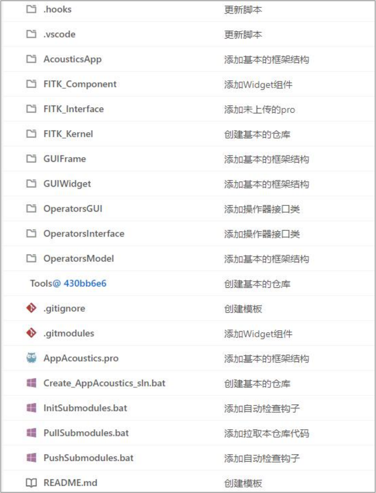

> **应用软件（App）开发** **说明书**
>
> **青岛数智船海科技有限公司**

+--------------+-------------------------------------------+--------------+
| > **时间**   | > **修改纲要**                            | > **修改人** |
+--------------+-------------------------------------------+--------------+
| > 2024/09/14 | > 首次编制                                | > 李宝君     |
+--------------+-------------------------------------------+--------------+
|              |                                           |              |
+--------------+-------------------------------------------+--------------+
|              |                                           |              |
+--------------+-------------------------------------------+--------------+
|              |                                           |              |
+--------------+-------------------------------------------+--------------+
|              |                                           |              |
+--------------+-------------------------------------------+--------------+
|              |                                           |              |
+--------------+-------------------------------------------+--------------+
|              |                                           |              |
+--------------+-------------------------------------------+--------------+
|              |                                           |              |
+--------------+-------------------------------------------+--------------+
|              |                                           |              |
+--------------+-------------------------------------------+--------------+
|              |                                           |              |
+--------------+-------------------------------------------+--------------+
|              |                                           |              |
+--------------+-------------------------------------------+--------------+
|              |                                           |              |
+--------------+-------------------------------------------+--------------+
|              |                                           |              |
+--------------+-------------------------------------------+--------------+
|              |                                           |              |
+--------------+-------------------------------------------+--------------+
|              |                                           |              |
+--------------+-------------------------------------------+--------------+
|              |                                           |              |
+--------------+-------------------------------------------+--------------+
|              |                                           |              |
+--------------+-------------------------------------------+--------------+
|              |                                           |              |
+--------------+-------------------------------------------+--------------+

> **一、代码仓库与子模块**
>
> FastCAE 采用基于 Git 的代码托管平台，代码同步与代码管理均通过
> Git进行管理。为
> 方便实现代码复用，软件的功能模块均以单独的仓库进行托管。在应用软件的开发过程中通
> 常需要用到多个功能模块，因此在代码组织形式上采用"子模块
> "的形式进行功能模块的关
> 联，每一个子模块都是一个独立的仓库，可以独立的设置分支与权限。通过子模块的形式可
> 以将一个代码仓库共享给多个应用软件，达到高效复用的目标。下图所式的代码仓库中文件
> 夹后面带有蓝色"@\<版本号\> "的均为子模块。

{width="3.0641655730533683in"
height="2.895832239720035in"}

> 应用软件的代码管理通常是建立一个代码仓库，然后在代码仓库中添加子模块，从而形
> 成一个完整的应用软件代码仓库。应用软件的常用子模块操作包含添加子模块、初始化子模
> 块、删除子模块以及常规的提交（commit）、拉取（pull）、推送（push）等操作。
>
> 子模块添加命令如下，其中，url 为子模块的路径，path
> 为该子模块存储的目录路径。
> 执行成功后，在原始仓库中会看到项目中新增或修改了.gitmodules
> 文件，并增加了一个子模
> 块的描述。在执行添加子模块的操作时，会自动将\<url\>的仓库克隆到\<path\>目录下，因此
> 每一个子模块都是一个独立的文件夹。
>
> 1\. git submodule add \<url\> \<path\>
>
> 若克隆一个已经存在子模块的代码仓库，这时子模块的代码不会被同步克隆到对应的文
> 件夹，需要进行子模块初始化，子模块初始化命令有两种，如下。第 1
> 种方式需要在子模块 所在的目录执行，第 2
> 种在仓库根目录执行，并能够递归初始化全部仓库。
>
> 1\. 方法一
>
> 2\. git submodule init
>
> 3\. git submodule update
>
> 4\. 方法二
>
> 5\. git submodule update \--init \--recursive
>
> 子模块的删除操作比较复杂，通常可以通过下面的步骤进行子模块删除操作：
>
> 1\. *//将子模块标记为不在追踪*
>
> 2\. git submodule de init \<submodule\>
>
> 3\. *//删除子模块目录*
>
> 4\. git rm \<submodule\>
>
> 5\. *//从.gitmodules 文件移除子模块标记*
>
> 6\. *//提交修改（commit）*
>
> 7\. g it commit -m \"Remove submodule\"
>
> 子模块在本质上是一个独立的仓库，其他操作，例如常规的提交（commit）、拉取
> （pull）、推送（push）等均与常规的仓库操作一致，也可以独立设置仓库权限与分支。
>
> **二、应用软件代码结构**
>
> 为保证应用软件开发效率与模块组件的适配性，对应用软件的代码结构提出一定的规范
> 性要求如下。

{width="3.820832239720035in"
height="5.0174989063867015in"}

> **1. 工程管理与脚本**
>
> 应用软件的工程管理通过 qmake 进行管理，可实现跨平台编译，其中 pro
> 文件为工程文
> 件，指定编译输出文件名称与路径等，还包含了其依赖的动态库；pri
> 文件指定工程中的文 件，包括代码文件与资源文件等。pro
> 工程文件可直接通过 Qt Creator 打开进行编译，或者 使用 Qt 提供的 qmake
> 转换工具转化为编译器能够识别的工程文件进行编译操作。
>
> 通过 Qt
> 进行代码管理的工程，其编译的中间文件（ui、moc、obj）等文件将生成在
> generate 文件夹下，最终编译输出的可执行程序与动态库输出在
> output路径下。
>
> 在代码目录下通常会包含一些批处理脚本（bat 或者 sh
> 文件），这些文件通常是用来执
> 行自动化操作，提高操作效率，避免不必要的错误。可能在目录中出现的脚本与功能如下:

+--------------------------+-------------------------------------------+
| > **脚本名称**           | > **功能描述**                            |
+--------------------------+-------------------------------------------+
| > InitSubmodules         | > 初始化子模块，递归初始化全部子模块。    |
|                          | > 并将子模块更                            |
|                          | > 新到最新，分支初始化为master            |
|                          | > 分支，初始化仓库，将                    |
+--------------------------+-------------------------------------------+

+--------------------------+----------------------------------------------------+
|                          | > git 钩子配置到正确的路径。                       |
+--------------------------+----------------------------------------------------+
| > PullSubmodules         | > 拉取代码，将子模块代码仓库代码更新到最新，子模块 |
|                          | > 拉取的代码为master                               |
|                          | > 分支。原仓库拉取分支为当前分支。 相当于 pull     |
|                          | > 命令。                                           |
+--------------------------+----------------------------------------------------+
| > PushSubmodules         | > 推送代码，将全部的代码推送到代码仓库，包含全部的 |
|                          | > 子模块和原仓库，相当于 push。若用户没有 push     |
|                          | > 权限则 会被拒绝。                                |
+--------------------------+----------------------------------------------------+
| > ResetSubmodules        | > 强制重置全部子模块仓库与原仓库。相当于 git reset |
+--------------------------+----------------------------------------------------+
| > Create_XXXX            | > 执行 qmake 生成工程文件，windows 平台需要注意    |
|                          | > qmake 与 VS 的路径，若有不一致，需要进行修改。   |
+--------------------------+----------------------------------------------------+

> **2. 配置文件**
>
> 在单面仓库中除了上述文件与脚本文件外，还包含了一些配置文件，这些配置文件是代
> 码管理工程管理的必要信息。配置文件的通常以符号".
> "开头，操作系统通常会识别为隐 藏文件。配置文件与文件夹的作用如下：

+----------------+-------------------+--------------------------------------------+
| > **配置文件** | > **类型**        | > **作用**                                 |
+----------------+-------------------+--------------------------------------------+
| > .git         | > 文件夹          | > git 仓库相关配置信息，用于 git仓库管理   |
+----------------+-------------------+--------------------------------------------+
| > .hooks       | > 文件夹          | > 自定义的钩子，用于提交与推送时的检查工具 |
+----------------+-------------------+--------------------------------------------+
| > .vscode      | > 文件夹          | > vscode 添加注释的配置文件，vscode        |
|                |                   | > 可使用通 义灵码添加注释                  |
+----------------+-------------------+--------------------------------------------+
| > .gitignore   | > 文件            | > git 版本管理中忽略的文件配置             |
+----------------+-------------------+--------------------------------------------+
| > .gitmodules  | > 文件            | > 子模块信息，远端地址与本地相对路径等     |
+----------------+-------------------+--------------------------------------------+

> **3. 代码文件**
>
> 应用软件的代码分为两部分，一部分是采用通用底座与通用组件（下文简称"通用代码
> "）， 另外一部分则是实现个性化应用软件相关的业务逻辑与 UI
> 的个性化代码。
>
> **通用代码**
>
> 通用代码是指在不同的软件中可以复用的代码，存放在三个文件夹内，分别是
>
> FITK_Kernel 、FITK_Interface 、FITK_Component
> ，分别存储核心底座、数据与功能接口、
>
> 组件的代码，三个文件夹内部的目录均为子模块，需要注意，三个文件夹的名称与相对路径
> 不能发生变化，否则会出现编译失败的问题。在远端的总仓库中也存在于上述三个文件夹同
> 名的仓库组，添加子模块时注意对应的分组名称即可。
>
> 三个文件夹代码的相互依赖关系为 FITK_Interface 依赖
> FITK_Kernel，FITK_Component 依赖 FITK_Interface 和 FITK_Kernel
> ，文件夹之间相互依赖关系不能发生变化。但文件夹内
> 部的子模块的依赖关系比较宽松，但是不能形成循环依赖。
>
> 除此之外，Tools
> 文件夹也是通用的，通过子模块的形式引入到应用软件，Tools 文件夹
> 中存放了通用的第三方库，包含 Linux 与 Windows
> 两个版本，可直接同步到本地使用。其
> 命名方式与使用方式与上文所述的三个文件夹相同。
>
> **个性化代码**
>
> 个性化代码可以分为四部分，第一部分是数据，数据指与仿真业务与流程相关的数据，
> 在通用底座中已经开发了一些数据组件，能够满足多学科的数据需求，且随着通用底座的开
> 发，数据部分的完善度将会越来越高，因此个性化数据部分工作量较少，甚至可以直接使用
> 已经存在的数据组件。
>
> 第二部分是用户交互界面，也就是
> GUI，这部分是个性化最重要的体现，这部分代码通 常分为三部分：GUIFrame
> ，用来表示主要的界面 UI ，例如主界面等主要用户交互界面的框
> 架；GUIWidget ，用来实现具体的功能窗口，例如树形菜单、
> 日志窗口等；GUIDialog 则用
> 来表示对话框等生命周期较短，逻辑功能与数据传递相对单一的 UI 界面。
>
> 第三部分是操作器（Operator），操作器的作用是建立界面与数据层的关联，个性化的
> 额操作器本质是个性化的业务实现，操作器在整个逻辑架构中处于承上启下的关键位置。操
> 作器通常分为三类，第一类是抽象接口，也就是下图的基类抽象接口，通常这些抽象接口被
> 放在 OperatorsInterface
> 的文件夹中，作为一个单独的模块编译为一个动态库，这个模块的依
> 赖层级比较低，因此可以作为接口被 GUI
> 调用；第二类是主要对数据进行操作的，例如导
>
> 入导出文件等 ， 这些操作器通常被称为数据操作器 ，
> 代码文件通常存放在名为 OperatorsModel 的文件夹内；第三类则是主要对 UI
> 对象进行交互的操作器，比如实现多个 UI
> 控件的联动，这些操作器通常被放在名为 OperatorsGUI 的文件夹内。

{width="3.5881933508311463in"
height="2.3472222222222223in"}

> 第四部分是指主程序部分，也就是在 main
> 函数所在的工程，该部分代码比较简单，主 要是基于基础底座中 AppFramework
> 定义的注册接口实现个性化的事件处理，主要是完成对
> 应类的注册。该部分也是软件的核心部分，若遗漏部分注册接口可能导致软件无法正确运行。
>
> **适配器**
>
> 在软件中，适配器分为两类，可视化适配器与IO
> 适配器，可视化适配器能够实现数据
> 对象与可视化对象之间的转化与适配；另外一类则是 IO
> 适配器，实现内存数据与外存文件 之间的数据转化。IO 适配器通常在 IO
> 组件中实现，而可视化组件则需要个性化的可视化要 求实现个性化转化。
