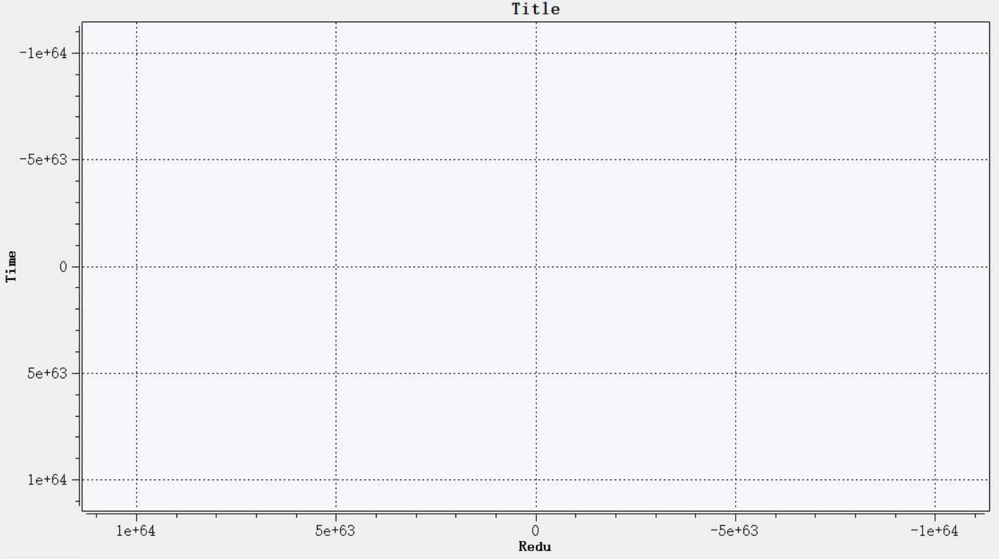
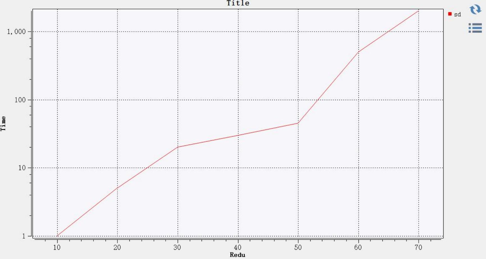
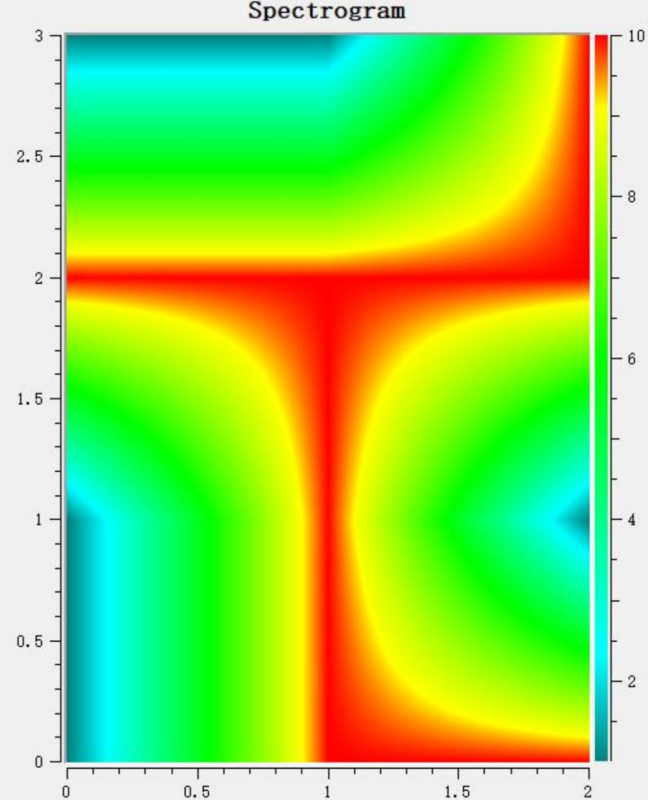
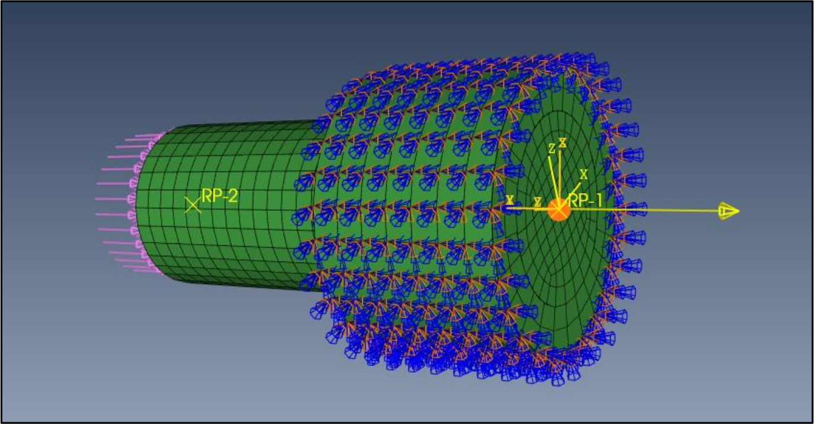
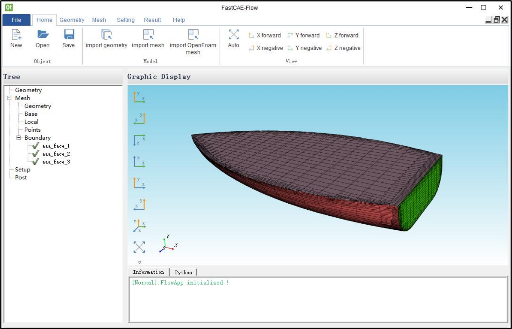

> **组件（Component）使用说明书**
>
> **青岛数智船海科技有限公司**

+--------------+-------------------------------------------+--------------+
| > **时间**   | > **修改纲要**                            | > **修改人** |
+--------------+-------------------------------------------+--------------+
| > 2024/09/19 | > 首次编制                                | > 李宝君     |
+--------------+-------------------------------------------+--------------+
|              |                                           |              |
+--------------+-------------------------------------------+--------------+
|              |                                           |              |
+--------------+-------------------------------------------+--------------+
|              |                                           |              |
+--------------+-------------------------------------------+--------------+
|              |                                           |              |
+--------------+-------------------------------------------+--------------+
|              |                                           |              |
+--------------+-------------------------------------------+--------------+
|              |                                           |              |
+--------------+-------------------------------------------+--------------+
|              |                                           |              |
+--------------+-------------------------------------------+--------------+
|              |                                           |              |
+--------------+-------------------------------------------+--------------+
|              |                                           |              |
+--------------+-------------------------------------------+--------------+
|              |                                           |              |
+--------------+-------------------------------------------+--------------+
|              |                                           |              |
+--------------+-------------------------------------------+--------------+
|              |                                           |              |
+--------------+-------------------------------------------+--------------+
|              |                                           |              |
+--------------+-------------------------------------------+--------------+
|              |                                           |              |
+--------------+-------------------------------------------+--------------+
|              |                                           |              |
+--------------+-------------------------------------------+--------------+
|              |                                           |              |
+--------------+-------------------------------------------+--------------+
|              |                                           |              |
+--------------+-------------------------------------------+--------------+

> **1 通用组件**
>
> **1.1 OCC 几何建模组件（FITKGeoCompOCC）**
>
> **1.1.1 组件功能**
>
> OCC
> 几何建模组件是一个继承自接口层几何模块的一个组件，其中包含一个组件接口、
> 几何模型数据获取工具、OCC
> 形状数据代理器、几何模型拆分工具与管理器、基准元素创
> 建以及模型与几何建模命令的OCC 实现。
>
> **1.1.2 组件依赖**
>
> 该组件依赖平台核心层中的 FITKCore 、FITKAppFramework ，接口层中的
> FITKInterfac eModel 、FITKInterfaceGeometry
> 共计四个模块。此外，该组件需要第三方库 OCC 的支持。
>
> **1.1.3 组件主要类**

+-----------------------------+-----------------------------+----------------------+
| > **类名**                  | > **所在文件**              | > **功能**           |
+-----------------------------+-----------------------------+----------------------+
| > FITKGeoCompOCCInterface   | > FITKGeoCompOCCInterface   | > OCC 建模组件接口   |
|                             |                             | >                    |
|                             |                             | > 类，               |
|                             |                             | > 内部对该组件支     |
|                             |                             | >                    |
|                             |                             | > 持的所有建模命令以 |
|                             |                             | >                    |
|                             |                             | > 及辅助元素创建方式 |
|                             |                             | >                    |
|                             |                             | > 在抽象层工厂内进行 |
|                             |                             | >                    |
|                             |                             | > 了注册。           |
+-----------------------------+-----------------------------+----------------------+
| > FITKAbstractOCCModel      | > FITKAbstractOCCModel      | > OCC 层模型形状数据 |
|                             |                             | > 代理器，包含对 OCC |
|                             |                             | > 的 TopoDS_Shape 进 |
|                             |                             | > 行管理、拆分、数据 |
|                             |                             | > 提取等功能。       |
+-----------------------------+-----------------------------+----------------------+
| > FITKOCCVirtualTopoCreator | > FITKOCCVirtualTopoCreator | > OCC 层几何形状拆分 |
+-----------------------------+-----------------------------+----------------------+

+--------------------------------+--------------------------------+:-------------------------+
| > FITKOCCShapeTriangulate      | > FITKOCCShapeTriangulate      | > 工具与三角面片化工     |
|                                |                                | > 具类，可递归地将形     |
|                                |                                | > 状进行逐层拆分。       |
+--------------------------------+--------------------------------+--------------------------+
| > FITKOCCPlaneFaceTool         | > FITKOCCGeomTools             | > OCC 层几何工具，提     |
| >                              |                                | > 供了如查询点坐标、     |
| > FITKOCCPointTool             |                                | >                        |
|                                |                                | > 获取平面方向等常用     |
|                                |                                | > 工具方法的工具类集     |
|                                |                                | > 合。                   |
+--------------------------------+--------------------------------+--------------------------+
| > FITKOCCModelSimpleShape      | > FITKOCCModelSimpleShape      | > 包含 OCC 层基础图形    |
+--------------------------------+--------------------------------+--------------------------+
| > FITKOCCModelPoint            | > FITKOCCModelPoint            | （如：立方体、圆柱、     |
+--------------------------------+--------------------------------+--------------------------+
| > FITKOCCModelCurve            | > FITKOCCModelCurve            | 球体等）、点、曲线、     |
+--------------------------------+--------------------------------+--------------------------+
| > FITKOCCModelSurface          | > FITKOCCModelSurface          | > 表面、实体创建命令     |
+--------------------------------+--------------------------------+--------------------------+
| > FITKOCCModelSolid            | > FITKOCCModelSolid            | > 以及 OCC 形状数据生    |
|                                |                                | > 成功能。               |
+--------------------------------+--------------------------------+--------------------------+
| > FITKOCCModelOperLine         | > FITKOCCModelOperLine         | > 包含 OCC 层线、面、    |
+--------------------------------+--------------------------------+--------------------------+
| > FITKOCCModelOperFace         | > FITKOCCModelOperFace         | > 体、组合对象等多种     |
+--------------------------------+--------------------------------+--------------------------+
| > FITKOCCModelOperSolid        | > FITKOCCModelOperSolid        | > 不同类型形状的几何     |
+--------------------------------+--------------------------------+--------------------------+
| > FITKOCCModelOperCompound     | > FITKOCCModelOperCompound     | > 处理、清理以及几何     |
+--------------------------------+--------------------------------+--------------------------+
| > FITKOCCModelOperImprintSolid | > FITKOCCModelOperImprintSolid | > 特征相关工具功能。     |
+--------------------------------+--------------------------------+--------------------------+
| > FITKOCCSplitter              | > FITKOCCSplitter              | > 包含 OCC 层形状变换    |
+--------------------------------+--------------------------------+--------------------------+
| > FITKOCCTransformation        | > FITKOCCTransformation        | > 功能（如：形状分割、   |
|                                |                                | > 平移、旋转、缩放等）。 |
+--------------------------------+--------------------------------+--------------------------+
| > FITKOCCModelSketch2D         | > FITKOCCModelSketch2D         | > 包含 OCC 层平面草图    |
+--------------------------------+--------------------------------+--------------------------+
| > FITKOCCReferencePoint        | > FITKOCCReferencePoint        | > 以及辅助元素（如：     |
+--------------------------------+--------------------------------+--------------------------+
| > FITKOCCReferenceLine         | > FITKOCCReferenceLine         | > 基准点、基准线、基     |
+--------------------------------+--------------------------------+--------------------------+
| > FITKOCCReferencePlane        | > FITKOCCReferencePlane        | > 准面）的多种不同创     |
|                                |                                | > 建方式。               |
+--------------------------------+--------------------------------+--------------------------+
| > FITKOCCModelImport           | > FITKOCCModelImport           | > OCC 层文件 IO ，支持   |
+--------------------------------+--------------------------------+--------------------------+
| > FITKOCCModelExport           | > FITKOCCModelExport           | > 导入 STL 、STP 、STE   |
+--------------------------------+--------------------------------+--------------------------+

+-------------------------+-------------------------+--------------------+
|                         |                         | > P 、IGS 、IGES   |
|                         |                         | > 、BRE P          |
|                         |                         | > 格式几何文件的导 |
|                         |                         | > 入与导出。       |
+-------------------------+-------------------------+--------------------+

> **1.1.4 组件使用示例**
>
> 该组件需要借助抽象层几何命令工厂接口进行命令的创建，此时可以返回抽象层命令类
> 型进行操作进行几何引擎的解耦合，在工厂成功实例化建模操作命令后对其进行参数设置并
> 更新命令，此时 OCC
> 几何命令层将会进行形状的生成，并将执行状态返回，示例代码如下 所示：
>
> 1\. *// 通过接口层工厂创建命令。*
>
> 2\. Interface: :FITKAbsGeoModelChamferSolid\* chamferCmd =
> Interface::F ITKInterfaceGeometryFactory::getInstance()
>
> 3\. -\>createCommandT\<Interface::FITKAbsGeoModelChamferSol
>
> id\>(Interface ::FITKGeoEnum::FITKGeometryComType::FGTChamferSolid);
>
> 4\. if (!chamferCmd)
>
> 6\. return false;
>
> 7\. }
>
> 8\. *// 设置参数生成数据。*
>
> 9\. chamferCmd-\>setInputCmdId(m_tempCmdId);
>
> 10\. chamferCmd-\>setEdgeIds(m_tempEdgeIds);
>
> 11\. chamferCmd-\>setDistance(ui-\>editLength-\>text().toDouble());
>
> 12\. bool flag = chamferCmd-\>update();
>
> 13\. if (!flag)
>
> 14\. {
>
> 15\. *// 建模失败则析构创建的数据对象。*
>
> 16\. delete chamferCmd;
>
> 17\. chamferCmd = nullptr;
>
> 18\. return false;
>
> 19.}
>
> 在命令执行状态返回值为真时，将命令的引用计数清空，并视界面逻辑与实际建模命令
> 输入数据依赖关系进行命令引用的指定，然后将命令放入命令列表，示例代码如下所示：
>
> 1\. *// 移除命令引用并添加新命令引用。*
>
> 2\. chamferCmd-\>clearReference();
>
> 5\. Interface: :FITKGeoCommand List\* geoData =
> FITKGLODATA-\>getGeometry Data\<Interface::FITKGeoCommand List\>();
>
> 6\.
> chamferCmd-\>setDataObjectName(geoData-\>checkName(QString(\"Chamfer
> -%1\").arg(geoData-\>getDataCount() + 1)));
>
> 7\. geoData-\>appendDataObj(chamferCmd);
>
> **1.2 OCC 几何信息读写组件（FITKGeoOCCIOHDF5）**
>
> **1.2.1 组件功能**
>
> 该组件是一个 IO 组件，用于软件运行时对几何工程信息、OCC
> 相关的几何信息进行存
> 储与读取。其中包含几何点、线、面、体、草绘、基准等。组件以HDF5
> 格式对软件信息进 行存储。
>
> **1.2.2 组件依赖**
>
> 该组件依赖平台核心层中的 FITKCore 、FITKAdaptor 、FITKAppFramework
> ，接口层中 的 FITKInterfaceIO 、FITKInterfaceGeoIOHDF5
> 、FITKInterfaceGeometry 以及组件层中的 FI TKGeoCompOCC
> 共计七个模块。此外，该组件需要第三方库 HDF5 的支持。
>
> **1.2.3 组件主要类**

+-------------------+--------------------------+---------------------------------------+
| > **类名**        | > **所在文件**           | > **功能**                            |
+-------------------+--------------------------+---------------------------------------+
| > FITKOCCIOHDF5In | > FITKOCCIOHDF5Interface | > 组件接口类，用于调用写出与读取。    |
| >                 |                          |                                       |
| > terface         |                          |                                       |
+-------------------+--------------------------+---------------------------------------+
| > FITKOCCHDF5Read | > FITKOCCHDF5Reader      | > 组件读取入口，该类继承自线程类,实现 |
| >                 |                          | > 在 run 函数中。                     |
| > er              |                          |                                       |
+-------------------+--------------------------+---------------------------------------+
| > FITKOCCHDF5Writ | > FITKOCCHDF5Writer      | > 组件写出入口，该类继承自线程类,实现 |
| >                 |                          | > 在 run 函数中。                     |
| > er              |                          |                                       |
+-------------------+--------------------------+---------------------------------------+
| > FITKOCCHDF5Ada  | > FITKOCCHDF5AdaptorCo   | > 命令读写适配器，写出与读取所有几何  |
| >                 | > mmand                  | > 入口。                              |
| > ptorCommand     |                          |                                       |
+-------------------+--------------------------+---------------------------------------+

> **1.2.4 组件使用示例**
>
> 该组件的使用分为两部分：写出与读取。组件加载通过注册到 AppFramework
> 的组件生 成器（FITKComponentFactory）的子类对象实现。示例代码如下：
>
> 1\. #include "FITKOCCIOHDF5Interface.h"
>
> 2\. class MyComponentFactory : public AppFrame::FITKComponentFactory
>
> 3\. {
>
> 4\. public:
>
> 5\. MyComponentFactory () = default;
>
> 6\. \~MyComponentFactory () = default;
>
> 7\. QList\<AppFrame::FITKComponentInterface \*\> createComponents ()
> override
>
> 8\. {
>
> 9\. QList\<AppFrame::FITKComponentInterface \*\> comps;
>
> 10\. *//创建信息窗口组件*
>
> 11\. comps \<\< new IO ::FITKOCCIOHDF5Interface();
>
> 12\. *// 创建其他组件*
>
> 13\. return comps;
>
> 14\. }
>
> 完成组件创建之后，组件则是从应用程序架构中的组件管理器查询得到，示例代码如下：
>
> 1\. *//获取几何命令列表*
>
> 2\. Interface: :FITKGeoCommand List\* cmd List =
> FITKAPP-\>getGlobalData()
>
> -\>getGeometryData\<Interface::FITKGeoCommand List\>();
>
> 3\. if (!cmd List) return false;
>
> 4\. auto fit kIO =
> FITKAPP-\>getComponents()-\>getComponentTByName\<IO::F
> ITKOCCIOHDF5Interface\>(\"FITKOCCHDF5IO\");
>
> 5\. *//组件获取异常*
>
> 6\. if (fit kIO == nullptr) return false;
>
> 7\. *//关联信号，后续处理结束的事件*
>
> 8\. connect(fit kIO, SIGNAL(ioThread FinishedSig()), this, SLOT(ioTh
> rea dFinishedSlot()));
>
> 9\. QString fileName;
>
> 10\. bool ok = this-\>argValue\<QString\>(\"FileName\", fileName);
>
> 11\. *//参数设置*
>
> 12\. fit kIO-\>setFileName(fileName);
>
> 13\. fit kIO-\>setDataObject(cmd List);
>
> 14\. *//执行读取，1-读取* *2- 写出*
>
> 15\. fit kIO-\>exec(2);
>
> 当需要读取 HDF5 几何文件时，需要修改 fileName 与 exec
> 的调用参数，确保线程安全。 示例代码如下：
>
> 1\. QString fileName;
>
> 2\. bool ok = this-\>argValue\<QString\>(\"FileName\", fileName);
>
> 3\. if (!ok) return false;
>
> 4\. QFileInfo finfo(fileName);
>
> 5\. if (!finfo.exists()) return false;
>
> 6\. *//输出信息*
>
> 7\. AppFrame::FITKMessageNormal(QString(tr(\"Reading project file %
>
> 1 \...\")).arg(fileName));
>
> 8\. *//获取数据对象*
>
> 9\. Interface::FITKGeoCommand List\* cmd List =
> FITKAPP-\>getGlobalData()
> -\>getGeometryData\<Interface::FITKGeoCommand List\>();
>
> 10\. if (!cmd List) return false;
>
> 11\. *//获取读取组件*
>
> 12\. auto fit kIO =
> FITKAPP-\>getComponents()-\>getComponentTByName\<IO::
> FITKOCCIOHDF5Interface\>(\"FITKOCCHDF5IO\");
>
> 13\. if (fit kIO == nullptr) return false;
>
> 14\. *//关联信号，后续处理结束的事件*
>
> 15\. connect(fit kIO, SIGNAL(ioThread FinishedSig()), this, SLOT(ioTh
> re ad FinishedSlot()));
>
> 16\. *//参数设置*
>
> 17\. fit kIO-\>setFileName(fileName);
>
> 18\. fit kIO-\>setDataObject(cmd List);
>
> 19\. *//执行读取，1-读取* *2- 写出*
>
> 20\. fit kIO-\>exec(1);
>
> **1.3 OCC 三维渲染窗口组件（FITKRenderWindowOCC）**
>
> **1.3.1 组件功能**
>
> OCC 三维渲染窗口组件是一个 UI 组件，其主要功能为创建、维护一个 OCC
> 渲染窗口。
> 该组件窗口中带有一个可点击交互进行视角切换的视方体以及一个视角常用操作工具栏。同
> 时，本组件内也提供了一个 OCC
> 可视化对象抽象类作为窗口输入数据类型，下图为 CAD
> 软件中的窗口显示效果。

{width="5.229166666666667in"
height="2.8208333333333333in"}

> **1.3.2 组件依赖**
>
> 该组件依赖平台核心层中的 FITKAppFramework 与 FITKCore
> 两个模块。此外，该组件 需要第三方库 OCC 的支持。
>
> **1.3.3 组件主要类**

+-------------------------------+-------------------------------+----------------------+
| > **类名**                    | > **所在文件**                | > **功能**           |
+-------------------------------+-------------------------------+----------------------+
| > FITKGraph3DWindowOCCInterfa | > FITKGraph3DWindowOCCInterfa | > 组件接口类，用于组 |
| >                             | >                             | > 件加载，           |
| > ce                          | > ce                          | > 以及组件窗         |
|                               |                               | > 口的实例化和管理。 |
+-------------------------------+-------------------------------+----------------------+
| > FITKGraph3DWindowOCC        | > FITKGraph3DWindowOCC        | > 经过封装的 OCC 三  |
|                               |                               | >                    |
|                               |                               | > 维渲染窗口，支持以 |
|                               |                               | >                    |
|                               |                               | > FITKGraphObjectOC  |
|                               |                               | >                    |
|                               |                               | > C 类型的可视化对象 |
|                               |                               | >                    |
|                               |                               | > 作为窗口输入进行可 |
|                               |                               | >                    |
|                               |                               | > 视化。             |
+-------------------------------+-------------------------------+----------------------+
| > FITKGraphObjectOCC          | > FITKGraphObjectOCC          | > OCC 三维可视化对   |
|                               |                               | > 象抽象类，所有 OCC |
|                               |                               | > 渲染对象的抽象类   |
+-------------------------------+-------------------------------+----------------------+

+---------------------------+---------------------------+----------------------+
|                           |                           | > 型，也是 OCC 渲染  |
|                           |                           | > 窗口的输入数据类   |
|                           |                           | > 型。               |
+---------------------------+---------------------------+----------------------+
| > FITKAIS_SketchShape     | > FITKAIS_SketchShape     | > OCC 可视化对象子   |
|                           |                           | > 类，提供了在草图模 |
|                           |                           | > 式下在窗口内进行鼠 |
|                           |                           | > 标拖拽建模的基础方 |
|                           |                           | > 法与预览效果。     |
+---------------------------+---------------------------+----------------------+
| > FITKAIS_ViewController  | > FITKAIS_ViewController  | > 子类化的OCC 渲染   |
| >                         | >                         | >                    |
| > FITKV3d_View            | > FITKV3d_View            | > 与交互控制类，实现 |
| >                         | >                         | >                    |
| > FITKV3d_Viewer          | > FITKV3d_Viewer          | > 了自定义渲染效果以 |
| >                         | >                         | >                    |
| > FITKV3d_RectangularGrid | > FITKV3d_RectangularGrid | > 及与 Qt 信号机制的 |
|                           |                           | >                    |
|                           |                           | > 完美融合，使交互功 |
|                           |                           | >                    |
|                           |                           | > 能更加可控。       |
+---------------------------+---------------------------+----------------------+

> **1.3.4 组件使用示例**
>
> 该组件的使用可以概括分为三部分：组件加载、创建窗口、添加可视化对象。首先在程
> 序初始化期间，将组件在组件工厂内进行注册；然后在需要创建 OCC
> 渲染窗口时，驱动组
> 件接口类中的获取窗口接口，将窗口进行实例化，示例代码如下：
>
> 1\. *// 获取窗口组件。*
>
> 2\. AppFrame::FITKComponentInterface\* graphWinInterface =
> FITKAPP-\>ge tComponents()-\>getComponentByName(\"Graph3DWindowOCC\");
>
> 3\. if (graphWinInterface == nullptr)
>
> 4\. {
>
> 5\. return nullptr;
>
> 6\. }
>
> 7\. *// 创建渲染窗口。*
>
> 8\. int port = 1;
>
> 9\. QWidget\* w = graphWinInterface-\>getWidget(port);
>
> 在创建或获取到三维窗口后，可将实例化的可视化对象添加到其中，示例代码如下：
>
> {width="2.339238845144357e-2in"
> height="0.21666557305336834in"}{width="4.40239501312336in"
> height="0.21666557305336834in"}1.Render::FITKGraph3DWindowOCC\*{width="6.227143482064742e-2in"
> height="0.19166557305336832in"}graphWindow{width="6.281277340332458e-2in"
> height="0.19166557305336832in"}={width="6.281277340332458e-2in"
> height="0.19166557305336832in"}{width="1.062422353455818in"
> height="0.19166557305336832in"}getGraphWindow();
>
> 2\. Render::FITKGraphObjectOCC\* obj = getGraphObject();
>
> 3\. if (!obj \|\| !graphWindow)
>
> 4\. {
>
> 6\. }
>
> 7\. *// 添加对象至渲染窗口。*
>
> 8\. graphWindow-\>addObject(obj, false);
>
> 此外，该组件窗口中提供了若干常用三维视角切换以及样式修改接口，如：自适应相机
> 视距、XYZ 正负方向快捷切换、正交/透视投影切换、修改背景颜色。
>
> **1.4 VTK 三维渲染窗口组件（FITKRenderWindowVTK）**
>
> **1.4.1 组件功能**
>
> VTK 三维渲染窗口组件是一个 UI
> 组件，它可以为外部提供一个含有多个渲染层的 VT K
> 渲染窗口，该渲染窗口中包含一个三维坐标轴对象。同时该组件中存放了一系列有关窗口
> 的窗口组件以及作为窗口输入数据的可视化对象抽象类，下图为 CFD
> 分析软件中的窗口显 示效果。

{width="5.110833333333333in"
height="2.8841666666666668in"}

> **1.4.2 组件依赖**
>
> 该组件依赖平台核心层中的 FITKAppFramework 与 FITKCore
> 两个模块。此外，该组件 需要第三方库 VTK 的支持。
>
> **1.4.3 组件主要类**

+---------------------+---------------------------+--------------------------------------+
| > **类名**          | > **所在文件**            | > **功能**                           |
+---------------------+---------------------------+--------------------------------------+
| > FITKGraph3DWindo  | > FITKGraph3DWindowInterf | > 组件接口类，用于组件加载，以及组件 |
| > wInterface        | >                         | > 窗口的实例化和管理。               |
|                     | > ace                     |                                      |
+---------------------+---------------------------+--------------------------------------+
| > FITKGraph3DWindo  | > FITKGraph3DWindowVTK    | > 经过封装的 VTK 三维渲染窗口，支持  |
| > wVTK              |                           | > 以 FITKGraphObjectVTK 类型的可视化 |
|                     |                           | > 对象作为窗口输入进行可视化。       |
+---------------------+---------------------------+--------------------------------------+
| > FITKGraphObjectVT | > FITKGraphObjectVTK      | > VTK 三维可视化对象抽象类，所有 VT  |
| > K                 |                           | > K 渲染对象的抽象类型，也是 VTK 渲  |
|                     |                           | > 染窗口的输入数据类型。             |
+---------------------+---------------------------+--------------------------------------+
| > FITKGraphRender   | > FITKGraphRender         | > 封装过的渲染器，其内部维护着 VTK   |
|                     |                           | > 渲染窗口中某一渲染层的渲染器指针。 |
+---------------------+---------------------------+--------------------------------------+

> **1.4.4 组件使用示例**
>
> 该组件的使用可以概括分为三部分：组件加载、创建窗口、添加可视化对象。首先在程
> 序初始化期间，将组件在组件工厂内进行注册；然后在需要创建 VTK
> 渲染窗口时，驱动组
> 件接口类中的获取窗口接口，将窗口进行实例化，示例代码如下：
>
> 1\. *// 获取窗口组件。*
>
> 2\. AppFrame::FITKComponentInterface\* graphWinInterface =
> FITKAPP-\>ge tComponents()-\>getComponentByName(\"Graph3DWindowVTK\");
>
> 3\. if (graphWinInterface == nullptr)
>
> 4\. {
>
> 5\. return nullptr;
>
> 6\. }
>
> 7\. *// 创建渲染窗口。*
>
> 8\. int port = 1;
>
> 9\. QWidget\* w = graphWinInterface-\>getWidget(port);
>
> 在创建或获取到三维窗口后，可将实例化的可视化对象添加到其中，示例代码如下：

5\.

return;

> 6\. }
>
> 7\. *// 获取渲染层级。*
>
> 8\. int layer = obj-\>getRenderLayer();
>
> 9\. *// 设置渲染器（计算渲染尺寸）*
>
> 10\. Comp::FITKGraph Render\* render =
> graphWindow-\>getRenderer(layer);
>
> 12\. {
>
> 13\. return;
>
> 14\. }
>
> 15\. obj-\>setFITKRender(render);
>
> 16\. *// 从上一个窗口移除可视化对象。*
>
> 17\. obj-\>removeFromGraphWidget();
>
> 18\. graphWindow-\>addObject(layer, obj, false);
>
> 此外，该组件窗口中提供了若干常用三维视角切换以及样式修改接口，如：自适应相机
> 视距、XYZ 正负方向快捷切换、正交/透视投影切换、修改背景颜色等。
>
> **1.5 OCC 三维可视化适配器组件（FITKOCCGraphAdapt or）**
>
> **1.5.1 组件功能**
>
> OCC
> 三维可视化适配器组件是一个数据转换模块，其中包含建模软件中所有三维模型
> 以及其一些附加辅助元素的图素与数据转换器。该模块中目前支持的可视化对象种类包括且
> 不限于模型、草图、拾取方向预览、模型预览、拓扑预览、测量工具等诸多模型以及建模辅
> 助工具可视化对象类型，下图为部分可视化对象显示效果。

{width="2.9725in"
height="2.1591666666666667in"}

> **1.5.2 组件依赖**
>
> 该组件依赖平台核心层中的 FITKCore、FITKAdaptor，接口层中的
> FITKInterfaceModel、 FITKInterfaceGeometry ，以及组件层中的
> FITKGeoCompOCC 、FITKRenderWindowOCC 共
> 计六个模块。此外，该组件需要第三方库 OCC 的支持。
>
> **1.5.3 组件主要类**

+--------------------------+--------------------------+----------------------------------+
| > **类名**               | > **所在文件**           | > **功能**                       |
+--------------------------+--------------------------+----------------------------------+
| > FITKOCCGraphObject3D   | > FITKOCCGraphObject3D   | > 三维可视化对象基类，所有 OCC   |
|                          |                          | > 建模数据的可视化对象基类，同   |
|                          |                          | > 时也是界面层维护的三维可视化   |
|                          |                          | > 对象数据抽象类型。             |
+--------------------------+--------------------------+----------------------------------+
| > FITKOCCCommons         | > FITKOCCCommons         | > OCC 可视化中用到的通用方法以   |
|                          |                          | > 及一些颜色定义类。             |
+--------------------------+--------------------------+----------------------------------+
| > FITKAIS_ObjectBase     | > FITKAIS_ObjectBase     | > 自定义交互对象类，负责存储 O   |
|                          |                          | > CC 可交互对象（interactive     |
|                          |                          | > obje ct）的原始数据对象信息。  |
+--------------------------+--------------------------+----------------------------------+
| > FITKOCCAIS_ColoredSha  | > FITKOCCAIS_ColoredShap | > OCC 着色形状子类，额外添加了   |
| >                        | >                        | > 存储接口层数据的功能。         |
| > pe                     | > e                      |                                  |
+--------------------------+--------------------------+----------------------------------+
| > FITKOCCAIS_Plane       | > FITKOCCAIS_Datum       | > 子类化的不包含形状数据的OCC    |
| >                        |                          | > 基准元素可视化交互对象以及包   |
| > FITKOCCAIS_ShapePlane  |                          | > 含形状数据的自定义基准元素交   |
| > FITKOCCAIS_Line        |                          | > 互对象。                       |
| >                        |                          |                                  |
| > FITKOCCAIS_ShapeLine   |                          |                                  |
| > FITKOCCAIS_Point       |                          |                                  |
| >                        |                          |                                  |
| > FITKOCCAIS_ShapePoint  |                          |                                  |
+--------------------------+--------------------------+----------------------------------+
| > FITKOCCGraphObjectTool | > FITKOCCGraphObjectTool | > 可视化工具抽象类，由此类派生   |
| > Base                   | > Base                   | > 出的工具包括且不限于：拾取方   |
|                          |                          | > 向工具、拾取边上投影坐标工具、 |
|                          |                          | > 测距、测夹角、测面积、测体积、 |
+--------------------------+--------------------------+----------------------------------+

+--------------------------+---------------------------+----------------------------------+
|                          |                           | > 模型拓扑标号等可视化工具。     |
+--------------------------+---------------------------+----------------------------------+
| > FITKOCCGraphObjectDatu | > FITKOCCGraphObjectDatu  | > 基准元素可视化对象类，可对基   |
| >                        | >                         | > 准元素进行可视化，如：参考点、 |
| > m                      | > m                       | > 参考线、参考面等。             |
+--------------------------+---------------------------+----------------------------------+
| > FITKOCCGraphObjectMod  | > FITKOCCGraphObjectMod   | > 模型相关可视化对象类，支持对   |
| > el                     | > el                      | > 所有 OCC 数据层建模命令的可    |
|                          |                           | > 视化（除草图外）。             |
+--------------------------+---------------------------+----------------------------------+
| > FITKOCCGraphObjectSket | > FITKOCCGraphObjectSketc | > 草图可视化对象类，可对草图进   |
| > ch                     | > h                       | > 行可视化以及特殊的拾取控制。   |
+--------------------------+---------------------------+----------------------------------+
| > FITKOCCViewAdaptorBas  | > FITKOCCViewAdaptorBase  | > 可视化数据适配器基类，所有该   |
| >                        |                           | > 组件可视化对象适配器的基类，   |
| > e                      |                           | > 同时也是对外开放的可视化对象   |
|                          |                           | > 适配器抽象类型。               |
+--------------------------+---------------------------+----------------------------------+

> **1.5.4 组件使用示例**
>
> 该组件需要搭配接口层的数据模块以及三维可视化窗口进行使用，在同时拥有数据层模
> 块以及窗口模块的依赖之后，可在代码中使用可视化适配器工厂进行适配器的创建，并在适
> 配器更新数据后将转换生成的可视化对象返回，示例代码如下：
>
> 1\. *// 生成可视化对象适配器。*
>
> 2\. Exchange::FITKOCCViewAdaptorBase\* adaptor = FITKVIEWADAPTORFACTOR
> Y-\>createT\<Exchange::FITKOCCViewAdaptorBase\>(adaptorKeyName, dataO
> bj);
>
> 3\. if (!adaptor)
>
> 4\. {
>
> 5\. return obj;
>
> 6\. }
>
> 7\. *// 设置输入数据并更新获取三维可视化对象。*
>
> 8\. adaptor-\>setDataObject(dataObj);
>
> 9\. adaptor-\>update();
>
> 10\. Exchange::FITKOCCGraphObject3D\* obj = adaptor-\>getOutputData();
>
> 在成功将数据转换为可视化对象后，需要将可视化对象添加至 VTK
> 可视化窗口中，示 例代码如下：
>
> {width="2.339238845144357e-2in"
> height="0.21666557305336834in"}{width="4.40239501312336in"
> height="0.21666557305336834in"}1.Render::FITKGraph3DWindowOCC\*{width="6.227143482064742e-2in"
> height="0.19166666666666668in"}graphWidget{width="6.281277340332458e-2in"
> height="0.19166666666666668in"}={width="6.281277340332458e-2in"
> height="0.19166666666666668in"}{width="1.062422353455818in"
> height="0.19166666666666668in"}getGraphWindow();
>
> 2\. if (!obj \|\| !graphWidget)
>
> 4\. return;
>
> 6\. *// 添加可视化对象。*
>
> 8\. obj-\>setGraphWidget(graphWidget);
>
> 9\. graphWidget-\>addObject(obj, false);
>
> 10\. *//@}*
>
> 11\. *// 刷新窗口。*
>
> 12\. *//@{*
>
> 13\. if (fitView)
>
> 14\. {
>
> 15\. graphWidget-\>fitView();
>
> 16\. }
>
> 17\. *//@}*
>
> **1.6 界面组件（FITKWidget）**
>
> **1.6.1 组件功能**
>
> FITKWidget 是 UI 组件，基于
> Qt开发。其中包含多视口界面、抽屉界面等多种通用界
> 面，在软件开发过程中可直接使用界面组件，快速完成 UI
> 界面的定制化开发，减少部分界 面的重复设计与开发。

{width="5.780833333333334in"
height="3.140832239720035in"}

> **1.6.2 组件依赖**
>
> 该组件依赖平台核心层中的 FITKAppFramework 、FITKCore 与 FITKEasyParam
> 三个模 块。
>
> **1.6.3 组件主要类**

+-----------------------+---------------------------+--------------------------------------+
| > **类名**            | > **所在文件**            | > **功能**                           |
+-----------------------+---------------------------+--------------------------------------+
| > FITKLockerWidget    | > FITKLockerWidget        | > 抽屉组件，基于 Qt基础界面设计抽屉  |
|                       |                           | > 组件，可将多个子界面放入到抽屉组件 |
|                       |                           | > 中，点击不同"手柄 "实现不同界面切  |
|                       |                           | > 换。                               |
+-----------------------+---------------------------+--------------------------------------+
| > FITKMdiArea         | > FITKMdiArea             | > 多视口组件，基于 QMdiArae 实现多视 |
|                       |                           | > 口界面，组件提供多视口布局方式修   |
|                       |                           | > 改、多视口位置修改等接口。         |
+-----------------------+---------------------------+--------------------------------------+
| > FITKSciNotationLine | > FITKSciNotationLineEdit | > 科学计数法组件，可识别科学计数法。 |
| >                     |                           |                                      |
| > Edit                |                           |                                      |
+-----------------------+---------------------------+--------------------------------------+
| > FITKWorkingDirDial  | > FITKWorkingDirDialog    | > 工作路径组件，提供工作路径对话框。 |
| >                     |                           | > 该组件需要在 FITKAppFramework 中注 |
| > og                  |                           | > 册 FITKAppSettings。               |
+-----------------------+---------------------------+--------------------------------------+

> **1.6.4 组件使用示例**
>
> 该组件的使用与 Qt 提供的界面组件使用方式一致。在 UI
> 界面中直接创建组件界面或 继承组件界面重写后添加至 UI
> 界面中，两种方式均可。示例代码如下：
>
> 1\. *//弹出对话框*
>
> 2\. QDialog\* dlg = new
> Comp::FITKWorkingDirDialog(FITKAPP-\>getGlobalD
> ata()-\>getMainWindow());
>
> 3\. dlg-\>show();
>
> 4\. m_MdiArea = new Comp::FITKMdiArea(this);
>
> 5\. *// 获取三维渲染组件的界面，并将其作为一个子窗口添加到MDI 区域*
>
> 6\. QWidget \*graph3DWidget = graph3DComp-\>getWidget(1);
>
> 7\. Comp::FITKGraph3DWindowVTK\* graph3DVTKWidget =
> dynamic_cast\<Comp:: FITKGraph3DWindowVTK\*\>(graph3DWidget);
>
> 8\. if (graph3DVTKWidget != nullptr) {
>
> 9\. graph3DVTKWidget-\>setIsShowActions(true);
>
> 11\. auto id = m_MdiArea-\>addSubWidget(graph3DWidget, \"\");
>
> 12\.
> m_MdiArea-\>setLayoutType(Comp::FITKVportsLayoutType::CurrentMax);
>
> **1.7 信息输出组件（FITKCompMessageWidget）**
>
> **1.7.1 组件功能**
>
> 信息输出组件是一个 UI 组件，是一个独立的
> QWidget对象，用于软件运行时的信息输
> 出，包含常规信息、警告信息、错误信息、以及其他信息（求解过程信息输出）等。

{width="5.285832239720035in"
height="3.6041666666666665in"}

> **1.7.2 组件依赖**
>
> 该组件依赖平台核心层中的 FITKAppFramework 与 FITKCore 两个模块。
>
> **1.7.3 组件主要类**

+--------------------+------------------------+------------------------------------+
| > **类名**         | > **所在文件**         | > **功能**                         |
+--------------------+------------------------+------------------------------------+
| > ConsoleComponent | > FITKConsoleComponent | > 组件接口类，用于组件加载与组件管 |
|                    |                        | > 理，实现信息窗口的管理。         |
+--------------------+------------------------+------------------------------------+
| > FITKConsole      | > FITKConsole          | > 信息输出窗口UI                   |
|                    |                        | > 与功能实现，创建时 自动关联      |
|                    |                        | > FITKAppFramework 中的 out        |
|                    |                        | > putMessageSig                    |
|                    |                        | > 信号，实现信息自动输 出。        |
+--------------------+------------------------+------------------------------------+

> **1.7.4 组件使用示例**
>
> 该组件的使用可以概括分为三部分：组件加载、创建窗口、发送消息。需要注意，在同
> 一个应用中的多个信息窗口将会显示相同的信息，因此一般来说一个应用中只创建一个信息
> 输出窗口。组件加载通过注册到 AppFramework
> 的组件生成器（FITKComponentFactory）的 子类对象实现。示例代码如下：
>
> 1\. #include "FITKConsoleComponent.h"
>
> 2\. class MyComponentFactory : public AppFrame::FITKComponentFactory
>
> 4\. public:
>
> 5\. MyComponentFactory () = default;
>
> 6\. \~MyComponentFactory () = default;
>
> 7\. QList\<AppFrame::FITKComponentInterface \*\> createComponents ()
> override
>
> 8\. {
>
> 9\. QList\<AppFrame::FITKComponentInterface \*\> comps;
>
> 10\. *//创建信息窗口组件*
>
> 11\. comps \<\< new Comp::ConsoleComponent();
>
> 12\. *// 创建其他组件*
>
> 13\. return comps;
>
> 14\. }
>
> 15\. };
>
> 完成组件创建之后，在主界面初始化的时候需要创建窗体，并嵌入到需要的位置上，创
> 建窗体的通过组件的 getWidget
> 函数可以实现，而组件则是从应用程序架构中的组件管理器
> 查询得到，示例代码如下：
>
> 1\. *//获取组件*
>
> 2\. auto conWidgetComp = FITKAPP-\>getComponents()-\>getComponentByNam
> e(\"MessageConsole\");
>
> 3\. *//强制类型转换，判断类型是否正确*
>
> 4\. Comp::ConsoleComponent \*conWidgetInter =
> dynamic_cast\<Comp::Conso leComponent \*\>(conWidgetComp);
>
> 5\. if (nullptr == conWidgetInter) return;
>
> 6\. QWidget\* messWidget = conWidgetInter-\>getWidget();
>
> 7\. *//将messWidget 放置到需要的位置*
>
> 8\. *//do something else*
>
> 当需要向信息输出窗口输出信息时，可直接通过应用程序框架中的 FITKMessage
> 提供 的接口输出。这写接口将信号封装，能够保证线程安全。示例代码如下：
>
> 1\. #include \"FITKAppFramework/FITKMessage.h\"
>
> 2\. *//正常输出，绿色字体*
>
> 3\. AppFrame::FITKMessageNormal(\"normal message\");
>
> 4\. *//警告输出，黄色字体*
>
> 5\. AppFrame::FITKMessageWarning(\"warning message\");
>
> 6\. *//错误输出，红色字体*
>
> 7\. AppFrame::FITKMessageError(\"error message\");
>
> 8\. *//信息输出，黑色字体*
>
> 9\. AppFrame::FITKMessageInfo(\"message\");
>
> **2 结构组件**
>
> **2.1 结构数据组件（FITKAbaqusData）**
>
> **2.1.1 组件功能**
>
> FITKAbaqusData
> 是结构数据组件，该组件对结构数据进行管理，包含对结构数据的算
> 例、作业以及后处理数据的管理。
>
> **2.1.2 组件依赖**
>
> 该组件依赖平台核心层中的 FITKAppFramework ，接口层中的
> FITKInterfaceMesh 、FIT KInterfaceModel 、FITKInterfacePhysics
> 、FITKInterfaceStructural 与 FITKInterfaceStructuralPo
>
> st 共计六个模块。
>
> **2.1.3 组件主要类**

+---------------------+-----------------------+--------------------------------------+
| > **类名**          | > **所在文件**        | > **功能**                           |
+---------------------+-----------------------+--------------------------------------+
| > FITKAbaqusData    | > FITKAbaqusData      | > 结构数据总管理器，可通过该类获取到 |
|                     |                       | > 结构相关的不同数据。               |
+---------------------+-----------------------+--------------------------------------+
| > FITKAbaModelInfo  | > FITKAbaModelInfo    | > 集合部件等信息数据，可获取到与模型 |
|                     |                       | > 相关的数据。                       |
+---------------------+-----------------------+--------------------------------------+
| > FITKAbaqusPart    | > FITKAbaqusPart      | > 部件相关数据。                     |
+---------------------+-----------------------+--------------------------------------+
| > FITKAbaqusPostDat | > FITKAbaqusPostData  | > 结构后处理相关数据。               |
| >                   |                       |                                      |
| > a                 |                       |                                      |
+---------------------+-----------------------+--------------------------------------+
| > FITKDataCase      | > FITKDataCase        | > 结构算例数据。                     |
+---------------------+-----------------------+--------------------------------------+
| > FITKDataCaseManag | > FITKDataCaseManager | > 结构算例管理器，可获取到不同的算   |
| >                   |                       | > 例。                               |
| > er                |                       |                                      |
+---------------------+-----------------------+--------------------------------------+
| > FITKJob           | > FITKJob             | > 任务数据。                         |
+---------------------+-----------------------+--------------------------------------+
| > FITKJobManager    | > FITKJobManager      | > 任务数据管理器，可获取到不同的任   |
|                     |                       | > 务。                               |
+---------------------+-----------------------+--------------------------------------+

> **2.1.4 组件使用示例**
>
> 该组件使用需要创建全局数据工厂，将结构数据管理器注册至全局数据工厂中并将全局
> 数据工厂注册至程序组件中。示例代码如下：
>
> 1\. *// 初始化应用框架*
>
> 2\. AppFrame::FITKApplication app(argc, argv);
>
> 3\. *// 注册程序的主要组件和设置*
>
> 4\. app.regGlobalDataFactory(new GlobalDataFactory); *// 注册全局数*
> *据工厂*
>
> 5\. *//注册结构数据至全局数据工厂*
>
> 6\. Core::FITKAbstractDataObject \*GlobalDataFactory:
> :createPhysicsDat a()
>
> 8\. *// 创建abaqus 数据*
>
> 9\. return new AbaqusData ::FITKAbaqusData;
>
> 10\. }
>
> 注册完成后，可通过程序框架抽象类接口获取到结构数据管理器。通过结构数据管理器
> 获取到具体的结构数据算例、作业等。示例代码如下：
>
> 1\. FITKAbaqusData\* FITKAbaqusData ::GetDataFromAppFrame()
>
> 2\. {
>
> 3\. {width="0.3220680227471566in"
> height="0.19166666666666668in"}if{width="8.10411198600175e-2in"
> height="0.19166666666666668in"}(FITKAPP{width="8.10411198600175e-2in"
> height="0.19166666666666668in"}=={width="8.034230096237971e-2in"
> height="0.19166666666666668in"}nullptr){width="8.034230096237971e-2in"
> height="0.19166666666666668in"}return{width="8.104002624671916e-2in"
> height="0.19166666666666668in"}nullptr;
>
> 4\. auto gloData = FITKAPP-\>getGlobalData();
>
> 5\. {width="0.3220680227471566in"
> height="0.19166557305336832in"}if{width="8.10411198600175e-2in"
> height="0.19166557305336832in"}(gloData{width="8.10411198600175e-2in"
> height="0.19166557305336832in"}=={width="8.034230096237971e-2in"
> height="0.19166557305336832in"}nullptr){width="8.034230096237971e-2in"
> height="0.19166557305336832in"}return{width="8.104002624671916e-2in"
> height="0.19166557305336832in"}nullptr;
>
> 6\. *//强制类型转换*
>
> 7\. {width="0.3215365266841645in"
> height="0.19166557305336832in"}return{width="8.090660542432196e-2in"
> height="0.19166557305336832in"}gloData-\>getPhysicsData\<FITKAbaqusData\>();
>
> 8\. }
>
> 9\. *// 获取任务管理器对象*
>
> 10\.
> auto{width="8.137029746281715e-2in"
> height="0.19166557305336832in"}jobManager{width="8.137029746281715e-2in"
> height="0.19166557305336832in"}={width="8.137029746281715e-2in"
> height="0.19166557305336832in"}AbaqusData:
> :FITKAbaqusData::GetDataFromAppFrame
> {width="4.397031933508312in"
> height="0.21666666666666667in"}{width="1.2488003062117234in"
> height="0.1701388888888889in"}()-\>getJobManager();
>
> 11\. if (jobManager == nullptr)
>
> 12\. *//获取当前算例*
>
> 13\.
> auto{width="8.164698162729658e-2in"
> height="0.19166557305336832in"}dataCase{width="8.164698162729658e-2in"
> height="0.19166557305336832in"}={width="8.164698162729658e-2in"
> height="0.19166557305336832in"}AbaqusData::FITKAbaqusData::GetDataFromAppFrame()
> -\>getCurrentCase();
>
> 14\. if (dataCase == nullptr)return false;
>
> 15\. *//获取边界管理器*
>
> 16\. auto boundaryMananger = dataCase-\>getBCManager();
>
> 17\. if{width="8.157370953630796e-2in"
> height="0.19166557305336832in"}(boundaryMananger{width="8.087051618547682e-2in"
> height="0.19166557305336832in"}=={width="8.157370953630796e-2in"
> height="0.19166557305336832in"}nullptr)
>
> **2.2 VTK 结构三维可视化适配器组件（FITKVTKGraphAda ptor）**
>
> **2.2.1 组件功能**
>
> VTK
> 结构三维可视化适配器组件是一个针对数据转换模块，其中包含结构分析软件中
> 所有三维图素以及其数据转换器，将其转换为 VTK
> 可视化对象。该模块中目前支持的可视
> 化对象种类包括且不限于模型、参考点、集合、表面、载荷、约束、边界、惯性等诸多物理
> 属性以及模型属性。模型可视化支持主流的高阶与低阶单元类型，下图为部分可视化对象显
> 示效果。

{width="4.570833333333334in"
height="2.390833333333333in"}

> **2.2.2 组件依赖**
>
> 该组件依赖平台核心层中的 FITKCore 、FITKAdaptor ，接口层中
> FITKVTKAlgorithm 、 FITKInterfaceModel 、FITKInterfaceMesh
> 、FITKInterfacePhysics 、FITKInterfaceStructural 、FI
> TKInterfaceStructuralPost 以及组件层中的
> FITKRenderWindowVTK、FITKAbaqusData 共计十
> 个模块。此外，该组件需要第三方库 VTK 的支持。
>
> **2.2.3 组件主要类**

+--------------------------+--------------------------+--------------------------------+
| > **类名**               | > **所在文件**           | > **功能**                     |
+--------------------------+--------------------------+--------------------------------+
| > FITKGraphObject3D      | > FITKGraphObject3D      | > 三维可视化对象基类，所有结构 |
|                          |                          | > 分析软件中的可视化对象基类， |
|                          |                          | > 同时也是界面层维护的三维可视 |
|                          |                          | > 化对象数据抽象类型。         |
+--------------------------+--------------------------+--------------------------------+
| > FITKGraphCommons       | > FITKGraphCommons       | > 结构分析软件中用到的通用方法 |
|                          |                          | > 以及一些颜色定义类。         |
+--------------------------+--------------------------+--------------------------------+
| > FITKColorMap           | > FITKColorMap           | > 模型颜色映射字典类，维护多组 |
|                          |                          | > 模型着色数据。               |
+--------------------------+--------------------------+--------------------------------+
| > FITKVTKViewAdaptorBase | > FITKVTKViewAdaptorBase | > 可视化数据适配器基类，所有该 |
|                          |                          | > 组件可视化对象适配器的基类， |
|                          |                          | > 同时也是对外开放的可视化对象 |
|                          |                          | > 适配器抽象类型。             |
+--------------------------+--------------------------+--------------------------------+

+---------------------------+---------------------------+:-------------------------------+
| > FITKSetSurfPolyProvider | > FITKSetSurfPolyProvider | > 集合与表面三维可视化数据管理 |
|                           |                           | > 器，负责维护部件与装配中的所 |
|                           |                           | > 有已实例化的集合与表面三维数 |
|                           |                           | > 据。                         |
+---------------------------+---------------------------+--------------------------------+
| > FITKGraphObjectPostBase | > FITKGraphObjectPostBase | > 后处理可视化对象基类，包含大 |
|                           |                           | > 部分 VTK 相关常用后处理功能  |
|                           |                           | > 方法，同时也是界面层后处理可 |
|                           |                           | > 视化数据维护的抽象类型。     |
+---------------------------+---------------------------+--------------------------------+

> **2.2.4 组件使用示例**
>
> 该组件需要搭配接口层的数据模块以及三维可视化窗口进行使用，在同时拥有数据层模
> 块以及窗口模块的依赖之后，可在代码中使用可视化适配器工厂进行适配器的创建，并在适
> 配器更新数据后将转换生成的可视化对象返回，示例代码如下：
>
> 1\. *// 生成可视化对象适配器。*
>
> 2\. Exchange::FITKVTKViewAdaptorBase\* adaptor = FITKVIEWADAPTORFACTOR
> Y-\>createT\<Exchange::FITKVTKViewAdaptorBase\>(adaptorKeyName, dataO
> bj);
>
> 4\. {
>
> 6\. }
>
> 7\. *// 设置输入数据并更新获取三维可视化对象。*
>
> 8\. adaptor-\>setStep(stepId != -1 ? stepId : 0);
>
> 9\. adaptor-\>setCaseData(caseData);
>
> 10\. adaptor-\>setDataObject(dataObj);
>
> 11\. adaptor-\>update();
>
> 12\. Exchange::FITKGraphObject3D\* obj = adaptor-\>getOutputData();
>
> 在成功将数据转换为可视化对象后，需要将可视化对象添加至 VTK
> 可视化窗口中，示
>
> 例代码如下：
>
> 1\. *// 获取渲染层级。*
>
> 2\. int layer = obj-\>getRenderLayer();
>
> 3\. *// 设置渲染器（计算渲染尺寸）*
>
> 4\. Comp::FITKGraph
> Render\*{width="8.113298337707786e-2in"
> height="0.19166557305336832in"}render{width="8.113298337707786e-2in"
> height="0.19166557305336832in"}={width="8.113298337707786e-2in"
> height="0.19166557305336832in"}graphWindow-\>getRenderer(layer);
>
> 5\. if (!render)
>
> 7\. return;
>
> 8\. }
>
> 9\. obj-\>setFITKRender(render);
>
> 10\. *// 从上一个窗口移除可视化对象。*
>
> 11\. obj-\>removeFromGraphWidget();
>
> 12\. graphWindow-\>addObject(layer, obj, false);
>
> **2.3 结构格式转换组件（FITKCalculixINPIO）**
>
> **2.3.1 组件功能**
>
> 通过该组件可以将结构数据以 Calculix 支持的 INP 的格式写出，并用于
> Calculix 求解。
>
> **2.3.2 组件依赖**
>
> 该组件依赖平台核心层中的 FITKCore 、FITKAdaptor 、FITKAppFramework
> ，接口层中 的 FITKInterfaceIO 、FITKInterfaceModel 、FITKInterfaceMesh
> 、FITKInterfaceStructural 、FIT KInterfacePhysics 以及组件层中
> FITKAbaqusData 共计九个模块。
>
> **2.3.3 组件主要类**

+---------------------------+------------------------------+------------------------------+
| > **类名**                | > **所在文件**               | > **功能**                   |
+---------------------------+------------------------------+------------------------------+
| > FITKCalculiXINPIO       | > FITKCalculiXINPIOInterface | > 模块调用接口，通过该接口执 |
|                           |                              | > 行输出 Calculix 格式的 INP |
|                           |                              | > 文 件。                    |
+---------------------------+------------------------------+------------------------------+
| > FITKCalculiXINPWriter   | > FITKCalculiXINPWriter      | > 输出 Calculix 格式的 INP   |
|                           |                              | > 文 件。                    |
+---------------------------+------------------------------+------------------------------+
| > FITKCCXModelInforManage | > FITKCCXModelInforManage    | > 用于处理 Abaqus 与         |
| >                         | >                            | > Calculix 的映射。          |
| > r                       | > r                          |                              |
+---------------------------+------------------------------+------------------------------+
| > FITKCCXAdaptorTransform | > FITKCCXAdaptorTransform    | > 用于处理 Abaqus 与         |
|                           |                              | > Calculix 的坐标系转换。    |
+---------------------------+------------------------------+------------------------------+

> **2.3.4 组件使用示例**
>
> 该组件通过底座中的组件管理器获取实例执行对象。写出示例代码如下：
>
> 2\. AbaqusData ::FITKAbaqusData\* abaData = AbaqusData:
> :FITKAbaqusData:: GetDataFromAppFrame();
>
> 3\. if (!abaData) return false;
>
> 4\. *// 获取算例数据*
>
> 5\. auto caseData = abaData-\>getCurrentCase();
>
> 6\. if (caseData == nullptr) return false;
>
> 7\. *// 通过组件管理器获取实例执行对象*
>
> 8\. auto fit kAbaIO =
> FITKAPP-\>getComponents()-\>getComponentTByName\<IO:
>
> :FITKCalculiXINPIO\>(\"CalculiXINPIO\");
>
> 9\. if (fit kAbaIO == nullptr) return false;
>
> 10\. *//关联信号，后续处理结束的事件*
>
> 11\. connect(fit kAbaIO, SIGNAL(ioThread FinishedSig()), this,
> SLOT(ioTh read FinishedSlot()));
>
> 12\. *//参数设置* *文件名称与数据对象*
>
> 13\. fit kAbaIO-\>setFileName(fileName);
>
> 14\. fit kAbaIO-\>setDataObject(caseData);
>
> 15\. *//执行读取，1-读取* *2- 写出*
>
> 16\. fit kAbaIO-\>exec(2);
>
> **2.4 结构工程文件读写组件（FITKAbaqusIOHDF5）**
>
> **2.4.1 组件功能**
>
> 该组件是一个 IO 组件，用于结构软件运行时的工程信息存储与读取。其中包含
> Part、P roperty 、Assembly 、Step 、Interaction 、Load 、Mesh 、Job
> 等信息。组件以 HDF5 格式对软件 信息进行存储。
>
> **2.4.2 组件依赖**
>
> 该组件依赖平台核心层中的 FITKCore 、FITKAdaptor 、FITKAppFramework
> ，接口层中 的 FITKInterfaceIO 、FITKInterfaceModel 、FITKInterfaceMesh
> 、FITKInterfaceStructural 、FIT KInterfacePhysics
> 、FITKInterfaceIOHDF5 以及组件层中的 FITKAbaqusData 共计十个模块。
> 此外，该组件需要第三方库 HDF5 的支持。
>
> **2.4.3 组件主要类**

+-------------------+--------------------------+--------------------------------------+
| > **类名**        | > **所在文件**           | > **功能**                           |
+-------------------+--------------------------+--------------------------------------+
| > FITKOCCIOHDF5In | > FITKOCCIOHDF5Interface | > 组件接口类，用于调用写出与读取。   |
| >                 |                          |                                      |
| > terface         |                          |                                      |
+-------------------+--------------------------+--------------------------------------+
| > FITKOCCHDF5Read | > FITKOCCHDF5Reader      | > 组件读取入口，该类继承自线程类，实 |
| >                 |                          | > 现在 run 函数中。                  |
| > er              |                          |                                      |
+-------------------+--------------------------+--------------------------------------+
| > FITKOCCHDF5Writ | > FITKOCCHDF5Writer      | > 组件写出入口，该类继承自线程类，实 |
| >                 |                          | > 现在 run 函数中。                  |
| > er              |                          |                                      |
+-------------------+--------------------------+--------------------------------------+
| > FITKAbaqusHDF5A | > FITKAbaqusHDF5Adaptor  | > 命令读写适配器，写出与读取所有几何 |
| > daptorCase      | > Case                   | > 入口。                             |
+-------------------+--------------------------+--------------------------------------+

> **2.4.4 组件使用示例**
>
> 该组件的使用分为两部分：写出与读取。组件加载通过注册到 AppFramework
> 的组件生 成器（FITKComponentFactory）的子类对象实现。示例代码如下：
>
> 1\. #include "FITKAbaqusIOHDF5Interface.h"
>
> 2\. class MyComponentFactory : public AppFrame::FITKComponentFactory
>
> 4\. public:
>
> 5\. MyComponentFactory () = default;
>
> 6\. \~MyComponentFactory () = default;
>
> 7\. QList\<AppFrame::FITKComponentInterface \*\> createComponents ()
> override
>
> 8\. {
>
> 9\. QList\<AppFrame::FITKComponentInterface \*\> comps;
>
> 10\. *//创建信息窗口组件*
>
> 11\. comps \<\< new IO::FITKAbaqusIOHDF5Interface();
>
> 12\. *// 创建其他组件*
>
> 13\. return comps;
>
> 14\. }
>
> 完成组件创建之后，组件则是从应用程序架构中的组件管理器查询得到，示例代码如下：
>
> 1\. *//获取数据对象*
>
> 2\. AbaqusData ::FITKAbaqusData\* abaData = AbaqusData:
> :FITKAbaqusData:: GetDataFromAppFrame();
>
> 3\. if (!abaData) return false;
>
> 4\. auto fit kAbaIO =
> FITKAPP-\>getComponents()-\>getComponentTByName\<IO:
>
> :FITKAbaqusIOHDF5Interface\>(\"FITKAbaqusHDF5IO\");
>
> 5\. if (fit kAbaIO == nullptr) return false;
>
> 6\. *//关联信号，后续处理结束的事件*
>
> 7\. connect(fit kAbaIO, SIGNAL(ioThread FinishedSig()), this,
> SLOT(ioTh read FinishedSlot()));
>
> 8\. QString fileName;
>
> 9\. bool ok = this-\>argValue\<QString\>(\"FileName\", fileName);
>
> 10\. *//参数设置*
>
> 11\. fit kAbaIO-\>setFileName(fileName);
>
> 12\. fit kAbaIO-\>setDataObject(abaData);
>
> 13\. *//执行读取，1-读取* *2- 写出*
>
> 14\. fit kAbaIO-\>exec(2);
>
> 当需要读取 HDF5 几何文件时，需要修改 fileName 与 exec
> 的调用参数，示例代码如下：
>
> 1\. *//文件路径*
>
> 2\. QString fileName;
>
> 3\. bool ok = this-\>argValue\<QString\>(\"FileName\", fileName);
>
> 4\. if (!ok) return false;
>
> 5\. QFileInfo finfo(fileName);
>
> 6\. if (!finfo.exists()) return false;
>
> 7\. *//输出信息*
>
> 8\. AppFrame::FITKMessageNormal(QString(tr(\"Reading project file %1
> ..
>
> .\")).arg(fileName));
>
> 9\. *//获取数据对象*
>
> 10\. AbaqusData ::FITKAbaqusData\* abaData = AbaqusData:
> :FITKAbaqusData:: GetDataFromAppFrame();
>
> 11\. if (!abaData) return false;
>
> 12\. *//获取读取组件*
>
> 13\. auto fit kAbaIO =
> FITKAPP-\>getComponents()-\>getComponentTByName\<IO:
> :FITKAbaqusIOHDF5Interface\>(\"FITKAbaqusHDF5IO\");
>
> 14\. if (fit kAbaIO == nullptr) return false;
>
> 15\. *//关联信号，后续处理结束的事件*
>
> 16\. connect(fit kAbaIO, SIGNAL(ioThread FinishedSig()), this,
> SLOT(ioTh read FinishedSlot()));
>
> 17\. *//参数设置*
>
> 18\. fit kAbaIO-\>setFileName(fileName);
>
> 19\. fit kAbaIO-\>setDataObject(abaData);
>
> 20\. *//执行读取，1-读取* *2- 写出*
>
> 21\. fit kAbaIO-\>exec(1);
>
> **3 流体组件**
>
> **3.1 VTK 流体三维可视化适配器组件（FITKFluidVTKGrap hAdaptor）**
>
> **3.1.1 组件功能**
>
> VTK
> 流体三维可视化适配器组件是一个数据转换模块，其中包含流体分析软件中所有
> 三维图素以及其数据转换器，将其转换为 VTK
> 可视化对象。该模块中目前支持的可视化对
> 象种类包括且不限于模型、边界网格、网格域预览、等物理属性预览对象，下图为部分可视
> 化对象显示效果。

{width="4.425833333333333in"
height="2.3641666666666667in"}

> **3.1.2 组件依赖**
>
> 该组件依赖平台核心层中的 FITKCore 、FITKAdaptor ，接口层的
> FITKVTKAlgorithm 、 FITKInterfaceModel 、FITKInterfaceMesh
> 、FITKInterfaceGeometry 、FITKInterfaceMeshGen 以及组件层的
> FITKRenderWindowVTK 共计八个模块。此外，该组件需要第三方库 VTK 的
> 支持。
>
> **3.1.3 组件主要类**

+-----------------------------+-----------------------------+--------------------+
| > **类名**                  | > **所在文件**              | > **功能**         |
+-----------------------------+-----------------------------+--------------------+
| > FITKFluidVTKGraphObject3D | > FITKFluidVTKGraphObject3D | > 三维可视化对象基 |
+-----------------------------+-----------------------------+--------------------+

+---------------------------------+---------------------------------+:---------------------+
|                                 |                                 | > 类，所有 CFD       |
|                                 |                                 | > 分析软             |
|                                 |                                 | > 件中的可视化对象基 |
|                                 |                                 | > 类，同时也是界面层 |
|                                 |                                 | > 维护的三维可视化对 |
|                                 |                                 | > 象数据抽象类型。   |
+---------------------------------+---------------------------------+----------------------+
| > FITKFluidVTKCommons           | > FITKFluidVTKCommons           | > CFD 分析软件中用到 |
|                                 |                                 | > 的通用方法以及一些 |
|                                 |                                 | > 颜色定义类。       |
+---------------------------------+---------------------------------+----------------------+
| > FITKFluidVTKShapeColorMap     | > FITKFluidVTKShapeColorMap     | > 模型颜色映射字典   |
|                                 |                                 | >                    |
|                                 |                                 | > 类，维护每个单元的 |
|                                 |                                 | > 颜色值。           |
+---------------------------------+---------------------------------+----------------------+
| > FITKFluidVTKGraphObjectSelect | > FITKFluidVTKGraphObjectSelect | > 可视化对象数据提取 |
|                                 |                                 | > 器，大部分可视化对 |
|                                 |                                 | > 象整体高亮、局部高 |
|                                 |                                 | > 亮、分组高亮实现用 |
|                                 |                                 | > 到的数据拆分对象。 |
+---------------------------------+---------------------------------+----------------------+
| > FITKFluidVTKViewAdaptorBase   | > FITKFluidVTKViewAdaptorBase   | > 可视化数据适配器基 |
|                                 |                                 | >                    |
|                                 |                                 | > 类，所有该组件可视 |
|                                 |                                 | >                    |
|                                 |                                 | > 化对象适配器的基   |
|                                 |                                 | >                    |
|                                 |                                 | > 类，同时也是对外开 |
|                                 |                                 | >                    |
|                                 |                                 | > 放的可视化对象适配 |
|                                 |                                 | >                    |
|                                 |                                 | > 器抽象类型。       |
+---------------------------------+---------------------------------+----------------------+

> **3.1.4 组件使用示例**
>
> 该组件需要搭配接口层的数据模块以及三维可视化窗口进行使用，在同时拥有数据层模
> 块以及窗口模块的依赖之后，可在代码中使用可视化适配器工厂进行适配器的创建，并在适
> 配器更新数据后将转换生成的可视化对象返回，示例代码如下：
>
> 1\. *// 生成可视化对象适配器。*
>
> 2\. Exchange::FITKFluidVTKViewAdaptorBase\* adaptor = FITKVIEWADAPTOR
> FACTORY-\>createT\<Exchange::FITKFluidVTKViewAdaptorBase\>(adaptorKey
> Name, dataObj);
>
> 4\. {
>
> 6\. }
>
> 7\. *// 设置输入数据并更新获取三维可视化对象。*
>
> 8\. adaptor-\>setDataObject(dataObj);
>
> 9\. adaptor-\>update();
>
> 10\. Exchange::FITKFluidVTKGraphObject3D\* obj =
> adaptor-\>getOutputDat a();
>
> 在成功将数据转换为可视化对象后，需要将可视化对象添加至 VTK
> 可视化窗口中，示 例代码如下：
>
> 1\. *// 获取渲染层级。*
>
> 2\. int layer = obj-\>getRenderLayer();
>
> 3\. *// 设置渲染器（计算渲染尺寸）*
>
> 4\. Comp::FITKGraph
> Render\*{width="8.113298337707786e-2in"
> height="0.19166557305336832in"}render{width="8.113298337707786e-2in"
> height="0.19166557305336832in"}={width="8.113298337707786e-2in"
> height="0.19166557305336832in"}graphWindow-\>getRenderer(layer);
>
> 5\. if (!render)
>
> 7\. return;
>
> 8\. }
>
> 9\. obj-\>setFITKRender(render);
>
> 10\. *// 从上一个窗口移除可视化对象。*
>
> 11\. obj-\>removeFromGraphWidget();
>
> 12\. graphWindow-\>addObject(layer, obj, false);
>
> **3.3 流体工程文件读写组件（FITKFlowOFIOHDF5）**
>
> **3.2.1 组件功能**
>
> 流体工程文件读写组件是用于存储和读取工程文件的组件，用于保存流体软件中的信息，
> 以便于再次打开流体软件后还原保存的流体软件信息。组件以 HDF5
> 格式对软件信息进行存 储。
>
> **3.2.2 组件依赖**
>
> 该组件依赖平台核心层中的 FITKAdaptor 、FITKAppFramework 、FITKCore
> 、FITKEasy
>
> Param ，接口层中的 FITKInterfaceIO 、 FITKInterfaceGeometry
> 、FITKInterfaceMesh 、FITKI nterfaceMeshGen 、FITKInterfaceFlowOF
> 、FITKInterfaceModel 、FITKInterfaceGeoIOHDF5
>
> 以及组件层中的 FITKGeoCompOCC 、FITKGeoOCCIOHDF5
> 共计十三个模块。此外，该组 件需要第三方库 HDF5 与 OCC 的支持。
>
> **3.2.3 组件主要类**

+-----------------------+-----------------------+--------------------------------------+
| > **类名**            | > **所在文件**        | > **功能**                           |
+-----------------------+-----------------------+--------------------------------------+
| > FITKFlowOFHDF5Abstr | > FITKFlowOFHDF5Abstr | > HDF5 读写适配器基类，里面有许多读  |
| >                     | >                     | > 写 hdf5 的工具接口，               |
| > actAdaptor          | > actAdaptor          | > 以便于派生类进 行复用。            |
+-----------------------+-----------------------+--------------------------------------+
| > FITKFlowOFIOHDF5Int | > FITKFlowOFIOHDF5Int | > HDF5 工程文件读写接口类，同时也是  |
| >                     | >                     | > 组件接口类，用于组件加载与组件管   |
| > erface              | > erface              | > 理，实现读写工程文件。             |
+-----------------------+-----------------------+--------------------------------------+
| > FITKFlowOFHDF5Read  | > FITKFlowOFHDF5Reade | > HDF5 工程文件读取类，继承自线程任  |
| >                     | >                     | > 务类，用于在线程中读取工程文件数   |
| > er                  | > r                   | > 据。                               |
+-----------------------+-----------------------+--------------------------------------+
| > FITKFlowOFHDF5Writ  | > FITKFlowOFHDF5Write | > HDF5 工程文件写出类，继承自线程任  |
| >                     | >                     | > 务类，用于在线程中写出软件数据到工 |
| > er                  | > r                   | > 程文件数据。                       |
+-----------------------+-----------------------+--------------------------------------+

> **3.2.4 组件使用示例**
>
> 该组件的使用可以概括分为三部分：组件加载、设置文件路径、执行读写。组件加载通
> 过注册到 AppFramework
> 的组件生成器（FITKComponentFactory）的子类对象实现。示例代 码如下：
>
> 1\. #include "FITKFlowOFIOHDF5Interface.h"
>
> 2\. class MyComponentFactory : public AppFrame::FITKComponentFactory
>
> 4\. public:
>
> 5\. MyComponentFactory () = default;
>
> 6\. \~MyComponentFactory () = default;
>
> 7\. QList\<AppFrame::FITKComponentInterface \*\> createComponents ()
> override
>
> 8\. {
>
> 9\. QList\<AppFrame::FITKComponentInterface \*\> comps;
>
> 10\. *//创建信息窗口组件*
>
> 11\. comps \<\< new IO::FITKFlowOFIOHDF5Interface();
>
> 12\. *// 创建其他组件*
>
> 13\. return comps;
>
> 14\. }
>
> 15\. };
>
> 完成组件创建之后，就可以使用该组件了，示例代码如下：
>
> 1\. *//获取组件*
>
> 2\. auto hdf5ProjectFile =
> FITKAPP-\>getComponents()-\>getComponentByNa me(\"FITKFlowOFHDF5IO\");
>
> 3\. *//关联信号，后续处理结束的事件*
>
> 4\. connect(hdf5ProjectFile, SIGNAL(ioThread FinishedSig()), this, SLO
> T(ioThread FinishedSlot()));
>
> 6\. hdf5ProjectFile-\>setFileName(fileName);
>
> 7\. *//执行读取，1-读取* *2- 写出*
>
> 8\. hdf5ProjectFile-\>exec(2);
>
> **3.3 OpenFOAM 驱动组件（FITKOFDriver）**
>
> **3.3.1 组件功能**
>
> 通过该组件可以驱动 OpenFOAM ，可以支持 BlockMesh 、 DecomposePar 、
> FoamMult Run 、 FoamRun 、 FoamToVTK 、 ReconstructPar 、
> SnappyHexMesh 、 SnappyHexMeshPar allel 八条命令，OFDriver 驱动通过
> Core 模块中的命令驱动执行上述命令。
>
> **3.3.2 组件依赖**
>
> 该组件依赖平台核心层中的 FITKCore 与 FITKAppFramework
> 两个模块。此外使用该组 件需要配置 OpenFOAM 的相关环境。
>
> **3.3.3 组件主要类**

+----------------------------+----------------------------+-----------------------------+
| > **类名**                 | > **所在文件**             | > **功能**                  |
+----------------------------+----------------------------+-----------------------------+
| > FITKOFInputInfo          | > FITKOFInputInfo          | > 输入参数信息类,用于驱动输 |
|                            |                            | > 入命令参数。              |
+----------------------------+----------------------------+-----------------------------+
| > FITKOFBlockMeshDriver    | > FITKOFBlockMeshDriver    | > 调用 BlockMesh 划分网格.  |
+----------------------------+----------------------------+-----------------------------+
| > FITKOFFoamMultiRunDriver | > FITKOFFoamMultiRunDriver | > 调用 FoamMultiRun 求解    |
+----------------------------+----------------------------+-----------------------------+

> {width="4.563429571303587e-2in"
> height="6.959364610673666in"}**3.4 组件使用示例**
>
> 该组件通过底座中的程序管理器获取实例执行对象。示例代码如下：
>
> 1\. *// 获取程序管理器*
>
> 2\. auto proGramManager = FITKAPP-\>getProgramTaskManager();
>
> 3\. if (proGramManager == nullptr) return;
>
> 4\. *// 实例输入参数*
>
> 5\. AppFrame::FITKProgramInputInfo\* inputInfo = new FoamDriver
> ::FITKO FInputInfo();
>
> 6\. inputInfo-\>setArgs({ \"-case\", path });
>
> 7\. *// 创建网格划分驱动*
>
> 8\. auto driver = proGramManager-\>createProgram(1,
> \"FITKOFBlockMeshDr iver\", inputInfo);
>
> 12\. driver-\>start();
>
> 完成组件执行之后，进入槽中处理执行六面体网格划分，示例代码如下：
>
> 1\. *// 调用SnappyHexMesh*
>
> 2\. auto proGramManager = FITKAPP-\>getProgramTaskManager();
>
> 3\. if (proGramManager == nullptr) return;
>
> 4\. *// 设置参数*
>
> 5\. AppFrame::FITKProgramInputInfo\* inputInfo = new FoamDriver
> ::FITKO FInputInfo();
>
> 6\. QString path = getValue(\"WorkDir\").toString();
>
> 7\. inputInfo-\>setArgs({ \"-overwrite -case\", path });
>
> 8\.
> *//*{width="7.857174103237095e-2in"
> height="0.19722222222222222in"}*仓库创建执行程序*
>
> 9\.
> auto{width="8.138013998250218e-2in"
> height="0.19166557305336832in"}driver{width="8.067804024496938e-2in"
> height="0.19166557305336832in"}={width="8.138013998250218e-2in"
> height="0.19166557305336832in"}proGramManager-\>createProgram(1,{width="8.067804024496938e-2in"
> height="0.19166557305336832in"} \"FITKOFSnappyHexMe
> shDriver\",{width="8.11515748031496e-2in"
> height="0.1701388888888889in"}inputInfo);
>
> 10\.
> *//*{width="7.093285214348206e-2in"
> height="0.19722112860892388in"}*开始执行*
>
> 11\. driver-\>start();
>
> **3.4 OpenFOAM 字典文件写出组件（FITKOFDictWriter）**
>
> **3.4.1 组件功能**
>
> 字典文件写出组件是用于写出 OpenFOAM
> 所需的字典文件的组件，写出网格划分所需
> 的字典文件与求解所需的字典文件。
>
> **3.4.2 组件依赖**
>
> 该组件依赖平台核心层中的 FITKAppFramework 、FITKCore 、FITKEasyParam
> ，接口层 中的 FITKInterfaceMeshGen 、FITKInterfaceModel
> 、FITKInterfaceGeometry 、FITKInterfaceFl owOF 与 FITKInterfaceMesh
> 共计八个模块。
>
> **3.4.3 组件主要类**

+--------------------+---------------------+--------------------------------------+
| > **类名**         | > **所在文件**      | > **功能**                           |
+--------------------+---------------------+--------------------------------------+
| > FITKAbstractDict | > FITKAbstractDict  | > 字典抽象数据接口，是字典数据模板。 |
+--------------------+---------------------+--------------------------------------+
| > FITKDictArray    | > FITKDictArray     | > 字典数组数据。用于写出 Name (      |
|                    |                     | >                                    |
|                    |                     | > Key value;                         |
|                    |                     | >                                    |
|                    |                     | > Key value;                         |
|                    |                     | >                                    |
|                    |                     | > )                                  |
+--------------------+---------------------+--------------------------------------+
| > FITKDictVector   | > FITKDictVector    | > 字典数组数据。用于写出             |
|                    |                     | >                                    |
|                    |                     | > Name (value value value)           |
|                    |                     | >                                    |
|                    |                     | > Name \[value value value\]         |
|                    |                     | >                                    |
|                    |                     | > Name {value value value}           |
+--------------------+---------------------+--------------------------------------+
| > FITKDictGroup    | > FITKDictGroup     | > 字典数组数据。用于写出 Name {      |
+--------------------+---------------------+--------------------------------------+

+------------------+---------------------+--------------------------------------+
|                  |                     | > Key value;                         |
|                  |                     | >                                    |
|                  |                     | > Key value; }                       |
+------------------+---------------------+--------------------------------------+
| > FITKDictObject | > FITKDictObject    | > 字典工程类，用于管理字典数据和写出 |
|                  |                     | > 字典文件。                         |
+------------------+---------------------+--------------------------------------+
| > FITKOFAbstract | > FITKOFAbstract    | > 字典文件写出基类接口，是字典文件写 |
| >                | >                   | > 出的模板。                         |
| > DictWriter     | > DictWriter        |                                      |
+------------------+---------------------+--------------------------------------+
| > FITKOF         | > FITKOF            | > 字典文件写出接口类，同时也是组件接 |
| >                | >                   | > 口类，用于组件加载与组件管理，实现 |
| > DictWriterIO   | > DictWriterIO      | > 写出字典文件。                     |
+------------------+---------------------+--------------------------------------+
| > FITKFlowOF     | > FITKFlowOF        | > HDF5 工程文件读取类，继承自线程任  |
| >                | >                   | > 务类，用于在线程中读取工程文件数   |
| > HDF5Reader     | > HDF5Reader        | > 据。                               |
+------------------+---------------------+--------------------------------------+
| > FITKFlowOF     | > FITKFlowOF        | > HDF5 工程文件写出类，继承自线程任  |
| >                | >                   | > 务类，用于在线程中写出软件数据到工 |
| > HDF5Writer     | > HDF5Writer        | > 程文件数据。                       |
+------------------+---------------------+--------------------------------------+

> **3.4.4 组件使用示例**
>
> 该组件的使用可以概括分为四部分：组件加载、设置写出的所需文件、设置文件路径、
> 执行写出。组件加载通过注册到 AppFramework
> 的组件生成器（FITKComponentFactory）的 子类对象实现。示例代码如下：
>
> 16.#include "FITKOFDictWriterIO.h"
>
> 17.class MyComponentFactory : public AppFrame::FITKComponentFactory
>
> 18.{
>
> 19.public:
>
> 20\. MyComponentFactory () = default;
>
> 21\. \~MyComponentFactory () = default;
>
> 22\. QList\<AppFrame::FITKComponentInterface \*\> createComponents() o
> verride
>
> 23\. {
>
> 24\. QList\<AppFrame ::FITKComponentInterface \*\> comps;
>
> 25\. *//创建信息窗口组件*
>
> 26\. comps \<\< new IO::FITKOFDictWriterIO();
>
> 27\. *// 创建其他组件*
>
> 28\. return comps;
>
> 29\. }
>
> 完成组件创建之后，就可以使用该组件了，示例代码如下：
>
> 1.*//获取组件*
>
> 2\. auto dictIO = FITKAPP-\>getComponents()-\>getComponentByName(\"IO:
> :FITK OFDictWriterIO\");
>
> *3.//设置写出的文件*
>
> 4.\*dictIO \<\< IO::DictWriteType::BlockMesh \<\<
> IO::DictWriteType::Contr ol \<\< IO::DictWriteType::SnappyHexMesh \<\<
> IO::DictWriteType::Creat
>
> ePatch;
>
> *5.//设置文件路径*
>
> 6.dictIO-\>setFilePath(path);
>
> *5.//执行写出*
>
> 6.dictIO-\>exec();
>
> **3.5 OpenFOAM 网格生成器组件（FITKMeshGenOF）**
>
> **3.5.1 组件功能**
>
> 网格生成器组件是用于驱动 OpenFOAM 生成网格文件。
>
> **3.5.2 组件依赖**
>
> 该组件依赖平台核心层中的 FITKAppFramework 、FITKCore ，接口层中的
> FITKInterfac eMeshGen 、FITKInterfaceIO 、FITKInterfaceMesh
> 、FITKInterfaceModel 、FITKInterfaceGeom etry 、FITKInterfaceFlowOF
> ，组件层中的 FITKOFDriver 、FITKOFMeshIO 、FITKGeoComp OCC
> 、FITKOFDictWriter 与 FITKOFMeshIO 共计十三个模块。
>
> **3.5.3 组件主要类**

+--------------------------+--------------------------+--------------------------------+
| > **类名**               | > **所在文件**           | > **功能**                     |
+--------------------------+--------------------------+--------------------------------+
| > FITKMeshGenOFInterface | > FITKMeshGenOFInterface | > 网格生成组件接口类，用于组件 |
|                          |                          | > 加载与组件管理。             |
+--------------------------+--------------------------+--------------------------------+

+---------------------------+---------------------------+--------------------------------+
| > FITKOFGeometry          | > FITKOFGeometry          | > 几何区域网格尺寸生成器，用于 |
| > MeshSizeGenerator       | > MeshSizeGenerator.      | > 生成网格尺寸数据。           |
+---------------------------+---------------------------+--------------------------------+
| > FITKOFMesherDriver      | > FITKOFMesherDriver      | > 网格驱动器，用于驱动 OpenFO  |
|                           |                           | > AM 进行网格划分。            |
+---------------------------+---------------------------+--------------------------------+
| > FITKOFMeshProcessor     | > FITKOFMeshProcessor     | > 网格处理器，用于对 OpenFOA M |
|                           |                           | > 划分的网格进行读取。         |
+---------------------------+---------------------------+--------------------------------+
| > FITKOFMeshSizeGenerator | > FITKOFMeshSizeGenerator | > 网格尺寸生成器，用于生成局部 |
|                           |                           | > 区域网格尺寸。               |
+---------------------------+---------------------------+--------------------------------+

> **3.5.4 组件使用示例**
>
> 该组件的使用可以概括为三个部分：组件加载、获取网格生成接口单例、调用接口。组
> 件加载通过注册到 AppFramework
> 的组件生成器（FITKComponentFactory）的子类对象实现。 示例代码如下：
>
> 1\. #include "FITKMeshGenOFInterface.h"
>
> 2\. class MyComponentFactory : public AppFrame::FITKComponentFactory
>
> 4\. public:
>
> 5\. MyComponentFactory () = default;
>
> 6\. \~MyComponentFactory () = default;
>
> 7\. QList\<AppFrame::FITKComponentInterface \*\> createComponents ()
> override
>
> 8\. {
>
> 9\. QList\<AppFrame::FITKComponentInterface \*\> comps;
>
> 10\. *//创建信息窗口组件*
>
> 11\. comps \<\< new OF::FITKMeshGenOFInterface();
>
> 12\. *// 创建其他组件*
>
> 13\. return comps;
>
> 14\. }
>
> 15\. };
>
> 完成组件创建之后，就可以使用该组件了，示例代码如下：
>
> 1\. *//获取网格生成接口单例*
>
> 2\. auto meshGen = Interface: :FITKMeshGenInterface::getInstance();
>
> 3\. *//调用网格处理接口*
>
> 4\. auto mesh Processor = meshGen-\>getMesh Processor();
>
> 5\. if (mesh Processor == nullptr) return;
>
> 6\. *//设置文件路径*
>
> 7\. mesh Processor-\>setValue(\"WorkDir\", \_fileName);
>
> 8\. *//执行读入*
>
> 9\. mesh Processor-\>start();
>
> **3.6 OpenFOAM 网格文件读取组件（FITKOFMeshIO）**
>
> **3.6.1 组件功能**
>
> OF 网格文件读取组件是一个网格文件解析组件，用于将 OpenFOAM
> 生成的网格文件
> 转换成平台需要的网格数据结构（FITKUnstructuredFluidMeshVTK）。

{width="4.7875in"
height="3.07583552055993in"}

> **3.6.2 组件依赖**
>
> 该组件依赖平台核心层中的 FITKAppFramework 、FITKCore ，接口层中的
> FITKInterfac eIO 、FITKInterfaceModel 、FITKInterfaceMesh
> 共计五个模块。
>
> **3.6.3 组件主要类**

+--------------------+---------------------+------------------------------------+
| > **类名**         | > **所在文件**      | > **功能**                         |
+--------------------+---------------------+------------------------------------+
| > FITKOFMeshReader | > FITKOFMeshReader  | > 组件接口类，用于组件加载与组件管 |
+--------------------+---------------------+------------------------------------+

+------------------+------------------------+---------------------------------------+
|                  |                        | > 理，实现网格组件的管理。            |
+------------------+------------------------+---------------------------------------+
| > FITKOpenFOAMMe | > FITKOpenFOAMMeshRead | > 解析 OF 网格数据，并将相关信息设置  |
| > shReader       | >                      | > 到                                  |
|                  | > er                   | > Interface::FITKUnstructureFluidMesh |
|                  |                        | > VTK 数据对象。                      |
+------------------+------------------------+---------------------------------------+

> **3.6.4 组件使用示例**
>
> 该组件的使用可以概括分为三部分：组件加载、设置网格信息、读取数据。组件加载通
> 过注册到 AppFramework
> 的组件生成器（FITKComponentFactory）的子类对象实现。示例代 码如下：
>
> 1\. #include "FITKConsoleComponent.h"
>
> 2\. class MyComponentFactory : public AppFrame::FITKComponentFactory
>
> 3\. {
>
> 4\. public:
>
> 6\. \~MyComponentFactory () = default;
>
> 7\. QList\<AppFrame::FITKComponentInterface \*\> createComponents ()
> override
>
> 8\. {

+---------------------------------------------------------------:+-----------------------------------------------------------------------------------------------------------------------------------------+
| 9\.                                                            | > {width="0.32239391951006124in"                                                                        |
| {width="0.40028105861767277in" | > height="0.19051727909011373in"}QList\<AppFrame::FITKComponentInterface{width="8.094706911636046e-2in" |
| height="0.19166557305336832in"}                                | > height="0.19051727909011373in"}\*\>{width="8.094706911636046e-2in"                                    |
|                                                                | > height="0.19051727909011373in"}comps;                                                                                                 |
+----------------------------------------------------------------+-----------------------------------------------------------------------------------------------------------------------------------------+
| > 10\.                                                         | > *//OpenFOAM 网格读取组件*                                                                                                             |
+----------------------------------------------------------------+-----------------------------------------------------------------------------------------------------------------------------------------+
| 11\.                                                           | > comps \<\< new IO::FITKOFMesh Reader;                                                                                                 |
| {width="0.40027340332458444in" |                                                                                                                                         |
| height="0.19166557305336832in"}                                |                                                                                                                                         |
+----------------------------------------------------------------+-----------------------------------------------------------------------------------------------------------------------------------------+
| > 12\.                                                         | > *// 创建其他组件*                                                                                                                     |
+----------------------------------------------------------------+-----------------------------------------------------------------------------------------------------------------------------------------+
| 13\.                                                           | > return comps;                                                                                                                         |
| {width="0.40027340332458444in" |                                                                                                                                         |
| height="0.19166557305336832in"}                                |                                                                                                                                         |
+----------------------------------------------------------------+-----------------------------------------------------------------------------------------------------------------------------------------+
| 14\. }                                                         |                                                                                                                                         |
+----------------------------------------------------------------+-----------------------------------------------------------------------------------------------------------------------------------------+
| > 15\. };                                                      |                                                                                                                                         |
+----------------------------------------------------------------+-----------------------------------------------------------------------------------------------------------------------------------------+

> 完成组件创建之后，在需要解析 OF
> 网格的代码处添加设置网格解析信息（网格路径和
> 解析结果的存储对象）即可完成相应逻辑，示例代码如下：
>
> 1\. Interface: :FITKUnstructured FluidMeshVTK\* mesh =
> FITKAPP-\>getGloba
>
> lData()-\>getMeshData\<Interface: :FITKUnstructured FluidMeshVTK\>();
>
> 2\. *// 获取OF 网格读取组件*
>
> 3\. auto ofMesh Reader =
> FITKAPP-\>getComponents()-\>getComponentTByName \<IO::FITKOFMesh
> Reader\>(\"IO::FITKOFMesh Reader\");
>
> 4\. if (ofMesh Reader == nullptr) return;
>
> 5\. *// 设置网格存储路径*
>
> 6\. ofMesh Reader-\>setMesh Folder(path + \"/constant/polyMesh/\");
>
> 7\. *//*{width="7.857174103237095e-2in"
> height="0.19722222222222222in"}*设置网格结果存储对象（Interface::FITKUnstructuredFluidMesh
> VTK）*
>
> 8\. ofMesh Reader-\>setMeshObj(mesh);
>
> 9\. // 解析是否成功可以通过 exec 的返回值判断
>
> 10\. ofMesh Reader-\>exec(0);
>
> 至此，OF 的网格信息就存储在的mesh
> 对象中，该对象包含两个成员变量：流体域网 格"\_fieldMesh
> "和边界网格"\_boundaryMeshManager "。在需要使用网格数据的时从 mes h
> 对象获取信息（网格的可视化可以参考组件 FITKFluidVTKGraphAdaptor）。
