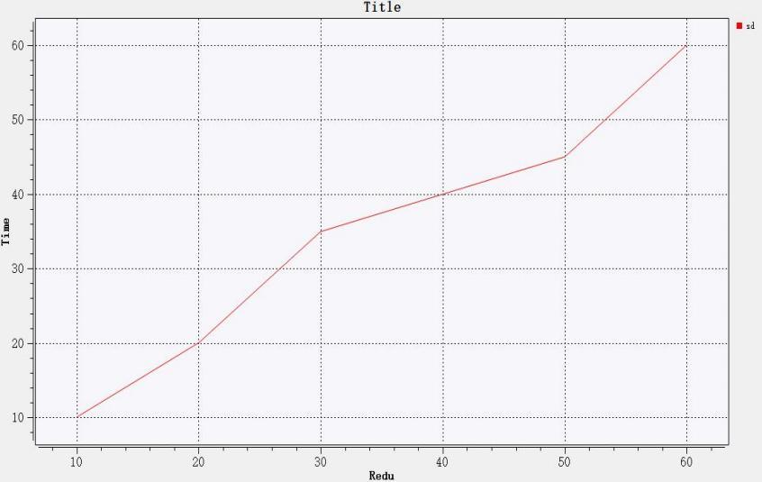
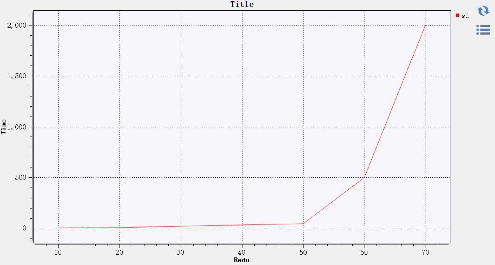
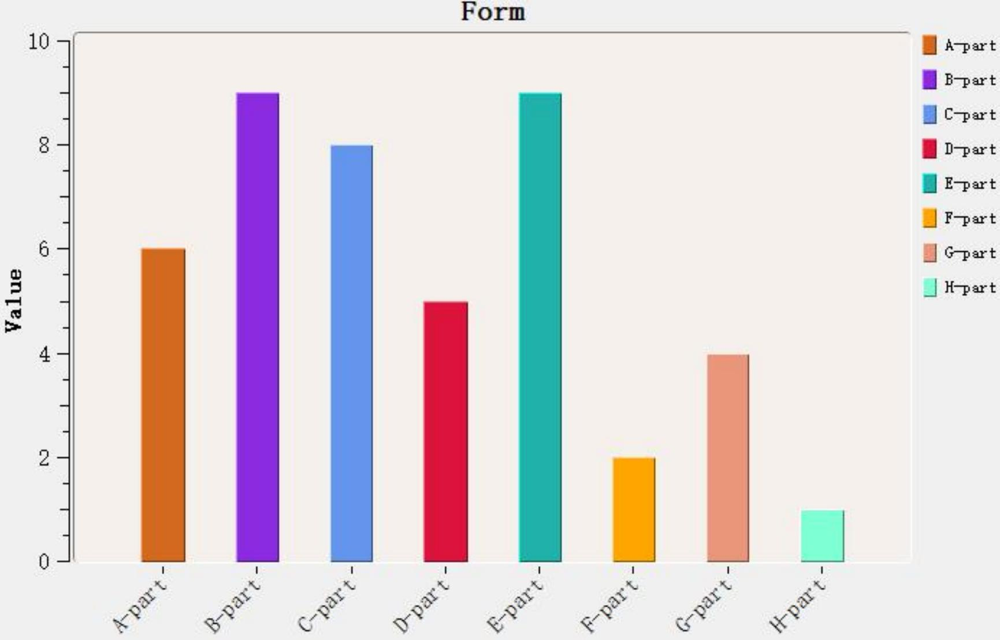

> **二维图表组件使用与接口调用**
>
> **说明书**
>
> **青岛数智船海科技有限公司**

+--------------+-------------------------------------------+--------------+
| > **时间**   | > **修改纲要**                            | > **修改人** |
+--------------+-------------------------------------------+--------------+
| > 2024/11/28 | > 首次编制                                | > 王宁       |
+--------------+-------------------------------------------+--------------+
|              |                                           |              |
+--------------+-------------------------------------------+--------------+
|              |                                           |              |
+--------------+-------------------------------------------+--------------+
|              |                                           |              |
+--------------+-------------------------------------------+--------------+
|              |                                           |              |
+--------------+-------------------------------------------+--------------+
|              |                                           |              |
+--------------+-------------------------------------------+--------------+
|              |                                           |              |
+--------------+-------------------------------------------+--------------+
|              |                                           |              |
+--------------+-------------------------------------------+--------------+
|              |                                           |              |
+--------------+-------------------------------------------+--------------+
|              |                                           |              |
+--------------+-------------------------------------------+--------------+
|              |                                           |              |
+--------------+-------------------------------------------+--------------+
|              |                                           |              |
+--------------+-------------------------------------------+--------------+
|              |                                           |              |
+--------------+-------------------------------------------+--------------+
|              |                                           |              |
+--------------+-------------------------------------------+--------------+
|              |                                           |              |
+--------------+-------------------------------------------+--------------+
|              |                                           |              |
+--------------+-------------------------------------------+--------------+
|              |                                           |              |
+--------------+-------------------------------------------+--------------+
|              |                                           |              |
+--------------+-------------------------------------------+--------------+

> **一、组件简介**
>
> 二维图表组件 FITKPlotWindow 基于 Qt Widgets for Technical
> Applications（Qwt）开发，
> 是用于直观展示数据的组件。目前的二维图表组件支持四种类型的图表，分别为标准直角坐
> 标图（包含对数坐标轴类型的直角坐标图），柱状图，频谱图（又称光谱图，云图）和极坐
> 标图。该组件的数据渲染效果示例如下：

{width="2.816666666666667in"
height="1.778332239720035in"}{width="1.6049989063867016in"
height="1.6266655730533683in"}{width="2.8049989063867016in"
height="1.793332239720035in"}

{width="2.783332239720035in"
height="1.6116666666666666in"}

> **二、主要接口**
>
> 组件中针对不同的数据渲染方式各有差异，但遵循相同的类组织结构，对于每种图表的
> 生成，均通过下面四个类实现核心的业务功能：
>
> **图表窗口类:**
> 主要用于创建窗口，其包含一个图表属性类指针和一个数据管理类指针，
> 分别用于设定窗口属性和管理数据。
>
> **图表属性类:** 主要用于指定图表的固有属性(
> 例如轴标题等)，并包含与界面表现形式相 关的所有接口。
>
> **数据属性类：**主要用于创建图表数据并设计数据样式（例如曲线颜色、线型，柱状图颜
> 色等）。
>
> **数据管理类:** 主要用于添加数据或删除数据。
>
> 具体相关类如下：

+--------------------------------+-------------------------------------+
| > **类名**                     |                                     |
+--------------------------------+-------------------------------------+
| > FITKXYPlotWindow             | > 标准直角坐标图的图表窗口类        |
+--------------------------------+-------------------------------------+
| > FITKXYPlotProperty           | > 标准直角坐标图的图表属性类        |
+--------------------------------+-------------------------------------+
| > FITKXYCurveDrawProp          | > 标准直角坐标图的数据属性类        |
+--------------------------------+-------------------------------------+
| > FITKXYCurveDrawManager       | > 标准直角坐标图的数据管理类        |
+--------------------------------+-------------------------------------+
| > FITKBarChartWindow           | > 柱状图的图表窗口类                |
+--------------------------------+-------------------------------------+
| > FITKBarChartProperty         | > 柱状图的图表属性类                |
+--------------------------------+-------------------------------------+
| > FITKBarChartDrawProp         | > 柱状图的数据属性类                |
+--------------------------------+-------------------------------------+
| > FITKBarChartDrawManager      | > 柱状图的数据管理类                |
+--------------------------------+-------------------------------------+
| > FITKSpectrogramWindow        | > 频谱图的图表窗口类                |
+--------------------------------+-------------------------------------+
| > FITKSpectrogramProperty      | > 频谱图的图表属性类                |
+--------------------------------+-------------------------------------+
| > FITKSpectrogramDrawPro       | > 频谱图的数据属性类                |
+--------------------------------+-------------------------------------+
| > FITKSpectrogramManager       | > 频谱图的数据管理类                |
+--------------------------------+-------------------------------------+
| > FITKPolarPlotWindow          | > 极坐标图的图表窗口类              |
+--------------------------------+-------------------------------------+
| > FITKPolarPlotProperty        | > 极坐标图的图表属性类              |
+--------------------------------+-------------------------------------+
| > FITKPolarCurveDrawProp       | > 极坐标图的数据属性类              |
+--------------------------------+-------------------------------------+
| > FITKPolarCurveDrawManager    | > 极坐标图的数据管理类              |
+--------------------------------+-------------------------------------+

> **三、使用过程（以直角坐标图为例）**
>
> 创建图表一般包含以下四步：
>
> 1 创建图表窗口
>
> 2 设置图表属性
>
> 3 构造图表专有数据对象，并设置数据到专有数据对象
>
> 4 将专有数据对象添加到图表
>
> 而在第①步创建图表窗口之前，还需要做一些准备工作，接下来我们将以**直角坐标图**为
>
> 例，演示创建图表的一般过程。
>
> 我们将通过图表窗口接口类 FITKPlotWindowsInterface
> 来创建图表窗口，在使用图表窗
> 口接口类之前，需要提前将图表窗口接口类添加到组件工厂，添加代码如下：
>
> 1\. QList\<AppFrame::FITKComponentInterface \*\>
>
> 2\. ComponentFactory::createComponents()
>
> 3\. {
>
> 4\. *// 自定义组件列表*
>
> 5\. QList\<AppFrame::FITKComponentInterface \*\> componentList;
>
> *6.*{width="0.13195975503062118in"
> height="0.18888779527559055in"}{width="0.29170056867891514in"
> height="0.18888779527559055in"}*//\*\*\*\*创建的其他组件\*\*\*\*\*\*\*\**
>
> *7. //* ............
>
> 8\. *//二维图表窗口接口*
>
> 9\. componentList \<\< new Plot:: FITKPlotWindowsInterface;
>
> 10\.
>
> 11\. return componentList;
>
> 12\. }
>
> 添加到组件工厂后，在图表窗口接口类 FITKPlotWindowsInterface
> 中有一个成员方法：
>
> QWidget\* getWidget(const int) ;
>
> 我们将通过 getWidget( ) 来统一创建窗口, getWidget(
> )传入的整形参数为图表类型， 具体类型如下：

+-------+----------------+---------------------------------------------+
| > 1\. | > **0          | > **Plot::FITKXYPlotWindow**                |
|       | > 普通坐标系** |                                             |
+-------+----------------+---------------------------------------------+
| > 2\. | > **1 柱状图** | > **Plot::FITKBarChartWindow**              |
+-------+----------------+---------------------------------------------+
| > 3\. | > **2 极坐标** | > **Plot::FITKPolarPlotWindow**             |
+-------+----------------+---------------------------------------------+
| > 4\. | > **3 云图**   | > **Plot::FITKSpectrogramWindow**           |
+-------+----------------+---------------------------------------------+

> 要通过工厂来创建窗口需要添加以下头文件：
>
> {width="2.9998906386701663e-2in"
> height="0.21666557305336834in"}1. #include
> \"FITK_Kernel/FITKAppFramework/FITKAppFramework.h\"
>
> {width="2.9998906386701663e-2in"
> height="0.21666557305336834in"}2. #include
> \"FITK_Kernel/FITKAppFramework/FITKGlobalData.h\"
>
> 创建直角坐标图需要以下头文件
>
> {width="2.9998906386701663e-2in"
> height="0.21666557305336834in"}1. #include
> \"FITK_Component/FITKPlotWindow/FITKPlotWindowsInterface.h\"
>
> 2\. #include \"FITK_Component/FITKPlotWindow/FITKXYPlotWindow.h\"
>
> 3\. #include \"FITK_Component/FITKPlotWindow/FITKXYPlotProperty.h\"
>
> 4\. #include
> \"FITK_Component/FITKPlotWindow/FITKXYCurveDrawManager.h\"
>
> 创建直角坐标窗口的调用方法如下：
>
> {width="2.9998906386701663e-2in"
> height="0.21666557305336834in"}1. *//获取二维图表窗口接口*
>
> 2\. Plot::FITKPlotWindowsInterface\* PlotWindows =
> FITKAPP-\>getComponents ()-\>getComponentTByName\<Plot
> ::FITKPlotWindowsInterface\>(\"FITKPlotWin dowsInterface\");
>
> *3. //创建图表窗口（直角坐标图的类型为0）*
>
> 4\. Plot::FITKXYPlotWindow \*plotWidget =
>
> dynamic_cast\<Plot::FITKXYPlotWindow\*\>(PlotWindows-\>getWidget(0));
>
> //add plotWidget to a window
>
> [创建窗口后还要将 plotWidget 添加到自己需要的窗口位置]{.underline}
>
> 此时窗口如下：

{width="5.524998906386702in"
height="3.0949989063867016in"}

> 上面只是创建了窗口，我们还需要设置窗口的具体属性，每一个图表窗口类都有一个获
> 取窗口属性的接口
> getPlotProperty()，通过该接口可以设置窗口的具体属性，代码如下：
>
> {width="2.9998906386701663e-2in"
> height="0.21666557305336834in"}1. *//设置窗口标题*
>
> 2\. plotWidget-\>getPlotProperty()-\>setTitle(\"Title \");
>
> 3\. *//设置XY 轴名称*
>
> 4\. plotWidget-\>getPlotProperty()-\>setAxisName(\"Red u\",\"Time\");
>
> 5\. *//将图例挪动到窗口右侧*
>
> 6\. plotWidget-\>getPlotProperty()-\>setLegend Place(1);
>
> 还有其它设置窗口的成员方法，具体方法可以到每种图表的窗口属性类中查看。
> 设置窗口属性后，此时窗口如下：

{width="5.524998906386702in"
height="3.088332239720035in"}

> 接下来我们就要添加数据了，添加数据时，首先要先创建一个对应图表类型的数据属性
> 类对象，直角坐标图的数据属性类为
> FITKXYCurveDrawProp，这里我们使用该类来创建曲 线数据对象
> CurveData，然后给 CurveData 设置数据及样式，代码如下：
>
> 1\. *//创建数据属性对象*
>
> 2\. [Plot]{.underline}::FITKXYCurveDrawProp\* CurveData = new
> Plot::FITKXYCurveDrawProp ();
>
> 3\. *//设置曲线颜色*
>
> 4\. CurveData-\>setColor(QColor(255,0,0));
>
> 5\. *//设置x 轴坐标和y 轴坐标*
>
> 6\. QVector\<double\> xData {10,20,30,40,50,60};
>
> 7\. QVector\<double\> yData {10,20,35,40,45,60};
>
> *8. //添加* *曲线名称"sd "，*xData:x *轴坐标,*yData:y *轴坐标，xy
> 轴坐标个数要一致*
>
> 9\. *//如果添加失败，* setData()*会返回false*
>
> 10\. CurveData-\>setData(\"sd\", xData, yData);
>
> 此时的图表窗口并不能显示曲线，上一步操作只是将数据 xData 和 yData
> 设置到曲线 CurveData ，我们还需要将曲线 CurveData 添加到窗口
> plotWidget 中，每个窗口类都有 一个获取数据管理的接口
> getCurveManager()，通过该接口调用 appendGraphObj()添加
> 曲线到窗口，有一点需要注意，添加曲线到窗口后，CurveData
> 的指针控制权将转移给窗 口 plotWidget，不需要再手动 delete
> CurveData，最后别忘了更新窗口画面，代码如下：
>
> 1\. *//获取曲线管理器并添加曲线到图表窗口*
>
> 2\. plotWidget-\>getCurveManager()-\>appendGraphObj(CurveData);
>
> 3\. *//更新画布*
>
> {width="2.9998906386701663e-2in"
> height="0.21666557305336834in"}4. plotWidget-\>updataCanvas();
>
> 此时窗口如下：

{width="5.546665573053368in"
height="3.088332239720035in"}

> **四、多种图表创建**
>
> 标准直角坐标图的创建如上所示，此处不再赘述，下面介绍其余种类图表创建时要注意
> 的地方。
>
> **(1)对数坐标轴类型的直角坐标图**
>
> 在数据量级差别太大时，曲线会有部分数据因差值太小看不出变化趋势，如果我们将直
> 角坐标图中的数据改为如下一串数据：
>
> {width="2.9998906386701663e-2in"
> height="0.21666557305336834in"}1. QVector\<double\> xData
> {10,20,30,40,50,60,70};
>
> {width="2.9998906386701663e-2in"
> height="0.21666557305336834in"}2. QVector\<double\> yData
> {1,5,20,30,45,500,2000};
>
> {width="2.9998906386701663e-2in"
> height="0.21666557305336834in"}3. CurveData-\>setData(\"sd\", xData,
> yData);
>
> 此时窗口如下：

{width="5.768332239720035in"
height="3.0949989063867016in"}

> 前 5
> 个数据因差值太小而看不出明显变化，因此，我们需要用到对数坐标轴。创建对数
> 坐标图时，只需要在设置窗口属性这一步时额外调用接口
>
> void setAxisScaleEngine (int Axis);
>
> 其传入的参数 Axis 为轴类型，只能输入 0 或 2 ，0 对应左侧 y 轴，2
> 对应底部 x 轴，使 用方法如下：
>
> {width="2.9998906386701663e-2in"
> height="0.21666666666666667in"}2.
> plotWidget-\>getPlotProperty()-\>setAxisScaleEngine(0)
>
> 在设置窗口属性这步添加上一行代码后，效果如图所示：

{width="5.768332239720035in"
height="3.0749989063867016in"}

> **(2)柱状图**
>
> 柱状图在设置窗口属性方面与直角坐标图类似，但设置数据的方法差别很大，根据给定
> 数据的形式，组件将自动生成简单型柱状图或复合型柱状图，此处直接给出示例代码，具体
> 使用方法如下：
>
> 创建窗口和设置窗口属性代码如下，
>
> {width="2.9998906386701663e-2in"
> height="0.21666557305336834in"}1. *//获取图表窗口接口*
>
> 2\. Plot::FITKPlotWindowsInterface\* PlotWindows =
> FITKAPP-\>getComponents ()-\>getComponentTByName\<Plot
> ::FITKPlotWindowsInterface\>(\"FITKPlotWin dowsInterface\");
>
> 3\. *//创建柱状图新窗口，柱状图类型为1*
>
> 4\. Plot::FITKBarChartWindow \*plotWidget =
> dynamic_cast\<Plot::FITKBarCha
> rtWindow\*\>(PlotWindows-\>getWidget(1));
>
> /\*\*\*\*将窗口添加到自己需要的位置\*\*\*\*\*/
>
> 5\. *//设置图表属性*
>
> 6\. plotWidget-\>getPlotProperty()-\>setTitle(\"Form\");
>
> 7\. plotWidget-\>getPlotProperty()-\>setAxisName(\"Value\",
> \"Month\");
>
> 柱状图设置数据需要两个成员方法，除了 setData()，还需要
> setBarNameGroupNum()，
> 下面将详细讲述如何使用这两个函数，setBarNameGroupNum()的函数原型为：
>
> int setBarNameGroupNum (QList\<QString\>& barNames, int groupNum = 1);
>
> 传入的参数 barNames 是设置的每个柱状条的名称，groupNum
> 为柱状条组数，其默认 值是 1
> ，如果不设置该值，将生成简单型柱状图，下方代码中将其设置为 3
> ，将生成有三个 柱状条组的复合型柱状图。
>
> setData()的函数原型为：
>
> bool setData(QVector\<double\> &data);
>
> 传入的参数 data 是设置的每个柱状条的数据，下方代码中，一组柱状条 title
> 包含 \"A-part\"\~\"H-part\"这 8 个柱状条，我们通过
> setBarNameGroupNum(title,3) 传入了三组 title，
>
> 所以我们需要导入 3 ×8=24 个数据，所以我们给 setData(QVector\<double\>
> &data)传入 data 时，data.size()至少为 24 ，而
> setBarNameGroupNum()会返回我们至少需要设置的数据个数
> {width="2.9998906386701663e-2in"
> height="0.21666557305336834in"}8. *//柱状图数据*
>
> 9\. *//所有柱状条数据都要添加到同一个数据对象中*
>
> 10\. Plot::FITKBarChartDrawProp \*barData= new
> Plot::FITKBarChartDrawProp;
>
> 11\. QList\<QString\>title = {
> \"A-part\",\"B-part\",\"C-part\",\"D-part\",\"E-part\",
> \"F-part\",\"G-part\",\"H-part\"};
>
> 12\. *//num=24*
>
> 13\. int num = barData-\>setBarNameGroupNum(title,3);
>
> 14\. QVector\<double\>list{};
>
> 15\. for (int i = 0; i \< num; i++)
>
> 16\. {
>
> 17\. list.append(1 + qrand() % 9);
>
> 18\. }
>
> 19\. *//* setData()*会判断list 是否为24
> 个数据，如果数据不够会添加失败*
>
> 20\. barData-\>setData(list);
>
> 设置完数据和柱状条名称后，我们还可设置柱状条组的名称，只有条组数大于 1
> 时，才 可以设置此项，代码如下：
>
> {width="2.9998906386701663e-2in"
> height="0.21666666666666667in"}21. *//每个条组的名称，如果*label
> *的个数小于条组数（此处为3），将添加失败*
>
> 22\. QList\<QString\> label = {\"February\",\"March\",\"April\"};
>
> 23\. barData-\>setXLabel(label);
>
> 最后将数据对象添加到图表并刷新画布：
>
> 25\. plotWidget-\>getBarChartManager()-\>appendGraphObj(barData);
>
> 27\. plotWidget-\>updataCanvas();
>
> 效果图如下：

{width="5.768332239720035in"
height="3.116665573053368in"}

> 简单型柱状图，示例代码如下：
>
> 2\. Plot::FITKPlotWindowsInterface\* PlotWindows =
> FITKAPP-\>getComponents ()-\>getComponentTByName\<Plot
> ::FITKPlotWindowsInterface\>(\"FITKPlotWin dowsInterface\");
>
> 3\. *//创建柱状图新窗口，柱状图类型为1*
>
> 4\. Plot::FITKBarChartWindow \*plotWidget =
> dynamic_cast\<Plot::FITKBarCha
> rtWindow\*\>(PlotWindows-\>getWidget(1));
>
> /\*\*\*\*将窗口添加到自己需要的位置\*\*\*\*\*/
>
> 5\. *//设置图表属性*
>
> 6\. plotWidget-\>getPlotProperty()-\>setTitle(\"Form\");
>
> 7\. plotWidget-\>getPlotProperty()-\>setAxisName(\"Value\");
>
> 8\. *//柱状图数据*
>
> 9\. Plot::FITKBarChartDrawProp \*barData =new
> Plot::FITKBarChartDrawProp;
>
> 10\. QList\<QString\>title = {
> \"A-part\",\"B-part\",\"C-part\",\"D-part\" ,\"E-part
> \",\"F-part\",\"G-part\",\"H-part\" };
>
> */\*此处未设置*setBarNameGroupNum()*的第二个参数，将生成简单型柱状图，简单型*
> *柱状图无法调用* setXLabel()*\*/*
>
> 11\. int num=barData-\>setBarNameGroupNum(title);
>
> 12\. QVector\<double\>list{};
>
> 13\. for (int i = 0; i \< num; i++)
>
> 14\. {
>
> 15\. list.append(1 + qrand() % 9);
>
> 16\. }
>
> 17．barData-\>setData(list);
>
> *18.//添加数据*
>
> *19.*plotWidget-\>getBarChartManager()-\>appendGraphObj(barData);
>
> *20.//更新画布*
>
> *21.*plotWidget-\>updataCanvas();
>
> 效果图如下：

{width="5.768332239720035in"
height="3.689998906386702in"}

> **(3)频谱图** **(光谱图，云图)**
>
> 频谱图在设置窗口属性方面也与直角坐标图类似，但频谱图在设置数据时，对数据形式
> 有严格要求，下面将通过频谱图设置数据的接口
> setData()，来讲解设置数据时需要的数 据形式。
>
> 在创建完频谱图类型的数据对象后，我们需要调用设置数据的接口
> setData()，来 将数据添加到数据对象中，频谱图类型中的 setData()原型为：
>
> bool setData( QVector\<double\> &x, QVector\<double\> &y,
> QVector\<QVector\<double\>\> &value);
>
> 其要求传入的数据是一个长为 x.size( ), 宽为 y.size()
> 的数据矩阵，矩阵上的每一个点 就是我们要设置的数值，x 和 y
> 分别是矩阵最下面一行点坐标的 x 轴坐标和左边第一列点坐 标的 y
> 轴坐标，value 为每个矩阵点上的值，也就是我们要设置的数值，且
> value.size( )= x.size( )×y.size( )。
>
> 为了方便理解, 这里做一个导入数据的完整示范。
>
> 先按照创建直角坐标图的方法创建窗口，设置窗口属性，创建数据对象，代码如下：
>
> {width="2.9998906386701663e-2in"
> height="0.21666557305336834in"}1. *//获取图表窗口接口*
>
> 2\. Plot::FITKPlotWindowsInterface\* PlotWindows =
> FITKAPP-\>getComponents ()-\>getComponentTByName\<Plot
> ::FITKPlotWindowsInterface\>(\"FITKPlotWin dowsInterface\");
>
> 3\. *//创建频谱图新窗口，频谱图类型为3*
>
> 4\. Plot::FITKSpectrogramWindow \*plotWidget =
> dynamic_cast\<Plot::FITKSpe
> ctrogramWindow\*\>(PlotWindows-\>getWidget(3));
>
> /\*\*\*\*将窗口添加到自己需要的位置\*\*\*\*\*/
>
> 5\. *//设置图表属性*
>
> 6\. plotWidget-\>getPlotProperty()-\>setTitle(\"Spectrogram\");
>
> 7\. *//添加曲线数据*
>
> 8\. Plot::FITKSpectrogramDrawPro\* CurveData = new
> Plot::FITKSpectrogramD rawPro();
>
> 然后就是将数据添加到数据对象，这里我们创建一个 4 行 3 列的数据矩阵
>
> 1 ， 1 ， 10
>
> 10 ，10 ，10
>
> 1 ， 10 ，1
>
> 1 ， 10 ，10
>
> 对应点坐标设置为
>
> (0 ，3)(1 ，3)(2 ，3)
>
> (0 ，2)(1 ，2)(2 ，2)
>
> (0 ，1)(1 ，1)(2 ，1)
>
> (0 ，0)(1 ，0)(2 ，0)
>
> 添加数据到数据对象，代码如下：
>
> {width="2.9998906386701663e-2in"
> height="0.21666557305336834in"}1. QVector\< QVector\<double\> \>
> value;
>
> 2\. QVector\<double\> cvalues;
>
> 3\. cvalues += {1, 10, 10};
>
> 4\. value += cvalues;
>
> 5\. cvalues.clear();
>
> 6\. cvalues += {1, 10, 1};
>
> 7\. value += cvalues;
>
> 8\. cvalues.clear();
>
> 9\. cvalues += {10, 10, 10};
>
> 10\. value += cvalues;
>
> 11\. cvalues.clear();
>
> 12\. cvalues += {1, 1, 10};
>
> 13\. value += cvalues;
>
> 14\. QVector\<double\> x;
>
> 16\. QVector\<double\> y;
>
> 18\. CurveData-\>setData(x, y, value);
>
> 将数据对象添加到窗口的步骤此处不在重复，添加数据对象并刷新画布后，
> 窗口如下：

{width="3.2349989063867017in"
height="3.983332239720035in"}

> **(4)极坐标图**
>
> 极坐标 图 的 生 成 与 直 角坐标 图 几 乎 一致 ， 其 数据 属 性类 中的
> 设置 数据 的接 口
>
> setData()
>
> 原型为：
>
> bool setData (const QString &name, QVector\<double\> &xData,
> QVector\<double\> &yData); 其中 name 为曲线名称，xData 为极角，yData
> 为极径。
>
> 示例代码如下：
>
> {width="2.9998906386701663e-2in"
> height="0.21666557305336834in"}1. *//获取图表窗口接口*
>
> 2\. Plot::FITKPlotWindowsInterface\* PlotWindows =
> FITKAPP-\>getComponents ()-\>getComponentTByName\<Plot
> ::FITKPlotWindowsInterface\>(\"FITKPlotWin dowsInterface\");
>
> 4\. Plot::FITKPolarPlotWindow \*plotWidget =
> dynamic_cast\<Plot::FITKPolar
> PlotWindow\*\>(PlotWindows-\>getWidget(2));
>
> /\*\*\*\*将窗口添加到自己需要的位置\*\*\*\*\*/
>
> 5\. *//设置图表属性*
>
> 6\. plotWidget-\>getPlotProperty()-\>setTitle(\"Polar\");
>
> 7\. *//添加曲线数据*
>
> 8\. Plot::FITKPolarCurveDrawProp\* CurveData = new
> Plot::FITKPolarCurveDr awProp();
>
> 9\. CurveData-\>setColor(QColor(255,0,0));
>
> 10\. QVector\<double\> xData{ 1,20,39,58,79,98,120,140,160 };
>
> 11\. QVector\<double\> yData{ 1,10,25,20,10,20,30,20,10 };
>
> 12\. CurveData-\>setData(\"sd\", xData, yData);
>
> 13\. *//获取曲线管理器并添加曲线到图表窗口*
>
> 14\. plotWidget-\>getPolarCurveManager()-\>appendGraphObj(CurveData);
>
> 15\. *//更新画布*
>
> 16\. plotWidget-\>updataCanvas();
>
> 效果图如下：

{width="4.416666666666667in"
height="4.475in"}
