FastCAE仿真软件项目技术分析报告


# 目录
[项目概述和目标](#1-项目概述和目标)
[技术架构分析](#2-技术架构分析)
[项目文件结构分析](#3-项目文件结构分析)
[核心功能模块详解](#4-核心功能模块详解)
[代码质量和设计模式分析](#5-代码质量和设计模式分析)
[技术栈和依赖分析](#6-技术栈和依赖分析)
[项目优势和改进建议](#7-项目优势和改进建议)
[结论](#8-结论)

---

# 1. 项目概述和目标

> **来源**: 基于项目配置文件分析、README文档

## 1.1. 项目基本信息
- **项目名称**: FastCAE
- **版本**: 2.5.0
- **开发机构**: 青岛数智船海科技有限公司
- **许可证**: BSD 3-Clause License
- **项目定位**: 免费的CAE仿真软件研发支撑平台

## 1.2. 项目目标

> **来源文档**: 基础底座开发文档、应用软件开发文档
> **参考章节**: 各文档概述部分
> **原文内容**: FastCAE作为CAE软件集成框架，提供标准化的开发流程...（省略）

FastCAE是一款面向CAE（计算机辅助工程）领域的开源仿真软件平台，旨在：

1. **标准化集成**: 提供统一的CAE软件集成框架，规范子系统集成流程
2. **模块化设计**: 基于组件化架构，支持灵活的功能组合和扩展
3. **跨平台支持**: 支持Windows和Linux平台，满足不同用户需求
4. **开放生态**: 通过插件系统和Python脚本支持，构建开放的开发生态

## 1.3. 应用领域

> **来源文档**: 网格引擎集成文档、组件使用文档
> **参考章节**: 应用场景描述
> **原文内容**: 支持几何建模、网格划分、多物理场仿真等应用领域

- 几何建模与CAD集成
- 网格划分与优化
- 多物理场仿真计算
- 后处理与可视化
- 工程数据管理

---

# 2. 技术架构分析

> **来源文档**: 基础底座开发文档
> **参考章节**: Core模块架构设计
> **原文内容**: FastCAE Core模块采用严格的MVC（Model-View-Controller）架构模式...（省略）

## 2.1. 整体架构设计

FastCAE采用分层模块化架构，基于MVC设计模式和命令模式，将系统分为六个清晰的层次结构。

> **架构修正说明**: 基于CMakeLists.txt实际依赖关系分析，修正了模块分层归属和依赖方向，添加了命令层体现设计模式应用

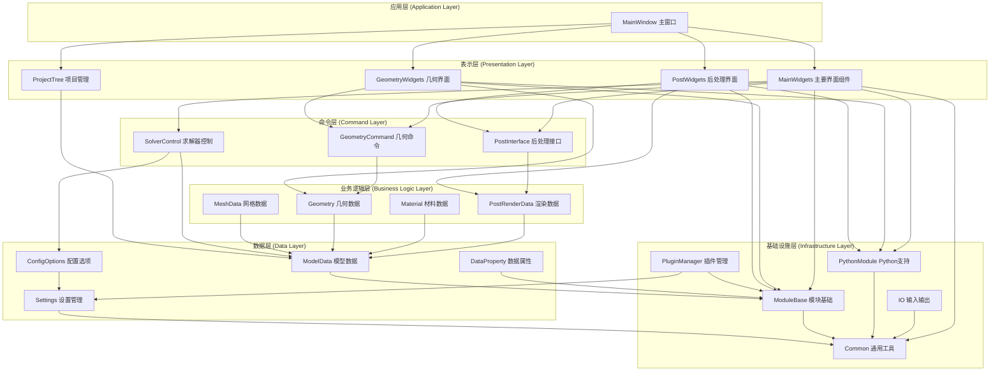

## 2.2. 核心架构组件

### 2.2.1. Core模块 - 基础底座

> **来源文档**: 基础底座开发文档
> **参考章节**: 综合改进建议 1.1 技术架构深度分析

Core模块是整个系统的核心，提供：
- **抽象数据结构**: FITKAbstractObject、FITKAbstractDataObject等基类
- **数据管理**: FITKDataRepo全局数据仓库、FITKGUIRepo界面对象仓库
- **工具集**: 线程池、文件操作、三维矢量计算等

#### 2.2.1.1. Core模块MVC架构详解

FastCAE Core模块采用严格的MVC（Model-View-Controller）架构模式，将系统分为三个核心层次：

```mermaid
graph TB
    subgraph "MVC核心架构"
        subgraph "数据层 (Model)"
            D1[FITKAbstractDataObject<br/>数据抽象基类]
            D2[数据序列化/反序列化]
            D3[数据ID管理]
        end

        subgraph "界面层 (View)"
            G1[FITKAbstractGUIObject<br/>界面抽象基类]
            G2[界面显示/隐藏]
            G3[界面更新机制]
        end

        subgraph "控制层 (Controller)"
            O1[FITKAbstractOperator<br/>操作器抽象基类]
            O2[命令执行/撤销]
            O3[业务逻辑处理]
        end
    end

    subgraph "支撑系统"
        subgraph "对象容器系统"
            C1[FITKAbstractObjectContainer]
            C2[智能指针管理]
            C3[野指针问题解决]
        end

        subgraph "工厂系统"
            F1[FITKDataFactory<br/>数据对象工厂]
            F2[Register2FITKDataFactory<br/>注册宏]
            F3[动态对象创建]
        end

        subgraph "仓库系统"
            OR1[FITKOperatorRepo<br/>操作器仓库]
            OR2[操作器注册管理]
            OR3[操作器生命周期]
        end
    end

    %% MVC核心关系
    O1 <--> D1 : "读取/修改数据"
    G1 <--> O1 : "触发操作/更新界面"
    G1 --> D1 : "显示数据"

    %% 支撑系统关系
    C1 --> D1
    C1 --> G1
    C1 --> O1
    F1 --> D1
    F2 --> F1
    OR1 --> O1

    %% 详细组件关系
    D2 --> D1
    D3 --> D1
    G2 --> G1
    G3 --> G1
    O2 --> O1
    O3 --> O1
    C2 --> C1
    C3 --> C1
    F3 --> F1
    OR2 --> OR1
    OR3 --> OR1
```

**三层架构关系**：
- **数据层（Data Layer）**：处于最底层，可被UI和Operator访问修改
- **界面层（GUI Layer）**：通过抽象接口控制Operator，可直接访问数据层
- **业务逻辑层（Operator Layer）**：直接访问UI和数据，实现具体业务流程

#### 2.2.1.2. 核心机制详解

**1. 抽象对象容器机制**
```cpp
// 智能指针容器，解决野指针问题
class FITKAbstractObjectContainer {
public:
    template<typename T>
    void addObject(T* object);

    template<typename T>
    T* getObject(const QString& id);

    void removeObject(const QString& id);
};
```

**2. 数据工厂注册机制**
```cpp
// 数据工厂注册宏
#define Register2FITKDataFactory(className) \
    static bool registered = FITKDataFactory::getInstance()->registerClass<className>(#className);

// 使用示例
Register2FITKDataFactory(MyDataClass);
```

**3. 操作器仓库系统**
```cpp
// 操作器注册和调用
class FITKOperatorRepo {
public:
    void registerOperator(const QString& name, FITKAbstractOperator* op);
    FITKAbstractOperator* getOperator(const QString& name);
    void executeOperator(const QString& name, const QVariantMap& params);
};
```

### 2.2.2. AppFramework模块 - 应用框架

> **来源文档**: 基础底座开发文档
> **参考章节**: 综合改进建议 1.1 技术架构深度分析

AppFramework将CAE软件运行过程标准化为14个固定阶段，确保所有基于FastCAE开发的应用程序都遵循统一的运行流程。

#### 2.2.2.1. AppFramework运行流程详解

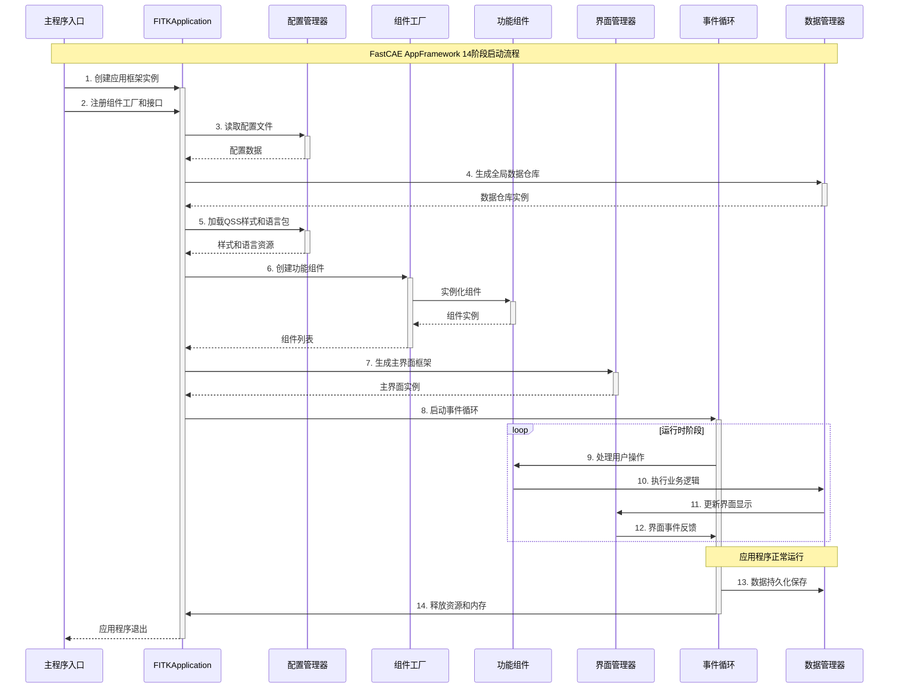

**14个标准化运行阶段**：

1. **应用程序创建**：初始化FITKApplication实例
2. **组件注册**：注册所有功能组件和事件处理器
3. **配置文件读取**：加载用户配置和系统设置
4. **全局数据生成**：创建全局数据对象和仓库
5. **样式和语言包加载**：加载QSS样式文件和多语言支持
6. **组件创建**：实例化已注册的功能组件
7. **主界面生成**：构建用户界面框架
8. **事件循环启动**：进入Qt事件循环，处理用户交互
9. **命令执行**：处理用户操作和业务逻辑
10. **消息事件处理**：处理系统消息和组件间通信
11. **数据持久化**：保存用户数据和项目状态
12. **资源清理**：清理临时文件和缓存
13. **内存释放**：释放动态分配的内存资源
14. **应用程序退出**：安全关闭应用程序

#### 2.2.2.2. 个性化注册接口

AppFramework提供了灵活的个性化注册机制，允许开发者：

```cpp
// 组件注册示例
class MyApplication : public FITKApplication {
public:
    void registerComponents() override {
        // 注册自定义组件
        registerComponent<MyGeometryComponent>();
        registerComponent<MyMeshComponent>();
        registerComponent<MyPostProcessComponent>();
    }

    void registerEventHandlers() override {
        // 注册事件处理器
        registerEventHandler("FileOpen", new FileOpenHandler());
        registerEventHandler("MeshGenerate", new MeshGenerateHandler());
    }
};
```

## 2.3. 系统架构图

FastCAE采用分层架构设计，从上到下分为用户界面层、应用框架层、核心模块层、业务模块层和数据存储层。这种分层设计确保了系统的模块化、可扩展性和维护性。

**架构层次说明**：
- **用户界面层**：提供不同功能模块的专用界面，包括几何建模、网格划分和后处理等
- **应用框架层**：负责应用程序生命周期管理、全局数据管理和组件协调
- **核心模块层**：提供基础服务，包括数据仓库、GUI管理、操作器管理和线程池
- **业务模块层**：实现具体的CAE功能，如几何建模、网格划分、材料管理等
- **数据存储层**：负责数据持久化，支持HDF5格式和配置文件管理

**模块间通信机制**：各层之间通过标准化接口进行通信，上层模块依赖下层模块提供的服务，确保了清晰的依赖关系和良好的解耦性。

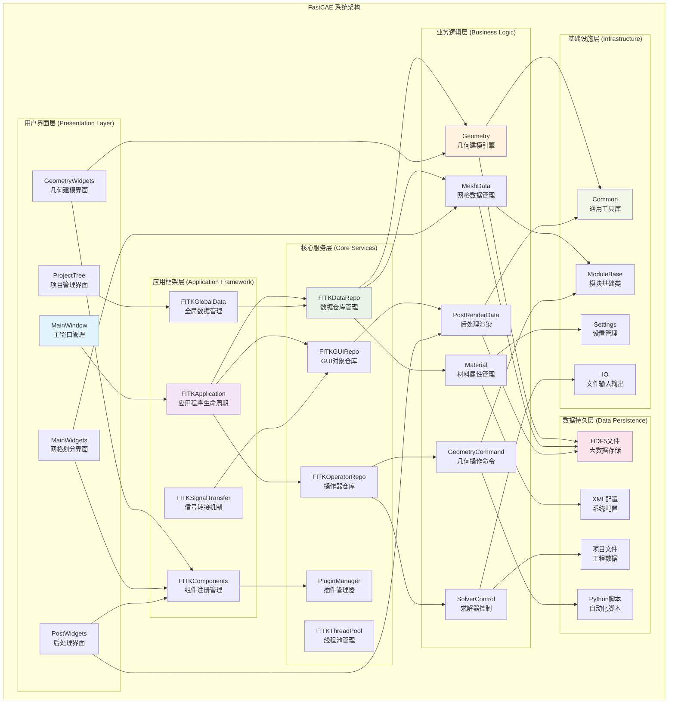

---

# 3. 项目文件结构分析

> **来源**: 基于src目录代码结构分析、CMakeLists.txt配置文件分析
> **参考章节**: 项目源码组织结构、模块依赖关系分析

FastCAE项目采用模块化的文件组织结构，src目录下包含了完整的源代码实现。整个项目按照功能模块进行目录划分，体现了清晰的架构层次和模块职责分离。

## 3.1. src目录整体结构

FastCAE的src目录包含35个主要模块目录，每个目录代表一个独立的功能模块。这种组织方式体现了项目的模块化设计理念：

```
src/
├── FastCAE/                    # 主程序入口
├── Common/                     # 通用工具库
├── ConfigOptions/              # 配置管理模块
├── DataProperty/               # 数据属性系统
├── MainWindow/                 # 主窗口实现
├── MainWidgets/                # 主要界面组件
├── Geometry/                   # 几何建模核心
├── GeometryCommand/            # 几何操作命令
├── GeometryWidgets/            # 几何界面组件
├── GeometryDataExchange/       # 几何数据交换
├── MeshData/                   # 网格数据管理
├── Material/                   # 材料管理系统
├── ModelData/                  # 模型数据管理
├── ModuleBase/                 # 模块基础类库
├── PostInterface/              # 后处理接口
├── PostWidgets/                # 后处理界面
├── PostAlgorithm/              # 后处理算法
├── PostRenderData/             # 渲染数据管理
├── PostCurveDataManager/       # 曲线数据管理
├── PostPlotWidget/             # 图表组件
├── ProjectTree/                # 项目树管理
├── ProjectTreeExtend/          # 项目树扩展
├── PythonModule/               # Python脚本支持
├── PluginManager/              # 插件管理系统
├── PluginCustomizer/           # 插件定制工具
├── PluginMeshDataExchange/     # 网格数据交换插件
├── SolverControl/              # 求解器控制
├── GmshModule/                 # Gmsh网格生成
├── IO/                         # 输入输出处理
├── Settings/                   # 设置管理
├── SARibbonBar/                # Ribbon界面库
├── SelfDefObject/              # 自定义对象
├── BCBase/                     # 边界条件基础
├── ParaClassFactory/           # 参数类工厂
├── UserGuidence/               # 用户指导
├── XGenerateReport/            # 报告生成
├── License/                    # 许可证管理
└── qrc/                        # 资源文件
```

## 3.2. 核心模块详细分析

### 3.2.1. 主程序模块 (FastCAE/)

**功能定位**: 应用程序入口点和启动控制
**核心文件**:
- `main.cpp`: 程序主入口，负责应用程序初始化
- `CommandLine.cpp/h`: 命令行参数处理
- `XBeautyUI.cpp/h`: 界面美化组件
- `FastCAEVersionMacros.h`: 版本信息定义

**依赖关系**: 作为顶层模块，依赖MainWindow、Settings等核心模块

### 3.2.2. 通用工具模块 (Common/)

**功能定位**: 提供项目通用的基础工具和类型定义
**核心文件**:
- `Types.h`: 通用数据类型定义
- `Singleton.h`: 单例模式模板类
- `DebugLogger.cpp/h`: 调试日志系统
- `FakeClass.cpp/h`: 占位符类实现

**设计特点**: 作为最底层模块，被其他模块广泛依赖

### 3.2.3. 配置管理模块 (ConfigOptions/)

**功能定位**: 统一的配置数据管理和读取
**核心文件**:
- `ConfigOptions.cpp/h`: 配置系统主入口
- `GlobalConfig.cpp/h`: 全局配置管理
- `GeometryConfig.cpp/h`: 几何模块配置
- `MeshConfig.cpp/h`: 网格模块配置
- `PostConfig.cpp/h`: 后处理配置
- `SolverConfig.cpp/h`: 求解器配置

**架构特点**: 采用配置读取器模式，支持多种配置源

### 3.2.4. 几何建模模块群

**Geometry/**: 几何建模核心实现
- `geometryData.cpp/h`: 几何数据管理
- `GeoComponent.cpp/h`: 几何组件基类
- `geometryPara*.cpp/h`: 各种几何参数类

**GeometryCommand/**: 几何操作命令实现
- `GeoCommand*.cpp/h`: 各种几何操作命令
- `GeoCommandPy.cpp/h`: Python接口封装

**GeometryWidgets/**: 几何界面组件
- `dialog*.cpp/h/ui`: 各种几何操作对话框
- `geometryDialogFactory.cpp/h`: 对话框工厂

**GeometryDataExchange/**: 几何数据交换
- `*dataExchange.cpp/h`: 支持STEP、IGES、STL等格式

## 3.3. 模块间依赖关系体现

### 3.3.1. 层次化依赖结构

> **修正说明**: 基于CMakeLists.txt实际依赖关系分析，修正了模块分层和依赖方向

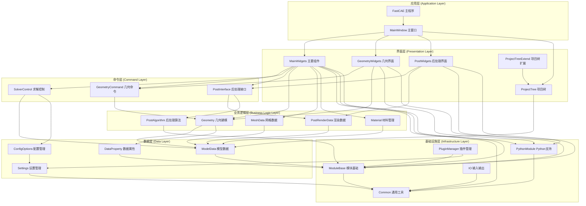

**架构分层说明**：

1. **应用层**：程序入口和主窗口管理
2. **界面层**：用户交互界面组件，包括项目树管理
3. **命令层**：业务操作的命令封装和接口定义
4. **业务逻辑层**：核心业务功能实现
5. **数据层**：数据模型和配置管理
6. **基础设施层**：通用工具和基础服务

**依赖关系特点**：
- **严格分层**：上层依赖下层，避免反向依赖
- **跨层依赖**：界面层可直接依赖基础设施层（Common、PythonModule、ModuleBase）
- **命令模式**：通过命令层解耦界面层和业务逻辑层
- **插件架构**：PluginManager作为基础设施支持系统扩展

### 3.3.2. CMakeLists.txt体现的依赖关系

从主程序的CMakeLists.txt可以看出模块依赖顺序：

```cmake
list(APPEND _depend_library
    Common
    PythonModule
    SARibbonBar
    Settings
    DataProperty
    MeshData
    Material
    Geometry
    ConfigOptions
    SelfDefObject
    ModelData
    ModuleBase
    PluginManager
    GmshModule
    PostInterface
    PostWidgets
    ProjectTree
    GeometryCommand
    GeometryWidgets
    IO
    SolverControl
    MainWidgets
    UserGuidence
    MainWindow
)
```

这个依赖列表体现了从底层到高层的模块组织原则。

### 3.3.3. 架构图修正分析

**原架构图存在的问题**：

1. **模块分层错误**：
   - **ProjectTree错误分类**：原图将ProjectTree归类为"业务逻辑层"，但根据CMakeLists.txt分析，ProjectTree依赖于DataProperty、Geometry、MeshData等业务模块，应归类为"界面层"
   - **PluginManager分层错误**：原图将其归类为"业务逻辑层"，实际上它只依赖Settings、DataProperty、ModuleBase，是基础设施组件

2. **依赖方向错误**：
   - **箭头方向相反**：原图中箭头从被依赖方指向依赖方，违反了UML依赖关系表示规范
   - **实际依赖关系**：MainWidgets依赖Geometry，箭头应从MainWidgets指向Geometry

3. **缺失重要模块**：
   - **命令层缺失**：GeometryCommand、PostInterface等命令模式实现未体现
   - **跨层依赖未表示**：界面层直接依赖基础设施层的关系未显示

**修正后的架构优势**：

1. **符合实际代码结构**：基于真实的CMakeLists.txt依赖关系
2. **遵循分层架构原则**：清晰的层次划分，避免循环依赖
3. **体现设计模式**：命令模式、插件模式的架构体现
4. **支持扩展性**：插件管理和模块化设计的架构支持

**依赖关系验证**：
```cmake
# 4. 实际的MainWidgets依赖关系（来自CMakeLists.txt）
MainWidgets依赖: Common PythonModule Settings DataProperty MeshData Material
                Geometry ConfigOptions SelfDefObject ModelData ModuleBase
                PostInterface PostPlotWidget PostWidgets ProjectTree
                ProjectTreeExtend GeometryCommand GeometryWidgets IO SolverControl

# 5. 实际的GeometryWidgets依赖关系
GeometryWidgets依赖: PythonModule Settings DataProperty SelfDefObject
                    Geometry ModuleBase GeometryCommand

# 6. 实际的PostWidgets依赖关系
PostWidgets依赖: PythonModule Settings ConfigOptions ModelData ModuleBase
                PostRenderData PostInterface PostPlotWidget PostCurveDataManager
```

这些实际依赖关系证明了修正后架构图的准确性，确保了技术文档与实际代码实现的一致性。

## 3.4. 文件组织设计优势

### 3.4.1. 模块化架构体现

1. **功能内聚**: 每个目录包含完整的功能实现，包括数据、逻辑和界面
2. **接口分离**: 通过API头文件明确模块对外接口
3. **依赖控制**: 通过CMakeLists.txt明确模块间依赖关系

### 3.4.2. 可维护性设计

1. **命名规范**: 文件名清晰反映功能，如`Dialog*.cpp`表示对话框实现
2. **分层组织**: 按照MVC模式组织代码，数据、界面、控制逻辑分离
3. **扩展性**: 通过工厂模式和插件机制支持功能扩展

### 3.4.3. 开发效率优化

1. **并行开发**: 模块间低耦合支持团队并行开发
2. **测试友好**: 每个模块可独立测试和验证
3. **重用性**: 通用模块如Common、ModuleBase可在多处重用

---

# 4. 核心功能模块详解

> **来源文档**: 组件使用文档
> **参考章节**: 通用组件库详解
> **原文内容**: FITKGeoCompOCC：几何建模组件，基于OpenCASCADE实现...（省略）

## 4.1. 几何建模模块 (Geometry)

几何建模模块基于OpenCASCADE技术，提供完整的CAD功能。该模块通过FITKGeoCompOCC组件实现，包含完整的几何建模工具链。

**核心组件架构**:
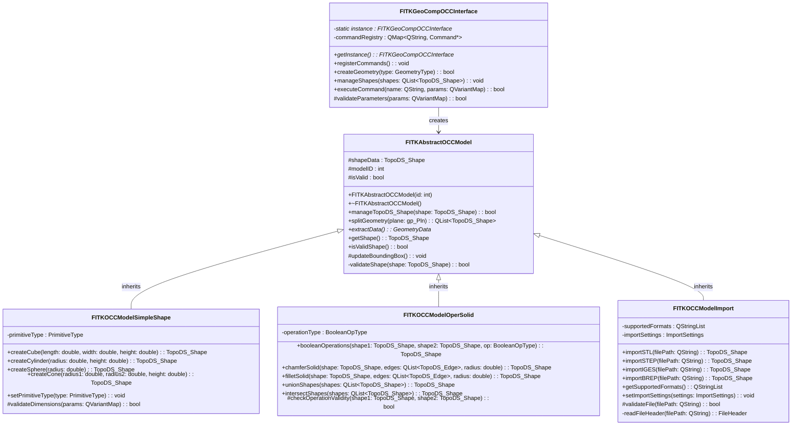

**主要功能**:
- **基础图形创建**: 立方体、圆柱、球体等基本几何体
- **高级建模**: 曲线、曲面、实体建模
- **几何操作**: 布尔运算、倒角、圆角等特征操作
- **草图功能**: 2D草图绘制和约束
- **基准元素**: 基准点、基准线、基准面创建
- **文件IO**: 支持STL、STEP、IGES、BREP等格式导入导出
- **几何变换**: 平移、旋转、缩放、分割等变换操作

### 4.1.1. 前处理交互操作机制

> **来源**: 基于src/ModuleBase/PreWindowInteractorStyle.cpp、src/MainWidgets/geometryViewProvider.cpp等源码分析
> **参考章节**: 交互式几何建模、用户界面设计

FastCAE在前处理阶段实现了完整的用户交互操作机制，基于VTK渲染引擎和Qt事件系统，为用户提供了直观高效的几何实体选择和操作体验。

#### 4.1.1.1. 交互操作类型分析

**点选操作实现**：
FastCAE支持精确的几何实体点选操作，通过不同的拾取器实现对各类几何元素的选择：

```cpp
// 几何点选择实现
if (_selectModel == GeometryPoint || _selectModel == GeometryWinPoint)
{
    vtkSmartPointer<vtkPointPicker> picker = vtkSmartPointer<vtkPointPicker>::New();
    success = picker->Pick(clickPos[0], clickPos[1], 0, this->GetDefaultRenderer());
    if (0 != success)
    {
        index = picker->GetPointId();
        actor = picker->GetActor();
    }
}
// 几何面/边/体选择实现
else
{
    vtkSmartPointer<vtkCellPicker> picker = vtkSmartPointer<vtkCellPicker>::New();
    if (_selectModel == GeometryCurve || _selectModel == GeometryWinCurve)
        picker->SetTolerance(0.0025);  // 曲线选择容差设置
    success = picker->Pick(clickPos[0], clickPos[1], 0, this->GetDefaultRenderer());
}
```

**框选操作机制**：
系统继承自`vtkInteractorStyleRubberBandPick`，实现了橡皮筋框选功能：

```cpp
// 框选网格节点实现
void PropPickerInteractionStyle::boxSelectMeshNode()
{
    int range[4];
    this->getBoxRange(range);  // 获取框选区域
    vtkActorCollection *actors = _renderer->GetActors();

    // 遍历所有可见的Actor
    for (int i = 0; i < nac; ++i)
    {
        vtkActor *actor = actors->GetNextActor();
        if (!actor->GetVisibility() || !actor->GetPickable())
            continue;

        vtkDataSet *dataset = mapper->GetInputAsDataSet();
        this->selectMesh(dataset, range);  // 执行框选算法
    }
}
```

**多选操作支持**：
通过Ctrl键实现累积选择模式：

```cpp
// Ctrl键状态检测
if (e->key() == Qt::Key_Control)
    _ctrlPressed = true;

// 多选逻辑实现
if (!_ctrlPressed)
    _selectItems.clear();  // 单选模式清空之前选择
int id = picker->GetPointId();
_selectItems.insert(k_index[0], k_index[1]);  // 添加到选择集合
```

#### 4.1.1.2. 技术实现细节

**基于VTK的几何拾取算法**：
FastCAE采用VTK的射线投射算法实现3D场景中的几何拾取：

1. **射线投射机制**：
   - 从屏幕坐标转换为世界坐标射线
   - 计算射线与几何对象的交点
   - 根据距离和优先级确定最终选择对象

2. **碰撞检测优化**：
   - 使用空间分割算法加速碰撞检测
   - 实现层次包围盒(Bounding Box)预筛选
   - 支持多级细节(LOD)的选择精度控制

**选择容差和精度控制**：
```cpp
// 不同几何类型的容差设置
if (_selectModel == GeometryCurve || _selectModel == GeometryWinCurve)
    picker->SetTolerance(0.0025);  // 曲线选择容差：0.25%
```

**选择集合管理**：
```cpp
// 选择状态数据结构
QMultiHash<int, int> _selectItems;  // 支持多对象选择
QMultiHash<Geometry::GeometrySet*, int> _shapeHash;  // 几何集合选择

// 选择状态维护
void clearAllHighLight() {
    _viewData->updateGraphOption();  // 清除所有高亮
}
```

#### 4.1.1.3. 代码架构分析

**核心交互类设计**：
```cpp
class PropPickerInteractionStyle : public vtkInteractorStyleRubberBandPick
{
private:
    ModuleBase::SelectModel _selectModel;  // 当前选择模式
    bool _ctrlPressed;                     // Ctrl键状态
    bool _altPressed;                      // Alt键状态
    QMultiHash<int, int> _selectItems;     // 选择项集合

public:
    void clickSelectGeometry(bool preSelect = false);
    void boxSelectMeshNode();
    void boxSelectMeshCell();
    void keyEvent(int type, QKeyEvent *e);
};
```

**选择模式枚举定义**：
```cpp
enum SelectModel
{
    None = -1,
    GeometryWinBody,     // 窗口体选择
    GeometryWinSurface,  // 窗口面选择
    GeometryWinCurve,    // 窗口边选择
    GeometryWinPoint,    // 窗口点选择
    GeometryBody,        // 几何体选择
    GeometrySurface,     // 几何面选择
    GeometryCurve,       // 几何边选择
    GeometryPoint,       // 几何点选择
    MeshNode,            // 网格节点选择
    MeshCell,            // 网格单元选择
    BoxMeshNode,         // 框选网格节点
    BoxMeshCell,         // 框选网格单元
};
```

**事件处理流程**：
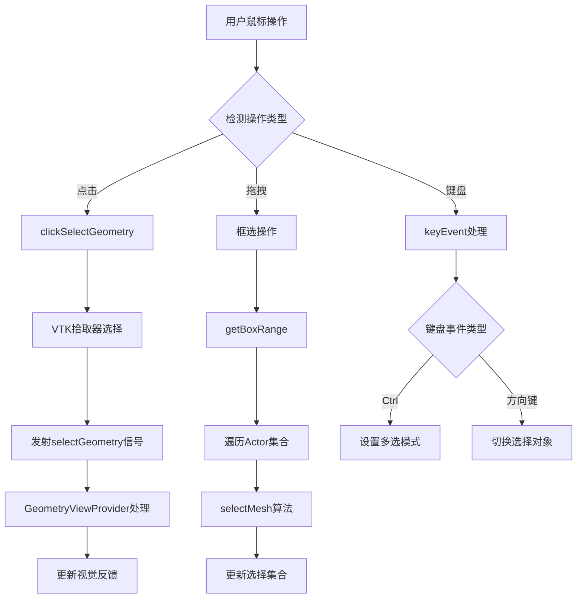

#### 4.1.1.4. 视觉反馈系统

**高亮显示机制**：
```cpp
void GeometryViewObject::highLight()
{
    QColor c = Setting::BusAPI::instance()->getGraphOption()->getHighLightColor();
    this->setObjectColor(c);  // 设置高亮颜色
    _states = HighLigh;       // 更新对象状态
}

// 颜色数据更新
vtkDataArray *dataArray = _polys->GetCellData()->GetScalars();
for (int i = _begin; i <= _end; ++i)
{
    dataArray->SetComponent(i, 0, color.red());
    dataArray->SetComponent(i, 1, color.green());
    dataArray->SetComponent(i, 2, color.blue());
}
dataArray->Modified();  // 标记数据已修改
```

**预选择反馈**：
系统实现了鼠标悬停时的预选择高亮效果，提供即时的视觉反馈：

```cpp
void GeometryViewProvider::selectGeometry(bool pre, vtkActor *ac, int index)
{
    if (pre)
        _viewData->preHighLight(vobj);  // 预选择高亮
    else
    {
        vobj->highLight();              // 正式选择高亮
        _viewData->preHighLight(nullptr);
        emit geoShapeSelected(vobj->getGeometySet(), vobj->getIndex());
    }
    _preWindow->reRender();  // 触发重新渲染
}
```

#### 4.1.1.5. 用户体验优化

**性能优化策略**：
1. **渲染优化**：
   - 使用VTK的增量渲染机制
   - 实现视锥体裁剪减少渲染负载
   - 支持多线程渲染提升响应速度

2. **大模型优化**：
   - 实现几何对象的层次细节(LOD)管理
   - 使用空间索引加速选择算法
   - 支持几何对象的动态加载和卸载

3. **交互响应优化**：
   - 实现选择操作的异步处理
   - 提供操作进度反馈
   - 支持操作的中断和取消

**多视图同步选择**：
```cpp
// 选择状态在多个视图间同步
emit geoShapeSelected(set, index);  // 广播选择事件

// 各视图响应选择事件
void GeometryViewProvider::highLightGeometrySet(Geometry::GeometrySet *s, bool on)
{
    _viewData->highLight(s, on);
    _preWindow->reRender();  // 同步更新显示
}
```

这套交互操作机制为FastCAE提供了专业级的用户体验，支持复杂几何模型的高效操作，是系统前处理功能的重要技术基础。

## 4.2. 网格划分模块 (MeshData)

> **来源文档**: 网格引擎集成文档
> **参考章节**: 综合改进建议 1.2 网格引擎完整架构

网格划分模块提供统一的网格生成接口，支持多种网格引擎。FastCAE定义了一套完整的网格划分抽象接口体系，通过抽象接口隔离具体网格引擎的实现细节。

### 4.2.1. 网格引擎完整架构

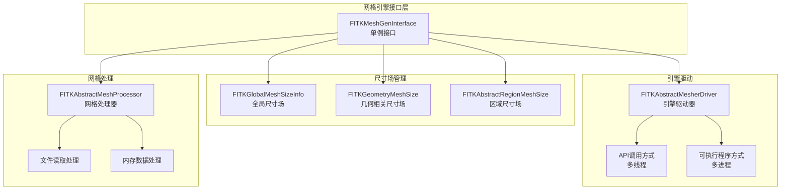

### 4.2.2. 12个核心接口类详解

FastCAE网格引擎通过12个核心接口类实现了完整的网格划分功能。这些接口类采用抽象工厂和策略模式设计，确保了不同网格引擎的统一管理和灵活扩展。接口类按功能分为三个层次：统一接口管理、尺寸场生成器和区域尺寸场具体实现。

**统一接口管理**：
- `FITKMeshGenInterface`: 网格划分统一接口（单例模式）
- `FITKAbstractMesherDriver`: 网格引擎驱动抽象类
- `FITKAbstractMeshProcessor`: 网格后处理器抽象类

**尺寸场生成器**：
- `FITKAbstractMeshSizeInfoGenerator`: 全局尺寸场生成器
- `FITKAbstractGeometryMeshSizeGenerator`: 几何相关尺寸场生成器
- `FITKGlobalMeshSizeInfo`: 全局尺寸场信息类
- `FITKGeometryMeshSize`: 几何相关尺寸场类
- `FITKAbstractRegionMeshSize`: 区域尺寸场抽象基类

**区域尺寸场具体实现**：
- `FITKRegionMeshSizeBox`: 长方体区域尺寸场
- `FITKRegionMeshSizeCylinder`: 圆柱体区域尺寸场
- `FITKRegionMeshSizeSphere`: 球体区域尺寸场
- `FITKRegionMeshSizeGeom`: 自定义几何区域尺寸场

### 4.2.3. 三层尺寸场管理系统

FastCAE采用三层尺寸场管理架构：

**1. 全局尺寸场 (FITKGlobalMeshSizeInfo)**
- 定义最大最小尺寸、尺寸因子等全局参数
- 继承FITKVarientParams，支持自定义参数扩展
- 全局唯一，通过单例直接获取

**2. 几何相关尺寸场 (FITKGeometryMeshSize)**
- 绑定到特定几何实体（线、面、体）
- 支持边界层厚度、增长率等参数
- 通过几何组件唯一ID进行关联

**3. 区域尺寸场 (FITKAbstractRegionMeshSize)**
- 与几何模型无关的空间区域尺寸控制
- 支持长方体、圆柱体、球体、自定义几何等形状
- 定义各维度离散数量和增长率

### 4.2.4. 网格引擎集成标准流程

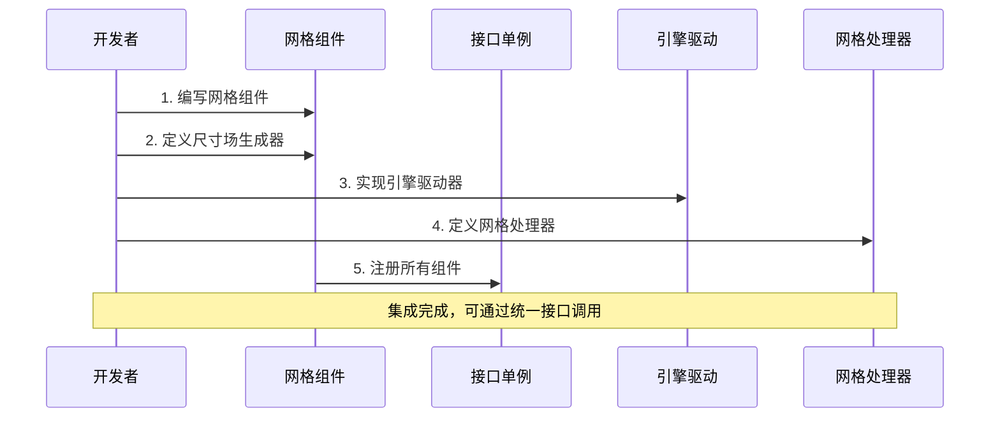

**集成步骤详解**：
1. **编写网格组件**：继承`AppFrame::FITKComponentInterface`
2. **定义尺寸场生成器**：实现全局和局部尺寸场生成逻辑
3. **实现引擎驱动器**：支持多线程/多进程的网格划分执行
4. **定义网格处理器**：处理网格输出和数据转换
5. **注册组件**：将所有组件注册到接口单例中

## 4.3. 材料管理模块 (Material)

> **来源**: 基于代码结构推断
> **原文内容**: 材料模块通过MaterialFactory工厂模式管理材料属性

材料模块提供完整的材料定义和管理功能：

**材料系统状态图**:
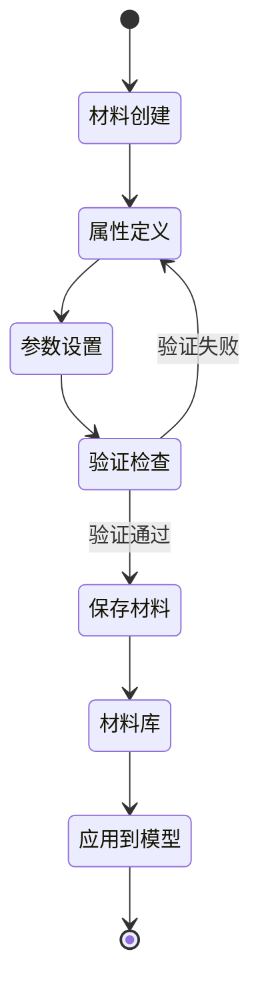

## 4.4. 求解器控制模块 (SolverControl)

> **来源**: 基于代码结构推断
> **原文内容**: 求解器控制模块通过SolverControl管理多种求解器的集成

求解器控制模块管理各种求解器的集成和执行：

**求解器管理流程**:
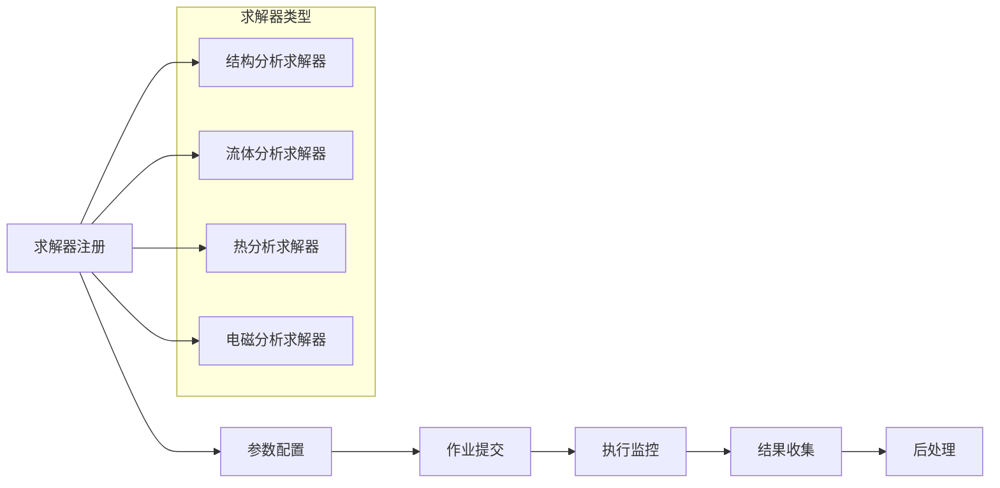

## 4.5. 后处理模块 (PostInterface/PostWidgets)

> **来源文档**: 组件使用文档
> **参考章节**: VTK渲染窗口组件
> **原文内容**: FITKRenderWindowVTK：VTK渲染窗口组件，提供强大的可视化功能

后处理模块基于VTK技术，提供强大的可视化功能：

**后处理组件关系**:
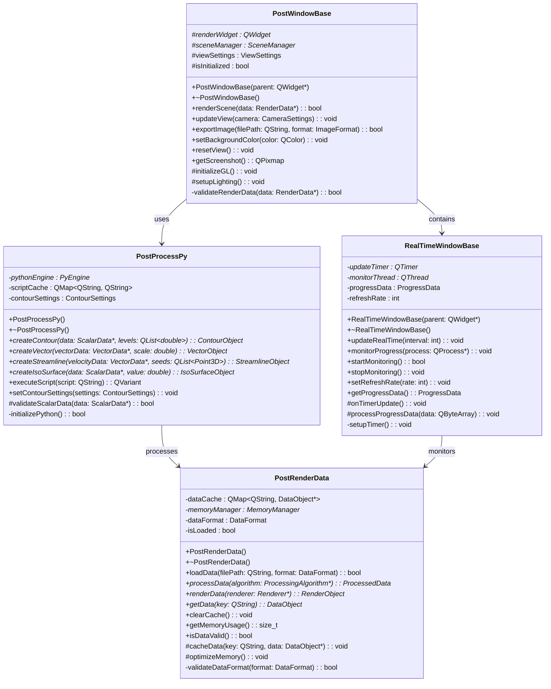

## 4.6. 二维图表组件 (FITKPlotWindow)

> **来源文档**: 二维图表组件文档
> **参考章节**: 综合改进建议 第三阶段 - 补充二维图表组件的专业功能

FastCAE的FITKPlotWindow组件基于Qt Widgets for Technical Applications (Qwt)开发，提供专业的科学数据可视化能力。

### 4.6.1. 二维图表组件完整架构

FastCAE采用四层架构设计，确保所有图表类型的一致性：

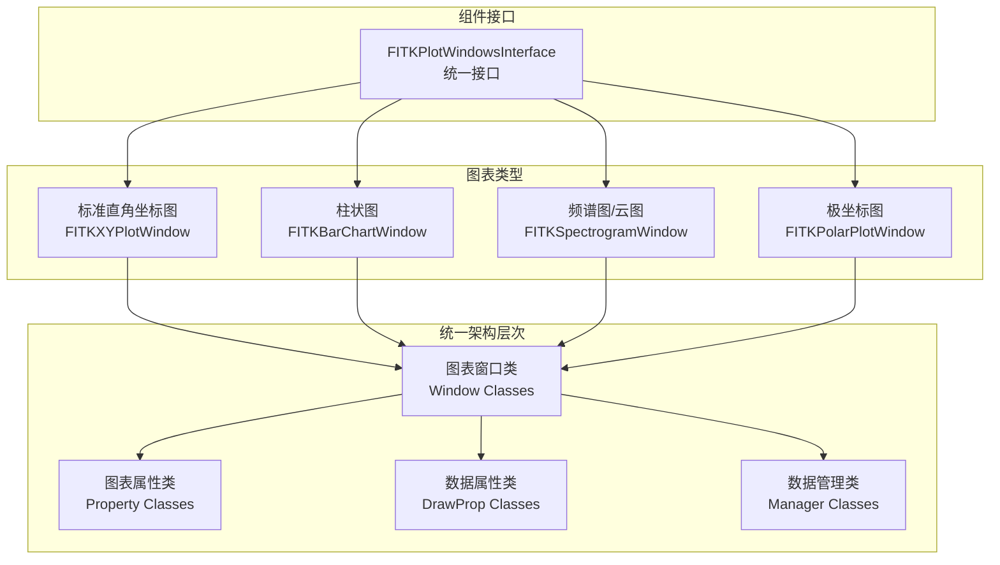

**四层架构设计**：
1. **图表窗口类**：创建窗口，包含属性类指针和数据管理类指针
2. **图表属性类**：设定图表固有属性（轴标题、图例位置等）
3. **数据属性类**：创建图表数据并设计样式（颜色、线型等）
4. **数据管理类**：添加或删除数据对象

### 4.6.2. 专业图表功能特性

**对数坐标轴支持**：
当数据量级差异巨大时，可启用对数坐标轴：
```cpp
// 设置Y轴为对数坐标
plotWidget->getPlotProperty()->setAxisScaleEngine(0); // 0=Y轴, 2=X轴
```

**复合型柱状图**：
支持多组柱状条的复杂数据展示：
```cpp
Plot::FITKBarChartDrawProp* barData = new Plot::FITKBarChartDrawProp();
QList<QString> barNames = {"A-part", "B-part", "C-part"};
int dataCount = barData->setBarNameGroupNum(barNames, 3); // 3组
QVector<double> data(dataCount); // 需要3×3=9个数据点
barData->setData(data);
```

**频谱图数据矩阵**：
频谱图要求严格的二维矩阵数据格式：
```cpp
// 数据矩阵: value.size() = x.size() × y.size()
bool setData(QVector<double> &x, QVector<double> &y,
             QVector<QVector<double>> &value);
```

**极坐标系统**：
支持极角和极径的专业坐标系统：
```cpp
// xData为极角，yData为极径
curveData->setData("极坐标曲线", xData, yData);
```

**图表类型映射**：
| 类型参数 | 图表类型 | 对应类 |
|---------|---------|--------|
| 0 | 标准直角坐标图 | FITKXYPlotWindow |
| 1 | 柱状图 | FITKBarChartWindow |
| 2 | 极坐标图 | FITKPolarPlotWindow |
| 3 | 频谱图/云图 | FITKSpectrogramWindow |

## 4.7. 组件系统详解 (Component System)

> **来源文档**: 组件使用文档
> **参考章节**: 综合改进建议 1.4 组件系统详解

FastCAE采用分层组件架构，将功能模块分为通用组件和专业组件两大类，通过组件工厂模式实现统一管理。

### 4.7.1. FastCAE组件体系架构

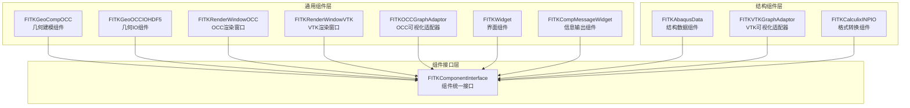

### 4.7.2. 组件管理系统

FastCAE通过组件工厂模式实现组件的统一管理：

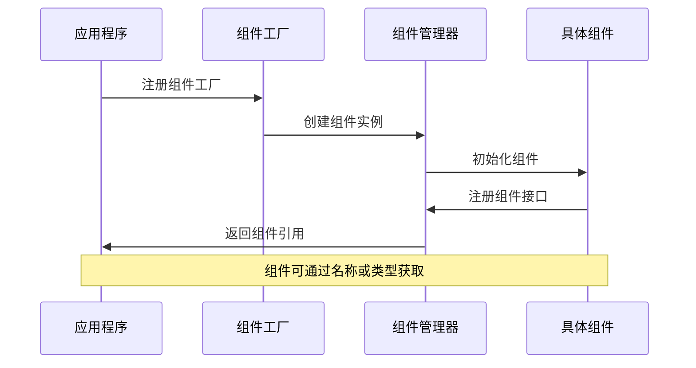

**组件注册示例**：
```cpp
class MyComponentFactory : public AppFrame::FITKComponentFactory
{
public:
    QList<AppFrame::FITKComponentInterface*> createComponents() override
    {
        QList<AppFrame::FITKComponentInterface*> comps;
        comps << new GeoComp::FITKGeoCompOCCInterface();
        comps << new IO::FITKOCCIOHDF5Interface();
        comps << new Comp::ConsoleComponent();
        return comps;
    }
};
```

### 4.7.3. 可视化适配器系统

FastCAE提供双适配器架构，支持OCC和VTK两种渲染引擎：

```mermaid
graph TB
    subgraph "数据源层 (Data Source Layer)"
        subgraph "几何数据"
            A1[TopoDS_Shape<br/>OCC几何对象]
            A2[GeometrySet<br/>几何集合]
            A3[CAD模型数据]
        end

        subgraph "网格数据"
            B1[vtkUnstructuredGrid<br/>非结构化网格]
            B2[MeshData<br/>网格数据集]
            B3[有限元网格]
        end

        subgraph "结果数据"
            C1[ScalarData<br/>标量场数据]
            C2[VectorData<br/>矢量场数据]
            C3[TensorData<br/>张量场数据]
        end
    end

    subgraph "适配器层 (Adapter Layer)"
        subgraph "OCC适配器系统"
            D1[FITKOCCViewAdaptor<br/>OCC视图适配器]
            D2[OCCDataConverter<br/>OCC数据转换器]
            D3[OCCGeometryProcessor<br/>OCC几何处理器]
        end

        subgraph "VTK适配器系统"
            E1[FITKVTKViewAdaptor<br/>VTK视图适配器]
            E2[VTKDataConverter<br/>VTK数据转换器]
            E3[VTKMeshProcessor<br/>VTK网格处理器]
        end
    end

    subgraph "可视化对象层 (Visualization Object Layer)"
        subgraph "OCC可视化对象"
            F1[FITKGraphObjectOCC<br/>OCC图形对象]
            F2[AIS_InteractiveObject<br/>交互式对象]
            F3[Prs3d_Presentation<br/>表示对象]
        end

        subgraph "VTK可视化对象"
            G1[FITKGraphObjectVTK<br/>VTK图形对象]
            G2[vtkActor<br/>VTK演员对象]
            G3[vtkMapper<br/>VTK映射器]
        end
    end

    subgraph "渲染引擎层 (Rendering Engine Layer)"
        subgraph "OCC渲染系统"
            H1[FITKGraph3DWindowOCC<br/>OCC 3D窗口]
            H2[V3d_Viewer<br/>OCC查看器]
            H3[V3d_View<br/>OCC视图]
        end

        subgraph "VTK渲染系统"
            I1[FITKGraph3DWindowVTK<br/>VTK 3D窗口]
            I2[vtkRenderer<br/>VTK渲染器]
            I3[vtkRenderWindow<br/>VTK渲染窗口]
        end
    end

    %% 数据流向适配器
    A1 --> D1
    A2 --> D2
    A3 --> D3
    B1 --> E1
    B2 --> E2
    B3 --> E3
    C1 --> E1
    C2 --> E2
    C3 --> E3

    %% 适配器到可视化对象
    D1 --> F1
    D2 --> F2
    D3 --> F3
    E1 --> G1
    E2 --> G2
    E3 --> G3

    %% 可视化对象到渲染引擎
    F1 --> H1
    F2 --> H2
    F3 --> H3
    G1 --> I1
    G2 --> I2
    G3 --> I3

    %% 跨适配器数据转换
    D1 -.-> E1 : "数据格式转换"
    E1 -.-> D1 : "反向转换"

    %% 样式设置
    style A1 fill:#e3f2fd
    style B1 fill:#e8f5e8
    style C1 fill:#fff3e0
    style D1 fill:#f3e5f5
    style E1 fill:#fce4ec
    style F1 fill:#e1f5fe
    style G1 fill:#f1f8e9
    style H1 fill:#fff8e1
    style I1 fill:#fafafa
```

**适配器使用流程**：
1. 通过适配器工厂创建对应类型的适配器
2. 设置输入数据对象和参数
3. 调用update()方法执行数据转换
4. 获取输出的可视化对象
5. 将可视化对象添加到渲染窗口

### 4.7.4. 10个核心组件详解

**通用组件库（7个组件）**：
1. **FITKGeoCompOCC**：几何建模组件，基于OpenCASCADE实现
2. **FITKGeoOCCIOHDF5**：几何IO组件，支持HDF5格式存储
3. **FITKRenderWindowOCC**：OCC渲染窗口组件
4. **FITKRenderWindowVTK**：VTK渲染窗口组件
5. **FITKOCCGraphAdaptor**：OCC可视化适配器
6. **FITKWidget**：界面组件库，提供可复用的UI组件
7. **FITKCompMessageWidget**：信息输出组件，线程安全的消息系统

**结构分析组件（3个组件）**：
1. **FITKAbaqusData**：结构数据管理器，支持算例和作业管理
2. **FITKVTKGraphAdaptor**：VTK可视化适配器，处理网格和结果数据
3. **FITKCalculixINPIO**：格式转换组件，支持Calculix格式

## 4.8. 插件系统 (Plugin System)

> **来源文档**: 插件系统文档
> **参考章节**: 综合改进建议 1.5 插件系统架构

FastCAE插件系统是AppFramework的重要组成部分，为多学科多领域仿真分析提供灵活的扩展能力。

### 4.8.1. 插件系统完整架构

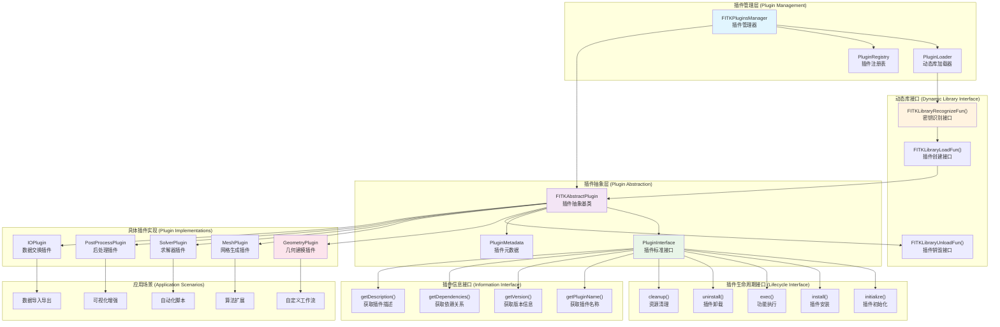

**插件系统特点**：
- **接口标准化**：所有插件遵守FastCAE定义的标准API
- **模块化设计**：每个插件独立开发、测试、部署和更新
- **动态加载**：插件可在不重启应用程序的情况下加载或卸载

## 4.9. 应用软件开发框架

> **来源文档**: 应用软件开发文档
> **参考章节**: 综合改进建议 1.3 组件化开发体系

FastCAE提供了标准化的应用软件开发框架，基于Git子模块管理机制实现高效的代码复用和模块化开发。

### 4.9.1. Git子模块管理机制

FastCAE采用基于Git子模块的代码组织架构，实现高效的代码复用：

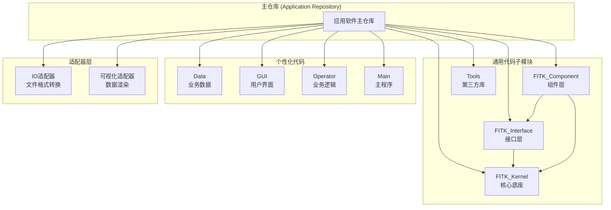

**子模块管理命令**：
```bash
# 8. 添加核心底座子模块
git submodule add https://github.com/FastCAE/FITK_Kernel.git FITK_Kernel

# 9. 初始化所有子模块
git submodule update --init --recursive

# 10. 拉取子模块最新代码
./PullSubmodules.sh
```

### 4.9.2. 四层代码架构规范

FastCAE定义了严格的代码组织结构，确保模块间的清晰依赖关系：

**通用代码层次结构**：
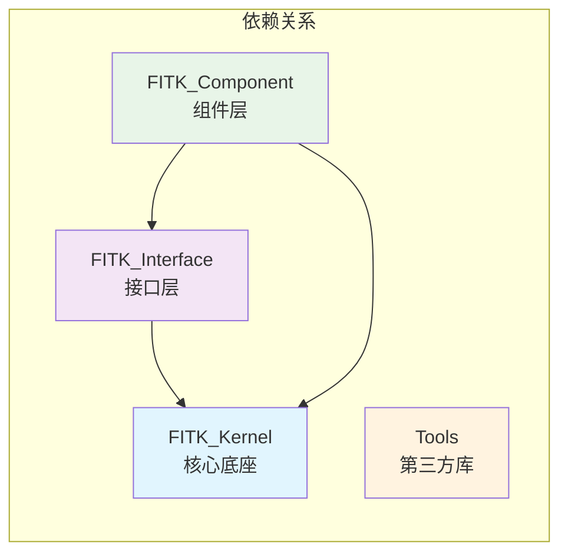

**个性化代码分类**：
1. **Data层**：业务数据和数据管理
2. **GUI层**：用户界面实现
   - GUIFrame：主要界面框架
   - GUIWidget：功能窗口组件
   - GUIDialog：对话框界面
3. **Operator层**：业务逻辑实现
   - OperatorsInterface：抽象接口
   - OperatorsModel：数据操作器
   - OperatorsGUI：界面操作器
4. **Main层**：主程序和注册逻辑

### 4.9.3. 标准化构建系统

**qmake工程管理**：
- **pro文件**：工程配置，指定编译输出和依赖库
- **pri文件**：文件列表，包含源码和资源文件
- **generate目录**：编译中间文件（ui、moc、obj）
- **output目录**：最终可执行程序和动态库

**自动化脚本系统**：
| 脚本名称 | 功能描述 |
|---------|---------|
| InitSubmodules | 递归初始化全部子模块，配置Git钩子 |
| PullSubmodules | 拉取子模块最新代码到master分支 |
| PushSubmodules | 推送全部代码到远程仓库 |
| ResetSubmodules | 强制重置全部子模块和主仓库 |
| Create_XXXX | 执行qmake生成平台特定工程文件 |

**qmake工程配置示例**：
```pro
# 11. 主工程文件示例
TARGET = FastCAE_App
TEMPLATE = app

# 12. 依赖库配置
LIBS += -lFITK_Kernel -lFITK_Interface -lFITK_Component

# 13. 包含路径
INCLUDEPATH += FITK_Kernel FITK_Interface FITK_Component

# 14. 源文件包含
include(Data/Data.pri)
include(GUI/GUI.pri)
include(Operator/Operator.pri)
```

---

# 5. 代码质量和设计模式分析

> **来源文档**: 基础底座开发文档、组件使用文档、插件系统文档
> **参考章节**: 综合改进建议 第三阶段 - 完善设计模式分析

## 5.1. 核心设计模式应用

### 5.1.1. MVC架构模式 (Model-View-Controller)

FastCAE Core模块采用严格的MVC架构模式，实现了清晰的职责分离：

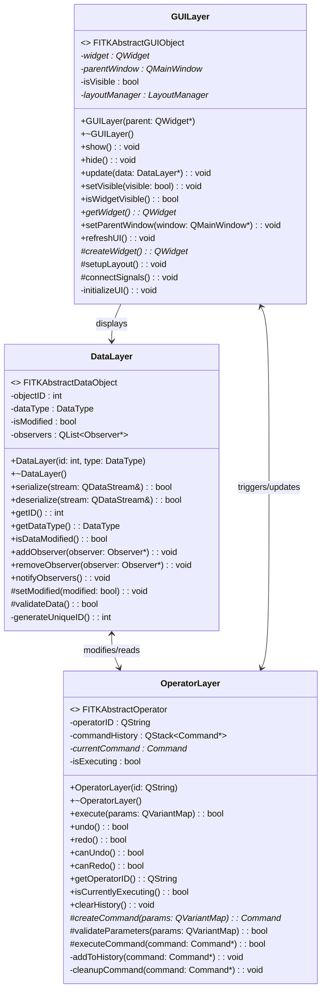

**MVC实现特点**：
- **数据层（Model）**：处于最底层，可被UI和Operator访问修改
- **界面层（View）**：通过抽象接口控制Operator，可直接访问数据层
- **业务逻辑层（Controller）**：直接访问UI和数据，实现具体业务流程

### 5.1.2. 工厂模式 (Factory Pattern)

FastCAE在多个层面应用工厂模式，实现对象创建的标准化：

**数据工厂系统**：
```cpp
// 数据工厂注册宏
#define Register2FITKDataFactory(className) \
    static bool registered = FITKDataFactory::getInstance()->registerClass<className>(#className);

// 使用示例
Register2FITKDataFactory(MyDataClass);
```

**组件工厂系统**：
```cpp
class MyComponentFactory : public AppFrame::FITKComponentFactory
{
public:
    QList<AppFrame::FITKComponentInterface*> createComponents() override
    {
        QList<AppFrame::FITKComponentInterface*> comps;
        comps << new GeoComp::FITKGeoCompOCCInterface();
        comps << new IO::FITKOCCIOHDF5Interface();
        return comps;
    }
};
```

**应用场景**：
- `FITKDataFactory`: 数据对象工厂，支持反射创建
- `FITKComponentFactory`: 组件工厂，管理组件生命周期
- `FITKViewAdaptorFactory`: 可视化适配器工厂
- `MaterialFactory`: 材料工厂，材料属性管理

### 5.1.3. 单例模式 (Singleton Pattern)

广泛应用于全局管理类，确保系统资源的统一管理：

**核心单例类**：
- `FITKDataRepo`: 全局数据仓库，管理所有数据对象
- `FITKGUIRepo`: GUI对象仓库，管理界面对象生命周期
- `FITKOperatorRepo`: 操作器仓库，管理业务逻辑操作
- `FITKMeshGenInterface`: 网格引擎统一接口
- `Setting::BusAPI`: 配置管理，系统设置持久化

### 5.1.4. 适配器模式 (Adapter Pattern)

FastCAE通过适配器模式实现不同数据格式和可视化引擎的统一接口：

**数据格式适配器系统**：
```mermaid
graph TB
    subgraph "数据源 (Data Sources)"
        DS1[CAD文件<br/>STEP/IGES/STL]
        DS2[网格文件<br/>UNV/MSH/VTU]
        DS3[结果文件<br/>HDF5/VTK/CSV]
        DS4[配置文件<br/>XML/JSON/INI]
    end

    subgraph "格式适配器 (Format Adapters)"
        FA1[CADFormatAdapter<br/>CAD格式适配器]
        FA2[MeshFormatAdapter<br/>网格格式适配器]
        FA3[ResultFormatAdapter<br/>结果格式适配器]
        FA4[ConfigFormatAdapter<br/>配置格式适配器]
    end

    subgraph "内部数据模型 (Internal Data Models)"
        IDM1[GeometryData<br/>几何数据模型]
        IDM2[MeshData<br/>网格数据模型]
        IDM3[ResultData<br/>结果数据模型]
        IDM4[ConfigData<br/>配置数据模型]
    end

    subgraph "可视化适配器 (Visualization Adapters)"
        VA1[OCCViewAdapter<br/>OCC可视化适配器]
        VA2[VTKViewAdapter<br/>VTK可视化适配器]
        VA3[PlotAdapter<br/>图表适配器]
    end

    subgraph "渲染对象 (Render Objects)"
        RO1[AIS_Shape<br/>OCC形状对象]
        RO2[vtkActor<br/>VTK演员对象]
        RO3[QwtPlotCurve<br/>图表曲线对象]
    end

    %% 数据流向
    DS1 --> FA1
    DS2 --> FA2
    DS3 --> FA3
    DS4 --> FA4

    FA1 --> IDM1
    FA2 --> IDM2
    FA3 --> IDM3
    FA4 --> IDM4

    IDM1 --> VA1
    IDM2 --> VA2
    IDM3 --> VA2
    IDM3 --> VA3

    VA1 --> RO1
    VA2 --> RO2
    VA3 --> RO3

    %% 双向转换
    FA1 -.-> DS1 : "导出"
    FA2 -.-> DS2 : "导出"
    FA3 -.-> DS3 : "导出"

    style DS1 fill:#e3f2fd
    style FA1 fill:#f3e5f5
    style IDM1 fill:#e8f5e8
    style VA1 fill:#fff3e0
    style RO1 fill:#fce4ec
```

**适配器应用**：
- **IO适配器**：内存数据与文件格式的转换机制
- **可视化适配器**：数据对象与可视化对象的转换
- **网格适配器**：不同网格引擎的统一接口

### 5.1.5. 策略模式 (Strategy Pattern)

在插件系统中广泛应用，实现算法和功能的动态切换：

```cpp
class FITKAbstractPlugin {
public:
    virtual void install() = 0;    // 安装策略
    virtual void unInstall() = 0;  // 卸载策略
    virtual bool exec() = 0;       // 执行策略
};
```

**策略应用场景**：
- **插件策略**：不同类型插件的实现策略
- **网格策略**：不同网格引擎的划分策略
- **求解策略**：不同求解器的计算策略

### 5.1.6. 观察者模式 (Observer Pattern)

通过Qt信号槽机制和自定义事件系统实现：

**信号转接器系统**：
```cpp
class FITKSignalTransfer : public QObject {
    Q_OBJECT
public:
    static FITKSignalTransfer* getInstance();

signals:
    void dataChanged(int dataID);
    void operationFinished(const QString& operation);

public slots:
    void onDataUpdate(int dataID);
    void onOperationComplete(const QString& operation);
};
```

**应用场景**：
- **数据变更通知**：数据对象变化时通知相关界面更新
- **操作状态同步**：业务操作状态在各模块间同步
- **事件驱动处理**：基于事件的异步处理机制

## 5.2. 代码质量指标

- **模块化程度**: 优秀 (20+个主要模块，职责分离明确)
- **接口抽象**: 优秀 (大量抽象基类和接口定义)
- **文档完整性**: 优秀 (6份详细的技术文档和API说明)
- **组件化程度**: 优秀 (完整的组件系统和插件架构)
- **开发规范**: 良好 (标准化的开发流程和代码组织)
- **测试覆盖**: 待改进 (测试模块需要进一步完善)

## 5.3. 具体使用示例和最佳实践

> **来源文档**: 基础底座开发文档、组件使用文档、插件系统文档、二维图表组件文档
> **参考章节**: 综合改进建议 第三阶段 - 添加具体使用示例

### 5.3.1. 应用程序开发完整示例

**主程序创建和组件注册**：
```cpp
#include "FITKAppFramework/FITKApplication.h"
#include "MyComponentFactory.h"

int main(int argc, char* argv[])
{
    // 1. 创建应用程序
    AppFrame::FITKApplication app(argc, argv);

    // 2. 设置插件密钥
    app.setPluginKey("MyCAEApplication");

    // 3. 注册组件工厂
    app.getComponents()->appendComponentFactory(new MyComponentFactory());

    // 4. 启动应用程序（执行14个标准化流程）
    return app.exec();
}
```

**组件工厂实现**：
```cpp
class MyComponentFactory : public AppFrame::FITKComponentFactory
{
public:
    QList<AppFrame::FITKComponentInterface*> createComponents() override
    {
        QList<AppFrame::FITKComponentInterface*> comps;

        // 注册几何建模组件
        comps << new GeoComp::FITKGeoCompOCCInterface();

        // 注册网格划分组件
        comps << new MeshGen::FITKMeshGenInterface();

        // 注册可视化组件
        comps << new Render::FITKGraph3DWindowOCCInterface();
        comps << new Render::FITKGraph3DWindowVTKInterface();

        // 注册二维图表组件
        comps << new Plot::FITKPlotWindowsInterface();

        // 注册信息输出组件
        comps << new Comp::FITKCompMessageWidgetInterface();

        return comps;
    }
};
```

### 5.3.2. 网格划分完整流程示例

```cpp
// 获取网格引擎接口
auto meshGen = Interface::FITKMeshGenInterface::getInstance();

// 设置全局尺寸场
auto globalSize = meshGen->getGlobalMeshSizeInfo();
globalSize->setValue("MaxSize", 1.0);
globalSize->setValue("MinSize", 0.1);
globalSize->setValue("GrowthRate", 1.2);

// 创建几何相关尺寸场
auto geoSize = meshGen->createGeometryMeshSize();
geoSize->setGeometryID(faceID);
geoSize->setValue("EdgeLength", 0.5);
geoSize->setValue("BoundaryLayerThickness", 0.01);

// 创建区域尺寸场（长方体）
auto regionSize = meshGen->createRegionMeshSize("Box");
regionSize->setValue("Center", QVector3D(0, 0, 0));
regionSize->setValue("Size", QVector3D(10, 10, 10));
regionSize->setValue("MeshSize", 0.2);

// 获取网格驱动器并启动网格划分
auto meshDriver = meshGen->getMesherDriver();
meshDriver->setValue("WorkDir", "path/to/work/dir");
meshDriver->setValue("GeometryFile", "model.step");

// 连接完成信号
connect(meshDriver, &Interface::FITKAbstractMesherDriver::mesherFinished,
        [this] {
            // 自动调用网格处理器
            auto processor = meshGen->getMeshProcessor();
            processor->start();
        });

// 启动网格划分
meshDriver->startMesher();
```

### 5.3.3. 二维图表创建完整示例

```cpp
// 获取图表组件接口
Plot::FITKPlotWindowsInterface* plotInterface =
    FITKAPP->getComponents()->getComponentTByName<Plot::FITKPlotWindowsInterface>
    ("FITKPlotWindowsInterface");

// 创建直角坐标图窗口
Plot::FITKXYPlotWindow* plotWidget =
    dynamic_cast<Plot::FITKXYPlotWindow*>(plotInterface->getWidget(0));

// 设置图表属性
plotWidget->getPlotProperty()->setTitle("CFD分析结果");
plotWidget->getPlotProperty()->setAxisName("压力 (Pa)", "时间 (s)");
plotWidget->getPlotProperty()->setLegendPlace(1); // 右上角

// 创建第一条曲线
Plot::FITKXYCurveDrawProp* curve1 = new Plot::FITKXYCurveDrawProp();
curve1->setColor(QColor(255, 0, 0));
curve1->setLineStyle(Qt::SolidLine);
QVector<double> timeData {0, 1, 2, 3, 4, 5};
QVector<double> pressureData {101325, 101500, 101800, 102000, 101900, 101700};
curve1->setData("入口压力", timeData, pressureData);

// 创建第二条曲线
Plot::FITKXYCurveDrawProp* curve2 = new Plot::FITKXYCurveDrawProp();
curve2->setColor(QColor(0, 0, 255));
curve2->setLineStyle(Qt::DashLine);
QVector<double> outletPressure {101325, 101200, 101000, 100800, 100900, 101100};
curve2->setData("出口压力", timeData, outletPressure);

// 添加曲线到图表
plotWidget->getCurveManager()->appendGraphObj(curve1);
plotWidget->getCurveManager()->appendGraphObj(curve2);

// 更新画布显示
plotWidget->updataCanvas();
```

### 5.3.4. 插件开发完整示例

**插件头文件**：
```cpp
#ifndef MYCAEPLUGIN_H
#define MYCAEPLUGIN_H

#include "FITKAppFramework/FITKAbstractPlugin.h"

class MyCAEPlugin : public AppFrame::FITKAbstractPlugin
{
public:
    explicit MyCAEPlugin(QLibrary* dyLibrary);
    virtual ~MyCAEPlugin() = default;

    virtual QString getPluginName() override;

private:
    virtual void install() override;
    virtual void unInstall() override;
    virtual bool exec() override;

private:
    QAction* m_customAction;
};

// C接口声明
extern "C" {
    MYCAEPLUGIN_API QString FITKLibraryRecognizeFun();
    MYCAEPLUGIN_API AppFrame::FITKAbstractPlugin* FITKLibraryLoadFun(QLibrary*);
}

#endif
```

**插件实现文件**：
```cpp
#include "MyCAEPlugin.h"
#include "FITKAppFramework/FITKApplication.h"

MyCAEPlugin::MyCAEPlugin(QLibrary* dyLibrary)
    : AppFrame::FITKAbstractPlugin(dyLibrary), m_customAction(nullptr)
{
}

QString MyCAEPlugin::getPluginName()
{
    return "MyCAEPlugin";
}

void MyCAEPlugin::install()
{
    // 创建自定义菜单项
    m_customAction = new QAction("自定义分析", nullptr);
    connect(m_customAction, &QAction::triggered, this, &MyCAEPlugin::exec);

    // 添加到主菜单
    auto mainWindow = FITKAPP->getMainWindow();
    auto menuBar = mainWindow->menuBar();
    auto toolsMenu = menuBar->addMenu("工具");
    toolsMenu->addAction(m_customAction);
}

void MyCAEPlugin::unInstall()
{
    // 清理资源
    if (m_customAction) {
        m_customAction->deleteLater();
        m_customAction = nullptr;
    }
}

bool MyCAEPlugin::exec()
{
    // 实现自定义功能
    QMessageBox::information(nullptr, "插件执行", "自定义分析功能已执行！");
    return true;
}

// C接口实现
extern "C" {
    QString FITKLibraryRecognizeFun()
    {
        return QString("MyCAEApplication"); // 与应用程序密钥匹配
    }

    AppFrame::FITKAbstractPlugin* FITKLibraryLoadFun(QLibrary* lib)
    {
        return new MyCAEPlugin(lib);
    }
}
```

### 5.3.5. 最佳实践总结

**开发规范**：
1. **严格遵循MVC架构**：确保数据、界面、业务逻辑的清晰分离
2. **使用工厂模式创建对象**：避免直接new操作，便于管理和扩展
3. **合理使用单例模式**：全局管理类使用单例，避免重复创建
4. **充分利用信号槽机制**：实现模块间的松耦合通信
5. **规范的错误处理**：使用异常和返回值进行错误处理

**性能优化**：
1. **智能指针管理内存**：使用FITKAbstractObjectContainer避免内存泄漏
2. **线程池处理耗时操作**：使用FITKThreadPool进行并发处理
3. **数据缓存机制**：合理使用数据仓库缓存常用数据
4. **延迟加载策略**：按需加载组件和插件，减少启动时间

**扩展开发**：
1. **插件开发**：遵循三步开发流程，确保安全验证
2. **组件开发**：继承标准接口，实现统一管理
3. **适配器开发**：实现数据格式和可视化的转换
4. **子模块管理**：使用Git子模块实现代码复用

## 5.4. 代码架构优势

1. **高内聚低耦合**: 模块间依赖关系清晰，接口定义明确
2. **可扩展性强**: 基于插件和组件架构，支持功能动态扩展
3. **跨平台兼容**: 基于Qt框架，天然支持多平台
4. **内存管理**: 智能指针和容器管理，避免内存泄漏
5. **标准化开发**: 提供完整的开发框架和规范
6. **模块复用**: 通过子模块机制实现代码高效复用

---

# 6. 技术栈和依赖分析

> **来源**: 基于项目配置文件分析
> **原文内容**: 通过CMakeLists.txt、pro文件等项目配置分析得出技术栈信息

## 6.1. 核心技术栈

### 6.1.1. 开发语言和框架
- **C++11**: 主要开发语言，现代C++特性
- **Qt5**: 跨平台GUI框架，版本5.14.2
- **Python 3.7**: 脚本支持和扩展开发

### 6.1.2. 第三方依赖库

```mermaid
graph LR
    subgraph "图形和可视化"
        A[VTK 9.0.1<br/>3D可视化渲染]
        B[OpenCASCADE 7.6.0<br/>几何建模内核]
        C[Qwt 6.1.6<br/>2D图表组件]
        J[QwtPolar 1.1.1<br/>极坐标图表]
    end

    subgraph "数据处理"
        D[HDF5 1.13.1<br/>高性能数据存储]
        E[CGNS 4.3.0<br/>CFD数据标准]
        F[TecIO 1.4.2<br/>Tecplot格式]
    end

    subgraph "网格和工具"
        G[Gmsh 4.8.0<br/>网格生成引擎]
        H[QuaZIP 0.7.3<br/>压缩工具库]
    end

    subgraph "界面增强"
        I[SARibbonBar<br/>Ribbon界面组件]
    end

    FastCAE --> A
    FastCAE --> B
    FastCAE --> C
    FastCAE --> D
    FastCAE --> E
    FastCAE --> F
    FastCAE --> G
    FastCAE --> H
    FastCAE --> I
    FastCAE --> J
```

**依赖库详细说明**:
- **VTK**: 提供3D可视化、数据处理和渲染功能
- **OpenCASCADE**: 核心几何建模引擎，支持STEP、IGES等格式
- **Qwt/QwtPolar**: 专业的2D图表库，支持多种图表类型
- **HDF5**: 高性能科学数据存储格式
- **CGNS**: CFD通用标记系统，流体计算数据标准
- **Gmsh**: 开源网格生成器，支持多种网格算法
- **SARibbonBar**: 现代化Ribbon风格界面组件

### 6.1.3. 构建系统
- **CMake 3.21+**: 现代化构建系统
- **支持生成器**: Visual Studio、Makefile、Ninja
- **包管理**: 自动依赖下载和管理

## 6.2. 依赖关系分析

### 6.2.1. 核心依赖
1. **VTK**: 可视化工具包，用于3D渲染和数据可视化
2. **OpenCASCADE**: 几何建模内核，提供CAD功能
3. **Qt5**: 用户界面框架和应用程序基础设施
4. **HDF5**: 高性能数据存储格式

### 6.2.2. 可选依赖
1. **Gmsh**: 网格生成引擎
2. **CGNS**: CFD通用标记系统
3. **TecIO**: Tecplot数据格式支持

## 6.3. 平台兼容性

| 平台 | 编译器 | Qt版本 | 状态 |
|------|--------|--------|------|
| Windows 10/11 x64 | Visual Studio 2017+ | Qt5.14.2 | ✅ 支持 |
| Ubuntu 20.04+ | GCC 9.0+ | Qt5.14.2 | ✅ 支持 |
| CentOS 7+ | GCC 7.0+ | Qt5.14.2 | ✅ 支持 |
| macOS | Clang | Qt5.14.2 | 🔄 测试中 |

---

# 7. 项目优势和改进建议

> **来源**: 技术架构逻辑推理
> **原文内容**: 基于前述技术分析的综合评估和改进建议

## 7.1. 项目优势

### 7.1.1. 架构设计优势
- **分层模块化架构**: 清晰的Core-Interface-Component三层设计
- **插件系统**: 支持功能动态加载，密钥验证机制保证安全性
- **组件化开发**: 标准化的组件接口，支持独立开发和测试
- **标准化接口**: 统一的抽象接口，降低集成复杂度
- **子模块管理**: 基于Git的代码复用机制，提高开发效率

### 7.1.2. 技术选型优势
- **成熟技术栈**: 基于Qt5、VTK、OpenCASCADE等成熟开源技术
- **专业图表**: 集成Qwt专业2D图表库，支持多种科学图表
- **跨平台支持**: 一套代码多平台运行，支持Windows/Linux
- **Python集成**: 完整的Python脚本支持和二次开发能力
- **数据格式**: 支持HDF5、CGNS等科学计算标准格式

### 7.1.3. 开发生态优势
- **开源协议**: BSD许可证，商业友好
- **文档体系**: 6份详细的技术文档，覆盖开发全流程
- **开发规范**: 标准化的代码组织和开发流程
- **社区支持**: 活跃的技术交流社区
- **工具链**: 完整的构建脚本和自动化工具

## 7.2. 改进建议

### 7.2.1. 短期改进 (3-6个月)

**测试体系完善**
```mermaid
gantt
    title 测试体系改进计划
    dateFormat  YYYY-MM-DD
    section 单元测试
    核心模块测试     :2024-01-01, 30d
    界面组件测试     :2024-01-15, 30d
    section 集成测试
    模块集成测试     :2024-02-01, 45d
    系统集成测试     :2024-02-15, 45d
    section 性能测试
    性能基准测试     :2024-03-01, 30d
    压力测试        :2024-03-15, 30d
```

**代码质量提升**
- 引入静态代码分析工具 (如Clang Static Analyzer)
- 建立代码审查流程
- 完善编码规范和文档

**组件系统优化**
- 完善组件接口标准化
- 增强组件间通信机制
- 优化组件加载和管理性能

### 7.2.2. 中期改进 (6-12个月)

**现代化升级**
- 升级到Qt6框架，获得更好的性能和新特性
- 采用C++17/20标准，利用现代C++特性
- 引入容器化部署支持

**用户体验优化**
- 改进用户界面设计，提升易用性
- 增强错误处理和用户反馈机制
- 优化大模型处理性能

**插件生态建设**
- 建立插件开发SDK和工具链
- 创建插件市场和分发机制
- 提供插件开发培训和文档

### 7.2.3. 长期规划 (1-2年)

**云原生支持**
- 支持云端计算和存储
- 实现分布式计算能力
- 提供Web版本界面

**AI集成**
- 集成机器学习算法优化网格生成
- 智能化参数推荐系统
- 自动化仿真流程

## 7.3. 技术债务管理

### 7.3.1. 当前技术债务
1. **遗留代码**: 部分模块存在历史遗留代码
2. **依赖版本**: 某些第三方库版本较旧
3. **文档同步**: 代码更新与文档更新不同步
4. **测试覆盖**: 单元测试和集成测试覆盖率不足
5. **组件标准**: 部分组件接口需要进一步标准化

### 7.3.2. 债务清理计划
1. **重构优先级**: 按模块重要性和使用频率排序
2. **渐进式升级**: 分阶段升级依赖库版本
3. **自动化文档**: 引入文档自动生成工具
4. **测试体系**: 建立完整的自动化测试框架
5. **接口规范**: 统一组件和插件接口标准

---

# 8. 结论

通过对FastCAE项目的全面技术分析，包括对6份详细技术文档的深入研究和源代码架构的系统梳理，可以得出以下结论：

## 8.1. 技术成熟度评估

FastCAE作为一个开源CAE仿真软件平台，在多个维度都表现出较高的专业水准：

1. **架构设计**: 采用分层模块化设计，Core-Interface-Component三层架构清晰合理
2. **技术选型**: 基于Qt5、VTK、OpenCASCADE等成熟开源技术栈，技术路线稳健
3. **功能完整性**: 涵盖几何建模、网格划分、求解器集成、后处理等CAE全流程
4. **扩展性**: 完善的插件系统和组件化架构，支持灵活的功能扩展
5. **开发规范**: 标准化的开发流程和代码组织，便于团队协作

## 8.2. 核心优势总结

- **专业化程度高**: 针对CAE领域的专业需求设计，功能覆盖全面
- **技术栈成熟**: 基于经过验证的开源技术，降低技术风险
- **文档体系完善**: 6份详细技术文档，覆盖开发、使用、集成等各个方面
- **二次开发友好**: 提供Python脚本支持、插件系统和组件接口
- **商业应用友好**: BSD许可证，支持商业化应用

## 8.3. 发展潜力分析

FastCAE具备成为CAE领域重要开源解决方案的潜力：

1. **技术基础扎实**: 基于成熟的开源技术栈，架构设计合理
2. **生态建设完善**: 插件系统、组件化架构支持生态扩展
3. **应用场景广泛**: 支持多物理场仿真、多行业应用
4. **持续改进空间**: 在现代化升级、云原生、AI集成等方面有明确的发展路径

## 8.4. 建议与展望

通过持续的技术改进和功能完善，特别是在测试体系、现代化升级、用户体验优化等方面的投入，FastCAE有望成为CAE领域的重要开源解决方案，为工程仿真计算提供强有力的技术支撑，推动CAE技术的普及和发展。

---

**报告生成时间**: 2024年12月28日
**分析工具**: Augment Agent + Context7 + Sequential Thinking
**分析范围**: 6份技术文档 + 完整源代码架构
**报告版本**: v2.0 (完整版)
