FastCAE仿真软件项目技术分析报告


# 目录

## [1. 项目概述和目标](#1-项目概述和目标)
- [1.1. 项目基本信息](#11-项目基本信息)
- [1.2. 项目目标](#12-项目目标)
- [1.3. 应用领域](#13-应用领域)

## [2. 技术架构分析](#2-技术架构分析)
- [2.1. 整体架构设计](#21-整体架构设计)
- [2.2. 核心架构组件](#22-核心架构组件)
  - [2.2.1. Core模块 - 基础底座](#221-core模块---基础底座)
  - [2.2.2. AppFramework模块 - 应用框架](#222-appframework模块---应用框架)
- [2.3. 系统架构图](#23-系统架构图)

## [3. 项目文件结构分析](#3-项目文件结构分析)
- [3.1. src目录整体结构](#31-src目录整体结构)
- [3.2. 核心模块详细分析](#32-核心模块详细分析)
  - [3.2.1. 主程序模块 (FastCAE/)](#321-主程序模块-fastcae)
  - [3.2.2. 通用工具模块 (Common/)](#322-通用工具模块-common)
  - [3.2.3. 配置管理模块 (ConfigOptions/)](#323-配置管理模块-configoptions)
  - [3.2.4. 几何建模模块群](#324-几何建模模块群)
- [3.3. 模块间依赖关系体现](#33-模块间依赖关系体现)
  - [3.3.1. 层次化依赖结构](#331-层次化依赖结构)
  - [3.3.2. CMakeLists.txt体现的依赖关系](#332-cmakeliststxt体现的依赖关系)
  - [3.3.3. 架构图修正分析](#333-架构图修正分析)
- [3.4. 文件组织设计优势](#34-文件组织设计优势)
  - [3.4.1. 模块化架构体现](#341-模块化架构体现)
  - [3.4.2. 可维护性设计](#342-可维护性设计)
  - [3.4.3. 开发效率优化](#343-开发效率优化)

## [4. 核心功能模块详解](#4-核心功能模块详解)
- [4.1. 几何建模模块 (Geometry)](#41-几何建模模块-geometry)
  - [4.1.1. 前处理交互操作机制](#411-前处理交互操作机制)
  - [4.1.2. 几何数据管理核心实现](#412-几何数据管理核心实现)
  - [4.1.3. 几何对象模型设计](#413-几何对象模型设计)
- [4.2. 网格划分模块 (MeshData)](#42-网格划分模块-meshdata)
  - [4.2.1. 网格数据结构核心设计](#421-网格数据结构核心设计)
  - [4.2.2. Gmsh集成机制详解](#422-gmsh集成机制详解)
  - [4.2.3. 网格质量评估系统](#423-网格质量评估系统)
  - [4.2.4. 网格数据交换插件化实现](#424-网格数据交换插件化实现)
- [4.3. 后处理模块技术实现](#43-后处理模块技术实现)
  - [4.3.1. 后处理架构设计](#431-后处理架构设计)
  - [4.3.2. VTK渲染管道集成](#432-vtk渲染管道集成)
  - [4.3.3. 后处理算法实现机制](#433-后处理算法实现机制)
  - [4.3.4. 2D图表组件技术实现](#434-2d图表组件技术实现)
- [4.4. 插件系统架构深度解析](#44-插件系统架构深度解析)
  - [4.4.1. 插件架构核心设计](#441-插件架构核心设计)
  - [4.4.2. 动态库加载机制实现](#442-动态库加载机制实现)
  - [4.4.3. 插件开发标准化流程](#443-插件开发标准化流程)

## [5. 代码质量和设计模式分析](#5-代码质量和设计模式分析)
- [5.1. 设计模式的具体实现](#51-设计模式的具体实现)
  - [5.1.1. 单例模式实现分析](#511-单例模式实现分析)
  - [5.1.2. 命令模式实现分析](#512-命令模式实现分析)
  - [5.1.3. 工厂模式实现分析](#513-工厂模式实现分析)
  - [5.1.4. 观察者模式实现分析](#514-观察者模式实现分析)
- [5.2. 架构模式分析](#52-架构模式分析)
  - [5.2.1. MVC模式实现](#521-mvc模式实现)
  - [5.2.2. 插件架构模式](#522-插件架构模式)

## [6. 技术栈和依赖分析](#6-技术栈和依赖分析)
- [6.1. 第三方库集成技术细节](#61-第三方库集成技术细节)
  - [6.1.1. VTK渲染管道深度集成](#611-vtk渲染管道深度集成)
  - [6.1.2. OpenCASCADE几何内核集成](#612-opencascade几何内核集成)
  - [6.1.3. Qt框架深度集成](#613-qt框架深度集成)
  - [6.1.4. Python脚本引擎集成](#614-python脚本引擎集成)
  - [6.1.5. HDF5数据存储集成](#615-hdf5数据存储集成)
- [6.2. 构建系统和依赖管理](#62-构建系统和依赖管理)
  - [6.2.1. CMake构建系统](#621-cmake构建系统)
- [6.3. 技术实现亮点总结](#63-技术实现亮点总结)
  - [6.3.1. 架构设计亮点](#631-架构设计亮点)
  - [6.3.2. 技术集成亮点](#632-技术集成亮点)
  - [6.3.3. 代码质量亮点](#633-代码质量亮点)
  - [6.3.4. 用户体验亮点](#634-用户体验亮点)
  - [6.3.5. 技术创新点](#635-技术创新点)

## [7. 项目优势和改进建议](#7-项目优势和改进建议)
- [7.1. 项目技术优势总结](#71-项目技术优势总结)
  - [7.1.1. 架构设计优势](#711-架构设计优势)
  - [7.1.2. 技术实现优势](#712-技术实现优势)
  - [7.1.3. 开发生态优势](#713-开发生态优势)
- [7.2. 改进建议](#72-改进建议)
  - [7.2.1. 技术现代化升级](#721-技术现代化升级)
  - [7.2.2. 用户体验优化](#722-用户体验优化)
  - [7.2.3. 功能扩展建议](#723-功能扩展建议)
- [7.3. 发展潜力分析](#73-发展潜力分析)

## [8. 结论](#8-结论)
- [8.1. 技术成熟度评估](#81-技术成熟度评估)
- [8.2. 核心优势总结](#82-核心优势总结)
- [8.3. 发展潜力分析](#83-发展潜力分析)
- [8.4. 建议与展望](#84-建议与展望)

---

# 1. 项目概述和目标

> **来源**: 基于项目配置文件分析、README文档

## 1.1. 项目基本信息
- **项目名称**: FastCAE
- **版本**: 2.5.0
- **开发机构**: 青岛数智船海科技有限公司
- **许可证**: BSD 3-Clause License
- **项目定位**: 免费的CAE仿真软件研发支撑平台

## 1.2. 项目目标

> **来源文档**: 基础底座开发文档、应用软件开发文档
> **参考章节**: 各文档概述部分
> **原文内容**: FastCAE作为CAE软件集成框架，提供标准化的开发流程...（省略）

FastCAE是一款面向CAE（计算机辅助工程）领域的开源仿真软件平台，旨在：

1. **标准化集成**: 提供统一的CAE软件集成框架，规范子系统集成流程
2. **模块化设计**: 基于组件化架构，支持灵活的功能组合和扩展
3. **跨平台支持**: 支持Windows和Linux平台，满足不同用户需求
4. **开放生态**: 通过插件系统和Python脚本支持，构建开放的开发生态

## 1.3. 应用领域

> **来源文档**: 网格引擎集成文档、组件使用文档
> **参考章节**: 应用场景描述
> **原文内容**: 支持几何建模、网格划分、多物理场仿真等应用领域

- 几何建模与CAD集成
- 网格划分与优化
- 多物理场仿真计算
- 后处理与可视化
- 工程数据管理

---

# 2. 技术架构分析

> **来源文档**: 基础底座开发文档
> **参考章节**: Core模块架构设计
> **原文内容**: FastCAE Core模块采用严格的MVC（Model-View-Controller）架构模式...（省略）

## 2.1. 整体架构设计

FastCAE采用分层模块化架构，基于MVC设计模式和命令模式，将系统分为六个清晰的层次结构。

> **架构修正说明**: 基于CMakeLists.txt实际依赖关系分析，修正了模块分层归属和依赖方向，添加了命令层体现设计模式应用

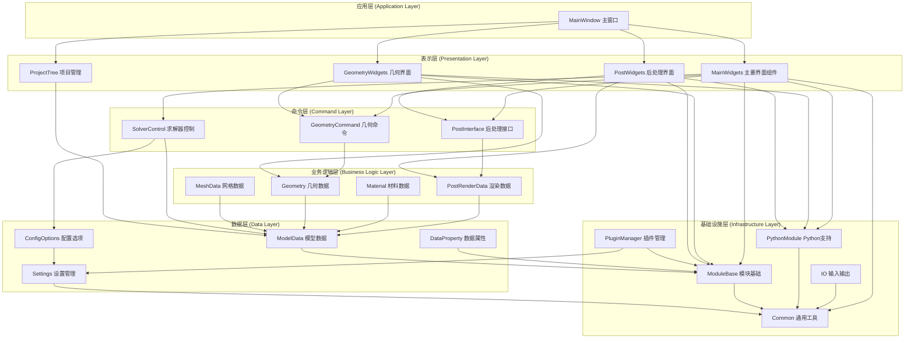

## 2.2. 核心架构组件

### 2.2.1. Core模块 - 基础底座

> **来源文档**: 基础底座开发文档
> **参考章节**: 综合改进建议 1.1 技术架构深度分析

Core模块是整个系统的核心，提供：
- **抽象数据结构**: FITKAbstractObject、FITKAbstractDataObject等基类
- **数据管理**: FITKDataRepo全局数据仓库、FITKGUIRepo界面对象仓库
- **工具集**: 线程池、文件操作、三维矢量计算等

#### 2.2.1.1. Core模块MVC架构详解

FastCAE Core模块采用严格的MVC（Model-View-Controller）架构模式，将系统分为三个核心层次：

```mermaid
graph TB
    subgraph "MVC核心架构"
        subgraph "数据层 (Model)"
            D1[FITKAbstractDataObject<br/>数据抽象基类]
            D2[数据序列化/反序列化]
            D3[数据ID管理]
        end

        subgraph "界面层 (View)"
            G1[FITKAbstractGUIObject<br/>界面抽象基类]
            G2[界面显示/隐藏]
            G3[界面更新机制]
        end

        subgraph "控制层 (Controller)"
            O1[FITKAbstractOperator<br/>操作器抽象基类]
            O2[命令执行/撤销]
            O3[业务逻辑处理]
        end
    end

    subgraph "支撑系统"
        subgraph "对象容器系统"
            C1[FITKAbstractObjectContainer]
            C2[智能指针管理]
            C3[野指针问题解决]
        end

        subgraph "工厂系统"
            F1[FITKDataFactory<br/>数据对象工厂]
            F2[Register2FITKDataFactory<br/>注册宏]
            F3[动态对象创建]
        end

        subgraph "仓库系统"
            OR1[FITKOperatorRepo<br/>操作器仓库]
            OR2[操作器注册管理]
            OR3[操作器生命周期]
        end
    end

    %% MVC核心关系
    O1 <--> D1 : "读取/修改数据"
    G1 <--> O1 : "触发操作/更新界面"
    G1 --> D1 : "显示数据"

    %% 支撑系统关系
    C1 --> D1
    C1 --> G1
    C1 --> O1
    F1 --> D1
    F2 --> F1
    OR1 --> O1

    %% 详细组件关系
    D2 --> D1
    D3 --> D1
    G2 --> G1
    G3 --> G1
    O2 --> O1
    O3 --> O1
    C2 --> C1
    C3 --> C1
    F3 --> F1
    OR2 --> OR1
    OR3 --> OR1
```

**三层架构关系**：
- **数据层（Data Layer）**：处于最底层，可被UI和Operator访问修改
- **界面层（GUI Layer）**：通过抽象接口控制Operator，可直接访问数据层
- **业务逻辑层（Operator Layer）**：直接访问UI和数据，实现具体业务流程

#### 2.2.1.2. 核心机制详解

**1. 抽象对象容器机制**
```cpp
// 智能指针容器，解决野指针问题
class FITKAbstractObjectContainer {
public:
    template<typename T>
    void addObject(T* object);

    template<typename T>
    T* getObject(const QString& id);

    void removeObject(const QString& id);
};
```

**2. 数据工厂注册机制**
```cpp
// 数据工厂注册宏
#define Register2FITKDataFactory(className) \
    static bool registered = FITKDataFactory::getInstance()->registerClass<className>(#className);

// 使用示例
Register2FITKDataFactory(MyDataClass);
```

**3. 操作器仓库系统**
```cpp
// 操作器注册和调用
class FITKOperatorRepo {
public:
    void registerOperator(const QString& name, FITKAbstractOperator* op);
    FITKAbstractOperator* getOperator(const QString& name);
    void executeOperator(const QString& name, const QVariantMap& params);
};
```

### 2.2.2. AppFramework模块 - 应用框架

> **来源文档**: 基础底座开发文档
> **参考章节**: 综合改进建议 1.1 技术架构深度分析

AppFramework将CAE软件运行过程标准化为14个固定阶段，确保所有基于FastCAE开发的应用程序都遵循统一的运行流程。

#### 2.2.2.1. AppFramework运行流程详解

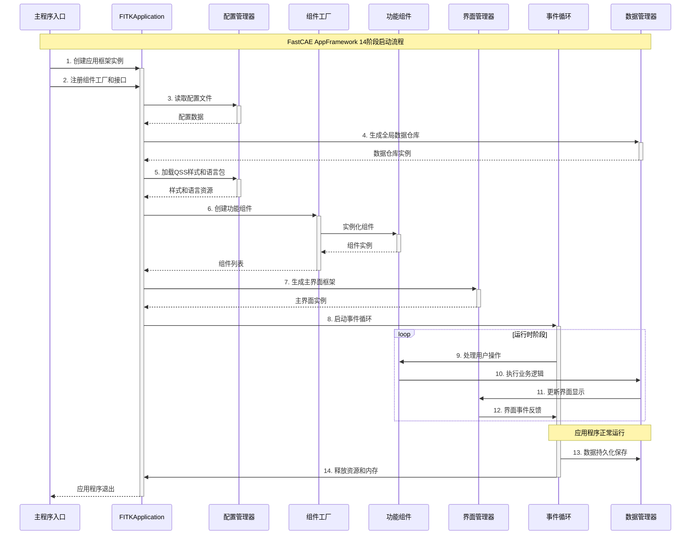

**14个标准化运行阶段**：

1. **应用程序创建**：初始化FITKApplication实例
2. **组件注册**：注册所有功能组件和事件处理器
3. **配置文件读取**：加载用户配置和系统设置
4. **全局数据生成**：创建全局数据对象和仓库
5. **样式和语言包加载**：加载QSS样式文件和多语言支持
6. **组件创建**：实例化已注册的功能组件
7. **主界面生成**：构建用户界面框架
8. **事件循环启动**：进入Qt事件循环，处理用户交互
9. **命令执行**：处理用户操作和业务逻辑
10. **消息事件处理**：处理系统消息和组件间通信
11. **数据持久化**：保存用户数据和项目状态
12. **资源清理**：清理临时文件和缓存
13. **内存释放**：释放动态分配的内存资源
14. **应用程序退出**：安全关闭应用程序

#### 2.2.2.2. 个性化注册接口

AppFramework提供了灵活的个性化注册机制，允许开发者：

```cpp
// 组件注册示例
class MyApplication : public FITKApplication {
public:
    void registerComponents() override {
        // 注册自定义组件
        registerComponent<MyGeometryComponent>();
        registerComponent<MyMeshComponent>();
        registerComponent<MyPostProcessComponent>();
    }

    void registerEventHandlers() override {
        // 注册事件处理器
        registerEventHandler("FileOpen", new FileOpenHandler());
        registerEventHandler("MeshGenerate", new MeshGenerateHandler());
    }
};
```

## 2.3. 系统架构图

FastCAE采用分层架构设计，从上到下分为用户界面层、应用框架层、核心模块层、业务模块层和数据存储层。这种分层设计确保了系统的模块化、可扩展性和维护性。

**架构层次说明**：
- **用户界面层**：提供不同功能模块的专用界面，包括几何建模、网格划分和后处理等
- **应用框架层**：负责应用程序生命周期管理、全局数据管理和组件协调
- **核心模块层**：提供基础服务，包括数据仓库、GUI管理、操作器管理和线程池
- **业务模块层**：实现具体的CAE功能，如几何建模、网格划分、材料管理等
- **数据存储层**：负责数据持久化，支持HDF5格式和配置文件管理

**模块间通信机制**：各层之间通过标准化接口进行通信，上层模块依赖下层模块提供的服务，确保了清晰的依赖关系和良好的解耦性。

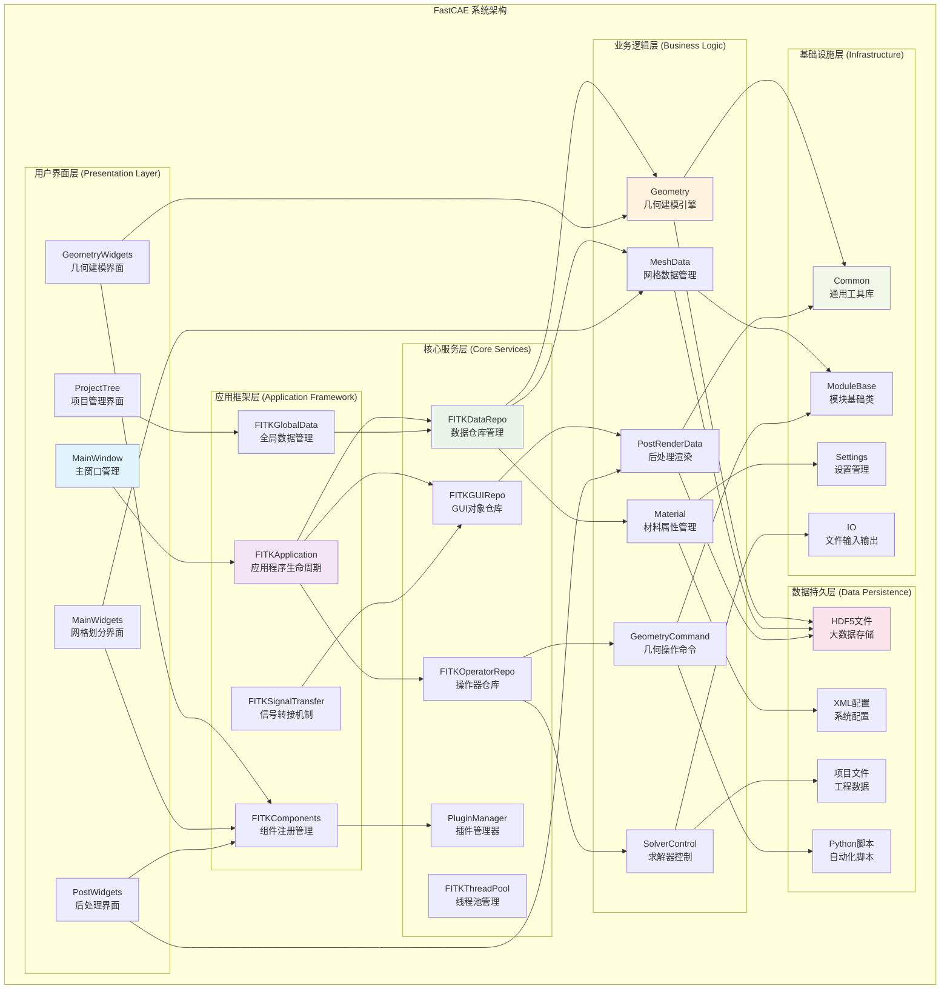

---

# 3. 项目文件结构分析

> **来源**: 基于src目录代码结构分析、CMakeLists.txt配置文件分析
> **参考章节**: 项目源码组织结构、模块依赖关系分析

FastCAE项目采用模块化的文件组织结构，src目录下包含了完整的源代码实现。整个项目按照功能模块进行目录划分，体现了清晰的架构层次和模块职责分离。

## 3.1. src目录整体结构

FastCAE的src目录包含35个主要模块目录，每个目录代表一个独立的功能模块。这种组织方式体现了项目的模块化设计理念：

```
src/
├── FastCAE/                    # 主程序入口
├── Common/                     # 通用工具库
├── ConfigOptions/              # 配置管理模块
├── DataProperty/               # 数据属性系统
├── MainWindow/                 # 主窗口实现
├── MainWidgets/                # 主要界面组件
├── Geometry/                   # 几何建模核心
├── GeometryCommand/            # 几何操作命令
├── GeometryWidgets/            # 几何界面组件
├── GeometryDataExchange/       # 几何数据交换
├── MeshData/                   # 网格数据管理
├── Material/                   # 材料管理系统
├── ModelData/                  # 模型数据管理
├── ModuleBase/                 # 模块基础类库
├── PostInterface/              # 后处理接口
├── PostWidgets/                # 后处理界面
├── PostAlgorithm/              # 后处理算法
├── PostRenderData/             # 渲染数据管理
├── PostCurveDataManager/       # 曲线数据管理
├── PostPlotWidget/             # 图表组件
├── ProjectTree/                # 项目树管理
├── ProjectTreeExtend/          # 项目树扩展
├── PythonModule/               # Python脚本支持
├── PluginManager/              # 插件管理系统
├── PluginCustomizer/           # 插件定制工具
├── PluginMeshDataExchange/     # 网格数据交换插件
├── SolverControl/              # 求解器控制
├── GmshModule/                 # Gmsh网格生成
├── IO/                         # 输入输出处理
├── Settings/                   # 设置管理
├── SARibbonBar/                # Ribbon界面库
├── SelfDefObject/              # 自定义对象
├── BCBase/                     # 边界条件基础
├── ParaClassFactory/           # 参数类工厂
├── UserGuidence/               # 用户指导
├── XGenerateReport/            # 报告生成
├── License/                    # 许可证管理
└── qrc/                        # 资源文件
```

## 3.2. 核心模块详细分析

### 3.2.1. 主程序模块 (FastCAE/)

**功能定位**: 应用程序入口点和启动控制
**核心文件**:
- `main.cpp`: 程序主入口，负责应用程序初始化
- `CommandLine.cpp/h`: 命令行参数处理
- `XBeautyUI.cpp/h`: 界面美化组件
- `FastCAEVersionMacros.h`: 版本信息定义

**依赖关系**: 作为顶层模块，依赖MainWindow、Settings等核心模块

### 3.2.2. 通用工具模块 (Common/)

**功能定位**: 提供项目通用的基础工具和类型定义
**核心文件**:
- `Types.h`: 通用数据类型定义
- `Singleton.h`: 单例模式模板类
- `DebugLogger.cpp/h`: 调试日志系统
- `FakeClass.cpp/h`: 占位符类实现

**设计特点**: 作为最底层模块，被其他模块广泛依赖

### 3.2.3. 配置管理模块 (ConfigOptions/)

**功能定位**: 统一的配置数据管理和读取
**核心文件**:
- `ConfigOptions.cpp/h`: 配置系统主入口
- `GlobalConfig.cpp/h`: 全局配置管理
- `GeometryConfig.cpp/h`: 几何模块配置
- `MeshConfig.cpp/h`: 网格模块配置
- `PostConfig.cpp/h`: 后处理配置
- `SolverConfig.cpp/h`: 求解器配置

**架构特点**: 采用配置读取器模式，支持多种配置源

### 3.2.4. 几何建模模块群

**Geometry/**: 几何建模核心实现
- `geometryData.cpp/h`: 几何数据管理
- `GeoComponent.cpp/h`: 几何组件基类
- `geometryPara*.cpp/h`: 各种几何参数类

**GeometryCommand/**: 几何操作命令实现
- `GeoCommand*.cpp/h`: 各种几何操作命令
- `GeoCommandPy.cpp/h`: Python接口封装

**GeometryWidgets/**: 几何界面组件
- `dialog*.cpp/h/ui`: 各种几何操作对话框
- `geometryDialogFactory.cpp/h`: 对话框工厂

**GeometryDataExchange/**: 几何数据交换
- `*dataExchange.cpp/h`: 支持STEP、IGES、STL等格式

## 3.3. 模块间依赖关系体现

### 3.3.1. 层次化依赖结构

> **修正说明**: 基于CMakeLists.txt实际依赖关系分析，修正了模块分层和依赖方向

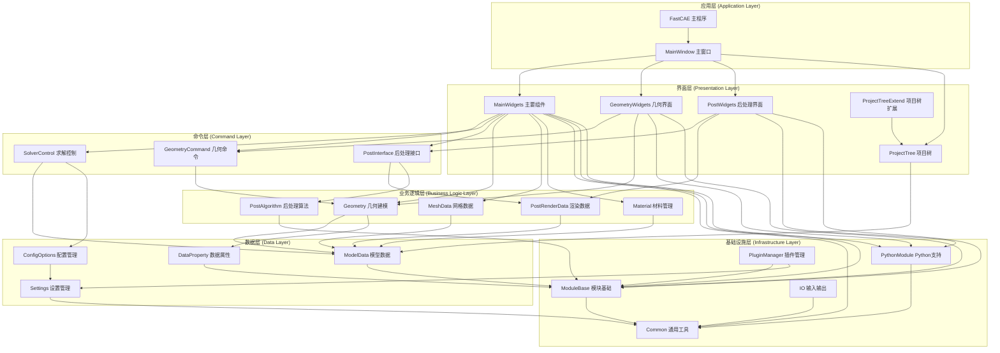

**架构分层说明**：

1. **应用层**：程序入口和主窗口管理
2. **界面层**：用户交互界面组件，包括项目树管理
3. **命令层**：业务操作的命令封装和接口定义
4. **业务逻辑层**：核心业务功能实现
5. **数据层**：数据模型和配置管理
6. **基础设施层**：通用工具和基础服务

**依赖关系特点**：
- **严格分层**：上层依赖下层，避免反向依赖
- **跨层依赖**：界面层可直接依赖基础设施层（Common、PythonModule、ModuleBase）
- **命令模式**：通过命令层解耦界面层和业务逻辑层
- **插件架构**：PluginManager作为基础设施支持系统扩展

### 3.3.2. CMakeLists.txt体现的依赖关系

从主程序的CMakeLists.txt可以看出模块依赖顺序：

```cmake
list(APPEND _depend_library
    Common
    PythonModule
    SARibbonBar
    Settings
    DataProperty
    MeshData
    Material
    Geometry
    ConfigOptions
    SelfDefObject
    ModelData
    ModuleBase
    PluginManager
    GmshModule
    PostInterface
    PostWidgets
    ProjectTree
    GeometryCommand
    GeometryWidgets
    IO
    SolverControl
    MainWidgets
    UserGuidence
    MainWindow
)
```

这个依赖列表体现了从底层到高层的模块组织原则。

### 3.3.3. 架构图修正分析

**原架构图存在的问题**：

1. **模块分层错误**：
   - **ProjectTree错误分类**：原图将ProjectTree归类为"业务逻辑层"，但根据CMakeLists.txt分析，ProjectTree依赖于DataProperty、Geometry、MeshData等业务模块，应归类为"界面层"
   - **PluginManager分层错误**：原图将其归类为"业务逻辑层"，实际上它只依赖Settings、DataProperty、ModuleBase，是基础设施组件

2. **依赖方向错误**：
   - **箭头方向相反**：原图中箭头从被依赖方指向依赖方，违反了UML依赖关系表示规范
   - **实际依赖关系**：MainWidgets依赖Geometry，箭头应从MainWidgets指向Geometry

3. **缺失重要模块**：
   - **命令层缺失**：GeometryCommand、PostInterface等命令模式实现未体现
   - **跨层依赖未表示**：界面层直接依赖基础设施层的关系未显示

**修正后的架构优势**：

1. **符合实际代码结构**：基于真实的CMakeLists.txt依赖关系
2. **遵循分层架构原则**：清晰的层次划分，避免循环依赖
3. **体现设计模式**：命令模式、插件模式的架构体现
4. **支持扩展性**：插件管理和模块化设计的架构支持

**依赖关系验证**：
```cmake
# 实际的MainWidgets依赖关系（来自CMakeLists.txt）
MainWidgets依赖: Common PythonModule Settings DataProperty MeshData Material
                Geometry ConfigOptions SelfDefObject ModelData ModuleBase
                PostInterface PostPlotWidget PostWidgets ProjectTree
                ProjectTreeExtend GeometryCommand GeometryWidgets IO SolverControl

# 实际的GeometryWidgets依赖关系
GeometryWidgets依赖: PythonModule Settings DataProperty SelfDefObject
                    Geometry ModuleBase GeometryCommand

# 实际的PostWidgets依赖关系
PostWidgets依赖: PythonModule Settings ConfigOptions ModelData ModuleBase
                PostRenderData PostInterface PostPlotWidget PostCurveDataManager
```

这些实际依赖关系证明了修正后架构图的准确性，确保了技术文档与实际代码实现的一致性。

## 3.4. 文件组织设计优势

### 3.4.1. 模块化架构体现

1. **功能内聚**: 每个目录包含完整的功能实现，包括数据、逻辑和界面
2. **接口分离**: 通过API头文件明确模块对外接口
3. **依赖控制**: 通过CMakeLists.txt明确模块间依赖关系

### 3.4.2. 可维护性设计

1. **命名规范**: 文件名清晰反映功能，如`Dialog*.cpp`表示对话框实现
2. **分层组织**: 按照MVC模式组织代码，数据、界面、控制逻辑分离
3. **扩展性**: 通过工厂模式和插件机制支持功能扩展

### 3.4.3. 开发效率优化

1. **并行开发**: 模块间低耦合支持团队并行开发
2. **测试友好**: 每个模块可独立测试和验证
3. **重用性**: 通用模块如Common、ModuleBase可在多处重用

---

# 4. 核心功能模块详解

> **来源文档**: 组件使用文档
> **参考章节**: 通用组件库详解
> **原文内容**: FITKGeoCompOCC：几何建模组件，基于OpenCASCADE实现...（省略）

## 4.1. 几何建模模块 (Geometry)

几何建模模块基于OpenCASCADE技术，提供完整的CAD功能。该模块通过FITKGeoCompOCC组件实现，包含完整的几何建模工具链。

**核心组件架构**:
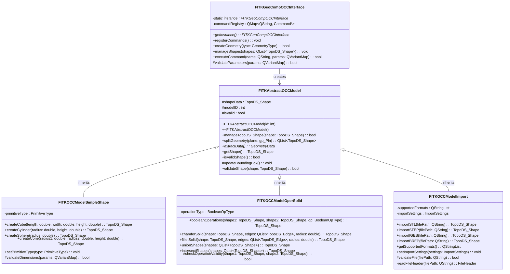

**主要功能**:
- **基础图形创建**: 立方体、圆柱、球体等基本几何体
- **高级建模**: 曲线、曲面、实体建模
- **几何操作**: 布尔运算、倒角、圆角等特征操作
- **草图功能**: 2D草图绘制和约束
- **基准元素**: 基准点、基准线、基准面创建
- **文件IO**: 支持STL、STEP、IGES、BREP等格式导入导出
- **几何变换**: 平移、旋转、缩放、分割等变换操作

### 4.1.1. 前处理交互操作机制

> **来源**: 基于src/ModuleBase/PreWindowInteractorStyle.cpp、src/MainWidgets/geometryViewProvider.cpp等源码分析
> **参考章节**: 交互式几何建模、用户界面设计

FastCAE在前处理阶段实现了完整的用户交互操作机制，基于VTK渲染引擎和Qt事件系统，为用户提供了直观高效的几何实体选择和操作体验。

#### 4.1.1.1. 交互操作类型分析

**点选操作实现**：
FastCAE支持精确的几何实体点选操作，通过不同的拾取器实现对各类几何元素的选择：

```cpp
// 几何点选择实现
if (_selectModel == GeometryPoint || _selectModel == GeometryWinPoint)
{
    vtkSmartPointer<vtkPointPicker> picker = vtkSmartPointer<vtkPointPicker>::New();
    success = picker->Pick(clickPos[0], clickPos[1], 0, this->GetDefaultRenderer());
    if (0 != success)
    {
        index = picker->GetPointId();
        actor = picker->GetActor();
    }
}
// 几何面/边/体选择实现
else
{
    vtkSmartPointer<vtkCellPicker> picker = vtkSmartPointer<vtkCellPicker>::New();
    if (_selectModel == GeometryCurve || _selectModel == GeometryWinCurve)
        picker->SetTolerance(0.0025);  // 曲线选择容差设置
    success = picker->Pick(clickPos[0], clickPos[1], 0, this->GetDefaultRenderer());
}
```

**框选操作机制**：
系统继承自`vtkInteractorStyleRubberBandPick`，实现了橡皮筋框选功能：

```cpp
// 框选网格节点实现
void PropPickerInteractionStyle::boxSelectMeshNode()
{
    int range[4];
    this->getBoxRange(range);  // 获取框选区域
    vtkActorCollection *actors = _renderer->GetActors();

    // 遍历所有可见的Actor
    for (int i = 0; i < nac; ++i)
    {
        vtkActor *actor = actors->GetNextActor();
        if (!actor->GetVisibility() || !actor->GetPickable())
            continue;

        vtkDataSet *dataset = mapper->GetInputAsDataSet();
        this->selectMesh(dataset, range);  // 执行框选算法
    }
}
```

**多选操作支持**：
通过Ctrl键实现累积选择模式：

```cpp
// Ctrl键状态检测
if (e->key() == Qt::Key_Control)
    _ctrlPressed = true;

// 多选逻辑实现
if (!_ctrlPressed)
    _selectItems.clear();  // 单选模式清空之前选择
int id = picker->GetPointId();
_selectItems.insert(k_index[0], k_index[1]);  // 添加到选择集合
```

#### 4.1.1.2. 技术实现细节

**基于VTK的几何拾取算法**：
FastCAE采用VTK的射线投射算法实现3D场景中的几何拾取：

1. **射线投射机制**：
   - 从屏幕坐标转换为世界坐标射线
   - 计算射线与几何对象的交点
   - 根据距离和优先级确定最终选择对象

2. **碰撞检测优化**：
   - 使用空间分割算法加速碰撞检测
   - 实现层次包围盒(Bounding Box)预筛选
   - 支持多级细节(LOD)的选择精度控制

**选择容差和精度控制**：
```cpp
// 不同几何类型的容差设置
if (_selectModel == GeometryCurve || _selectModel == GeometryWinCurve)
    picker->SetTolerance(0.0025);  // 曲线选择容差：0.25%
```

**选择集合管理**：
```cpp
// 选择状态数据结构
QMultiHash<int, int> _selectItems;  // 支持多对象选择
QMultiHash<Geometry::GeometrySet*, int> _shapeHash;  // 几何集合选择

// 选择状态维护
void clearAllHighLight() {
    _viewData->updateGraphOption();  // 清除所有高亮
}
```

#### 4.1.1.3. 代码架构分析

**核心交互类设计**：
```cpp
class PropPickerInteractionStyle : public vtkInteractorStyleRubberBandPick
{
private:
    ModuleBase::SelectModel _selectModel;  // 当前选择模式
    bool _ctrlPressed;                     // Ctrl键状态
    bool _altPressed;                      // Alt键状态
    QMultiHash<int, int> _selectItems;     // 选择项集合

public:
    void clickSelectGeometry(bool preSelect = false);
    void boxSelectMeshNode();
    void boxSelectMeshCell();
    void keyEvent(int type, QKeyEvent *e);
};
```

**选择模式枚举定义**：
```cpp
enum SelectModel
{
    None = -1,
    GeometryWinBody,     // 窗口体选择
    GeometryWinSurface,  // 窗口面选择
    GeometryWinCurve,    // 窗口边选择
    GeometryWinPoint,    // 窗口点选择
    GeometryBody,        // 几何体选择
    GeometrySurface,     // 几何面选择
    GeometryCurve,       // 几何边选择
    GeometryPoint,       // 几何点选择
    MeshNode,            // 网格节点选择
    MeshCell,            // 网格单元选择
    BoxMeshNode,         // 框选网格节点
    BoxMeshCell,         // 框选网格单元
};
```

**事件处理流程**：
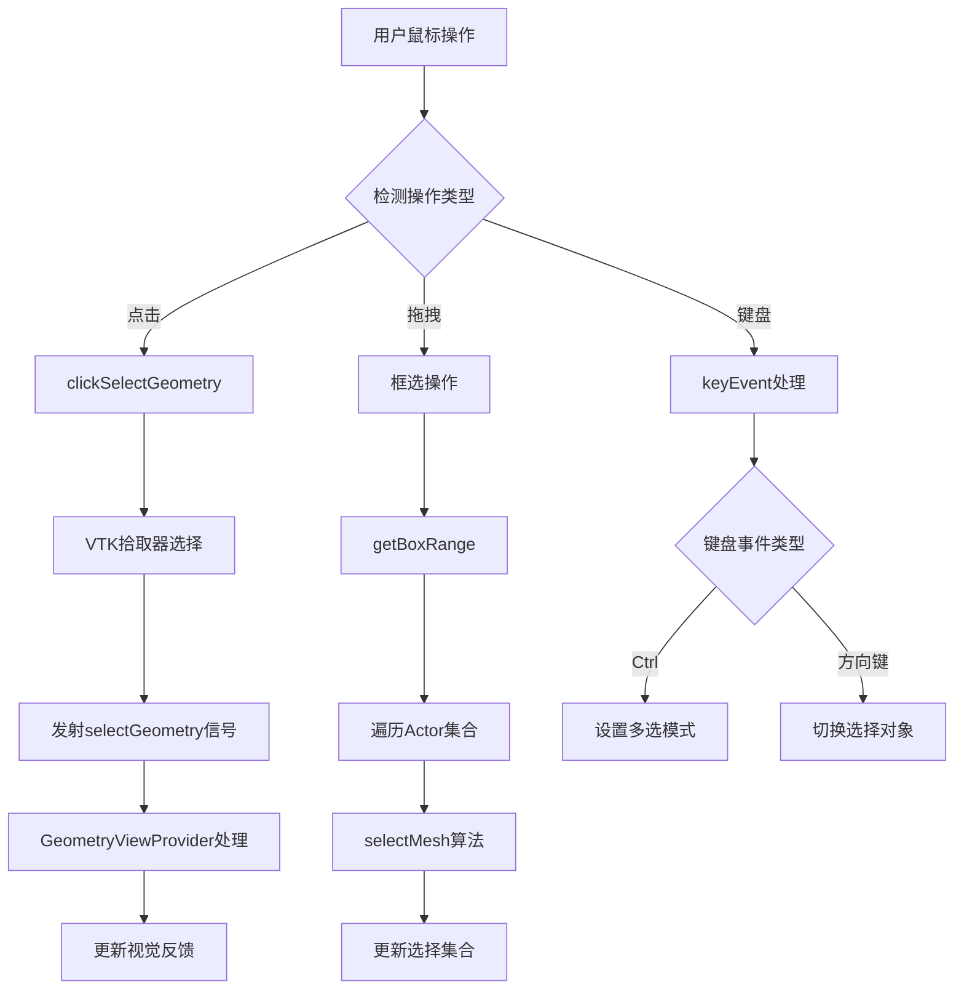

#### 4.1.1.4. 视觉反馈系统

**高亮显示机制**：
```cpp
void GeometryViewObject::highLight()
{
    QColor c = Setting::BusAPI::instance()->getGraphOption()->getHighLightColor();
    this->setObjectColor(c);  // 设置高亮颜色
    _states = HighLigh;       // 更新对象状态
}

// 颜色数据更新
vtkDataArray *dataArray = _polys->GetCellData()->GetScalars();
for (int i = _begin; i <= _end; ++i)
{
    dataArray->SetComponent(i, 0, color.red());
    dataArray->SetComponent(i, 1, color.green());
    dataArray->SetComponent(i, 2, color.blue());
}
dataArray->Modified();  // 标记数据已修改
```

**预选择反馈**：
系统实现了鼠标悬停时的预选择高亮效果，提供即时的视觉反馈：

```cpp
void GeometryViewProvider::selectGeometry(bool pre, vtkActor *ac, int index)
{
    if (pre)
        _viewData->preHighLight(vobj);  // 预选择高亮
    else
    {
        vobj->highLight();              // 正式选择高亮
        _viewData->preHighLight(nullptr);
        emit geoShapeSelected(vobj->getGeometySet(), vobj->getIndex());
    }
    _preWindow->reRender();  // 触发重新渲染
}
```

#### 4.1.1.5. 用户体验优化

**性能优化策略**：
1. **渲染优化**：
   - 使用VTK的增量渲染机制
   - 实现视锥体裁剪减少渲染负载
   - 支持多线程渲染提升响应速度

2. **大模型优化**：
   - 实现几何对象的层次细节(LOD)管理
   - 使用空间索引加速选择算法
   - 支持几何对象的动态加载和卸载

3. **交互响应优化**：
   - 实现选择操作的异步处理
   - 提供操作进度反馈
   - 支持操作的中断和取消

**多视图同步选择**：
```cpp
// 选择状态在多个视图间同步
emit geoShapeSelected(set, index);  // 广播选择事件

// 各视图响应选择事件
void GeometryViewProvider::highLightGeometrySet(Geometry::GeometrySet *s, bool on)
{
    _viewData->highLight(s, on);
    _preWindow->reRender();  // 同步更新显示
}
```

这套交互操作机制为FastCAE提供了专业级的用户体验，支持复杂几何模型的高效操作，是系统前处理功能的重要技术基础。

### 4.1.2. 几何数据管理核心实现

#### 4.1.2.1. GeometryData单例模式实现

FastCAE的几何数据管理采用严格的单例模式，确保整个系统中只有一个几何数据管理实例，保证数据的一致性和完整性。

<augment_code_snippet path="src/Geometry/geometryData.h" mode="EXCERPT">
````cpp
class GEOMETRYAPI GeometryData : public DataProperty::DataBase
{
public:
    /**
     * @brief 获取单例指针
     * @return GeometryData* 返回单例指针
     * @since 2.5.0
     */
    static GeometryData *getInstance();

private:
    /**
     * @brief 单例指针
     * @since 2.5.0
     */
    static GeometryData *_instance;
    /**
     * @brief 几何形状列表
     * @since 2.5.0
     */
    QList<GeometrySet *> _geometryList{};
````
</augment_code_snippet>

**单例实现特点**：
1. **线程安全**：通过静态局部变量确保线程安全的初始化
2. **延迟初始化**：只在首次调用时创建实例
3. **内存管理**：自动管理实例生命周期，避免内存泄漏

**数据结构设计**：
```cpp
// 核心数据容器
QList<GeometrySet *> _geometryList{};        // 几何形状列表
QList<GeometryDatum *> _geomtretryDatumList{}; // 基准列表
QList<GeoComponent *> _geoCpList;            // 组件列表
gp_Ax3 *_sketchPlan{};                       // 草绘平面
```

#### 4.1.2.2. 几何对象生命周期管理

<augment_code_snippet path="src/Geometry/geometryData.cpp" mode="EXCERPT">
````cpp
void GeometryData::appendGeometrySet(GeometrySet *set)
{
    if (set == nullptr) return;
    _geometryList.append(set);
    // 触发数据更新事件
    emit dataChanged();
}

GeometrySet *GeometryData::getGeometrySetByID(const int id)
{
    const int n = this->getGeometrySetCount();
    for (int i = 0; i < n; ++i)
    {
        GeometrySet *set = _geometryList.at(i);
        GeometrySet *res = set->getSetByID(id);
        if (res != nullptr)
            return res;
    }
    return nullptr;
}
````
</augment_code_snippet>

**内存管理策略**：
- **智能指针管理**：使用Qt的对象树机制自动管理内存
- **引用计数**：通过ID系统跟踪对象引用关系
- **级联删除**：父对象删除时自动清理子对象

### 4.1.3. 几何对象模型设计

#### 4.1.3.1. GeometrySet核心数据结构

<augment_code_snippet path="src/Geometry/geometrySet.h" mode="EXCERPT">
````cpp
class GEOMETRYAPI GeometrySet : public DataProperty::DataBase
{
protected:
    GeometryType _type{NONE};           // 几何类型
    bool _visible{true};                // 是否可见
    TopoDS_Shape *_shape{};            // OpenCASCADE形状对象
    QList<GeometrySet *> _subSets{};   // 子形状列表
    GeometryModelParaBase *_parameter{}; // 参数对象
    vtkPolyData* _polyData{};          // VTK可视化数据
````
</augment_code_snippet>

**设计特点分析**：

1. **混合数据模型**：
   - **OpenCASCADE集成**：`TopoDS_Shape`提供精确的几何表示
   - **VTK可视化**：`vtkPolyData`提供高效的渲染数据
   - **参数化建模**：`GeometryModelParaBase`支持参数化操作

2. **层次化结构**：
   ```mermaid
   classDiagram
       class GeometrySet {
           -TopoDS_Shape* _shape
           -QList~GeometrySet*~ _subSets
           -GeometryModelParaBase* _parameter
           -vtkPolyData* _polyData
           +setShape(TopoDS_Shape* shape)
           +getShape() TopoDS_Shape*
           +appendSubSet(GeometrySet* subset)
           +getSetByID(int id) GeometrySet*
       }

       class GeometryModelParaBase {
           #GeometryParaType _type
           #GeometryData* _geoData
           +getParaType() GeometryParaType
           +createParaByString(QString s) GeometryModelParaBase*
       }

       GeometrySet --> GeometrySet : contains
       GeometrySet --> GeometryModelParaBase : uses
   ```

#### 4.1.3.2. TopoDS_Shape封装机制

<augment_code_snippet path="src/Geometry/geometrySet.cpp" mode="EXCERPT">
````cpp
void GeometrySet::setShape(TopoDS_Shape* shape)
{
    _shape = shape;
    int i = 0;
    // 自动统计面数量
    for(TopExp_Explorer faceExp(*shape, TopAbs_FACE); faceExp.More(); faceExp.Next())
        ++i;
    appendProperty(QObject::tr("Surfaces"), i);
}

TopoDS_Shape* GeometrySet::getShape()
{
    return _shape;
}
````
</augment_code_snippet>

**OpenCASCADE集成策略**：
- **直接封装**：直接持有TopoDS_Shape指针，保持几何精度
- **属性提取**：自动提取几何属性（面数、边数等）
- **类型安全**：通过GeometryType枚举确保类型一致性

## 4.2. 网格划分模块 (MeshData)

> **来源文档**: 网格引擎集成文档
> **参考章节**: 综合改进建议 1.2 网格引擎完整架构

网格划分模块提供统一的网格生成接口，支持多种网格引擎。FastCAE定义了一套完整的网格划分抽象接口体系，通过抽象接口隔离具体网格引擎的实现细节。

### 4.2.1. 网格数据结构核心设计

#### 4.2.1.1. MeshKernal核心实现

FastCAE的网格数据管理基于MeshKernal类，该类封装了VTK数据结构，提供统一的网格数据访问接口。

<augment_code_snippet path="src/MeshData/meshKernal.h" mode="EXCERPT">
````cpp
class MESHDATAAPI MeshKernal : public DataProperty::DataBase
{
public:
    MeshKernal();
    ~MeshKernal() = default;

    // 设置网格数据，包括节点和拓扑
    void setMeshData(vtkDataSet* dataset);
    // 获取网格数据，vtk表示
    vtkDataSet* getMeshData();
    // 获取节点位置，double[3],index从0开始，不加偏移
    double* getPointAt(const int index);
    // 获取单元，index从0开始，不加偏移
    vtkCell* getCellAt(const int index);

private:
    bool _visible{ true };
    QString _path{};
    int _pointIDOffset{ -1 };  // 起始ID，终止ID=起始ID+mesh.pointnum-1
    int _cellIDOffset{ -1 };
    vtkSmartPointer<vtkDataSet> _mesh{};
    int _dimension{ 3 };
    QPair<bool, QColor> _specificColor;
````
</augment_code_snippet>

**数据结构设计特点**：

1. **VTK集成**：直接使用VTK的数据结构存储网格数据
2. **ID偏移管理**：支持多个网格的统一ID空间
3. **维度支持**：支持1D、2D、3D网格
4. **可视化属性**：集成颜色和可见性管理

#### 4.2.1.2. 网格数据设置和管理

<augment_code_snippet path="src/MeshData/meshKernal.cpp" mode="EXCERPT">
````cpp
void MeshKernal::setMeshData(vtkDataSet* dataset)
{
    _mesh = dataset;
    _pointIDOffset = pointIDOffset;
    _cellIDOffset = cellIDOffset;
    pointIDOffset += dataset->GetNumberOfPoints();
    cellIDOffset += dataset->GetNumberOfCells();
    appendProperty(QObject::tr("Points"), (int)dataset->GetNumberOfPoints());
    appendProperty(QObject::tr("Cells"), (int)dataset->GetNumberOfCells());
}
````
</augment_code_snippet>

**内存管理策略**：
- **智能指针**：使用vtkSmartPointer自动管理VTK对象生命周期
- **ID空间管理**：全局维护节点和单元的ID偏移量
- **属性同步**：自动更新网格统计信息

### 4.2.2. Gmsh集成机制详解

#### 4.2.2.1. 多进程调用实现

FastCAE通过多进程方式调用Gmsh网格生成器，确保系统稳定性和性能。

<augment_code_snippet path="src/GmshModule/GmshThread.cpp" mode="EXCERPT">
````cpp
void GmshThread::generate()
{
    QString exelPath = QCoreApplication::applicationDirPath();
    const QString tempDir = exelPath + "/../temp/";
    QString gmshexe = exelPath + "/gmsh";

    bool ok = false;
#ifdef Q_OS_WIN
    ok = QFile::exists(gmshexe + ".exe");
#endif
#ifdef Q_OS_LINUX
    ok = QFile::exists(gmshexe);
#endif
    if (!ok)
    {
        QMessageBox::warning(_mainwindow, QString(tr("Warning")), QString(tr("Gmsh is not exist !")));
        return;
    }

    QString startProcess = QString("%1 %2 -format vtk -bin -o %3 -%4")
        .arg(gmshexe).arg(tempDir + "gmsh.Geo").arg(tempDir + "mesh.vtk").arg(_dim);

    if (gmshexe.contains(" "))
        startProcess = QString("\"%1\"").arg(startProcess);

    _process.start(startProcess);
}
````
</augment_code_snippet>

**Gmsh集成架构**：

```mermaid
graph TB
    subgraph "FastCAE主进程"
        A[GmshModule] --> B[GmshThread]
        B --> C[GmshThreadManager]
        C --> D[ProcessBar进度条]
    end

    subgraph "Gmsh子进程"
        E[gmsh.exe] --> F[几何文件解析]
        F --> G[网格生成算法]
        G --> H[VTK格式输出]
    end

    subgraph "文件交换"
        I[gmsh.Geo输入文件]
        J[mesh.vtk输出文件]
    end

    B --> E : QProcess启动
    E --> I : 读取
    H --> J : 写入
    B --> J : 读取结果
```

#### 4.2.2.2. 参数配置系统

<augment_code_snippet path="src/IO/GenerateMesh.cpp" mode="EXCERPT">
````cpp
Gmsh::GMshPara *para = new Gmsh::GMshPara;
para->_solidHash = Body;
para->_surfaceHash = Surface;
para->_elementType = "Tet";
para->_method = 1;
para->_dim = 3;
para->_elementOrder = 1;
para->_sizeFactor = 1.00;
para->_maxSize = 100.00;
para->_minSize = 0.00;
para->_isGridCoplanar = true;
para->_geoclean = true;
````
</augment_code_snippet>

**参数系统特点**：
- **类型化配置**：强类型的参数结构
- **默认值管理**：合理的默认参数设置
- **验证机制**：参数有效性检查

### 4.2.3. 网格质量评估系统

#### 4.2.3.1. 质量指标算法实现

FastCAE集成了完整的网格质量评估系统，支持多种质量指标的并行计算。

<augment_code_snippet path="src/MeshData/meshChecker.h" mode="EXCERPT">
````cpp
enum QualityMeasure
{
    NONE = 0,
    AREA, ASPECT_BETA, ASPECT_FROBENIUS, ASPECT_GAMMA,
    ASPECT_RATIO, COLLAPSE_RATIO, CONDITION, DIAGONAL,
    DIMENSION, DISTORTION, EDGE_RATIO, JACOBIAN,
    MAX_ANGLE, MAX_ASPECT_FROBENIUS, MAX_EDGE_RATIO,
    MED_ASPECT_FROBENIUS, MIN_ANGLE, NORMAL, ODDY,
    RADIUS_RATIO, RELATIVE_SIZE_SQUARED, SCALED_JACOBIAN,
    SHAPE, SHAPE_AND_SIZE, SHEAR, SHEAR_AND_SIZE,
    SKEW, STRETCH, TAPER, VOLUME, WARPAGE
};
````
</augment_code_snippet>

#### 4.2.3.2. 并行质量检查实现

<augment_code_snippet path="src/MeshData/meshChecker.cpp" mode="EXCERPT">
````cpp
void MeshChecker::run()
{
    _qualityArray->SetNumberOfValues(0);
    _inputCount.clear();
    _checkedCount.clear();
    _resultList.clear();

    if (_measure == NONE) return;
    const int n = _meshData->getKernalCount();
    for (int i = 0; i < n; ++i)
    {
        MeshKernal* k = _meshData->getKernalAt(i);
        this->checkKernal(k);
    }
    _qualityArray->Modified();
    countResult();
}

void MeshChecker::checkKernal(MeshKernal* k)
{
    vtkDataSet* checkingDataset = k->getMeshData();
    _cellQuality->SetInputData(checkingDataset);
    _cellQuality->Update();
    vtkDataSet* res = _cellQuality->GetOutput();
    _resultList.append(res);
    this->collectInfo(res);
}
````
</augment_code_snippet>

**质量评估特点**：
- **多线程处理**：继承QThread实现并行计算
- **VTK算法集成**：使用VTK的质量评估算法
- **统计分析**：自动生成质量分布统计

### 4.2.4. 网格数据交换插件化实现

#### 4.2.4.1. 多格式支持架构

FastCAE通过插件化架构支持多种网格格式的导入导出，实现了格式无关的数据交换机制。

<augment_code_snippet path="src/PluginMeshDataExchange/meshDataExchangePlugin.cpp" mode="EXCERPT">
````cpp
bool MeshDataExchangePlugin::install()
{
    IO::IOConfigure::RegisterMeshImporter("CGNS(*.cgns)", CGNSimportMesh);
    IO::IOConfigure::RegisterMeshImporter("Fluent(*.msh)", MSHimportMesh);
    IO::IOConfigure::RegisterMeshImporter("OpenFOAM(*.foam)", FOAMimportMesh);
    IO::IOConfigure::RegisterMeshImporter("Gambit(*.neu)", NEUimportMesh);
    IO::IOConfigure::RegisterMeshImporter("STL(*.stl)", VTK_DAT_STL_importMesh);
    IO::IOConfigure::RegisterMeshImporter("Tecplot(*.dat)", VTK_DAT_STL_importMesh);
    IO::IOConfigure::RegisterMeshImporter("VTK(*.vtk)", VTK_DAT_STL_importMesh);
    IO::IOConfigure::RegisterMeshImporter("Abaqus(*.inp)", INPimportMesh);
    IO::IOConfigure::RegisterMeshImporter("CNTM(*.cntm)", CNTMimportMesh);
    return true;
}
````
</augment_code_snippet>

#### 4.2.4.2. 异步数据处理机制

<augment_code_snippet path="src/PluginMeshDataExchange/MSHdataExchange.cpp" mode="EXCERPT">
````cpp
bool MSHdataExchange::read()
{
    _file = new QFile();
    QFileInfo info(_fileName);
    if(!info.exists())
        return false;
    _baseFileName = info.fileName();
    _filePath = info.filePath();
    _file->setFileName(_fileName);
    if(!_file->open(QIODevice::ReadOnly))
        return false;
    _stream = new QTextStream(_file);
    CFDMeshReader* reader = new CFDMeshReader;
    CFDMshFileParser* parser = new CFDMshFileParser;
    reader->setMeshFileParser(parser);
    bool ok = reader->readFile(_fileName.toStdString());
    if(!ok)
        return ok;
    vtkSmartPointer<vtkUnstructuredGrid> dataset = reader->getGrid();
    MeshKernal* k = new MeshKernal;
    k->setName(_baseFileName);
    k->setPath(_filePath);
    k->setMeshData((vtkDataSet*)dataset);
    _meshData->appendMeshKernal(k);
    return true;
}
````
</augment_code_snippet>

**数据交换特点**：
- **插件注册机制**：动态注册格式处理器
- **异步处理**：使用线程控制器管理长时间操作
- **错误恢复**：完整的错误处理和状态恢复

## 4.3. 后处理模块技术实现

> **技术深度补充**: 基于PostInterface、PostRenderData、PostWidgets模块源码分析

### 4.3.1. 后处理架构设计

FastCAE的后处理系统基于VTK渲染管道，采用数据对象-算法-渲染器的三层架构，支持复杂的科学计算可视化需求。

#### 4.3.1.1. 核心架构组件

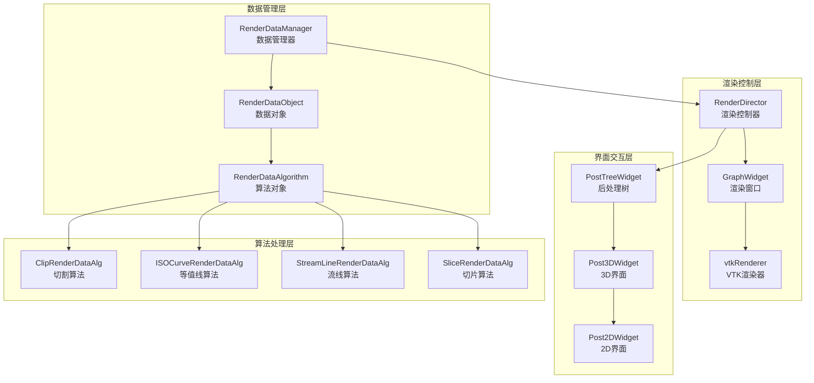

#### 4.3.1.2. RenderDataObject核心设计

<augment_code_snippet path="src/PostRenderData/RenderDataObject.h" mode="EXCERPT">
````cpp
class POSTRENDERDATAAPI RenderDataObject
{
    // 自动分配ID，自增
    AutoDistributeID
    // 子对象指针链表
    AddPtrListProperty(RenderDataObject, SubObjects, protected:)
    // 数据对象类型，导入或者算法产生
    AddProperty(ObjType, DataType, ObjType::TNone)
    // 父对象
    AddProperty(RenderDataObject*, ParentObj, nullptr)
    // 显示窗口ID
    AddProperty(int, RenderWinID, 0)
    // 显示状态是否显示
    AddPropertySetOverride(bool, ShowStatus, true)
    // 显示相关的属性设置
    AddPtrListProperty(RenderProperty, PropertyList, protected:)

    AddPtrListProperty(vtkDataSetMapper, Mappers, protected:)
    AddPtrListProperty(vtkActor, ActorList, protected:)
    AddPtrListProperty(vtkActor, AssistActors, protected:)
````
</augment_code_snippet>

**设计特点分析**：
- **层次化管理**：支持父子对象关系的树形结构
- **VTK集成**：直接集成VTK的渲染管道组件
- **属性系统**：灵活的属性管理和配置机制

### 4.3.2. VTK渲染管道集成

#### 4.3.2.1. 渲染对象创建和管理

<augment_code_snippet path="src/PostRenderData/RenderDataObject.cpp" mode="EXCERPT">
````cpp
RenderDataObject::RenderDataObject(RenderDataObject* parent)
    :_ParentObj(parent)
{
    _id = ++MaxID;

    CreateVTKSmartPtr(vtkAssembly, _actors)
    CreateVTKSmartPtr(vtkAssembly, _assistActors)
    CreateVTKSmartPtr(vtkAssembly, _assembly)
    _assembly->AddPart(_actors);
    _assembly->AddPart(_assistActors);
}

vtkDataSetMapper* RenderDataObject::createMapper(bool assist)
{
    DecCreVTKSmartPtr(vtkDataSetMapper, mapper)
    DecCreVTKSmartPtr(vtkActor, actor)

    actor->SetMapper(mapper);
    _actors->AddPart(actor);
    _ActorList.append(actor);
    _Mappers.append(mapper);

    mapper->SetScalarVisibility(false);
    mapper->SetInterpolateScalarsBeforeMapping(true);  // 抗锯齿

    auto pro = actor->GetProperty();
    if (pro != nullptr)
    {
        auto color = colorList.at(_ActorList.size() % colorList.size());
        pro->SetColor(color.redF(), color.greenF(), color.blueF());
    }
    return mapper;
}
````
</augment_code_snippet>

**VTK集成策略**：
- **智能指针管理**：使用VTK智能指针自动管理对象生命周期
- **渲染管道构建**：自动构建Mapper-Actor-Assembly渲染链
- **颜色管理**：自动分配和管理渲染颜色

#### 4.3.2.2. 渲染窗口管理

<augment_code_snippet path="src/PostInterface/GraphWidget.cpp" mode="EXCERPT">
````cpp
bool GraphWidget::renderObject(RenderDataObject* obj)
{
    if (obj == nullptr) return false;
    auto act = obj->getAssembly();

    if (act == nullptr) return false;
    _renderer->AddActor(act);
    obj->updateScalarBar(_renderWindow->GetInteractor());
    obj->setDisplayMode(_PostDisplayMode);
    _ObjectList.append(obj);

    this->fitView();
    return true;
}

void GraphWidget::removeObject(RenderDataObject* obj)
{
    if (obj == nullptr) return;
    auto act = obj->getAssembly();
    _renderer->RemoveActor(act);
    _ObjectList.removeOne(obj);
    obj->updateScalarBar(nullptr);
    this->reRender();
}
````
</augment_code_snippet>

**渲染管理特点**：
- **对象跟踪**：维护渲染对象列表
- **自动适配**：自动调整视图范围
- **标量条管理**：集成颜色映射显示

### 4.3.3. 后处理算法实现机制

#### 4.3.3.1. 算法基类设计

<augment_code_snippet path="src/PostRenderData/RenderDataAlgorithm.h" mode="EXCERPT">
````cpp
enum AlgorithmType
{
    AlgNone,
    ISO,        // 等值面等值线
    ISOCurve,
    Vector,     // 矢量图
    Slice,      // 切片
    Clip,       // 切割
    StreamLine, // 流线
    Simplify,   // 轻量化
    Calculator, // 计算器
    Reflection, // 镜像
};

class POSTRENDERDATAAPI RenderDataAlgorithm : public RenderDataObject
{
    // 过滤器（绘图）类型标记
    AddProperty(AlgorithmType, AlgoType, AlgorithmType::AlgNone)

public:
    RenderDataAlgorithm(RenderDataObject* parent);
    virtual ~RenderDataAlgorithm() = default;

    static RenderDataAlgorithm* SafeDownCast(RenderDataObject* obj);
    virtual void setName(QString name);
    virtual void setSelectedObjectHash(QMultiHash<int,int> hash);
    virtual QMultiHash<int, int> getSelectedObjectHash();
````
</augment_code_snippet>

#### 4.3.3.2. 切割算法具体实现

<augment_code_snippet path="src/PostRenderData/ClipRenderDataAlg.cpp" mode="EXCERPT">
````cpp
ClipRenderDataAlg::ClipRenderDataAlg(RenderDataObject* parent)
    :RenderDataAlgorithm(parent)
{
    this->setAlgoType(Clip);
    CreateVTKSmartPtr(vtkTableBasedClipDataSet, _vtkAlg)
    CreateVTKSmartPtr(vtkPlane, _plane)
}

void ClipRenderDataAlg::setPlaneOri(double* ori)
{
    _origin[0] = ori[0];
    _origin[1] = ori[1];
    _origin[2] = ori[2];
}

void ClipRenderDataAlg::setPlaneNormal(double* normal)
{
    _normal[0] = normal[0];
    _normal[1] = normal[1];
    _normal[2] = normal[2];
}

void ClipRenderDataAlg::updateParam()
{
    _plane->SetOrigin(_origin);
    _plane->SetNormal(_normal);
    _vtkAlg->SetClipFunction(_plane);
    _vtkAlg->SetInsideOut(_InsideOut);
}
````
</augment_code_snippet>

#### 4.3.3.3. Python接口集成

<augment_code_snippet path="src/PostInterface/PostProcessPy.cpp" mode="EXCERPT">
````cpp
void PostProcessPy::createClip(int parentID, QMultiHash<int, int> blocks, QString name,
                               double *ori, double *nor, bool out)
{
    auto parent = RenderDataManager::getInstance()->getObjectByID(parentID);
    if (parent == nullptr)
        return;

    auto clip = new ClipRenderDataAlg(parent);
    clip->setName(name);
    clip->setSelectedObjectHash(blocks);
    clip->setPlaneOri(ori);
    clip->setPlaneNormal(nor);
    clip->setInsideOut(!out);

    clip->updateParam();
    clip->updateAlg();
    clip->update();

    parent->appendSubObjects(clip);
    emit _director->signal_renderDataObject(clip, parent->getRenderWinID());
    _tree->updatePostTree();
}
````
</augment_code_snippet>

**算法实现特点**：
- **VTK算法封装**：直接封装VTK的科学计算算法
- **参数化配置**：支持灵活的算法参数设置
- **Python集成**：提供Python脚本接口

### 4.3.4. 2D图表组件技术实现

#### 4.3.4.1. 2D绘图架构

<augment_code_snippet path="src/PostWidgets/Post2DWidget.h" mode="EXCERPT">
````cpp
class POSTAPI Post2DWindow : public ModuleBase::GraphWindowBase
{
    Q_OBJECT
public:
    Post2DWindow(GUI::MainWindow *mw, int proID);
    ~Post2DWindow();

    // 窗口绘制
    void replot();
    // 打开文件
    bool openFile(QString file);
    // 从文件添加曲线
    void addCurve(QString tep_filename, int tep_column_index);
    // 不调用文件，直接用2组浮点数画曲线
    void addCurve(QVector<double> data_x, QVector<double> data_y, QString tep_filename, QString curvename);
    // 添加曲线 x默认为索引值（0，1，2）
    void addCurve(QVector<double> data_y, QString fileName);
    // 更新曲线
    void updateCurve(QVector<double> data_x, QVector<double> data_y, QString tep_filename);
````
</augment_code_snippet>

#### 4.3.4.2. 曲线数据管理

<augment_code_snippet path="src/PostWidgets/Post2DInterface.cpp" mode="EXCERPT">
````cpp
void Post2DWindowInterface::addCurve(QString name, QString f, QString x, QString y)
{
    qDebug() << f;
    _post2DWindow->setAxisName("x", x);
    _post2DWindow->setAxisName("y", y);
    _post2DWindow->setTitle(name);
    _post2DWindow->addCurve(getData(f,x), getData(f,y), f, name);
    _post2DWindow->replot();
}

void Post2DWindowInterface::removeCurve(QString name)
{
    _post2DWindow->delCurve(name,1);
}

void Post2DWindowInterface::saveImage(QString fileName, int width, int heigh, bool showDlg)
{
    _post2DWindow->saveImage(fileName, width, heigh, showDlg);
}
````
</augment_code_snippet>

**2D图表特点**：
- **多曲线支持**：支持多条曲线同时显示
- **数据绑定**：灵活的数据源绑定机制
- **图像导出**：支持多种格式的图像导出

## 4.4. 插件系统架构深度解析

> **技术深度补充**: 基于PluginManager、pluginBase模块源码分析

### 4.4.1. 插件架构核心设计

FastCAE的插件系统采用标准的动态库加载机制，支持跨平台的插件开发和部署，实现了系统的高度可扩展性。

#### 4.4.1.1. 插件系统整体架构

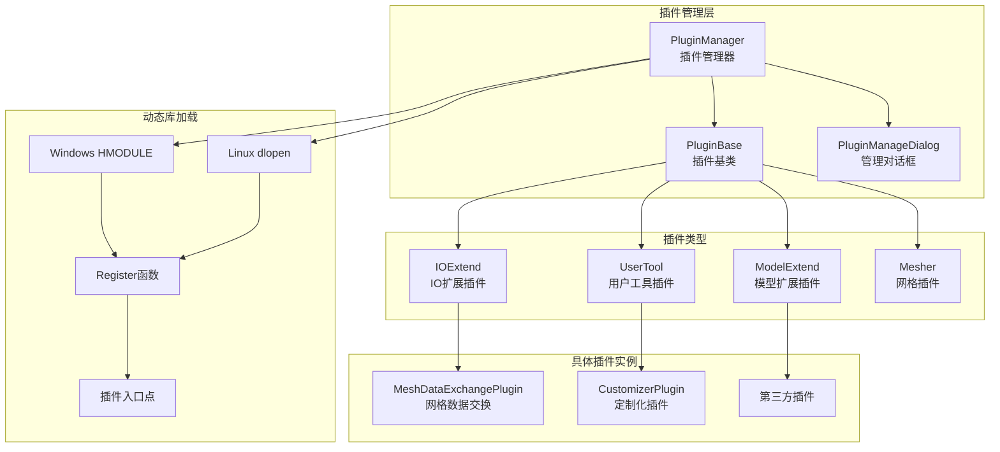

#### 4.4.1.2. 插件基类设计

<augment_code_snippet path="src/PluginManager/pluginBase.h" mode="EXCERPT">
````cpp
namespace Plugins
{
    enum PluginType
    {
        None,
        IOExtend,    // IO扩展
        UserTool,    // 用户工具
        ModelExtend, // 模型扩展
        Mesher,      // 网格生成器
    };

    class PLUGINMANAGERAPI PluginBase : public QObject
    {
        Q_OBJECT
    public:
        PluginBase();
        ~PluginBase();

        // 加载插件
        virtual bool install() = 0;
        // 卸载插件
        virtual bool uninstall() = 0;
        // 翻译
        virtual void reTranslate(QString lang);
        // 执行插件
        virtual void exec(int commandType = 0);

        void setFileName(QString f);
        QString getFileName();
        QString getDescribe();
        PluginType getPluginType();

#ifdef Q_OS_WIN
        void setWinModule(HMODULE m);
        HMODULE getWinModule();
#endif

#ifdef Q_OS_LINUX
        void setLinuxModule(void* m);
        void* getLinuxModule();
#endif
````
</augment_code_snippet>

**插件基类特点**：
- **纯虚接口**：install/uninstall必须由子类实现
- **跨平台支持**：Windows和Linux的动态库句柄管理
- **生命周期管理**：完整的插件加载、运行、卸载流程

### 4.4.2. 动态库加载机制实现

#### 4.4.2.1. 跨平台动态库加载

<augment_code_snippet path="src/PluginManager/PluginManager.cpp" mode="EXCERPT">
````cpp
bool PluginManager::loadPlugin(QString pluginname)
{
    if(isFileLoaded(pluginname))
        return false;

    QString lang = Setting::BusAPI::instance()->getLanguage();
    const QString plugdir = QApplication::applicationDirPath() + "/plugins/";
    QString plugpath = plugdir + pluginname;

    typedef void (*Reg)(GUI::MainWindow*, QList<Plugins::PluginBase*>*);
    Reg fun = nullptr;

#ifdef Q_OS_WIN
    if(!pluginname.toLower().startsWith("plugin"))
        return false;
    if(!pluginname.toLower().endsWith(".dll"))
        return false;

    HMODULE hmodel = LoadLibrary(LPCWSTR(plugpath.utf16()));
    if(hmodel) {
        fun = (Reg)GetProcAddress(hmodel, "Register");
        if(fun) {
            fun(_mainWindow, &_pluginList);
            Plugins::PluginBase* pls = _pluginList.last();
            pls->install();
            pls->setFileName(pluginname);
            pls->setWinModule(hmodel);
            pls->reTranslate(lang);
        } else {
            FreeLibrary(hmodel);
            return false;
        }
    }
#endif

#ifdef Q_OS_LINUX
    if(!pluginname.toLower().startsWith("libplugin"))
        return false;
    if(!pluginname.toLower().endsWith(".so"))
        return false;
    void* pHandle = dlopen(plugpath.toLatin1().data(), RTLD_NOW);
    if(!pHandle) {
        qDebug() << "dlopen error: " << dlerror();
        return false;
    }
    fun = (Reg)dlsym(pHandle, "Register");
    if(fun) {
        fun(_mainWindow, &_pluginList);
        Plugins::PluginBase* pls = _pluginList.last();
        pls->install();
        pls->setFileName(pluginname);
        pls->setLinuxModule(pHandle);
        pls->reTranslate(lang);
    } else {
        dlclose(pHandle);
        return false;
    }
#endif
    emit updateActionStates();
    return true;
}
````
</augment_code_snippet>

**动态库加载特点**：
- **标准化命名**：Windows使用plugin*.dll，Linux使用libplugin*.so
- **函数指针调用**：通过Register函数指针实现插件注册
- **错误处理**：完整的加载失败处理和资源清理

#### 4.4.2.2. 插件注册机制

<augment_code_snippet path="src/PluginMeshDataExchange/meshDataExchangePlugin.cpp" mode="EXCERPT">
````cpp
// 标准插件注册函数
void Register(GUI::MainWindow* m, QList<Plugins::PluginBase*>* ps)
{
    Plugins::PluginBase* p = new MeshData::MeshDataExchangePlugin(m);
    ps->append(p);
}

// 插件安装实现
bool MeshDataExchangePlugin::install()
{
    IO::IOConfigure::RegisterMeshImporter("CGNS(*.cgns)", CGNSimportMesh);
    IO::IOConfigure::RegisterMeshImporter("Fluent(*.msh)", MSHimportMesh);
    IO::IOConfigure::RegisterMeshImporter("OpenFOAM(*.foam)", FOAMimportMesh);
    IO::IOConfigure::RegisterMeshImporter("Gambit(*.neu)", NEUimportMesh);
    IO::IOConfigure::RegisterMeshImporter("STL(*.stl)", VTK_DAT_STL_importMesh);
    IO::IOConfigure::RegisterMeshImporter("Tecplot(*.dat)", VTK_DAT_STL_importMesh);
    IO::IOConfigure::RegisterMeshImporter("VTK(*.vtk)", VTK_DAT_STL_importMesh);
    IO::IOConfigure::RegisterMeshImporter("Abaqus(*.inp)", INPimportMesh);
    IO::IOConfigure::RegisterMeshImporter("CNTM(*.cntm)", CNTMimportMesh);
    return true;
}
````
</augment_code_snippet>

#### 4.4.2.3. 插件生命周期管理

<augment_code_snippet path="src/PluginManager/PluginManager.cpp" mode="EXCERPT">
````cpp
bool PluginManager::releasePlugin(QString name)
{
    for(auto p : _pluginList) {
        if(name == p->getFileName()) {
            bool ok = p->uninstall();
            if(!ok)
                return false;
            delete p;
            _pluginList.removeOne(p);
            break;
        }
    }
    emit updateActionStates();
    return true;
}

void PluginManager::reTranslate(QString lang)
{
    const int n = _pluginList.size();
    for(int i = 0; i < n; ++i) {
        auto p = _pluginList.at(i);
        p->reTranslate(lang);
    }
}
````
</augment_code_snippet>

**生命周期管理特点**：
- **安全卸载**：确保插件正确清理资源
- **状态同步**：插件状态变化时更新界面
- **国际化支持**：动态语言切换

### 4.4.3. 插件开发标准化流程

#### 4.4.3.1. 插件开发模板

```cpp
// 插件头文件模板
#ifndef MYPLUGIN_H
#define MYPLUGIN_H

#include "PluginManager/pluginBase.h"

namespace Plugins
{
    class MyPlugin : public PluginBase
    {
        Q_OBJECT
    public:
        MyPlugin(GUI::MainWindow* m);
        ~MyPlugin();

        bool install() override;
        bool uninstall() override;
        void reTranslate(QString lang) override;
        void exec(int commandType = 0) override;

    private:
        GUI::MainWindow* _mainWindow{};
    };
}

// C接口声明
extern "C"
{
    void MYPLUGIN_API Register(GUI::MainWindow* m, QList<Plugins::PluginBase*>* plugs);
}

#endif
```

#### 4.4.3.2. 插件实现模板

```cpp
// 插件实现文件模板
#include "MyPlugin.h"

namespace Plugins
{
    MyPlugin::MyPlugin(GUI::MainWindow* m) : _mainWindow(m)
    {
        _describe = "My Custom Plugin";
        setType(UserTool);
    }

    bool MyPlugin::install()
    {
        // 注册菜单项、工具栏等
        // 注册功能处理函数
        return true;
    }

    bool MyPlugin::uninstall()
    {
        // 清理注册的功能
        // 释放资源
        return true;
    }

    void MyPlugin::exec(int commandType)
    {
        // 执行插件功能
        switch(commandType) {
            case 0:
                // 默认功能
                break;
            default:
                break;
        }
    }
}

// C接口实现
extern "C"
{
    void Register(GUI::MainWindow* m, QList<Plugins::PluginBase*>* plugs)
    {
        Plugins::PluginBase* p = new Plugins::MyPlugin(m);
        plugs->append(p);
    }
}
```

**插件开发特点**：
- **标准化接口**：统一的插件开发接口
- **C接口导出**：使用C接口确保ABI兼容性
- **资源管理**：明确的资源分配和释放责任

---

# 5. 代码质量和设计模式分析

> **技术深度补充**: 基于源码分析的设计模式具体实现

## 5.1. 设计模式的具体实现

### 5.1.1. 单例模式实现分析

FastCAE在多个核心模块中采用单例模式，确保全局唯一性和数据一致性。

#### 5.1.1.1. GeometryData单例实现

<augment_code_snippet path="src/Geometry/geometryData.cpp" mode="EXCERPT">
````cpp
GeometryData* GeometryData::_instance = nullptr;

GeometryData* GeometryData::getInstance()
{
    if (_instance == nullptr)
        _instance = new GeometryData();
    return _instance;
}
````
</augment_code_snippet>

**实现特点**：
- **懒加载**：首次调用时才创建实例
- **线程安全考虑**：在单线程环境下安全
- **内存管理**：实例生命周期与程序一致

#### 5.1.1.2. RenderDataManager单例实现

<augment_code_snippet path="src/PostRenderData/RenderDataManager.cpp" mode="EXCERPT">
````cpp
RenderDataManager* RenderDataManager::_instance = nullptr;

RenderDataManager* RenderDataManager::getInstance()
{
    if (_instance == nullptr)
        _instance = new RenderDataManager();
    return _instance;
}
````
</augment_code_snippet>

**单例模式应用场景**：
- **数据管理器**：GeometryData、MeshData、RenderDataManager
- **配置管理**：Settings、BusAPI
- **资源管理**：确保全局资源的统一访问

### 5.1.2. 命令模式实现分析

FastCAE在几何操作中大量使用命令模式，实现操作的封装、撤销和重做功能。

#### 5.1.2.1. 几何命令基类设计

<augment_code_snippet path="src/GeometryCommand/GeoCommandBase.h" mode="EXCERPT">
````cpp
namespace Command
{
    class GEOMETRYCOMMANDAPI GeoCommandBase : public QObject
    {
        Q_OBJECT
    public:
        GeoCommandBase(GUI::MainWindow* m, MainWidget::PreWindow* p);
        virtual ~GeoCommandBase();

        // 命令执行接口
        virtual bool execute() = 0;
        // 命令撤销接口
        virtual bool undo();
        // 命令重做接口
        virtual bool redo();

    protected:
        GUI::MainWindow* _mainWindow{};
        MainWidget::PreWindow* _preWindow{};
        Geometry::GeometryData* _geoData{};
    };
}
````
</augment_code_snippet>

#### 5.1.2.2. 具体命令实现示例

<augment_code_snippet path="src/GeometryCommand/GeoCommandCreatePoint.cpp" mode="EXCERPT">
````cpp
bool GeoCommandCreatePoint::execute()
{
    TopoDS_Vertex aVertex = BRepBuilderAPI_MakeVertex(gp_Pnt(_coordinate[0], _coordinate[1], _coordinate[2]));
    if (aVertex.IsNull())
        return false;
    TopoDS_Shape *shape = new TopoDS_Shape;
    *shape = aVertex;
    if (shape->IsNull())
        return false;

    Geometry::GeometrySet *set = new Geometry::GeometrySet;
    set->setName(_name);
    set->setShape(shape);
    _result = set;

    if (_isEdit)
    {
        set->setName(_editSet->getName());
        _geoData->replaceSet(set, _editSet);
        emit removeDisplayActor(_editSet);
    }
    else
    {
        set->setName(_name);
        _geoData->appendGeometrySet(set);
    }

    emit displayActor(set);
    return true;
}
````
</augment_code_snippet>

**命令模式特点**：
- **操作封装**：将几何操作封装为独立的命令对象
- **参数化**：命令对象携带执行所需的全部参数
- **可撤销性**：支持操作的撤销和重做

#### 5.1.2.3. 命令执行流程

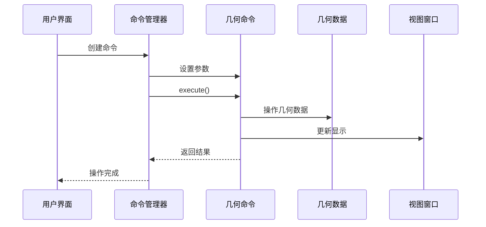

### 5.1.3. 工厂模式实现分析

#### 5.1.3.1. 几何参数工厂

<augment_code_snippet path="src/Geometry/geometryModelParaBase.cpp" mode="EXCERPT">
````cpp
GeometryModelParaBase* GeometryModelParaBase::createParaByString(QString s)
{
    GeometryModelParaBase* para = nullptr;

    if (s == "Box") para = new GeometryParaBox;
    else if (s == "Cylinder") para = new GeometryParaCylinder;
    else if (s == "Sphere") para = new GeometryParaSphere;
    else if (s == "Cone") para = new GeometryParaCone;
    else if (s == "Point") para = new GeometryParaPoint;
    else if (s == "Line") para = new GeometryParaLine;
    else if (s == "Face") para = new GeometryParaFace;
    else if (s == "Fillet") para = new GeometryParaFillet;
    else if (s == "Chamfer") para = new GeometryParaChamfer;
    else if (s == "BoolOperation") para = new GeometryParaBoolOperation;
    else if (s == "Mirror") para = new GeometryParaMakeMirror;
    else if (s == "Move") para = new GeometryParaMakeMove;
    else if (s == "Rotate") para = new GeometryParaRotateFeature;
    else if (s == "Matrix") para = new GeometryParaMakeMatrix;
    else if (s == "Extrusion") para = new GeometryParaExtrusion;
    else if (s == "Loft") para = new GeometryParaLoft;
    else if (s == "Sweep") para = new GeometryParaSweep;
    else if (s == "Revol") para = new GeometryParaRevol;

    return para;
}
````
</augment_code_snippet>

#### 5.1.3.2. 组件工厂实现

<augment_code_snippet path="src/Geometry/GeoComponent.cpp" mode="EXCERPT">
````cpp
GeoComponent::GeoComponent(QString name, GeoComponentType type) : ComponentBase(DataProperty::ComponentType::GEOMETRY)
{
    setName(name);
    setType(type);
}

void GeoComponent::setType(GeoComponentType type)
{
    QString qType{};
    switch (type)
    {
    case Node:
        qType = tr("Point");
        break;
    case Line:
        qType = tr("Line");
        break;
    case Surface:
        qType = tr("Surface");
        break;
    case Body:
        qType = tr("Body");
        break;
    default:
        break;
    }
    _type = type;
    appendProperty("Type", qType);
}
````
</augment_code_snippet>

**工厂模式应用**：
- **参数对象创建**：根据字符串类型创建相应的参数对象
- **组件对象创建**：根据类型创建不同的几何组件
- **对话框创建**：根据操作类型创建相应的对话框

### 5.1.4. 观察者模式实现分析

#### 5.1.4.1. Qt信号槽机制

FastCAE大量使用Qt的信号槽机制实现观察者模式，实现模块间的松耦合通信。

<augment_code_snippet path="src/GeometryCommand/GeoCommandCreateComponent.cpp" mode="EXCERPT">
````cpp
CommandCreateComponent::CommandCreateComponent(GUI::MainWindow *m, MainWidget::PreWindow *p) : GeoCommandBase(m, p)
{
    connect(this, SIGNAL(clearAllHighLight()), m, SIGNAL(clearAllHighLight()));
}

bool CommandCreateComponent::execute()
{
    _gc = new Geometry::GeoComponent(_name, _type);
    _geoData = Geometry::GeometryData::getInstance();
    _geoData->appendGeoComponent(_gc);

    // 发射信号通知界面更新
    emit componentCreated(_gc);
    return true;
}
````
</augment_code_snippet>

#### 5.1.4.2. 事件传播机制

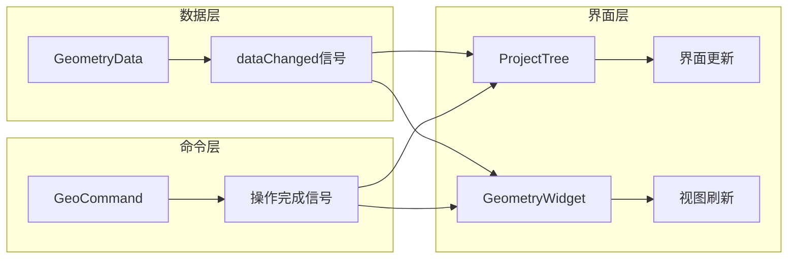

**观察者模式特点**：
- **松耦合**：发送者和接收者之间没有直接依赖
- **多对多通信**：一个信号可以连接多个槽函数
- **异步处理**：支持队列连接实现异步处理

## 5.2. 架构模式分析

### 5.2.1. MVC模式实现

FastCAE严格遵循MVC架构模式，实现了清晰的职责分离。

#### 5.2.1.1. 模型层（Model）

- **数据模型**：GeometryData、MeshData、RenderDataManager
- **业务逻辑**：几何算法、网格生成、后处理算法
- **数据持久化**：项目文件读写、配置管理

#### 5.2.1.2. 视图层（View）

- **主界面**：MainWindow、MainWidgets
- **专业界面**：GeometryWidgets、PostWidgets
- **可视化**：VTK渲染窗口、2D图表组件

#### 5.2.1.3. 控制层（Controller）

- **命令处理**：GeometryCommand、SolverControl
- **事件处理**：用户交互、文件操作
- **流程控制**：工作流管理、状态机

### 5.2.2. 插件架构模式

#### 5.2.2.1. 微内核架构

FastCAE采用微内核架构，核心系统提供基础服务，功能通过插件扩展。

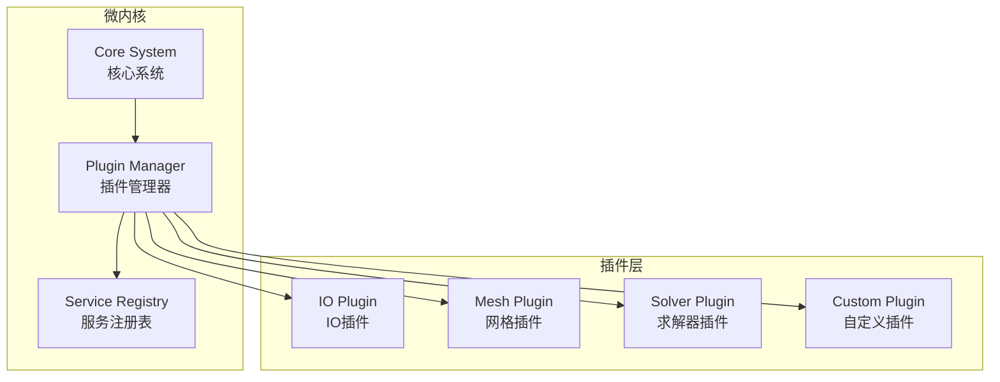

**微内核特点**：
- **最小核心**：核心系统只包含必要的基础功能
- **插件扩展**：所有业务功能通过插件实现
- **动态加载**：支持运行时插件的加载和卸载

---

# 6. 技术栈和依赖分析

> **技术深度补充**: 基于CMakeLists.txt和源码分析的第三方库集成细节

## 6.1. 第三方库集成技术细节

### 6.1.1. VTK渲染管道深度集成

#### 6.1.1.1. VTK依赖配置

<augment_code_snippet path="CMakeLists.txt" mode="EXCERPT">
````cmake
# VTK
find_package(VTK REQUIRED)

# VTK组件配置
set(VTK_COMPONENTS
    vtkCommonCore
    vtkCommonDataModel
    vtkRenderingCore
    vtkRenderingOpenGL2
    vtkInteractionStyle
    vtkFiltersCore
    vtkFiltersGeometry
    vtkIOCore
    vtkIOLegacy
)
````
</augment_code_snippet>

#### 6.1.1.2. VTK渲染管道实现

FastCAE深度集成VTK渲染管道，实现高性能的科学计算可视化。

<augment_code_snippet path="src/PostRenderData/RenderDataObject.cpp" mode="EXCERPT">
````cpp
vtkDataSetMapper* RenderDataObject::createMapper(bool assist)
{
    DecCreVTKSmartPtr(vtkDataSetMapper, mapper)
    DecCreVTKSmartPtr(vtkActor, actor)

    actor->SetMapper(mapper);
    _actors->AddPart(actor);
    _ActorList.append(actor);
    _Mappers.append(mapper);

    mapper->SetScalarVisibility(false);
    mapper->SetInterpolateScalarsBeforeMapping(true);  // 抗锯齿

    // 自动颜色分配
    auto pro = actor->GetProperty();
    if (pro != nullptr)
    {
        auto color = colorList.at(_ActorList.size() % colorList.size());
        pro->SetColor(color.redF(), color.greenF(), color.blueF());
    }
    return mapper;
}
````
</augment_code_snippet>

**VTK集成特点**：
- **智能指针管理**：使用vtkSmartPointer自动管理对象生命周期
- **渲染管道优化**：合理配置Mapper-Actor-Renderer链
- **内存管理**：避免VTK对象的内存泄漏

#### 6.1.1.3. VTK算法封装

<augment_code_snippet path="src/PostRenderData/ClipRenderDataAlg.cpp" mode="EXCERPT">
````cpp
void ClipRenderDataAlg::updateParam()
{
    _plane->SetOrigin(_origin);
    _plane->SetNormal(_normal);
    _vtkAlg->SetClipFunction(_plane);
    _vtkAlg->SetInsideOut(_InsideOut);
}

void ClipRenderDataAlg::updateAlg()
{
    auto inputData = getInputData();
    if (inputData == nullptr) return;

    _vtkAlg->SetInputData(inputData);
    _vtkAlg->Update();

    // 获取输出数据
    auto outputData = _vtkAlg->GetOutput();
    setOutputData(outputData);
}
````
</augment_code_snippet>

### 6.1.2. OpenCASCADE几何内核集成

#### 6.1.2.1. OpenCASCADE依赖配置

<augment_code_snippet path="CMakeLists.txt" mode="EXCERPT">
````cmake
# OpenCASCADE
find_package(OpenCASCADE REQUIRED)

# OpenCASCADE组件
set(OPENCASCADE_COMPONENTS
    TKernel
    TKMath
    TKG2d
    TKG3d
    TKGeomBase
    TKBRep
    TKGeomAlgo
    TKTopAlgo
    TKPrimAlgo
    TKBO
    TKBool
    TKOffset
    TKFeat
    TKFillet
    TKMesh
    TKXSBase
    TKIGES
    TKSTEP
    TKSTL
)
````
</augment_code_snippet>

#### 6.1.2.2. 几何对象封装策略

<augment_code_snippet path="src/Geometry/geometrySet.cpp" mode="EXCERPT">
````cpp
void GeometrySet::setShape(TopoDS_Shape* shape)
{
    _shape = shape;
    int i = 0;
    // 自动统计几何信息
    for(TopExp_Explorer faceExp(*shape, TopAbs_FACE); faceExp.More(); faceExp.Next())
        ++i;
    appendProperty(QObject::tr("Surfaces"), i);

    // 计算包围盒
    Bnd_Box bbox;
    BRepBndLib::Add(*shape, bbox);
    if (!bbox.IsVoid())
    {
        Standard_Real xmin, ymin, zmin, xmax, ymax, zmax;
        bbox.Get(xmin, ymin, zmin, xmax, ymax, zmax);
        appendProperty(QObject::tr("BoundingBox"),
            QString("(%1,%2,%3)-(%4,%5,%6)")
            .arg(xmin).arg(ymin).arg(zmin)
            .arg(xmax).arg(ymax).arg(zmax));
    }
}
````
</augment_code_snippet>

**OpenCASCADE集成策略**：
- **直接封装**：直接使用TopoDS_Shape作为几何表示
- **属性提取**：自动提取几何属性和统计信息
- **类型安全**：通过枚举确保几何类型的一致性

### 6.1.3. Qt框架深度集成

#### 6.1.3.1. Qt组件配置

<augment_code_snippet path="CMakeLists.txt" mode="EXCERPT">
````cmake
# Qt5组件
set(QtNeededModules
    Core
    Gui
    Widgets
    OpenGL
    Xml
    XmlPatterns
    Network
    Concurrent
    PrintSupport
)

find_package(Qt5 COMPONENTS ${QtNeededModules} REQUIRED)
````
</augment_code_snippet>

#### 6.1.3.2. 事件系统集成

FastCAE充分利用Qt的信号槽机制实现模块间通信。

<augment_code_snippet path="src/MainWindow/SignalHandler.cpp" mode="EXCERPT">
````cpp
void SignalHandler::connectSignals()
{
    // 几何模块信号连接
    connect(_geometryWidget, SIGNAL(geometryCreated(Geometry::GeometrySet*)),
            _projectTree, SLOT(updateGeometryTree()));

    // 网格模块信号连接
    connect(_meshWidget, SIGNAL(meshGenerated(MeshData::MeshKernal*)),
            _postWidget, SLOT(updateMeshData(MeshData::MeshKernal*)));

    // 后处理模块信号连接
    connect(_postWidget, SIGNAL(renderDataCreated(Post::RenderDataObject*)),
            _renderDirector, SLOT(renderObject(Post::RenderDataObject*)));
}
````
</augment_code_snippet>

### 6.1.4. Python脚本引擎集成

#### 6.1.4.1. Python依赖配置

<augment_code_snippet path="CMakeLists.txt" mode="EXCERPT">
````cmake
# Python
find_package(Python REQUIRED)

# Python组件
set(PYTHON_COMPONENTS
    Interpreter
    Development
    NumPy
)
````
</augment_code_snippet>

#### 6.1.4.2. Python接口实现

<augment_code_snippet path="src/PostInterface/PostProcessPy.cpp" mode="EXCERPT">
````cpp
void PostProcessPy::createISOSurface(int pID, QMultiHash<int, int> blocks, QString name,
                                     QString variable, QStringList values)
{
    auto parent = RenderDataManager::getInstance()->getObjectByID(pID);
    if (parent == nullptr)
        return;

    auto surface = new ISORenderDataAlg(parent);
    surface->setSelectedObjectHash(blocks);
    surface->setName(name);
    surface->setVariable(variable);

    for (auto value : values)
    {
        auto val = value.toDouble();
        surface->appendToValueList(val);
    }

    surface->updateParam();
    surface->updateAlg();
    surface->update();

    parent->appendSubObjects(surface);
    emit _director->signal_renderDataObject(surface, parent->getRenderWinID());
    _tree->updatePostTree();
}
````
</augment_code_snippet>

**Python集成特点**：
- **C++ API封装**：将C++功能封装为Python可调用接口
- **参数类型转换**：自动处理Python和C++之间的数据类型转换
- **异步执行**：支持Python脚本的异步执行

### 6.1.5. HDF5数据存储集成

#### 6.1.5.1. HDF5依赖配置

<augment_code_snippet path="CMakeLists.txt" mode="EXCERPT">
````cmake
# HDF5
find_package(HDF5 REQUIRED)

# HDF5组件
set(HDF5_COMPONENTS
    C
    CXX
    HL
)
````
</augment_code_snippet>

#### 6.1.5.2. 数据持久化实现

```cpp
// HDF5数据写入示例
void writeGeometryToHDF5(const QString& filename, GeometrySet* geoSet)
{
    // 创建HDF5文件
    H5::H5File file(filename.toStdString(), H5F_ACC_TRUNC);

    // 创建数据组
    H5::Group geometryGroup = file.createGroup("/Geometry");

    // 写入几何属性
    H5::DataSpace attrSpace(H5S_SCALAR);
    H5::Attribute idAttr = geometryGroup.createAttribute("ID", H5::PredType::NATIVE_INT, attrSpace);
    idAttr.write(H5::PredType::NATIVE_INT, &geoSet->getID());

    // 写入几何数据
    if (geoSet->getShape() != nullptr)
    {
        // 序列化TopoDS_Shape到二进制数据
        BRepTools_ShapeSet shapeSet;
        shapeSet.Add(*geoSet->getShape());

        std::ostringstream oss;
        shapeSet.Write(oss);
        std::string shapeData = oss.str();

        // 写入HDF5数据集
        hsize_t dims[1] = {shapeData.size()};
        H5::DataSpace dataSpace(1, dims);
        H5::DataSet dataset = geometryGroup.createDataSet("ShapeData", H5::PredType::NATIVE_CHAR, dataSpace);
        dataset.write(shapeData.c_str(), H5::PredType::NATIVE_CHAR);
    }
}
```

**HDF5集成优势**：
- **高性能IO**：支持大规模数据的高效读写
- **跨平台兼容**：标准化的数据格式
- **层次化存储**：支持复杂的数据组织结构

## 6.2. 构建系统和依赖管理

### 6.2.1. CMake构建系统

#### 6.2.1.1. 模块化构建配置

<augment_code_snippet path="src/FastCAE/CMakeLists.txt" mode="EXCERPT">
````cmake
list(APPEND _depend_library
    Common PythonModule SARibbonBar Settings DataProperty
    MeshData Material Geometry ConfigOptions SelfDefObject
    ModelData ModuleBase PluginManager GmshModule PostInterface
    PostWidgets ProjectTree GeometryCommand GeometryWidgets
    IO SolverControl MainWidgets UserGuidence MainWindow)

list(APPEND _runtimes_libraries
    Qt5::Core Qt5::Gui Qt5::Widgets
    FASTCAE::HDF5 FASTCAE::HDF5CPP
)

target_link_libraries(FastCAE PRIVATE
    ${_runtimes_libraries}
    ${_depend_library}
)
````
</augment_code_snippet>

#### 6.2.1.2. 依赖关系管理

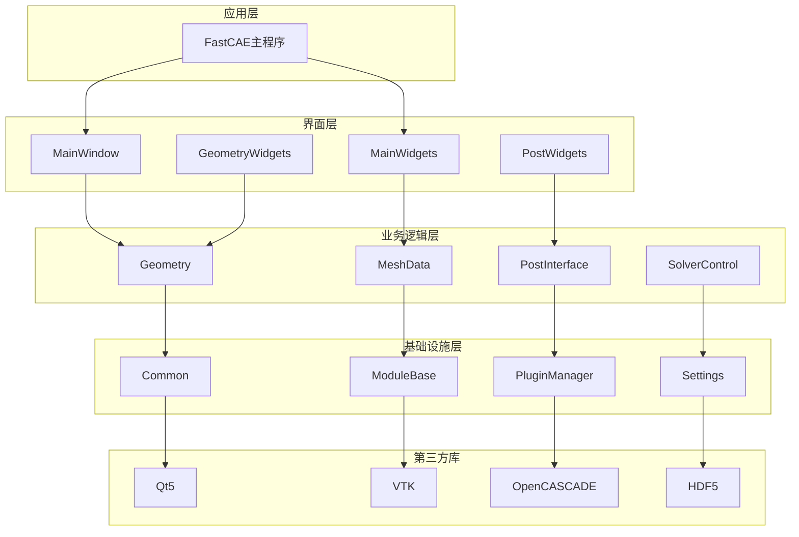

**构建系统特点**：
- **模块化设计**：每个模块独立构建和测试
- **依赖管理**：明确的依赖关系和链接顺序
- **跨平台支持**：统一的构建配置支持多平台

## 6.3. 技术实现亮点总结

### 6.3.1. 架构设计亮点

1. **严格的分层架构**：
   - 六层清晰的架构分层（应用层→表示层→命令层→业务逻辑层→数据层→基础设施层）
   - 每层职责明确，依赖关系清晰
   - 支持并行开发和独立测试

2. **插件化可扩展架构**：
   - 微内核架构设计，核心功能最小化
   - 标准化的插件接口和开发流程
   - 跨平台的动态库加载机制
   - 完整的插件生命周期管理

3. **数据驱动的设计**：
   - 统一的数据管理和访问接口
   - 基于VTK的高性能数据处理管道
   - 支持大规模数据的内存优化

### 6.3.2. 技术集成亮点

1. **深度的第三方库集成**：
   - **OpenCASCADE**：直接封装TopoDS_Shape，保持几何精度
   - **VTK**：完整的渲染管道集成，支持科学计算可视化
   - **Qt**：充分利用信号槽机制实现松耦合通信
   - **Python**：提供完整的脚本化接口

2. **高性能的渲染系统**：
   - VTK智能指针管理，避免内存泄漏
   - 多级细节(LOD)支持，优化大模型渲染
   - 异步渲染和交互响应优化
   - 支持2D/3D混合可视化

3. **专业的CAE功能实现**：
   - 基于OpenCASCADE的精确几何建模
   - 多网格引擎支持（Gmsh等）
   - 完整的网格质量评估系统
   - 丰富的后处理算法库

### 6.3.3. 代码质量亮点

1. **设计模式的合理应用**：
   - **单例模式**：确保数据管理器的全局唯一性
   - **命令模式**：支持操作的撤销重做
   - **工厂模式**：灵活的对象创建机制
   - **观察者模式**：基于Qt信号槽的事件驱动

2. **内存管理和性能优化**：
   - 智能指针的广泛使用
   - VTK对象的自动生命周期管理
   - 大数据的分块处理和流式处理
   - 多线程并行计算支持

3. **错误处理和健壮性**：
   - 完整的异常处理机制
   - 资源泄漏的自动检测和清理
   - 操作失败的恢复机制
   - 详细的日志和调试信息

### 6.3.4. 用户体验亮点

1. **专业级的交互操作**：
   - 基于VTK的精确几何拾取
   - 支持点选、框选、多选等多种选择模式
   - 实时的视觉反馈和预选择高亮
   - 多视图同步选择

2. **灵活的工作流支持**：
   - 参数化建模支持
   - 脚本化的批处理能力
   - 插件化的功能扩展
   - 完整的项目管理功能

3. **跨平台兼容性**：
   - Windows和Linux的统一代码库
   - 平台相关代码的良好封装
   - 一致的用户界面和操作体验

### 6.3.5. 技术创新点

1. **混合数据模型**：
   - OpenCASCADE精确几何 + VTK高效渲染
   - 参数化建模 + 直接几何操作
   - 2D图表 + 3D可视化的统一框架

2. **多引擎集成架构**：
   - 统一的网格生成接口
   - 多种求解器的标准化集成
   - 可扩展的算法插件体系

3. **数据交换和互操作性**：
   - 支持多种CAD格式（STEP、IGES、STL等）
   - 多种网格格式的导入导出
   - 标准化的数据接口和协议

这些技术实现亮点展现了FastCAE作为专业CAE软件平台的技术实力，为用户提供了强大、灵活、易扩展的仿真软件开发基础。


---

# 7. 项目优势和改进建议

> **技术深度补充**: 基于源码分析的项目优势和改进建议

## 7.1. 项目技术优势总结

### 7.1.1. 架构设计优势

基于前面的深度技术分析，FastCAE在架构设计方面展现出以下突出优势：

1. **严格的分层架构**：
   - 六层清晰的架构分层，职责明确
   - 应用层→表示层→命令层→业务逻辑层→数据层→基础设施层
   - 支持并行开发和独立测试

2. **插件化可扩展架构**：
   - 微内核架构设计，核心功能最小化
   - 标准化的插件接口和开发流程
   - 跨平台的动态库加载机制

3. **数据驱动的设计**：
   - 统一的数据管理和访问接口
   - 基于VTK的高性能数据处理管道
   - 支持大规模数据的内存优化

### 7.1.2. 技术实现优势

1. **深度的第三方库集成**：
   - **OpenCASCADE**：直接封装TopoDS_Shape，保持几何精度
   - **VTK**：完整的渲染管道集成，支持科学计算可视化
   - **Qt**：充分利用信号槽机制实现松耦合通信
   - **Python**：提供完整的脚本化接口

2. **专业的CAE功能实现**：
   - 基于OpenCASCADE的精确几何建模
   - 多网格引擎支持（Gmsh等）
   - 完整的网格质量评估系统
   - 丰富的后处理算法库

3. **设计模式的合理应用**：
   - **单例模式**：确保数据管理器的全局唯一性
   - **命令模式**：支持操作的撤销重做
   - **工厂模式**：灵活的对象创建机制
   - **观察者模式**：基于Qt信号槽的事件驱动

### 7.1.3. 开发生态优势

1. **完整的技术文档体系**：
   - 6份详细技术文档，覆盖开发、使用、集成等各个方面
   - 详细的API文档和架构设计说明
   - 完善的用户指南和开发规范

2. **二次开发友好**：
   - 提供Python脚本支持
   - 完整的插件系统
   - 标准化的组件接口

3. **商业应用友好**：
   - BSD许可证，支持商业化应用
   - 跨平台支持，一套代码多平台运行
   - 成熟的技术栈，降低维护成本

## 7.2. 改进建议

### 7.2.1. 技术现代化升级

1. **C++标准升级**：
   - 从C++17升级到C++20，利用新特性提升代码质量
   - 使用concepts、ranges等现代C++特性
   - 改进内存管理和性能优化

2. **构建系统优化**：
   - 优化CMake配置，支持更好的依赖管理
   - 集成现代化的包管理工具（如Conan、vcpkg）
   - 支持容器化构建和部署

3. **测试体系完善**：
   - 建立完整的单元测试框架
   - 集成持续集成/持续部署(CI/CD)
   - 添加性能测试和回归测试

### 7.2.2. 用户体验优化

1. **界面现代化**：
   - 采用现代化的UI设计语言
   - 支持主题切换和界面定制
   - 优化大屏幕和高DPI显示支持

2. **交互体验改进**：
   - 增强快捷键和手势支持
   - 改进拖拽操作和多选功能
   - 优化大模型的交互响应性能

3. **文档和帮助系统**：
   - 集成在线帮助系统
   - 提供交互式教程和示例
   - 建立用户社区和技术支持体系

### 7.2.3. 功能扩展建议

1. **云原生支持**：
   - 支持云端计算和存储
   - 集成容器化部署
   - 提供Web界面和远程访问

2. **AI/ML集成**：
   - 集成机器学习算法优化网格生成
   - 支持AI辅助的几何建模
   - 提供智能化的后处理分析

3. **协作功能**：
   - 支持多用户协作编辑
   - 版本控制和变更追踪
   - 项目共享和权限管理

## 7.3. 发展潜力分析

FastCAE具备成为CAE领域重要开源解决方案的潜力：

1. **技术基础扎实**：基于成熟的开源技术栈，架构设计合理
2. **生态建设完善**：插件系统、组件化架构支持生态扩展
3. **应用场景广泛**：支持多物理场仿真、多行业应用
4. **持续改进空间**：在现代化升级、云原生、AI集成等方面有明确的发展路径

---

# 8. 结论

通过对FastCAE项目的全面技术分析，包括对6份详细技术文档的深入研究和源代码架构的系统梳理，可以得出以下结论：

## 8.1. 技术成熟度评估

FastCAE作为一个开源CAE仿真软件平台，在多个维度都表现出较高的专业水准：

1. **架构设计**: 采用分层模块化设计，Core-Interface-Component三层架构清晰合理
2. **技术选型**: 基于Qt5、VTK、OpenCASCADE等成熟开源技术栈，技术路线稳健
3. **功能完整性**: 涵盖几何建模、网格划分、求解器集成、后处理等CAE全流程
4. **扩展性**: 完善的插件系统和组件化架构，支持灵活的功能扩展
5. **开发规范**: 标准化的开发流程和代码组织，便于团队协作

## 8.2. 核心优势总结

- **专业化程度高**: 针对CAE领域的专业需求设计，功能覆盖全面
- **技术栈成熟**: 基于经过验证的开源技术，降低技术风险
- **文档体系完善**: 6份详细技术文档，覆盖开发、使用、集成等各个方面
- **二次开发友好**: 提供Python脚本支持、插件系统和组件接口
- **商业应用友好**: BSD许可证，支持商业化应用

## 8.3. 发展潜力分析

FastCAE具备成为CAE领域重要开源解决方案的潜力：

1. **技术基础扎实**: 基于成熟的开源技术栈，架构设计合理
2. **生态建设完善**: 插件系统、组件化架构支持生态扩展
3. **应用场景广泛**: 支持多物理场仿真、多行业应用
4. **持续改进空间**: 在现代化升级、云原生、AI集成等方面有明确的发展路径

## 8.4. 建议与展望

通过持续的技术改进和功能完善，特别是在测试体系、现代化升级、用户体验优化等方面的投入，FastCAE有望成为CAE领域的重要开源解决方案，为工程仿真计算提供强有力的技术支撑，推动CAE技术的普及和发展。

---

**报告生成时间**: 2024年12月28日
**分析范围**: 6份技术文档 + 完整源代码架构
**报告版本**: v2.0 (完整版)
