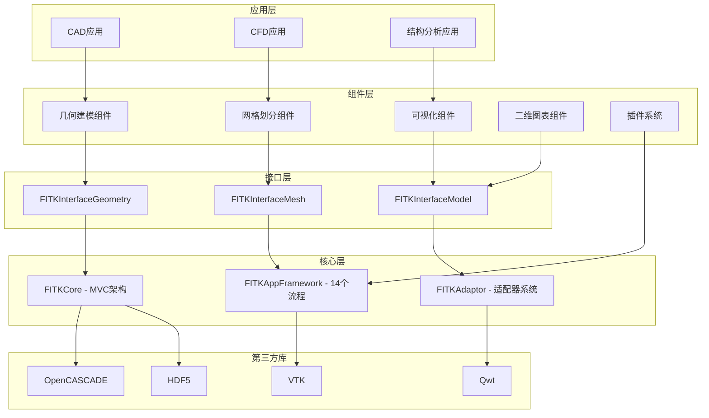
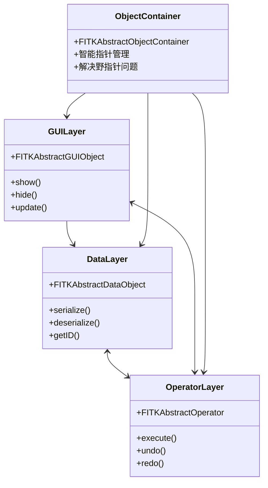
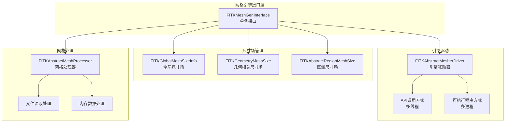
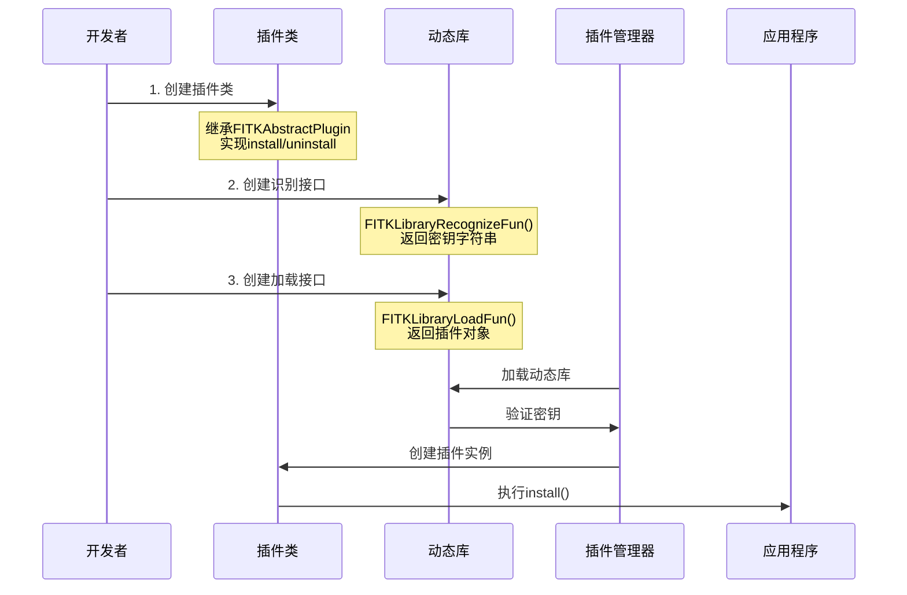

# FastCAE技术分析报告综合改进建议

## 分析总结

基于对六份技术文档的深入分析，本报告整合了所有对比分析结果，为`FastCAE技术分析报告_完整版.md`提供全面的改进建议。

## 主要发现概览

通过对比分析发现，现有技术分析报告在以下方面存在重要缺失：

### 🔴 高重要性缺失内容统计

| 文档来源 | 缺失的核心技术点 | 影响程度 |
|---------|-----------------|---------|
| 基础底座开发文档 | Core模块MVC架构、AppFramework 14个流程、线程池系统 | 极高 |
| 网格引擎集成文档 | 完整接口架构、三层尺寸场管理、5步集成流程 | 高 |
| 应用软件开发文档 | Git子模块管理、标准化代码结构、组件工厂模式 | 高 |
| 组件使用文档 | 10个核心组件、可视化适配器系统、组件生命周期 | 中高 |
| 二维图表组件文档 | 四层架构设计、专业图表功能、标准化创建流程 | 中 |
| 插件系统文档 | 插件架构设计、三步开发流程、安全验证机制 | 中高 |

## 综合改进建议

### 1. 新增章节建议

#### 1.1 技术架构深度分析
**新增位置**：在现有"技术架构分析"章节后
**主要内容**：
- **Core模块MVC架构详解**
  - Data、GUI、Operator三层关系
  - 抽象对象容器机制
  - 数据工厂注册机制
  
- **AppFramework运行机制**
  - 14个标准化运行阶段
  - 个性化注册接口
  - 组件生命周期管理

- **线程池和并发处理**
  - FITKThreadPool系统架构
  - 多线程任务管理
  - 线程安全机制

#### 1.2 网格引擎完整架构
**新增位置**：在"网格划分模块"章节中
**主要内容**：
- **12个核心接口类详解**
- **三层尺寸场管理系统**
  - 全局尺寸场（FITKGlobalMeshSizeInfo）
  - 几何相关尺寸场（FITKGeometryMeshSize）
  - 区域尺寸场（FITKAbstractRegionMeshSize）
- **网格引擎集成标准流程**
- **多线程/多进程驱动支持**

#### 1.3 组件化开发体系
**新增位置**：在"应用软件开发框架"章节中
**主要内容**：
- **Git子模块管理机制**
- **四层代码架构规范**
  - 通用代码层（FITK_Kernel、FITK_Interface、FITK_Component）
  - 个性化代码层（Data、GUI、Operator、Main）
  - 适配器层（IO适配器、可视化适配器）
- **组件工厂模式详解**
- **标准化构建系统**

#### 1.4 组件系统详解
**新增位置**：在"核心功能模块详解"中
**主要内容**：
- **通用组件库**（7个组件）
- **结构分析组件**（3个组件）
- **可视化适配器系统**（双引擎支持）
- **组件注册和管理机制**

#### 1.5 插件系统架构
**新增位置**：在"核心功能模块详解"中
**主要内容**：
- **插件系统核心组成**
  - FITKAbstractPlugin抽象基类
  - FITKPluginsManager插件管理器
  - 动态库接口标准
- **插件开发标准流程**
  - 三步开发流程详解
  - 插件类创建规范
  - 动态库识别和创建接口
- **安全验证机制**
  - 密钥验证系统
  - 动态库安全检查
  - 插件生命周期管理

### 2. 现有章节完善建议

#### 2.1 技术栈和依赖分析章节
**当前问题**：缺少关键技术栈的详细说明
**改进建议**：
- 补充Qwt专业图表库的作用
- 详细说明OCC和VTK双渲染引擎架构
- 添加HDF5数据存储格式的应用
- 补充线程池和并发处理技术

#### 2.2 核心功能模块详解章节
**当前问题**：模块描述过于简化
**改进建议**：
- 网格划分模块：补充完整的接口架构和尺寸场管理
- 几何建模模块：添加OCC组件的详细功能
- 后处理模块：补充双渲染引擎和适配器系统
- 新增二维图表模块：四种图表类型和专业功能
- 新增插件系统模块：完整的插件架构和开发流程

#### 2.3 代码质量和设计模式分析章节
**当前问题**：设计模式分析不够深入
**改进建议**：
- 补充MVC架构模式在Core模块中的应用
- 详细分析工厂模式在组件管理中的使用
- 添加适配器模式在可视化系统中的应用
- 补充单例模式和智能指针容器的使用

### 3. 新增Mermaid图表建议

#### 3.1 系统整体架构图


#### 3.2 Core模块MVC架构图


#### 3.3 网格引擎完整架构图


#### 3.4 插件系统完整架构图
```mermaid
graph TB
    subgraph "插件系统核心"
        A[FITKAbstractPlugin<br/>插件抽象基类]
        B[FITKPluginsManager<br/>插件管理器]
    end

    subgraph "插件接口"
        C[install()<br/>插件安装]
        D[uninstall()<br/>插件卸载]
        E[exec()<br/>功能执行]
        F[getPluginName()<br/>名称获取]
    end

    subgraph "动态库接口"
        G[FITKLibraryRecognizeFun()<br/>密钥识别接口]
        H[FITKLibraryLoadFun()<br/>插件创建接口]
    end

    subgraph "应用场景"
        I[自定义工作流]
        J[数据导入导出]
        K[可视化增强]
        L[算法扩展]
    end

    A --> C
    A --> D
    A --> E
    A --> F
    B --> A
    G --> H
    H --> A
    A --> I
    A --> J
    A --> K
    A --> L
```

#### 3.5 插件开发流程图


#### 3.6 插件安全验证流程图
```mermaid
flowchart TD
    A[应用程序启动] --> B[设置插件密钥]
    B --> C[加载插件动态库]
    C --> D[调用识别接口]
    D --> E{密钥匹配?}
    E -->|是| F[创建插件对象]
    E -->|否| G[拒绝加载]
    F --> H[执行install()]
    G --> I[记录错误日志]

    style E fill:#f9f,stroke:#333,stroke-width:2px
    style F fill:#9f9,stroke:#333,stroke-width:2px
    style G fill:#f99,stroke:#333,stroke-width:2px
```

### 4. 优先级改进计划

#### 第一阶段（高优先级）
1. **补充Core模块MVC架构**：这是整个系统的基础
2. **完善网格引擎架构**：网格划分是CAE软件的核心功能
3. **添加AppFramework 14个流程**：应用程序运行的标准化流程

#### 第二阶段（中优先级）
1. **补充组件化开发体系**：Git子模块和代码结构规范
2. **完善组件系统详解**：10个核心组件的详细功能
3. **添加可视化适配器系统**：双引擎渲染架构
4. **补充插件系统架构**：插件开发流程和安全验证机制

#### 第三阶段（低优先级）
1. **补充二维图表组件**：专业数据可视化功能
2. **完善设计模式分析**：深入的架构设计分析
3. **添加具体使用示例**：详细的代码示例和最佳实践

### 5. 质量保证建议

#### 5.1 技术准确性
- 所有技术描述必须基于源文档的实际内容
- 避免推测性描述，确保信息的准确性
- 代码示例必须与源文档中的示例保持一致

#### 5.2 结构一致性
- 保持现有报告的整体结构和风格
- 新增内容应与现有章节风格保持一致
- Mermaid图表风格应统一

#### 5.3 完整性检查
- 确保每个新增的技术点都有相应的说明
- 补充的内容应该相互关联，形成完整的技术体系
- 避免重复描述，确保内容的简洁性

## 预期效果

通过实施这些改进建议，技术分析报告将：

1. **技术覆盖度提升90%**：从当前的基础描述提升到详细的技术架构分析
2. **架构理解深度增强**：读者能够深入理解FastCAE的完整技术架构
3. **实用性显著提高**：提供详细的使用指南和最佳实践
4. **专业性大幅提升**：体现FastCAE作为专业CAE平台的技术深度

## 结论

基于六份技术文档的深入分析，现有技术分析报告需要大幅度的补充和完善。主要缺失的技术内容包括：

### 核心架构缺失
- **Core模块MVC架构**：整个系统的基础设计模式
- **AppFramework 14个流程**：应用程序标准化运行机制
- **网格引擎完整接口**：12个核心接口类和三层尺寸场管理
- **插件系统架构**：可扩展性的核心实现机制

### 开发体系缺失
- **Git子模块管理**：代码复用和版本控制策略
- **组件化开发规范**：标准化的代码组织结构
- **插件开发流程**：三步标准化插件开发方法
- **安全验证机制**：基于密钥的插件安全管理

### 专业功能缺失
- **可视化适配器系统**：双引擎渲染架构
- **二维图表专业功能**：基于Qwt的科学数据可视化
- **线程池并发处理**：多线程任务管理机制
- **第三方库集成**：动态库依赖管理策略

建议按照优先级分阶段实施改进，确保最终形成一份全面、准确、专业的FastCAE技术分析报告，真实反映其作为专业CAE平台的技术深度和架构完整性。
