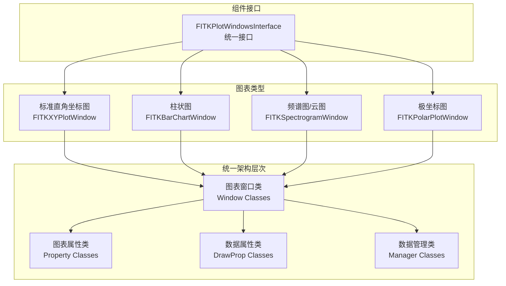
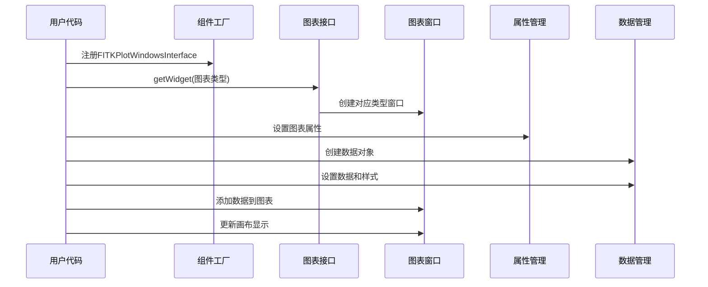
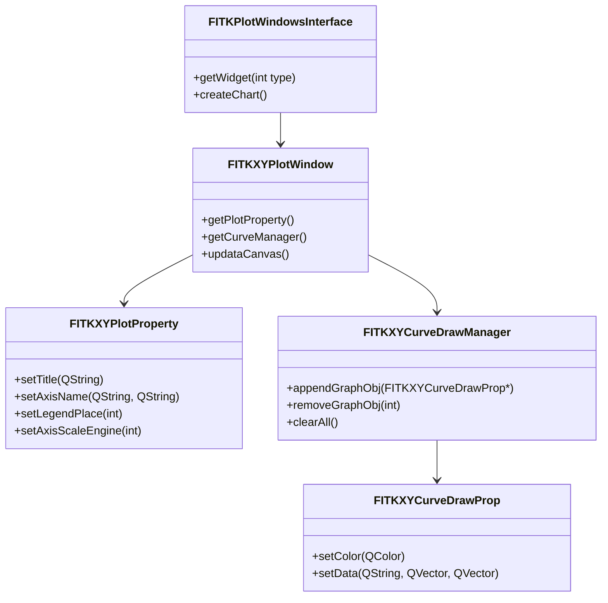
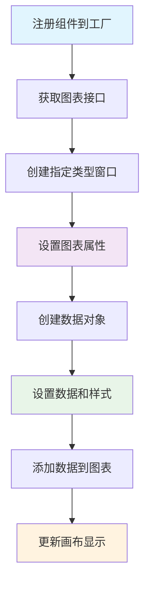

# FastCAE二维图表组件文档对比分析报告

## 分析概述

本报告对比分析了`5_二维图表组件使用与接口调用.md`与现有`FastCAE技术分析报告_完整版.md`，识别技术分析报告中关于二维图表组件的缺失内容和需要补充的详细信息。

## 主要发现

### 🔴 高重要性缺失内容

#### 1. 完整的二维图表组件架构

**缺失内容**：
- **FITKPlotWindow组件的完整架构**：基于Qwt开发的专业2D图表库
- **四种图表类型**：标准直角坐标图、柱状图、频谱图(云图)、极坐标图
- **统一的类组织结构**：窗口类、属性类、数据属性类、数据管理类四层架构

**当前报告描述**：
```markdown
### 6. 二维图表组件 (FITKPlotWindow)
基于Qwt技术开发的专业二维图表组件，支持多种图表类型
```

**建议补充**：
```markdown
### 二维图表组件完整架构

FastCAE的FITKPlotWindow组件基于Qt Widgets for Technical Applications (Qwt)开发，提供专业的科学数据可视化能力：



**四层架构设计**：
1. **图表窗口类**：创建窗口，包含属性类指针和数据管理类指针
2. **图表属性类**：设定图表固有属性（轴标题、图例位置等）
3. **数据属性类**：创建图表数据并设计样式（颜色、线型等）
4. **数据管理类**：添加或删除数据对象
```

#### 2. 图表创建的标准化流程

**缺失内容**：
- **四步创建流程**：创建窗口、设置属性、构造数据、添加到图表
- **组件工厂集成**：通过FITKPlotWindowsInterface统一创建
- **类型参数映射**：0-普通坐标系、1-柱状图、2-极坐标、3-云图

**建议补充位置**：核心功能模块详解章节
**具体建议**：
```markdown
### 二维图表创建标准流程

FastCAE定义了统一的图表创建流程，确保所有图表类型的一致性：



**图表类型映射**：
| 类型参数 | 图表类型 | 对应类 |
|---------|---------|--------|
| 0 | 标准直角坐标图 | FITKXYPlotWindow |
| 1 | 柱状图 | FITKBarChartWindow |
| 2 | 极坐标图 | FITKPolarPlotWindow |
| 3 | 频谱图/云图 | FITKSpectrogramWindow |

**创建示例**：
```cpp
// 1. 获取图表接口
Plot::FITKPlotWindowsInterface* plotInterface = 
    FITKAPP->getComponents()->getComponentTByName<Plot::FITKPlotWindowsInterface>
    ("FITKPlotWindowsInterface");

// 2. 创建直角坐标图窗口
Plot::FITKXYPlotWindow* plotWidget = 
    dynamic_cast<Plot::FITKXYPlotWindow*>(plotInterface->getWidget(0));

// 3. 设置图表属性
plotWidget->getPlotProperty()->setTitle("数据分析");
plotWidget->getPlotProperty()->setAxisName("值", "时间");

// 4. 创建和设置数据
Plot::FITKXYCurveDrawProp* curveData = new Plot::FITKXYCurveDrawProp();
curveData->setColor(QColor(255,0,0));
curveData->setData("曲线1", xData, yData);

// 5. 添加到图表
plotWidget->getCurveManager()->appendGraphObj(curveData);
plotWidget->updataCanvas();
```
```

#### 3. 专业图表功能特性

**缺失内容**：
- **对数坐标轴支持**：setAxisScaleEngine()接口处理大数量级差异
- **复合型柱状图**：支持多组柱状条的复杂数据展示
- **频谱图数据矩阵**：严格的二维数据矩阵格式要求
- **极坐标数据格式**：极角和极径的专业坐标系统

**建议补充位置**：核心功能模块详解章节
**具体建议**：
```markdown
### 专业图表功能特性

#### 对数坐标轴支持
当数据量级差异巨大时，可启用对数坐标轴：
```cpp
// 设置Y轴为对数坐标
plotWidget->getPlotProperty()->setAxisScaleEngine(0); // 0=Y轴, 2=X轴
```

#### 复合型柱状图
支持多组柱状条的复杂数据展示：
```cpp
Plot::FITKBarChartDrawProp* barData = new Plot::FITKBarChartDrawProp();
QList<QString> barNames = {"A-part", "B-part", "C-part"};
int dataCount = barData->setBarNameGroupNum(barNames, 3); // 3组
QVector<double> data(dataCount); // 需要3×3=9个数据点
barData->setData(data);
```

#### 频谱图数据矩阵
频谱图要求严格的二维矩阵数据格式：
```cpp
// 数据矩阵: value.size() = x.size() × y.size()
bool setData(QVector<double> &x, QVector<double> &y, 
             QVector<QVector<double>> &value);
```

#### 极坐标系统
支持极角和极径的专业坐标系统：
```cpp
// xData为极角，yData为极径
curveData->setData("极坐标曲线", xData, yData);
```
```

### 🟡 中重要性缺失内容

#### 4. 图表属性管理系统

**缺失内容**：
- **图表属性类的完整接口**：标题、轴名称、图例位置等设置
- **样式定制能力**：颜色、线型、字体等视觉属性
- **交互功能**：缩放、平移、选择等用户交互

#### 5. 数据管理机制

**缺失内容**：
- **数据对象生命周期**：指针控制权转移机制
- **数据更新和删除**：appendGraphObj、removeGraphObj等接口
- **内存管理策略**：自动内存管理，避免手动delete

#### 6. 组件集成方式

**缺失内容**：
- **组件工厂注册**：在ComponentFactory中的注册方式
- **与AppFramework集成**：通过FITKAPP获取组件的标准流程

### 🟢 低重要性缺失内容

#### 7. 具体图表类型的详细配置

**缺失内容**：
- **柱状图的简单型和复合型区别**
- **频谱图的颜色映射机制**
- **极坐标图的角度和半径设置**

## 具体改进建议

### 1. 现有章节完善建议

#### 1.1 二维图表组件章节
**当前内容**：简单描述了基于Qwt的图表功能
**建议完善**：
- 补充完整的四层架构设计
- 详细描述四种图表类型的特性
- 添加标准化创建流程
- 补充专业功能特性说明

#### 1.2 技术栈和依赖分析章节
**建议新增**：
- Qwt库的专业图表能力说明
- QwtPolar极坐标图表扩展
- 与Qt Widgets的深度集成

### 2. 新增Mermaid图表建议

#### 2.1 二维图表组件类关系图


#### 2.2 图表创建流程图


### 3. 代码示例补充建议

#### 3.1 完整的图表创建示例
```cpp
// 组件注册
QList<AppFrame::FITKComponentInterface*> ComponentFactory::createComponents()
{
    QList<AppFrame::FITKComponentInterface*> componentList;
    componentList << new Plot::FITKPlotWindowsInterface;
    return componentList;
}

// 直角坐标图创建
Plot::FITKPlotWindowsInterface* plotInterface = 
    FITKAPP->getComponents()->getComponentTByName<Plot::FITKPlotWindowsInterface>
    ("FITKPlotWindowsInterface");

Plot::FITKXYPlotWindow* plotWidget = 
    dynamic_cast<Plot::FITKXYPlotWindow*>(plotInterface->getWidget(0));

// 属性设置
plotWidget->getPlotProperty()->setTitle("数据分析");
plotWidget->getPlotProperty()->setAxisName("值", "时间");
plotWidget->getPlotProperty()->setLegendPlace(1);

// 数据创建和设置
Plot::FITKXYCurveDrawProp* curveData = new Plot::FITKXYCurveDrawProp();
curveData->setColor(QColor(255,0,0));
QVector<double> xData {10,20,30,40,50,60};
QVector<double> yData {10,20,35,40,45,60};
curveData->setData("测试曲线", xData, yData);

// 添加到图表
plotWidget->getCurveManager()->appendGraphObj(curveData);
plotWidget->updataCanvas();
```

## 总结

二维图表组件文档包含了大量在当前技术分析报告中缺失的重要技术细节：

1. **完整的组件架构**：基于Qwt的四层架构设计和四种图表类型
2. **标准化创建流程**：统一的四步创建流程和组件工厂集成
3. **专业图表功能**：对数坐标、复合柱状图、频谱图矩阵、极坐标系统
4. **数据管理机制**：完整的数据对象生命周期和内存管理
5. **组件集成方式**：与AppFramework的标准集成流程

这些内容对于理解FastCAE的专业数据可视化能力具有重要意义，建议按照重要性优先级完善技术分析报告，确保准确反映FastCAE的完整二维图表系统。
