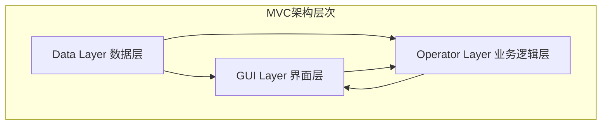
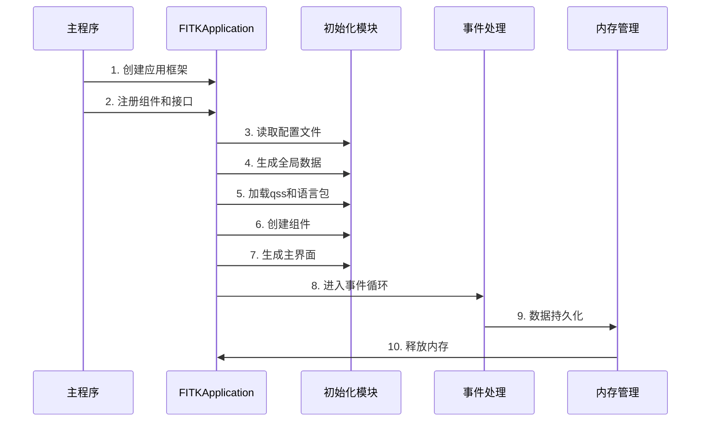
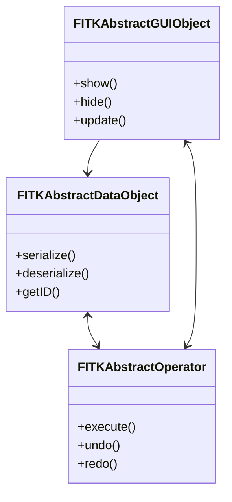
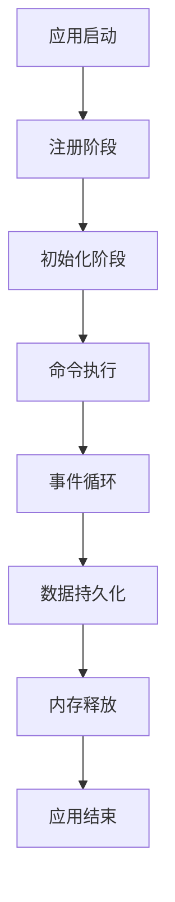
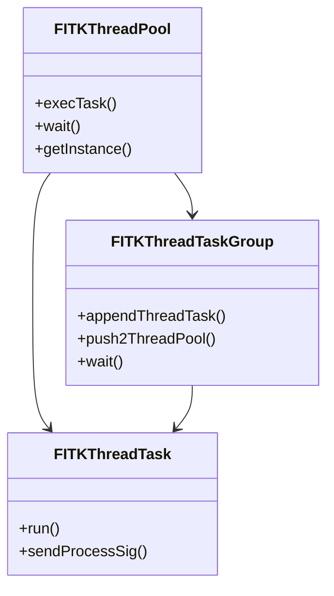

# FastCAE基础底座开发文档对比分析报告

## 分析概述

本报告对比分析了`1_FastCAE基础底座开发与使用说明书.md`与现有`FastCAE技术分析报告_完整版.md`，识别技术分析报告中可能遗漏或需要补充的关键信息。

## 主要发现

### 🔴 高重要性缺失内容

#### 1. Core模块详细架构设计

**缺失内容**：
- **MVC架构模式的具体实现**：源文档详细描述了Data、GUI、Operator三层架构关系
- **抽象对象容器机制**：`FITKAbstractObjectContainer`智能指针机制，解决野指针问题
- **数据工厂注册机制**：`Register2FITKDataFactory`宏的使用方法和示例
- **操作器仓库系统**：`FITKOperatorRepo`的注册和调用机制

**建议补充位置**：技术架构分析章节
**具体建议**：
```markdown
### Core模块MVC架构实现

FastCAE Core模块采用严格的MVC架构模式：



- **数据层**：处于最底层，可被UI和Operator访问修改
- **界面层**：通过抽象接口控制Operator
- **业务逻辑层**：直接访问UI和数据，实现具体业务流程
```

#### 2. AppFramework模块的14个固定流程

**缺失内容**：
- **详细的14个运行阶段**：注册、初始化、命令执行、消息事件处理、数据持久化、内存释放等
- **每个阶段的具体执行逻辑**和依赖关系
- **个性化注册接口**的详细说明

**建议补充位置**：核心功能模块详解章节
**具体建议**：
```markdown
### AppFramework运行流程详解

AppFramework将CAE软件运行过程标准化为14个固定阶段：


```

#### 3. 关键工具类和算法

**缺失内容**：
- **线程池系统**：`FITKThreadPool`、`FITKThreadTask`、`FITKThreadTaskGroup`的详细使用
- **枚举值反射机制**：`FITKEnumTransfer`基于Qt反射的双向映射
- **单例模式宏**：`DeclSingleton`宏的实现和使用方法
- **文件操作工具**：`FITKDirFileTools`的C函数接口

**建议补充位置**：代码质量和设计模式分析章节

### 🟡 中重要性缺失内容

#### 4. 第三方程序驱动系统

**缺失内容**：
- **可执行程序驱动器**：`FITKExecProgramDriver`的详细实现
- **程序任务管理器**：`FITKProgramTaskManager`的进程级集成
- **Linux Shell驱动**：`FITKLinuxShellDriver`的跨平台支持

#### 5. 自动保存和系统检查机制

**缺失内容**：
- **自动保存器**：`FITKAbstractAutoSaver`的定时保存机制
- **系统环境检查**：`FITKAbstractSysChecker`的硬件软件检查

#### 6. 全局事件和信号处理

**缺失内容**：
- **全局事件过滤器**：`FITKGlobalEventFilter`的键盘鼠标事件处理
- **信号转接器**：`FITKSignalTransfer`的跨模块信号处理
- **键盘鼠标状态管理**：`FITKKeyMouseStates`的状态记录

### 🟢 低重要性缺失内容

#### 7. 开发工具和辅助功能

**缺失内容**：
- **版权信息对话框**：`FITKCopyrigntInfoDlg`
- **Workbench处理器**：`FITKWorkBenchHandler`
- **命令行参数处理**：`FITKCommandLineHandler`

## 具体改进建议

### 1. 新增章节建议

#### 1.1 在"核心功能模块详解"中新增：
- **Core模块MVC架构实现**
- **AppFramework标准化流程**
- **线程池和并发处理**
- **第三方程序集成机制**

#### 1.2 在"代码质量和设计模式分析"中新增：
- **智能指针容器模式**
- **工厂注册模式详解**
- **单例模式宏实现**
- **反射机制应用**

### 2. 现有章节完善建议

#### 2.1 技术架构分析章节
- 补充MVC架构的具体实现细节
- 添加Core模块的详细类关系图
- 完善AppFramework的运行时序图

#### 2.2 核心功能模块详解章节
- 详细描述14个标准化运行流程
- 补充线程池系统的使用方法
- 添加第三方程序驱动的集成方案

### 3. 新增Mermaid图表建议

#### 3.1 Core模块MVC架构图


#### 3.2 AppFramework运行流程图


#### 3.3 线程池系统架构图


## 总结

基础底座开发文档包含了大量在当前技术分析报告中缺失的重要技术细节，特别是：

1. **Core模块的MVC架构实现**是整个系统的基础，需要重点补充
2. **AppFramework的14个标准化流程**是CAE软件集成的核心，必须详细描述
3. **线程池、反射机制、智能指针容器**等工具类是系统稳定性的保障
4. **第三方程序驱动系统**是系统扩展性的重要体现

建议按照重要性优先级逐步完善技术分析报告，确保准确反映FastCAE基础底座的完整技术架构。
