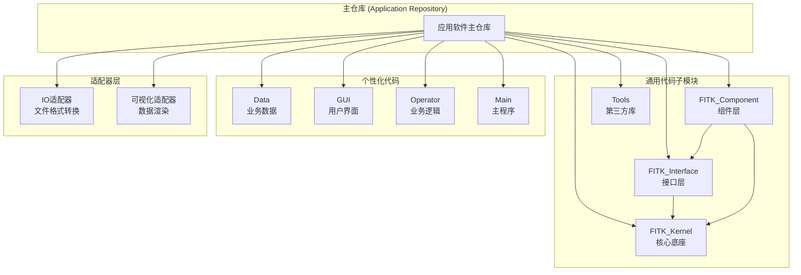
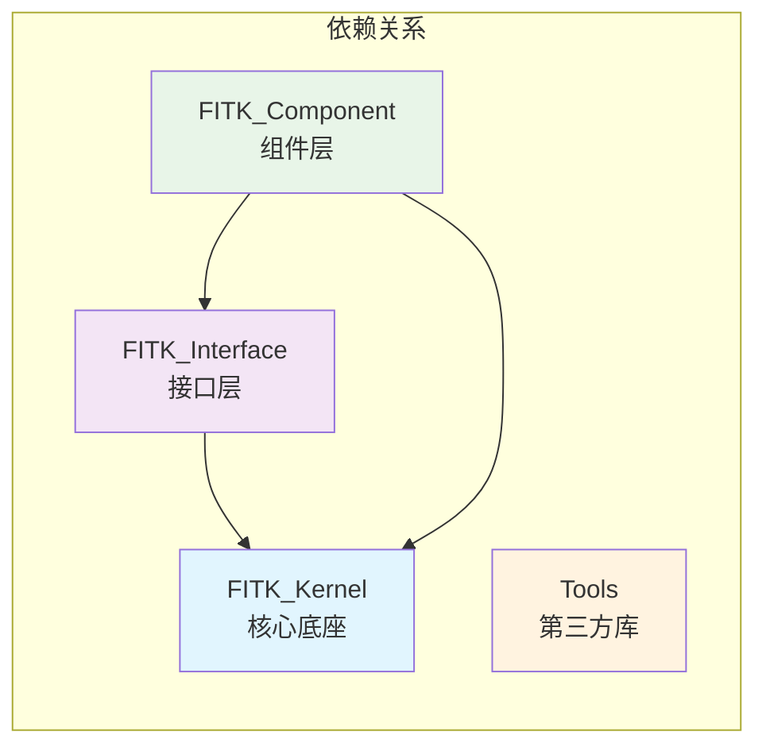
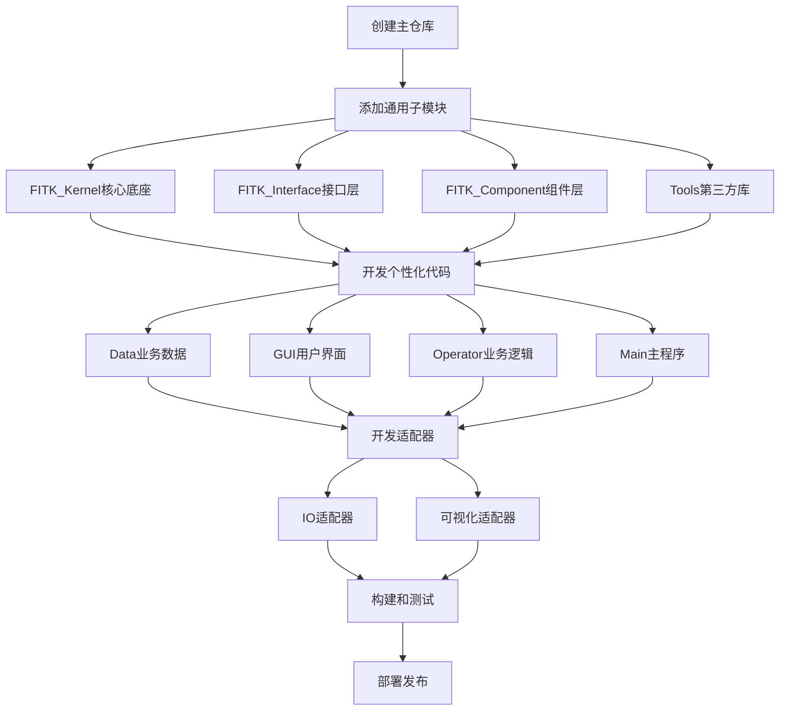
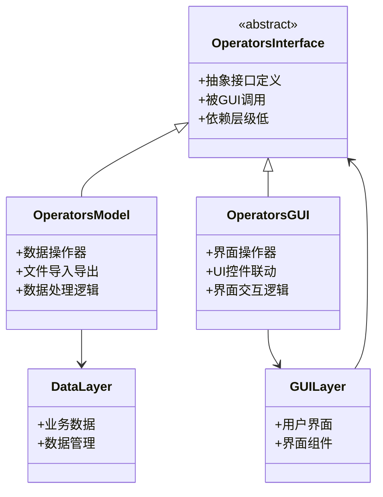

# FastCAE应用软件开发文档对比分析报告

## 分析概述

本报告对比分析了`3_应用软件开发说明书.md`与现有`FastCAE技术分析报告_完整版.md`，识别技术分析报告中关于应用软件开发体系和规范的缺失内容。

## 主要发现

### 🔴 高重要性缺失内容

#### 1. 基于Git子模块的代码组织架构

**缺失内容**：
- **子模块管理机制**：基于Git子模块实现代码复用的完整方案
- **代码仓库结构**：主仓库与子模块的组织关系
- **版本管理策略**：子模块的分支管理和版本控制

**当前报告描述**：
```markdown
**子模块管理**: 基于Git的代码复用机制，提高开发效率
```

**建议补充**：
```markdown
### 代码组织架构 - Git子模块系统

FastCAE采用基于Git子模块的代码组织架构，实现高效的代码复用：



**子模块管理命令**：
- 添加子模块：`git submodule add <url> <path>`
- 初始化子模块：`git submodule update --init --recursive`
- 删除子模块：`git submodule deinit <submodule> && git rm <submodule>`
```

#### 2. 标准化的代码结构规范

**缺失内容**：
- **四层代码架构**：通用代码、个性化代码、适配器的详细分层
- **依赖关系规范**：模块间的严格依赖关系定义
- **文件夹命名规范**：固定的目录结构和命名约定

**建议补充位置**：项目优势和改进建议章节
**具体建议**：
```markdown
### 标准化代码结构

FastCAE定义了严格的代码组织结构，确保模块间的清晰依赖关系：

#### 通用代码层次结构


#### 个性化代码分类
1. **Data层**：业务数据和数据管理
2. **GUI层**：用户界面实现
   - GUIFrame：主要界面框架
   - GUIWidget：功能窗口组件
   - GUIDialog：对话框界面
3. **Operator层**：业务逻辑实现
   - OperatorsInterface：抽象接口
   - OperatorsModel：数据操作器
   - OperatorsGUI：界面操作器
4. **Main层**：主程序和注册逻辑
```

#### 3. 工程管理和构建系统

**缺失内容**：
- **qmake工程管理**：pro和pri文件的作用和配置
- **跨平台编译**：Windows和Linux的构建支持
- **自动化脚本**：InitSubmodules、PullSubmodules等脚本功能

**建议补充位置**：技术栈和依赖分析章节
**具体建议**：
```markdown
### 构建系统和工程管理

#### qmake工程管理
- **pro文件**：工程配置，指定编译输出和依赖库
- **pri文件**：文件列表，包含源码和资源文件
- **generate目录**：编译中间文件（ui、moc、obj）
- **output目录**：最终可执行程序和动态库

#### 自动化脚本系统
| 脚本名称 | 功能描述 |
|---------|---------|
| InitSubmodules | 递归初始化全部子模块，配置Git钩子 |
| PullSubmodules | 拉取子模块最新代码到master分支 |
| PushSubmodules | 推送全部代码到远程仓库 |
| ResetSubmodules | 强制重置全部子模块和主仓库 |
| Create_XXXX | 执行qmake生成平台特定工程文件 |
```

### 🟡 中重要性缺失内容

#### 4. 配置文件管理系统

**缺失内容**：
- **Git配置文件**：.git、.gitignore、.gitmodules的作用
- **开发工具配置**：.vscode、.hooks等配置文件
- **版本控制策略**：钩子检查和代码质量控制

#### 5. 适配器设计模式

**缺失内容**：
- **IO适配器**：内存数据与文件格式的转换机制
- **可视化适配器**：数据对象与可视化对象的转换
- **适配器的个性化实现**：不同应用的适配需求

#### 6. 操作器分层架构

**缺失内容**：
- **三类操作器**的详细分类和职责
- **抽象接口操作器**：OperatorsInterface的设计
- **数据操作器**：OperatorsModel的实现
- **界面操作器**：OperatorsGUI的交互逻辑

### 🟢 低重要性缺失内容

#### 7. 开发工具集成

**缺失内容**：
- **Qt Creator集成**：IDE的项目管理和编译
- **VSCode配置**：代码注释和开发环境配置
- **跨平台注意事项**：Windows VS路径配置等

## 具体改进建议

### 1. 新增章节建议

#### 1.1 在"项目优势和改进建议"中新增：
- **代码组织架构优势**
- **标准化开发流程**
- **模块复用机制**

#### 1.2 在"技术栈和依赖分析"中新增：
- **构建系统详解**
- **自动化工具链**
- **配置管理系统**

### 2. 现有章节完善建议

#### 2.1 应用软件开发框架章节
**当前内容**：简单描述了代码组织结构
**建议完善**：
- 补充Git子模块的详细管理机制
- 详细描述四层代码架构
- 添加依赖关系的严格定义
- 补充工程管理和构建流程

#### 2.2 代码质量和设计模式分析章节
**建议新增**：
- 适配器模式的具体应用
- 操作器分层设计模式
- 模块间依赖管理策略

### 3. 新增Mermaid图表建议

#### 3.1 应用软件开发完整流程图


#### 3.2 操作器分层架构图


### 4. 代码示例补充建议

#### 4.1 子模块管理示例
```bash
# 添加核心底座子模块
git submodule add https://github.com/FastCAE/FITK_Kernel.git FITK_Kernel

# 初始化所有子模块
git submodule update --init --recursive

# 拉取子模块最新代码
./PullSubmodules.sh
```

#### 4.2 qmake工程配置示例
```pro
# 主工程文件示例
TARGET = FastCAE_App
TEMPLATE = app

# 依赖库配置
LIBS += -lFITK_Kernel -lFITK_Interface -lFITK_Component

# 包含路径
INCLUDEPATH += FITK_Kernel FITK_Interface FITK_Component

# 源文件包含
include(Data/Data.pri)
include(GUI/GUI.pri)
include(Operator/Operator.pri)
```

## 总结

应用软件开发文档包含了大量在当前技术分析报告中缺失的重要开发规范和架构设计：

1. **Git子模块管理机制**：实现代码高效复用的核心技术
2. **标准化代码结构**：四层架构和严格的依赖关系定义
3. **工程管理系统**：qmake构建系统和自动化脚本工具
4. **适配器设计模式**：IO和可视化适配器的具体实现
5. **操作器分层架构**：三类操作器的职责分离和交互机制

这些内容对于理解FastCAE的开发规范和架构设计具有重要意义，建议按照重要性优先级完善技术分析报告，确保准确反映FastCAE的完整开发体系。
