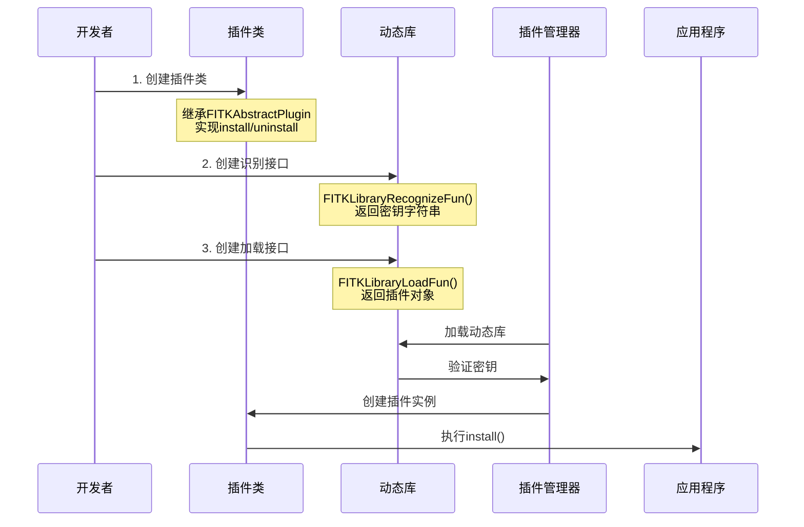
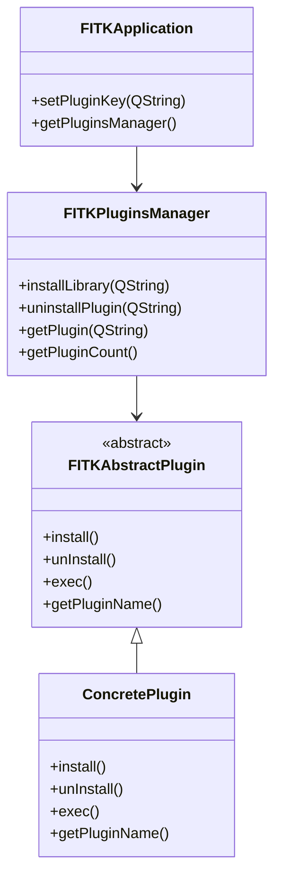
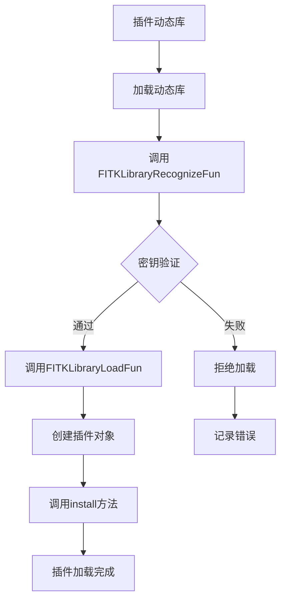

# FastCAE插件系统文档对比分析报告

## 分析概述

本报告对比分析了`6_插件系统开发与使用说明.md`与现有`FastCAE技术分析报告_完整版.md`，识别技术分析报告中关于插件系统的缺失内容和需要补充的详细信息。

## 主要发现

### 🔴 高重要性缺失内容

#### 1. 完整的插件系统架构

**缺失内容**：
- **插件系统的核心组成**：FITKAbstractPlugin抽象类和FITKPluginsManager管理器
- **插件本质定义**：插件是动态链接库（Windows下为dll，Linux下为so）
- **插件系统特点**：接口标准化、模块化设计、动态加载能力

**当前报告描述**：
```markdown
### 9. 插件系统
支持第三方插件开发，提供标准化的插件接口
```

**建议补充**：
```markdown
### 插件系统完整架构

FastCAE插件系统是AppFramework的重要组成部分，为多学科多领域仿真分析提供灵活的扩展能力：

```mermaid
graph TB
    subgraph "插件系统核心"
        A[FITKAbstractPlugin<br/>插件抽象基类]
        B[FITKPluginsManager<br/>插件管理器]
    end
    
    subgraph "插件接口"
        C[install()<br/>插件安装]
        D[uninstall()<br/>插件卸载]
        E[exec()<br/>功能执行]
        F[getPluginName()<br/>名称获取]
    end
    
    subgraph "动态库接口"
        G[FITKLibraryRecognizeFun()<br/>密钥识别接口]
        H[FITKLibraryLoadFun()<br/>插件创建接口]
    end
    
    subgraph "应用场景"
        I[自定义工作流]
        J[数据导入导出]
        K[可视化增强]
        L[算法扩展]
    end
    
    A --> C
    A --> D
    A --> E
    A --> F
    B --> A
    G --> H
    H --> A
    A --> I
    A --> J
    A --> K
    A --> L
```

**插件系统特点**：
- **接口标准化**：所有插件遵守FastCAE定义的标准API
- **模块化设计**：每个插件独立开发、测试、部署和更新
- **动态加载**：插件可在不重启应用程序的情况下加载或卸载
```

#### 2. 插件开发的三步标准流程

**缺失内容**：
- **插件类创建**：继承FITKAbstractPlugin，实现install和uninstall纯虚函数
- **动态库识别接口**：基于密钥的安全验证机制
- **插件创建接口**：标准化的插件对象创建函数

**建议补充位置**：核心功能模块详解章节
**具体建议**：
```markdown
### 插件开发标准流程

FastCAE定义了标准化的三步插件开发流程：



**步骤详解**：

1. **插件类创建**
```cpp
class FITKPluginDemo : public AppFrame::FITKAbstractPlugin
{
public:
    explicit FITKPluginDemo(QLibrary* dyLibrary) : 
        AppFrame::FITKAbstractPlugin(dyLibrary) {}
    
    virtual QString getPluginName() override {
        return "PluginDemo"; // 全局唯一名称
    }
    
private:
    virtual void install() override {
        // 插件初始化：添加按钮、注入函数指针等
    }
    
    virtual void unInstall() override {
        // 插件卸载：清理资源、移除界面元素等
    }
    
    virtual bool exec() override {
        // 具体功能逻辑实现
        return true;
    }
};
```

2. **动态库识别接口**
```cpp
extern "C" {
    FITKPluginDemoAPI QString FITKLibraryRecognizeFun();
}

QString FITKLibraryRecognizeFun() {
    return QString("MyAppPlugin"); // 与应用程序密钥匹配
}
```

3. **插件创建接口**
```cpp
extern "C" {
    FITKPluginDemoAPI AppFrame::FITKAbstractPlugin* 
        FITKLibraryLoadFun(QLibrary* lib);
}

AppFrame::FITKAbstractPlugin* FITKLibraryLoadFun(QLibrary* lib) {
    return new FITKPluginDemo(lib);
}
```
```

#### 3. 安全验证和密钥管理机制

**缺失内容**：
- **密钥验证系统**：基于字符串密钥的插件安全验证
- **应用程序密钥设置**：app.setPluginKey()的使用方法
- **动态库识别流程**：插件加载前的安全检查机制

**建议补充位置**：安全性分析章节
**具体建议**：
```markdown
### 插件安全验证机制

FastCAE采用密钥验证机制确保插件的安全性和兼容性：

```mermaid
flowchart TD
    A[应用程序启动] --> B[设置插件密钥]
    B --> C[加载插件动态库]
    C --> D[调用识别接口]
    D --> E{密钥匹配?}
    E -->|是| F[创建插件对象]
    E -->|否| G[拒绝加载]
    F --> H[执行install()]
    G --> I[记录错误日志]
    
    style E fill:#f9f,stroke:#333,stroke-width:2px
    style F fill:#9f9,stroke:#333,stroke-width:2px
    style G fill:#f99,stroke:#333,stroke-width:2px
```

**安全机制特点**：
- **密钥唯一性**：每个应用程序设置唯一的插件密钥
- **编译时绑定**：插件在编译时必须包含正确的密钥
- **运行时验证**：动态库加载时进行密钥匹配验证
- **拒绝机制**：密钥不匹配的插件将被拒绝加载

**使用示例**：
```cpp
// 应用程序中设置密钥
int main(int argc, char* argv[]) {
    AppFrame::FITKApplication app(argc, argv);
    app.setPluginKey("MyAppPlugin"); // 设置插件密钥
    return app.exec();
}
```
```

### 🟡 中重要性缺失内容

#### 4. 插件管理器的完整功能

**缺失内容**：
- **插件管理器接口**：加载、卸载、查询插件的完整API
- **插件生命周期管理**：从加载到卸载的完整生命周期
- **配置文件持久化**：插件路径的自动保存和恢复机制

#### 5. 插件应用场景

**缺失内容**：
- **自定义工作流**：用户可根据项目需求创建特定工作流程
- **数据导入/导出**：支持更多格式的数据文件
- **可视化增强**：添加新的图表类型或改进现有视图
- **算法扩展**：引入新的求解器或其他算法

#### 6. 第三方库集成

**缺失内容**：
- **动态库依赖管理**：第三方动态库的部署策略
- **路径配置要求**：动态库放置在exe同级目录的要求

### 🟢 低重要性缺失内容

#### 7. 开发工具和编译配置

**缺失内容**：
- **跨平台编译**：Windows下dll和Linux下so的编译差异
- **接口宏定义**：FITKPluginDemoAPI等接口声明宏的使用

## 具体改进建议

### 1. 新增章节建议

#### 1.1 在"核心功能模块详解"中新增：
- **插件系统架构详解**
- **插件开发标准流程**
- **插件管理器功能**

#### 1.2 在"安全性分析"中新增：
- **插件安全验证机制**
- **密钥管理系统**
- **动态库安全检查**

### 2. 现有章节完善建议

#### 2.1 插件系统章节
**当前内容**：简单描述了插件支持
**建议完善**：
- 补充完整的插件系统架构
- 详细描述三步开发流程
- 添加安全验证机制说明
- 补充插件应用场景

#### 2.2 技术栈和依赖分析章节
**建议新增**：
- 动态库技术的应用
- 跨平台插件编译支持
- 第三方库集成策略

### 3. 新增Mermaid图表建议

#### 3.1 插件系统完整架构图


#### 3.2 插件加载流程图


### 4. 代码示例补充建议

#### 4.1 完整的插件开发示例
```cpp
// 插件头文件 MyPlugin.h
#ifndef MYPLUGIN_H
#define MYPLUGIN_H

#include "FITKAppFramework/FITKAbstractPlugin.h"

class MyPlugin : public AppFrame::FITKAbstractPlugin
{
public:
    explicit MyPlugin(QLibrary* dyLibrary);
    virtual ~MyPlugin() = default;
    
    virtual QString getPluginName() override;
    
private:
    virtual void install() override;
    virtual void unInstall() override;
    virtual bool exec() override;
};

// C接口声明
extern "C" {
    MYPLUGIN_API QString FITKLibraryRecognizeFun();
    MYPLUGIN_API AppFrame::FITKAbstractPlugin* FITKLibraryLoadFun(QLibrary*);
}

#endif
```

#### 4.2 插件使用示例
```cpp
// 获取插件管理器
AppFrame::FITKPluginsManager* pMgr = FITKAPP->getPluginsManager();

// 加载插件
bool success = pMgr->installLibrary("path/to/plugin.dll");
if (success) {
    // 获取插件
    AppFrame::FITKAbstractPlugin* plugin = pMgr->getPlugin("MyPlugin");
    if (plugin) {
        // 执行插件功能
        plugin->exec();
    }
}
```

## 总结

插件系统文档包含了大量在当前技术分析报告中缺失的重要技术细节：

1. **完整的插件架构**：FITKAbstractPlugin和FITKPluginsManager的详细设计
2. **标准化开发流程**：三步插件开发的具体实现方法
3. **安全验证机制**：基于密钥的插件安全验证系统
4. **插件管理功能**：完整的插件生命周期管理
5. **应用场景扩展**：自定义工作流、算法扩展等实际应用

这些内容对于理解FastCAE的可扩展性和插件生态具有重要意义，建议按照重要性优先级完善技术分析报告，确保准确反映FastCAE的完整插件系统架构。
