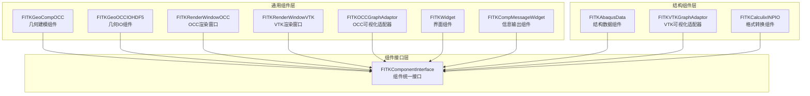
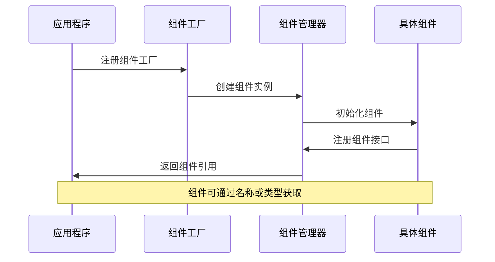
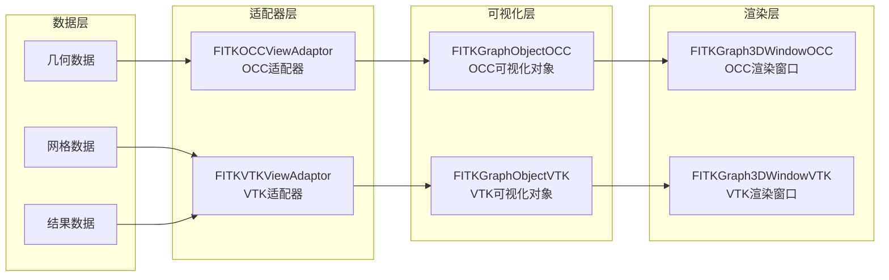
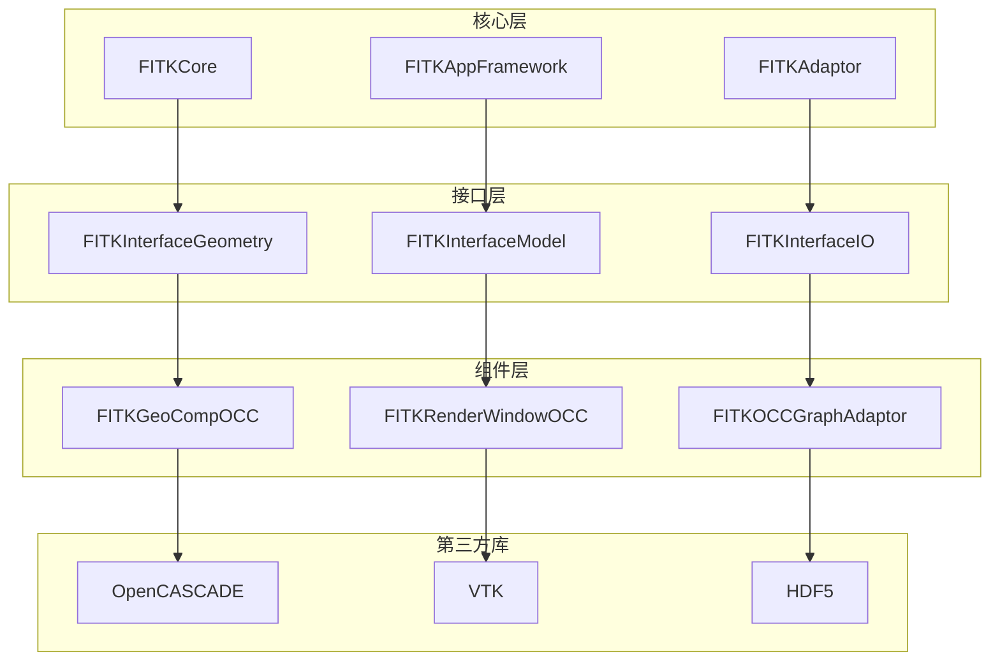
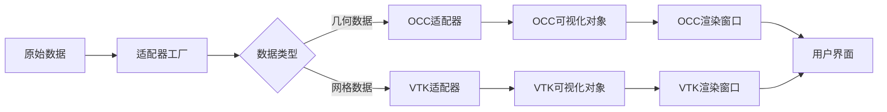

# FastCAE组件使用文档对比分析报告

## 分析概述

本报告对比分析了`4_组件使用说明书.md`与现有`FastCAE技术分析报告_完整版.md`，识别技术分析报告中关于组件系统的缺失内容和需要补充的详细信息。

## 主要发现

### 🔴 高重要性缺失内容

#### 1. 完整的组件体系架构

**缺失内容**：
- **通用组件分类**：7个通用组件的详细功能和依赖关系
- **结构组件分类**：3个结构分析专用组件的具体实现
- **组件接口标准化**：`FITKComponentInterface`的统一接口规范

**当前报告描述**：
```markdown
### 8. 应用软件开发框架
- 组件化: 模块化组件设计，支持独立开发和测试
```

**建议补充**：
```markdown
### FastCAE组件体系架构

FastCAE采用分层组件架构，将功能模块分为通用组件和专业组件两大类：


```

#### 2. 组件加载和管理机制

**缺失内容**：
- **组件工厂模式**：`FITKComponentFactory`的实现机制
- **组件注册流程**：组件在AppFramework中的注册过程
- **组件生命周期**：组件的创建、初始化、销毁管理

**建议补充位置**：核心功能模块详解章节
**具体建议**：
```markdown
### 组件管理系统

FastCAE通过组件工厂模式实现组件的统一管理：



**组件注册示例**：
```cpp
class MyComponentFactory : public AppFrame::FITKComponentFactory
{
public:
    QList<AppFrame::FITKComponentInterface*> createComponents() override
    {
        QList<AppFrame::FITKComponentInterface*> comps;
        comps << new GeoComp::FITKGeoCompOCCInterface();
        comps << new IO::FITKOCCIOHDF5Interface();
        comps << new Comp::ConsoleComponent();
        return comps;
    }
};
```
```

#### 3. 可视化适配器系统

**缺失内容**：
- **双适配器架构**：OCC和VTK两套可视化适配器的设计理念
- **数据转换机制**：内存数据到可视化对象的转换流程
- **适配器工厂**：`FITKVIEWADAPTORFACTORY`的工作机制

**建议补充位置**：核心功能模块详解章节
**具体建议**：
```markdown
### 可视化适配器系统

FastCAE提供双适配器架构，支持OCC和VTK两种渲染引擎：



**适配器使用流程**：
1. 通过适配器工厂创建对应类型的适配器
2. 设置输入数据对象和参数
3. 调用update()方法执行数据转换
4. 获取输出的可视化对象
5. 将可视化对象添加到渲染窗口
```

### 🟡 中重要性缺失内容

#### 4. 界面组件库

**缺失内容**：
- **FITKWidget组件库**：抽屉组件、多视口组件、科学计数法组件等
- **界面组件的复用机制**：减少重复开发的设计理念
- **Qt集成方式**：与Qt原生组件的兼容性

#### 5. 信息输出系统

**缺失内容**：
- **FITKMessage系统**：线程安全的信息输出机制
- **多级信息分类**：正常、警告、错误、信息四种输出类型
- **信号槽机制**：自动关联AppFramework的输出信号

#### 6. 结构分析组件

**缺失内容**：
- **FITKAbaqusData**：结构数据管理器的完整功能
- **算例和作业管理**：FITKDataCase和FITKJob的管理机制
- **后处理数据管理**：FITKAbaqusPostData的功能

### 🟢 低重要性缺失内容

#### 7. 格式转换组件

**缺失内容**：
- **FITKCalculixINPIO**：Calculix格式转换功能
- **Abaqus与Calculix映射**：数据格式转换机制

## 具体改进建议

### 1. 新增章节建议

#### 1.1 在"核心功能模块详解"中新增：
- **组件管理系统**
- **可视化适配器系统**
- **界面组件库**
- **信息输出系统**

#### 1.2 在"代码质量和设计模式分析"中新增：
- **组件工厂模式详解**
- **适配器模式在可视化中的应用**
- **组件生命周期管理**

### 2. 现有章节完善建议

#### 2.1 应用软件开发框架章节
**当前内容**：简单提到了组件化设计
**建议完善**：
- 补充完整的组件体系架构
- 详细描述组件注册和管理机制
- 添加组件使用的具体示例

#### 2.2 后处理模块章节
**建议新增**：
- 双渲染引擎支持（OCC + VTK）
- 可视化适配器的工作机制
- 渲染窗口的多层渲染支持

### 3. 新增Mermaid图表建议

#### 3.1 组件依赖关系图


#### 3.2 可视化数据流图


### 4. 代码示例补充建议

#### 4.1 组件使用完整示例
```cpp
// 1. 组件注册
class MyComponentFactory : public AppFrame::FITKComponentFactory
{
public:
    QList<AppFrame::FITKComponentInterface*> createComponents() override
    {
        QList<AppFrame::FITKComponentInterface*> comps;
        comps << new GeoComp::FITKGeoCompOCCInterface();
        comps << new Render::FITKGraph3DWindowOCCInterface();
        comps << new Exchange::FITKOCCGraphAdaptorInterface();
        return comps;
    }
};

// 2. 组件获取和使用
auto graphWinInterface = FITKAPP->getComponents()
    ->getComponentByName("Graph3DWindowOCC");
QWidget* window = graphWinInterface->getWidget(1);

// 3. 可视化适配器使用
auto adaptor = FITKVIEWADAPTORFACTORY->createT<Exchange::FITKOCCViewAdaptorBase>(
    adaptorKeyName, dataObj);
adaptor->setDataObject(dataObj);
adaptor->update();
auto visualObj = adaptor->getOutputData();
```

#### 4.2 信息输出系统示例
```cpp
#include "FITKAppFramework/FITKMessage.h"

// 不同级别的信息输出
AppFrame::FITKMessageNormal("操作成功完成");
AppFrame::FITKMessageWarning("参数可能不合理");
AppFrame::FITKMessageError("操作失败");
AppFrame::FITKMessageInfo("处理进度: 50%");
```

## 总结

组件使用说明书包含了大量在当前技术分析报告中缺失的重要组件系统信息：

1. **完整的组件体系**：10个核心组件的详细功能和依赖关系
2. **组件管理机制**：工厂模式、注册流程、生命周期管理
3. **可视化适配器系统**：双引擎支持和数据转换机制
4. **界面组件库**：可复用的UI组件和Qt集成方案
5. **信息输出系统**：线程安全的多级信息输出机制

这些内容对于理解FastCAE的组件化架构和实际使用具有重要意义，建议按照重要性优先级完善技术分析报告，确保准确反映FastCAE的完整组件系统。
