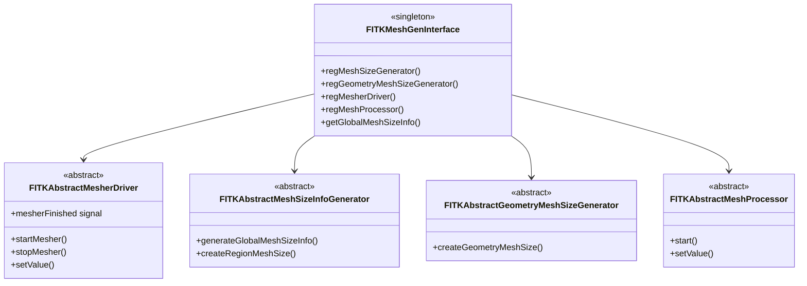
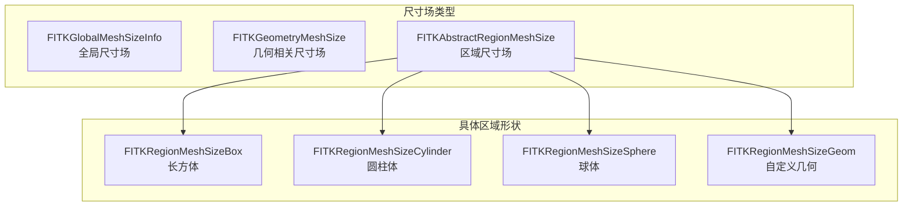
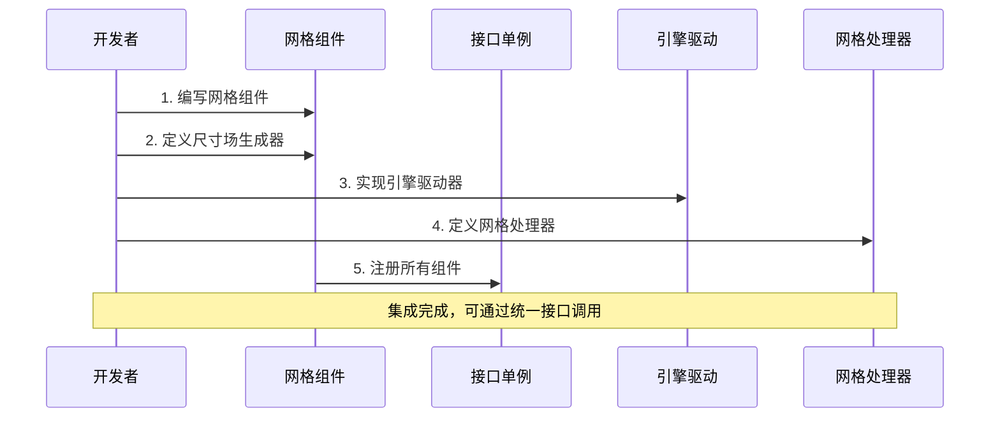
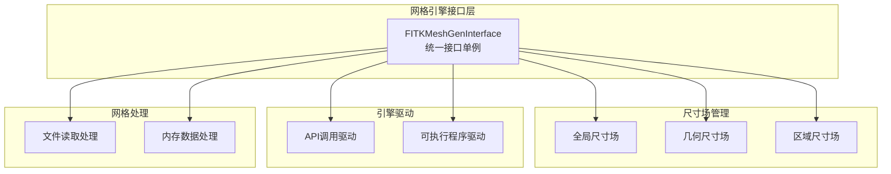
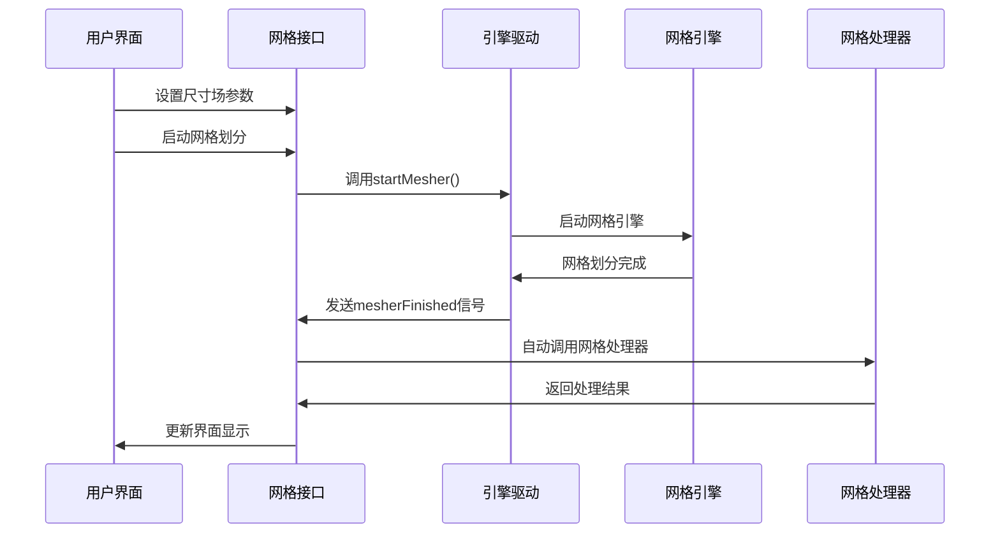

# FastCAE网格引擎集成文档对比分析报告

## 分析概述

本报告对比分析了`2_网格引擎集成与接口调用说明书.md`与现有`FastCAE技术分析报告_完整版.md`中关于网格引擎的描述，识别技术分析报告中缺失或描述不够详细的技术内容。

## 主要发现

### 🔴 高重要性缺失内容

#### 1. 网格划分接口架构的详细设计

**缺失内容**：
- **完整的接口类体系**：源文档详细定义了12个核心接口类及其功能
- **尺寸场分类系统**：全局尺寸场、几何相关尺寸场、区域尺寸场的三层架构
- **网格引擎抽象化机制**：通过抽象接口隔离具体网格引擎的设计理念

**当前报告描述**：
```markdown
**网格引擎架构**:
- FITKMeshGenInterface: 网格划分统一接口
- FITKAbstractMesherDriver: 网格引擎驱动抽象类
```

**建议补充**：
```markdown
### 网格划分接口完整架构

FastCAE定义了一套完整的网格划分抽象接口体系：


```

#### 2. 尺寸场管理系统

**缺失内容**：
- **三种尺寸场类型**的详细定义和用途
- **尺寸场生成器**的工作机制
- **参数化尺寸场**的扩展机制

**建议补充位置**：核心功能模块详解 - 网格划分模块
**具体建议**：
```markdown
#### 尺寸场管理系统

FastCAE采用三层尺寸场管理架构：

1. **全局尺寸场 (FITKGlobalMeshSizeInfo)**
   - 定义最大最小尺寸、尺寸因子等全局参数
   - 继承FITKVarientParams，支持自定义参数扩展
   - 全局唯一，通过单例直接获取

2. **几何相关尺寸场 (FITKGeometryMeshSize)**
   - 绑定到特定几何实体（线、面、体）
   - 支持边界层厚度、增长率等参数
   - 通过几何组件唯一ID进行关联

3. **区域尺寸场 (FITKAbstractRegionMeshSize)**
   - 与几何模型无关的空间区域尺寸控制
   - 支持长方体、圆柱体、球体、自定义几何等形状
   - 定义各维度离散数量和增长率


```

#### 3. 网格引擎集成的标准化流程

**缺失内容**：
- **5步集成流程**的详细说明
- **组件化集成方式**的具体实现
- **注册机制**的代码示例

**建议补充位置**：核心功能模块详解章节
**具体建议**：
```markdown
### 网格引擎集成标准化流程

FastCAE定义了标准化的网格引擎集成流程：



**集成步骤详解**：

1. **编写网格组件**：继承`AppFrame::FITKComponentInterface`
2. **定义尺寸场生成器**：实现全局和局部尺寸场生成逻辑
3. **实现引擎驱动器**：支持多线程/多进程的网格划分执行
4. **定义网格处理器**：处理网格输出和数据转换
5. **注册组件**：将所有组件注册到接口单例中
```

### 🟡 中重要性缺失内容

#### 4. 网格引擎驱动的多进程/多线程支持

**缺失内容**：
- **API调用方式**：使用线程池进行多线程处理
- **可执行程序方式**：使用多进程驱动器
- **信号机制**：`mesherFinished`信号的自动触发

#### 5. 网格处理器的后处理机制

**缺失内容**：
- **文件读取方式**：从网格引擎输出文件读取
- **API读取方式**：通过网格引擎API获取内存数据
- **数据转换流程**：内存转化和可视化刷新

#### 6. 参数化配置系统

**缺失内容**：
- **FITKVarientParams**基础参数管理
- **setValue/getValue**参数设置机制
- **工作目录和文件路径**配置

### 🟢 低重要性缺失内容

#### 7. 网格区域点定义

**缺失内容**：
- **FITKZonePoint**：材料点定义功能

## 具体改进建议

### 1. 现有章节完善建议

#### 1.1 网格划分模块章节
**当前内容**：简单描述了接口和序列图
**建议完善**：
- 补充完整的接口类体系图
- 详细描述三种尺寸场类型
- 添加集成流程的具体步骤
- 补充多线程/多进程支持机制

#### 1.2 技术架构分析章节
**建议新增**：
- 网格引擎抽象化设计理念
- 组件化集成架构
- 参数化配置系统

### 2. 新增Mermaid图表建议

#### 2.1 网格引擎完整接口架构图


#### 2.2 网格划分执行流程图


### 3. 代码示例补充建议

#### 3.1 网格引擎集成示例
```cpp
// 网格组件注册示例
class MyMeshGenInterface : public AppFrame::FITKComponentInterface
{
public:
    MyMeshGenInterface() {
        auto mf = Interface::FITKMeshGenInterface::getInstance();
        // 注册尺寸场生成器
        mf->regMeshSizeGenerator(new MyMeshSizeGenerator);
        // 注册几何尺寸场生成器
        mf->regGeometryMeshSizeGenerator(new MyGeometryMeshSizeGenerator);
        // 注册网格驱动器
        mf->regMesherDriver(new MyMesherDriver);
        // 注册网格处理器
        mf->regMeshProcessor(new MyMeshProcessor);
    }
};
```

#### 3.2 网格划分调用示例
```cpp
// 网格划分执行示例
auto meshGen = Interface::FITKMeshGenInterface::getInstance();
auto meshDriver = meshGen->getMesherDriver();

// 设置参数
meshDriver->setValue("WorkDir", "path/to/work/dir");

// 启动网格划分
meshDriver->startMesher();

// 自动处理完成信号
connect(meshDriver, &Interface::FITKAbstractMesherDriver::mesherFinished, 
        [this] { readMesh(); });
```

## 总结

网格引擎集成文档包含了大量在当前技术分析报告中缺失的重要技术细节：

1. **完整的接口架构体系**：12个核心接口类的详细定义
2. **三层尺寸场管理**：全局、几何、区域尺寸场的分类管理
3. **标准化集成流程**：5步集成流程的具体实现
4. **多线程/多进程支持**：API和可执行程序两种驱动方式
5. **信号驱动的自动化处理**：mesherFinished信号机制

建议按照重要性优先级完善技术分析报告，确保准确反映FastCAE网格引擎的完整技术架构和集成能力。
