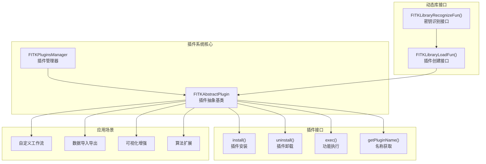
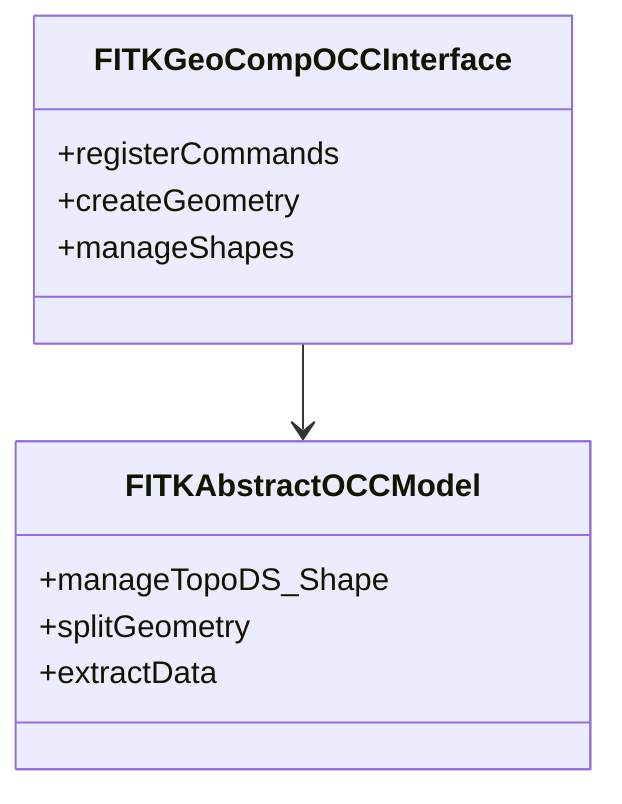

# 测试Mermaid语法

## 插件系统架构

```mermaid
graph TB
    subgraph "插件系统核心"
        A[FITKAbstractPlugin<br/>插件抽象基类]
        B[FITKPluginsManager<br/>插件管理器]
    end

    subgraph "插件接口"
        C["install()<br/>插件安装"]
        D["uninstall()<br/>插件卸载"]
        E["exec()<br/>功能执行"]
        F["getPluginName()<br/>名称获取"]
    end

    subgraph "动态库接口"
        G["FITKLibraryRecognizeFun()<br/>密钥识别接口"]
        H["FITKLibraryLoadFun()<br/>插件创建接口"]
    end

    subgraph "应用场景"
        I[自定义工作流]
        J[数据导入导出]
        K[可视化增强]
        L[算法扩展]
    end

    A --> C
    A --> D
    A --> E
    A --> F
    B --> A
    G --> H
    H --> A
    A --> I
    A --> J
    A --> K
    A --> L
```

## 类图测试

```mermaid
classDiagram
    class FITKGeoCompOCCInterface {
        +registerCommands
        +createGeometry
        +manageShapes
    }

    class FITKAbstractOCCModel {
        +manageTopoDS_Shape
        +splitGeometry
        +extractData
    }

    FITKGeoCompOCCInterface --> FITKAbstractOCCModel
```
