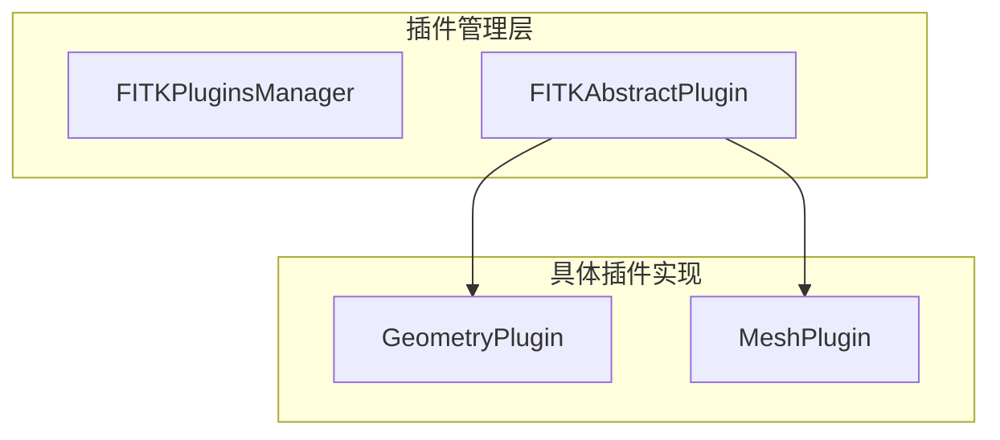
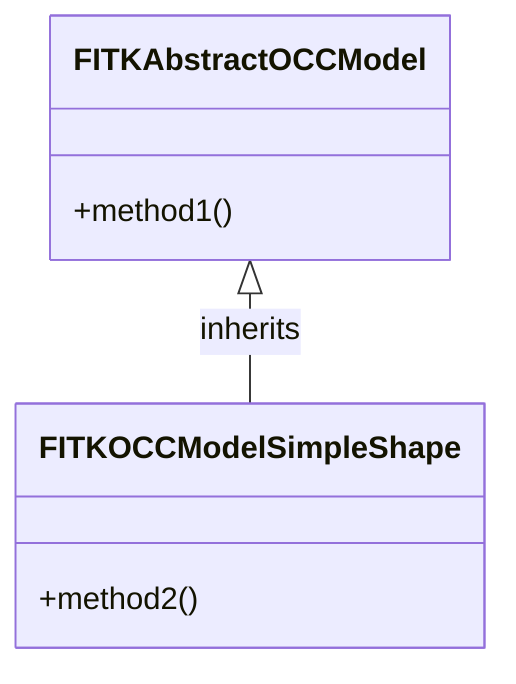

# 测试Mermaid语法修复

## 插件系统架构图测试

```mermaid
graph TB
    subgraph "插件管理层"
        PM[FITKPluginsManager]
        AP[FITKAbstractPlugin]
    end

    subgraph "具体插件实现"
        GEO_PLUGIN[GeometryPlugin]
        MESH_PLUGIN[MeshPlugin]
    end

    %% 正确的graph语法 - 使用箭头而不是继承符号
    AP --> GEO_PLUGIN
    AP --> MESH_PLUGIN
```

## 类图测试

```mermaid
classDiagram
    class FITKAbstractOCCModel {
        +method1()
    }

    class FITKOCCModelSimpleShape {
        +method2()
    }

    %% 正确的classDiagram语法 - 可以使用继承符号
    FITKAbstractOCCModel <|-- FITKOCCModelSimpleShape : inherits
```
